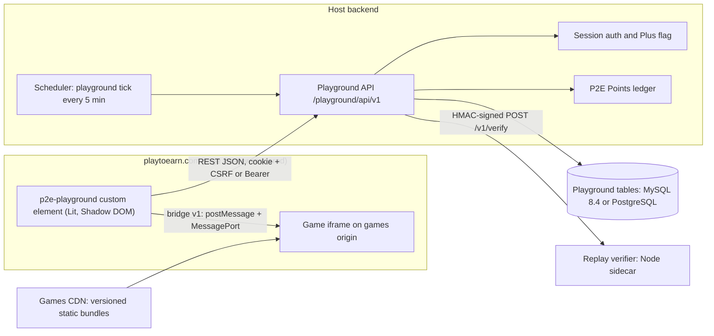
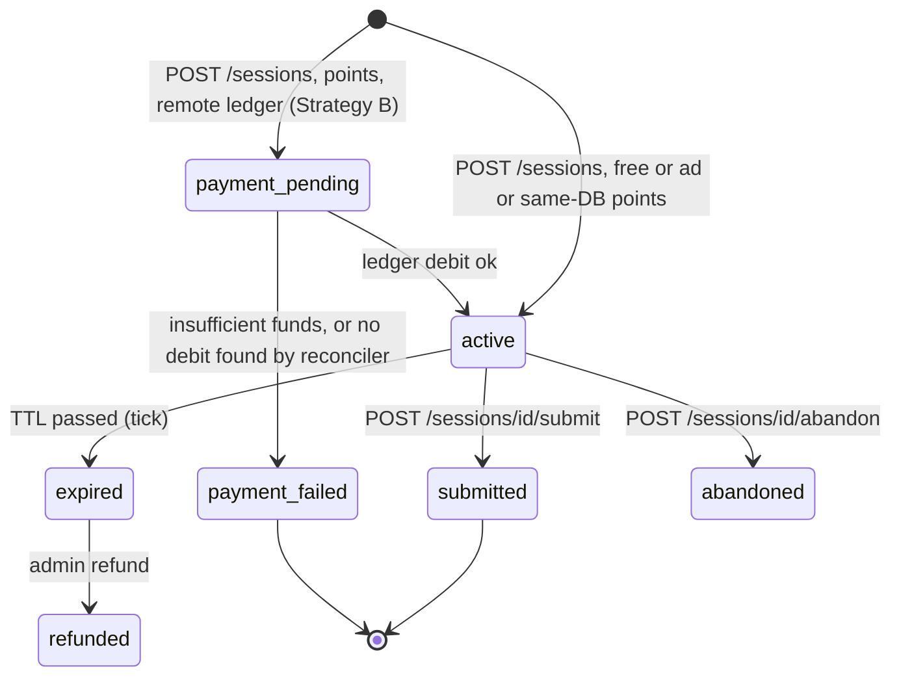
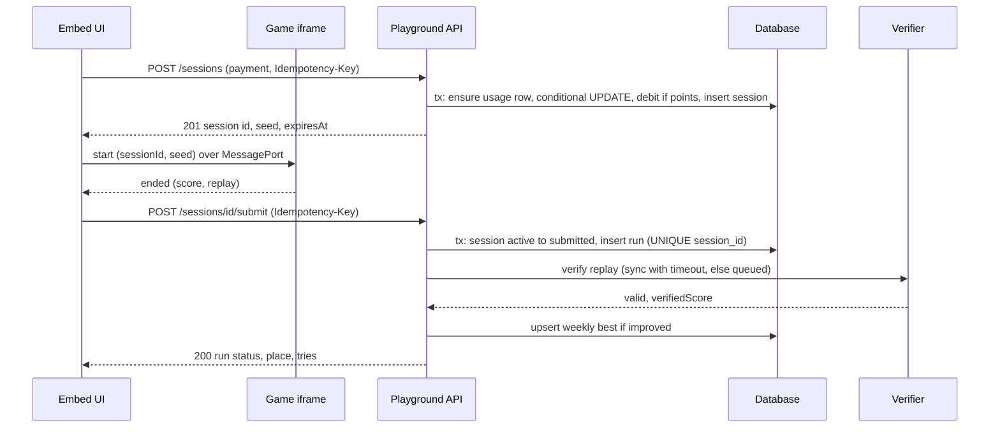
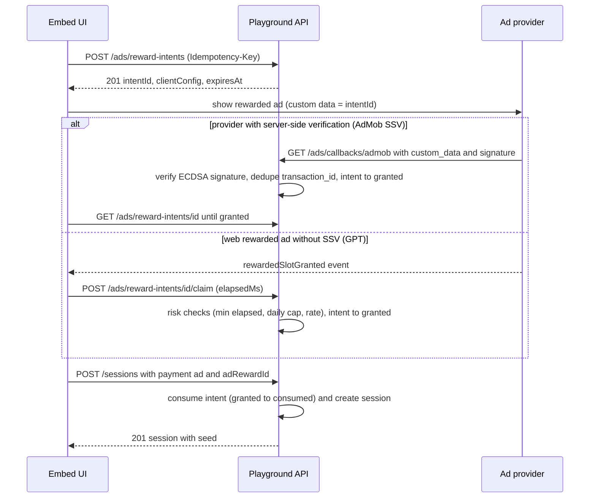
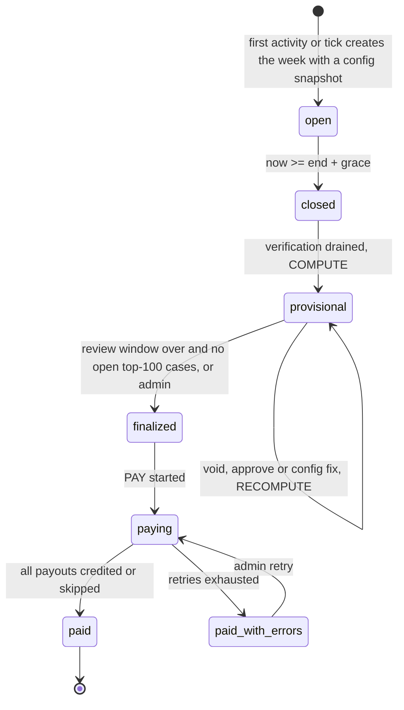

# 06 Integration and Portability Architecture

Track: Integration and portability (demo + reference implementation + porting kit)
Date: 2026-09-24. Author: research agent (Claude). Status: research and plan only, no project code written.
Scope: how to build the Playground so that (a) a working demo can be shared, (b) a clean reference implementation exists, and (c) PlayToEarn's lead developer, working with Claude, can port it into (or attach it to) playtoearn.com with low risk.

Legend: VERIFIED = checked against a primary source in this session (link given). INFERRED = derived from evidence, needs confirmation by the lead dev. UNVERIFIED = could not be checked; treat as assumption. Numbers marked "placeholder" belong to other tracks (mostly Economy).

---

## TL;DR

1. **Host evidence (INFERRED, strong):** archived playtoearn.com pages show a server-rendered site with jQuery + Bootstrap 4.3.1, a 40-character `csrf-token` meta tag and the exact `$.ajaxSetup({headers:{'X-CSRF-TOKEN': ...}})` snippet from the Laravel docs, GA4, three locales (en, de, id), a dark-mode toggle, an existing "P2E Points" ledger with history, and "PlayToEarn Plus" ($9.99/month, double P2E Points, ad-free). Most likely a Laravel (PHP) monolith. Laravel is therefore the primary porting target, while the kit stays language-agnostic.
2. **Architecture:** hexagonal. A pure `core` (integer math, UTC epoch ms, no I/O), a `contract` package (zod 4 schemas as the single source of truth, emitted as OpenAPI 3.1 and JSON Schema), `app` use cases behind ports, swappable adapters (memory, SQL), and a runtime-agnostic Hono HTTP app. The same HTTP app runs in Node (reference server) and in-process inside the browser (demo), so the demo exercises the exact API contract.
3. **Two integration strategies, one kit:** A "Native port" (Claude translates backend into Laravel, verified by golden vectors + a black-box conformance suite) and B "Attached service" (deploy our Node service on the same origin; host implements identity token, ledger debit/credit and profile lookup). A Node replay-verifier sidecar is needed in both, so B is the fastest safe launch path; A remains fully supported.
4. **Frontend:** a framework-free embed built with Lit 3 custom elements (Shadow DOM, CSS-variable theming, en/de/id) that drops into Blade/jQuery pages unchanged and also works in React 19 and Vue. Games are static versioned bundles on a separate origin, embedded in a sandboxed iframe with a versioned postMessage + MessagePort bridge, plus an inline mode for demo, artifact and tests.
5. **Database:** portable DDL for PostgreSQL 14+ (and PGlite) and MySQL 8.4 LTS (MySQL 8.0 reached EOL in April 2026) with MariaDB notes. Concurrency uses "ensure row + conditional UPDATE", unique idempotency keys and a session state machine. Leaderboards use one composite index (top 100 = index range scan, my rank = COUNT of rows above me). Redis sorted sets are an optional accelerator with a documented composite-score formula; SQL stays the source of truth.
6. **Weekly settlement** is an idempotent "tick" state machine (open, closed, provisional, finalized, paying, paid) run every 5 minutes, with a review window before finalize, deterministic payout keys `playground:v1:payout:{week}:{scope}:{user}` deduplicated by the ledger, and full re-runnability after crashes.
7. **API:** REST under `/playground/api/v1`, RFC 9457 problem+json with a stable `code`, `Idempotency-Key` with IETF draft-07 semantics (400 missing, 422 payload mismatch, 409 in flight, replay when done), RateLimit headers (draft-11) + `Retry-After`. 18 player endpoints, 21 admin endpoints, 6 test-only endpoints.
8. **Porting kit** follows Anthropic's published migration playbook (rulebook, dependency map, gap inventory, a mechanical "judge"): SPEC with rule IDs, JSON golden vectors, OpenAPI, SQL migrations and a named-query catalog, conformance suite (+ Schemathesis fuzzing, + differential settlement test), AGENTS.md with a CLAUDE.md import, and an Agent Skill `port-playground`. The kit is validated by a dry-run Laravel port before handover.
9. **Tooling (npm registry, 2026-09-24):** pnpm 11.26 (local; 12.6 exists), Node >= 22.12, TypeScript 6.0.3 pinned (7.0.2 is out but has no JS API until 7.1), Vite 8.3, Vitest 5.0.1, Playwright 1.63, Biome 2.5.14, Hono 4.13.9, zod 4.6.5, Lit 3.3.3, PGlite 0.5.8, raw-SQL query catalog instead of an ORM.
10. **Demo:** static SPA with the in-browser backend, IndexedDB persistence and a dev panel (personas, points, time travel, bots, settlement, pool, payouts, mock ledger, network log), switchable to the real server. Host on any static host; a claude.ai private artifact works with an "artifact profile" (inline games, bare-token hash routing, no service worker) and neutral branding.

---

## 1. What we know about the host platform

| Signal | Evidence | Confidence | Consequence for this track |
|---|---|---|---|
| Server framework | Archived pages contain `<meta name="csrf-token">` with a 40-char token, `_token` form fields and the verbatim Laravel snippet `$.ajaxSetup({headers:{'X-CSRF-TOKEN': $('meta[name="csrf-token"]').attr('content')}})` ([archive, P2E leaderboard, 2026-02-14](https://web.archive.org/web/20260214045114/https://playtoearn.com/account/p2e-leaderboard), [Laravel 13 CSRF docs](https://laravel.com/docs/13.x/csrf)) | INFERRED (strong): Laravel | Laravel is porting target #1; MySQL or MariaDB likely (UNVERIFIED); cookie session + `X-CSRF-TOKEN` auth for XHR |
| Frontend stack | Bootstrap 4.3.1 + Font Awesome 6.5.1 from cdnjs, jQuery `$.ajax`, Swiper, Lottie, ApexCharts, WalletConnect v1 UMD, Google Identity Services; multi-page server rendering (same archive) | VERIFIED (archived HTML) | Deliver UI as framework-free custom elements with Shadow DOM so Bootstrap 4 global CSS cannot break it |
| Asset host | JS and images served from `assets.playtoearn.com` (same archive) | VERIFIED | Embed bundle can live on the existing asset CDN; games get their own subdomain for iframe isolation |
| Locales | hreflang en, de, id; switcher English, Deutsch, Bahasa Indonesia ([archive, P2E points, 2025-02-18](https://web.archive.org/web/20250218200607/https://playtoearn.com/account/p2e-points)) | VERIFIED | i18n from day one: en, de, id catalogs; `locale` attribute on the embed |
| Theme | "Dark Theme" toggle that calls `/toggle-mode` (same archive) | VERIFIED | Embed must follow the host's light/dark state (`theme="auto"`) |
| Analytics | gtag.js GA4 tag on every page (archives) | VERIFIED | Analytics adapter maps to gtag; event names respect GA4 limits |
| Points | "P2E Points": 7-day login streak (+5, +5, +10, +10, +15, +15, +20), "History" tab, redeem for rewards; public "P2E Points Leaderboard" (archives above) | VERIFIED | A ledger with history exists; PointsLedger adapter maps onto it and needs unique idempotency keys |
| Premium | "PlayToEarn Plus": $9.99/month or $99.90/year; "Every time you earn P2E Points, Plus doubles them"; ad-free browsing; Reward Center pools; member events ([archive, 2026-03-26](https://web.archive.org/web/20260326235627/https://playtoearn.com/plus?r=PlayToEarnX)) | VERIFIED (as of 2026-03-26) | `tier = 'premium'` means Plus. Two decisions needed: does Plus doubling apply to playground payouts, and do Plus users see rewarded ads |
| Login | Google sign-in, wallet login (MetaMask, Phantom, WalletConnect), Discord OAuth link (archives) | VERIFIED | Identity always comes from the host session; the Playground never touches credentials |
| Service worker | Site registers `/service.js` (P2E points archive) | VERIFIED | PORTING pitfall: make sure the host service worker never caches `/playground/api/*` responses |

Design consequences:
- Port target ranking: Laravel/PHP first, then Node/Next.js, Django, Go (mapping tables for all four).
- Deliver the UI as a drop-in bundle (`<script type="module">` + `<p2e-playground>` tag), not as source to be rewritten in jQuery.
- Treat "premium" as an opaque tier from the host; never infer it from payments.
- Expect a MySQL-family database. MySQL DDL is first-class and a MariaDB variant is kept in CI.

---

## 2. Integration strategies

| | Strategy A: Native port | Strategy B: Attached service |
|---|---|---|
| What runs where | Playground API, tables and jobs inside the host app (Laravel) | Our Node service (`apps/server`) behind the host reverse proxy on the same origin (`/playground/api/*`), own tables (same or separate DB server) |
| Host team work | Translate backend per spec with Claude; wire auth, Plus flag, ledger, scheduler, queue | Implement 3 small adapters (identity token, ledger debit/credit/lookup, profile lookup), one proxy route, one Blade view with the embed tag |
| Source of business logic | PHP port, verified by vectors + conformance + differential settlement | Reference TypeScript (no translation) |
| Node in production | Yes, verifier sidecar only | Yes, service + verifier (can be one process) |
| Points debit consistency | Same DB transaction as try consumption (strongest) | Remote ledger through an idempotent saga (payment_pending state + reconciler) |
| Rough effort (UNVERIFIED guess) | 2 to 4 developer-weeks with Claude | 3 to 6 developer-days |
| Long-term ownership | One stack for the host team | Two stacks |
| Choose when | Team wants everything inside Laravel | Launch speed matters and running Node is acceptable |

Recommendation: build the reference so both strategies work from day one. Propose B for the first launch (fastest, zero business-logic divergence, and a Node process is required anyway for replay verification); keep A as a fully documented path whose parity is proven by the same conformance suite, so the team can migrate later without behavior changes. The lead dev makes the final call (open question Q1).



In Strategy B the "Playground API" box is our Node service reached through the host's reverse proxy; AUTH and LEDGER become HTTP calls to host-internal endpoints (section 5.4).

---

## 3. Repository layout and module boundaries

### 3.1 Tree (pnpm workspace at `C:/Users/Robo1/Desktop/minigames`)

```text
minigames/
  AGENTS.md                 canonical agent instructions (< 150 lines)
  CLAUDE.md                 "@AGENTS.md" import + Claude-only notes
  PORTING.md                entry point for the lead dev and for Claude
  README.md
  package.json              private root, scripts only, packageManager pnpm@11.26.0
  pnpm-workspace.yaml       packages, catalog, allowBuilds (pnpm 11 settings live here)
  biome.json  tsconfig.base.json  .dependency-cruiser.cjs
  .github/workflows/ci.yml
  .claude/skills/port-playground/   Agent Skill (SKILL.md + references/ + scripts/)
  spec/                     LANGUAGE-AGNOSTIC SOURCE OF TRUTH (generated parts are committed)
    SPEC.md                 numbered business rules (R-TIME-1, R-TRY-3, ...)
    openapi/playground.v1.yaml            generated from packages/contract, CI-diffed
    schemas/*.schema.json   JSON Schema 2020-12: config, bridge messages, replay envelope, analytics events
    vectors/*.json          golden test vectors per rule group
    sql/postgres/0001_init.sql ...        migrations
    sql/mysql/0001_init.sql ...
    sql/mariadb/            only files that differ from mysql
    sql/queries/            named-parameter query catalog (common + dialect overrides)
    fixtures/               deterministic seed data (games, config v1, bot worlds)
  porting/                  RULEBOOK.md, DEPENDENCY-MAP.md, GAPS.md, host-mappings/{laravel,node,django,go}.md
  packages/
    core/  contract/  app/  adapters-memory/  adapters-sql/  http/  client/
    game-sdk/  game-host/  ui/  verifier-core/  conformance/
  games/
    <game-id>/              sim/ (pure, deterministic), render/ (canvas), manifest.json, assets/
  apps/
    server/                 reference backend (Node + Hono + adapters-sql + jobs + admin)
    verifier/               stateless replay verification service
    demo/                   static SPA: ui + dev panel + in-browser backend; host-sim page
    embed/                  builds the production embed bundle
  tools/                    spec export, vector runner, purity check, bots, diff-settlement
  docs/
    research/  adr/  architecture.md  runbooks/
```

### 3.2 Packages

| Package | Responsibility | May import | Runs in |
|---|---|---|---|
| `packages/core` | Pure domain: time keys, tries, payment decision, ranking, overall score, reward tables, pool allocation, settlement planning, idempotency key builders, config validation, plausibility checks | nothing (zero npm deps) | anywhere |
| `packages/contract` | zod 4 DTO schemas, error codes, route table (method, path, schemas, errors, idempotency), emitters for OpenAPI 3.1 and JSON Schema | core (types, constants), zod | anywhere (emitters in Node) |
| `packages/app` | Use cases (startSession, submitRun, leaderboards, results, ads, tick/settle, admin actions) and port interfaces | core, contract (types only) | anywhere |
| `packages/adapters-memory` | In-memory repositories, mock ledger, mock ads, offset clock, seeded ids, snapshot/restore | app, core | browser, Node |
| `packages/adapters-sql` | SQL repositories running `spec/sql/queries`, migration runner, PGlite/Postgres/MySQL drivers | app, core, postgres, mysql2, @electric-sql/pglite | Node |
| `packages/http` | Hono app factory binding contract routes to use cases; middleware: auth strategy, idempotency, rate limit, problem+json, request id | app, contract, core, hono, zod | Node, Workers, browser |
| `packages/client` | `ApiClient` with pluggable transport and auth strategy; zod response parsing in dev builds | contract | browser, Node |
| `packages/game-sdk` | Game-side bridge client, lifecycle, deterministic tick/RNG interfaces (shared with the runtime track) | nothing | game bundles, verifier |
| `packages/game-host` | Host-side loader: iframe or inline mounting, handshake, origin and schema validation | game-sdk (protocol types) | browser |
| `packages/ui` | Lit custom elements, framework-free stores and flow reducers, i18n catalogs, theme tokens | client, game-host, core | browser |
| `packages/verifier-core` | Headless replay runner selecting a game sim by id and version | game-sdk, `games/*/sim` | Node, Web Worker |
| `packages/conformance` | Black-box HTTP test suite against any base URL | contract, core, spec vectors | Node CLI |
| `games/<id>` | One game: sim, render, manifest, assets | game-sdk only | browser bundle, verifier |
| `apps/server` | Reference backend and jobs | everything except ui, demo | Node 22+ |
| `apps/verifier` | Verify service (HTTP + HMAC, worker threads) | verifier-core | Node |
| `apps/demo` | Demo SPA, dev panel, host-sim page | ui, http, adapters-memory, verifier-core | browser |
| `apps/embed` | Production embed bundle build | ui | build only |

### 3.3 Dependency rules

1. `core` has zero dependencies and no ambient effects: no `Date`, `Math.random`, `crypto`, `fetch`, `process`, `console`, timers. Time, randomness and ids come in as arguments.
2. Nothing imports `apps/*`; apps never import each other.
3. `app` never imports drivers, Hono or DOM APIs; it only sees port interfaces.
4. Games import only `game-sdk`, so every game stays a portable static bundle and its sim can run headless.
5. `ui` never imports `app` or adapters; it talks to the backend only through `client`. This keeps server logic out of the production embed.
6. Demo-only code (mock adapters, test endpoints, dev panel) is unreachable from `apps/server` production builds and from `apps/embed`.
7. DTO shapes are defined only in `contract`; nobody redeclares them.
8. No deep imports: every package exposes `exports` entries; internal packages export TypeScript source ("just-in-time packages") and apps bundle them, so there is no per-package build step.

Enforcement: dependency-cruiser 18.4 forbidden-path rules (graph level), Biome 2.5 lint/format plus `noRestrictedImports` where a per-folder rule is simpler ([Biome rule docs](https://biomejs.dev/linter/rules/no-restricted-imports/)), `tools/check-purity.ts` (AST scan of `packages/core` for banned globals), knip 6.38 for unused files, exports and dependencies. All four run in `pnpm lint` and in CI.

### 3.4 Code conventions that make an AI-assisted port reliable

| Convention | Why it helps the port |
|---|---|
| `erasableSyntaxOnly: true` (no enums, namespaces, parameter properties) | Code runs under Node's native type stripping (on by default since Node 22.18, [Node 22.18 release](https://nodejs.org/en/blog/release/v22.18.0)) and maps 1:1 to PHP, Python and Go constructs |
| Plain data + pure functions in `core`, discriminated unions with a string `kind` | No hidden state to reproduce; unions become PHP enums/classes or Go structs mechanically |
| Every exported core function cites rule IDs (`@rule R-TRY-3`) and has at least one vector | The port is traceable: grep a rule ID, find code, spec text and tests |
| Integers only for points; basis points for percentages; named rounding helpers (`floorDiv`, `allocateLargestRemainder`) | Removes float and rounding divergence between languages |
| Errors are string codes (`NO_FREE_TRIES_LEFT`), not exception class hierarchies | Codes survive translation and appear verbatim in the API |
| No advanced type-level programming in public signatures | Types translate to PHP docblocks or Python hints without guessing |
| Small files (< 300 lines), one concept per file, names mirrored in `porting/host-mappings/*.md` | Claude can port file by file with a mechanical work queue (done = target file exists and its tests pass) |
| Per-package `AGENTS.md` with local invariants (Claude Code loads a subdirectory AGENTS.md when it reads files there, [Claude Code memory docs](https://code.claude.com/docs/en/memory)) | Local rules are in context exactly when needed |

---

## 4. Domain core (pure logic)

### 4.1 Time model

| Concept | Rule | Default |
|---|---|---|
| Instant | integer epoch milliseconds, UTC (`EpochMs`) | none |
| Day key | `YYYY-MM-DD` of `(t + dailyResetOffsetMinutes)` in UTC | offset 0: reset at 00:00 UTC |
| Week key | ISO 8601 week `YYYY-Www` (Monday start) of `(t + weeklyResetOffsetMinutes)` | Monday 00:00 UTC |
| Week window | half-open `[startMs, endMs)`, 604,800,000 ms | none |
| Session attribution | by server `started_at_ms`, never by submit time | none |
| Submission cutoff | `min(session.expires_at_ms, week.end_ms + submitGraceMs)` | grace 30 min, session TTL 30 min |
| Tie time | `achieved_at_ms` = server receive time of the accepted submission | none |
| Client countdowns | derived from `serverTime` in every response plus `performance.now()` deltas, never the device clock | none |

Fixed offsets only (no time zones with daylight saving), so every language computes identical keys. Boundary cases (23:59:59.999, leap years, ISO week 53, year change inside a week) are covered by vectors.

### 4.2 Function catalogue (all pure, all vector-tested)

| Function | Input to output | Rules |
|---|---|---|
| `dayKey`, `weekKey`, `weekWindow`, `nextDailyReset`, `nextWeeklyReset` | time + config to keys and instants | R-TIME-1 to 5 |
| `tryStatus` | tier, usage counters, balance, config, optional gameId to `TriesStatus` | R-TRY-1 to 7 |
| `decidePayment` | requested method, status, config, ad reward state to `{method, cost}` or error code | R-PAY-1 to 8 |
| `sessionExpiry`, `checkSubmission` | session, week, now, config to ok or code | R-SES-1 to 6 |
| `plausibility` | claimed score, duration, manifest limits to flags | R-RUN-1 to 4 |
| `compareEntries`, `rankEntries` | entries + eligibility to ordinal places | R-LB-1 to 5 |
| `overallScores` | per-game places, active games, formula id to ranked overall list | R-OVR-1 to 6 |
| `rewardFor` | place + reward table to points | R-RWD-1 to 3 |
| `poolAmount`, `allocateLargestRemainder` | points spent, share bps, weights to integer shares that sum exactly to the pool | R-POOL-1 to 4 |
| `planSettlement` | week snapshot + config to results and payouts (deterministic) | R-SET-1 to 8 |
| `tryDebitKey`, `payoutKey`, `refundKey`, `notifyKey` | ids to idempotency keys | R-IDEM-1 to 4 |
| `validateConfig`, `toPublicConfig` | config document to issues; public projection without secret bonus inputs | R-CFG-1 to 9 |

### 4.3 Ordering, ties and collation

- Per-game order: `best_score DESC`, then `achieved_at_ms ASC` (earlier wins), then `user_id ASC` compared bytewise.
- Places are ordinal 1..N (no shared places). Shared places would require splitting rewards and are not recommended.
- All ids are ASCII (`[A-Za-z0-9_-]`, max 64). PostgreSQL columns use `COLLATE "C"`, MySQL uses `ascii_bin`, TypeScript compares with `<` on strings, PHP uses `strcmp`. Without this, PostgreSQL's default locale collation could order ties differently from MySQL and from the TypeScript core.
- Numeric host ids compared as strings order "100" before "99". That is acceptable because the rule only needs to be identical everywhere; it is documented and vector-tested.
- Ineligible entries (banned, rewards-blocked, voided, still pending at close) are removed before places are assigned, so everyone below moves up (R-LB-4). Economy or Legal may prefer "forfeit" instead; that is a config flag (`ineligibleHandling`).

### 4.4 Overall leaderboard formula options (Economy track decides; core supports both)

| Formula id | Definition (G = active games that week, rank in 1..100) | Rank 100 in a game is worth | Not ranked is worth |
|---|---|---|---|
| `owner_v1` (as proposed) | `100 x G - sum(rank_g)`, unranked counts as 100 | 0 | 0 |
| `linear_101` (recommended) | `sum(101 - rank_g)` over ranked games | 1 | 0 |

Example with G = 3. User A: ranks 1, unranked, 50. `owner_v1` = 300 - (1 + 100 + 50) = 149; `linear_101` = 100 + 0 + 51 = 151. User B: rank 100 in all three. `owner_v1` = 0 (B does not appear at all); `linear_101` = 3. `linear_101` equals the owner's formula with "unranked = 101", which removes the quirk that a 100th place counts the same as not playing.

Tie-breakers for the overall board (R-OVR-4): points DESC, count of 1st places DESC, count of top-10 places DESC, best single place ASC, earliest time the final points total was reached ASC, `user_id` ASC. The formula id is stored per week in the config snapshot, so historic weeks never change.

### 4.5 Reward tables and the bonus pool

- Reward tables are ranges: `[{from: 1, to: 1, points: 500}, {from: 2, to: 2, points: 300}, ...]` (placeholder numbers). `validateConfig` rejects gaps, overlaps and non-integer points.
- Pool: `pool = floor(pointsSpentOnPaidTries x shareBps / 10000)`, with `shareBps = 5000` for the owner's "50%". Only tries paid with points count (not ad tries); sessions in `payment_failed` or `refunded` are excluded; attribution by session start week (R-POOL-1).
- Distribution: weights per place range in basis points; `allocateLargestRemainder` floors each share, then gives the remaining units to the largest fractional parts, ties to the better place. Example: pool 1003, weights 50/30/20 percent: raw 501.5, 300.9, 200.6; floors 501, 300, 200 (sum 1001); the two leftover units go to 300.9 and 200.6; result 501, 301, 201 (sum 1003).
- Secrecy: pool inputs (`points_spent_total`, `paid_tries_count`, `share_bps`) are admin-only. Public APIs expose at most the bonus amount per place, and `bonus.display` can be `hidden`, `rounded` (default: round down to 100, refresh hourly) or `exact`. An exact live pool that grows by 5 on every paid try would reveal the 50% rule.

### 4.6 Versioned config document (numbers are placeholders)

```json
{
  "configVersion": 3,
  "time": { "dailyResetOffsetMinutes": 0, "weeklyResetOffsetMinutes": 0, "submitGraceMs": 1800000,
            "reviewWindowMs": 86400000, "verificationDrainMaxMs": 7200000, "sessionTtlMs": 1800000, "autoFinalize": true },
  "tries": {
    "scope": "global",
    "requireFreeFirst": true,
    "free": { "regular": 3, "premium": 9 },
    "paid": { "enabled": true, "costPoints": 10, "dailyCap": 50 },
    "ad":   { "enabled": true, "triesPerAd": 1, "dailyCap": 5, "intentTtlMs": 600000, "creditTtlMs": 3600000, "hideForPremium": false }
  },
  "leaderboards": { "rankedPlaces": 100, "ineligibleHandling": "shift_up" },
  "rewards": {
    "perGame": [ { "from": 1, "to": 1, "points": 500 }, { "from": 2, "to": 3, "points": 250 },
                 { "from": 4, "to": 10, "points": 100 }, { "from": 11, "to": 100, "points": 10 } ],
    "overall": {
      "formula": "linear_101",
      "fixed": [ { "from": 1, "to": 1, "points": 2000 }, { "from": 2, "to": 10, "points": 500 }, { "from": 11, "to": 100, "points": 50 } ],
      "bonus": { "shareBps": 5000,
                 "weights": [ { "from": 1, "to": 1, "weightBps": 2500 }, { "from": 2, "to": 10, "weightBps": 5000 },
                              { "from": 11, "to": 100, "weightBps": 2500 } ],
                 "display": "rounded", "displayRoundTo": 100 }
    },
    "eligibility": { "minAccountAgeDays": 7, "requireEmailVerified": true, "excludeStaff": true },
    "membershipMultiplier": false
  },
  "antiCheat": { "verification": "async", "syncTimeoutMs": 1500, "maxReplayBytes": 262144, "reviewTopN": 100 },
  "killSwitches": { "playground": false, "paidTries": false, "ads": false, "rewards": false },
  "countries": { "paidTriesBlocked": [], "rewardsBlocked": [] }
}
```

A weight range is split equally among the places inside it (for example 5000 bps over places 2 to 10 means 9 equal shares); the exact rule is fixed in SPEC and vectors. Configs are immutable once activated; each week stores the version it used (`playground_weeks.config_version`).

### 4.7 Golden vectors

```json
{
  "suite": "tries",
  "specVersion": "1.0.0",
  "fn": "tryStatus",
  "cases": [
    {
      "id": "TRY-007",
      "rules": ["R-TRY-2", "R-TRY-5"],
      "title": "User upgraded to Plus mid-day after using 3 free tries: 6 free tries left",
      "input": {
        "tier": "premium",
        "usage": { "free": 3, "ad": 0, "paid": 0 },
        "balance": 25,
        "config": { "tries": { "scope": "global", "free": { "regular": 3, "premium": 9 },
                               "paid": { "enabled": true, "costPoints": 10, "dailyCap": 50 },
                               "ad": { "enabled": true, "dailyCap": 5 } } }
      },
      "expected": { "free": { "limit": 9, "used": 3, "remaining": 6 }, "ad": { "remaining": 5 },
                    "paid": { "affordable": true, "costPoints": 10 } }
    }
  ]
}
```

- One file per rule group: `time`, `tries`, `payment`, `session`, `plausibility`, `ranking`, `overall`, `rewards`, `pool`, `settlement-plan`, `idempotency-keys`, `config-validation`. Target: 250+ cases before handover, including all boundary cases.
- Vectors are reviewed and frozen per `specVersion`; any behavior change bumps the version and the SPEC.md changelog.
- Runners: Vitest in the reference; a port writes one data-driven test per file (PHPUnit data provider, pytest parametrize, Go table test). The vector file format itself is described by `spec/schemas/vector-file.schema.json`.

---

## 5. Adapter interfaces (ports)

Everything PlayToEarn-specific sits behind these interfaces in `packages/app/src/ports.ts` (types only, no runtime dependencies). The demo implements them in memory, the reference server with SQL and HTTP, the host with its own services.

### 5.1 TypeScript ports

```ts
export type UserId = string;   // host user id as ASCII string, <= 64 chars, compared bytewise
export type EpochMs = number;  // integer ms since Unix epoch, UTC
export type Points = number;   // integer, never fractional
export type Tier = 'regular' | 'premium';   // premium = PlayToEarn Plus

export interface UserFlags {
  emailVerified: boolean;
  playgroundBanned: boolean;   // host ban or active playground_bans row
  rewardsBlocked: boolean;     // may play, not eligible for payouts
  isStaff: boolean;
  country?: string;            // ISO 3166-1 alpha-2, for kill switches
}
export interface UserContext {
  userId: UserId; displayName: string; avatarUrl?: string;
  tier: Tier; accountCreatedAt: EpochMs; locale: string; flags: UserFlags;
}
export interface UserDirectory {
  current(req: Request): Promise<UserContext | null>;               // null = anonymous (401)
  getMany(ids: readonly UserId[]): Promise<Map<UserId, UserContext>>; // leaderboards, settlement snapshots
}

export type LedgerOk = { ok: true; txId: string; amount: Points; balanceAfter?: Points; duplicate: boolean };
export type LedgerErr = { ok: false; code: 'INSUFFICIENT_FUNDS' | 'ACCOUNT_LOCKED' | 'LIMIT_EXCEEDED' | 'UNAVAILABLE'; retryable: boolean };
export interface PointsLedger {
  readonly transactional: boolean;   // true when debit/credit can join the caller's DB transaction
  getBalance(userId: UserId): Promise<Points>;
  debit(i: { userId: UserId; amount: Points; idempotencyKey: string;
             reason: 'playground.try'; ref: { sessionId: string; gameId: string } }): Promise<LedgerOk | LedgerErr>;
  credit(i: { userId: UserId; amount: Points; idempotencyKey: string;
              reason: 'playground.weekly_reward' | 'playground.refund' | 'playground.adjustment';
              ref: { weekKey?: string; scope?: string; sessionId?: string };
              applyMembershipMultiplier: boolean }): Promise<LedgerOk | LedgerErr>;   // LedgerOk.amount = credited amount
  findByKey(idempotencyKey: string): Promise<LedgerOk | null>;       // crash recovery, reconciliation
}

export interface AdsProvider {
  readonly id: string;                        // 'mock' | 'gpt-rewarded-web' | 'admob-ssv' | ...
  readonly verification: 's2s' | 'client';
  isAvailable(user: UserContext, ctx: { platform: 'web' | 'ios' | 'android'; country?: string }): boolean;
  clientConfig(intent: { id: string; userId: UserId }): Record<string, string>;   // ad unit, custom data
  verifyCallback?(req: Request): Promise<
    { ok: true; intentId: string; userId: UserId; providerTxId: string; rewardedAt: EpochMs } | { ok: false; reason: string }>;
  assessClientClaim?(c: { intentCreatedAt: EpochMs; now: EpochMs; elapsedMs: number; adsToday: number }):
    { ok: true } | { ok: false; reason: string };
}

export interface Clock { now(): EpochMs }                            // system, offset (demo), manual (tests)
export interface IdGenerator { uuidv7(): string }
export interface RandomSource { seedHex128(): string }               // CSPRNG in prod, seeded in tests and demo

export interface UnitOfWork { run<T>(fn: (repos: Repositories) => Promise<T>): Promise<T> }
export interface Repositories {
  games: GamesRepo; config: ConfigRepo; weeks: WeeksRepo; usage: UsageRepo; sessions: SessionsRepo;
  runs: RunsRepo; replays: ReplayStore; leaderboard: LeaderboardRepo; adRewards: AdRewardsRepo;
  settlement: SettlementRepo; moderation: ModerationRepo; idempotency: IdempotencyRepo;
  audit: AuditRepo; outbox: OutboxRepo;
}
export interface UsageRepo {   // example of the atomicity contract every repo documents
  tryConsume(k: { userId: UserId; dayKey: string; scope: string; kind: 'free' | 'ad' | 'paid'; limit: number }): Promise<boolean>;
  release(k: { userId: UserId; dayKey: string; scope: string; kind: 'free' | 'ad' | 'paid' }): Promise<void>;
  get(k: { userId: UserId; dayKey: string; scope: string }): Promise<{ free: number; ad: number; paid: number }>;
}
export interface LeaderboardRepo {
  submitBest(e: { weekKey: string; gameId: string; userId: UserId; score: number; achievedAt: EpochMs; runId: string }):
    Promise<{ improved: boolean }>;                                  // equal score never replaces
  top(q: { weekKey: string; gameId: string; limit: number }): Promise<BoardEntry[]>;
  placeOf(q: { weekKey: string; gameId: string; userId: UserId }): Promise<{ place: number; entry: BoardEntry } | null>;
  neighbors(q: { weekKey: string; gameId: string; userId: UserId; above: number; below: number }): Promise<BoardEntry[]>;
  count(q: { weekKey: string; gameId: string }): Promise<number>;
  recomputeBest(q: { weekKey: string; gameId: string; userId: UserId }): Promise<void>;   // after a void
}

export interface ReplayVerifier {
  verify(r: { gameId: string; gameVersion: string; seed: string; replay: Uint8Array; claimedScore: number; durationMs: number }):
    Promise<{ verdict: 'valid' | 'invalid' | 'inconclusive'; verifiedScore?: number; reasons: string[] }>;
}
export interface Notifications {
  send(n: { userId: UserId; type: 'weekly_results' | 'payout_credited' | 'run_voided' | 'banned';
            data: Record<string, unknown>; dedupeKey: string }): Promise<void>;
}
export interface Analytics { track(e: { name: string; userId?: UserId; at: EpochMs; props: Record<string, string | number | boolean> }): void }
export interface Lock { withLock<T>(name: string, ttlMs: number, fn: () => Promise<T>): Promise<T | 'locked'> }
export interface Cache { get<T>(k: string): Promise<T | undefined>; set<T>(k: string, v: T, ttlMs: number): Promise<void>; del(k: string): Promise<void> }
export interface ConfigProvider { active(now: EpochMs): Promise<PlaygroundConfig>; forWeek(weekKey: string): Promise<PlaygroundConfig> }
```

### 5.2 Guarantees every implementation must honour

| Port | Must guarantee | Proven by |
|---|---|---|
| `PointsLedger.debit` | Atomic, balance never negative, idempotent on key forever (same key returns the original tx with `duplicate: true`) | ledger contract tests; conformance `payments` suite |
| `PointsLedger.credit` | Idempotent on key; returns the credited amount after any host multiplier (for example Plus doubling) | conformance `settlement` suite; reconciliation |
| `UsageRepo.tryConsume` | One conditional UPDATE, never read-then-write | concurrency suite: 20 parallel starts with 3 free tries left must yield exactly 3 sessions |
| `SessionsRepo.markSubmitted` | Only from `active`, only once, only before cutoff | double-submit suite |
| `LeaderboardRepo.submitBest` | Equal score never replaces; improvement is atomic | vectors + conformance `leaderboard` suite |
| `AdRewardsRepo.consume` | Only from `granted`, once, before expiry | conformance `ads` suite |
| `IdempotencyRepo` | Scope + key unique; 422 on payload mismatch; 409 while in flight; replay when completed | conformance `idempotency` suite |
| `Clock` | Single source of "now" for all logic; test mode can set and advance it | conformance `time` suite |
| `UnitOfWork` | All repository calls inside `run` share one DB transaction; READ COMMITTED is sufficient because guards are conditional writes | adapters-sql tests on PostgreSQL and MySQL |

### 5.3 Mapping onto typical hosts

| Port | Laravel (likely host) | Next.js / Node | Django | Go |
|---|---|---|---|---|
| UserDirectory | `auth()->user()`, Plus check on the user model, `web` middleware group (session + CSRF) | Auth.js / session middleware | `request.user` + profile | session or JWT middleware |
| PointsLedger | existing points service; `DB::transaction()` + `lockForUpdate()` on the balance row; unique `idempotency_key` column on the transactions table | Prisma/Drizzle transaction on the ledger table | `transaction.atomic()` + `select_for_update()` | `sql.Tx` + `SELECT ... FOR UPDATE` |
| AdsProvider | callback controller outside CSRF; GPT or H5 ads script in the Blade view | route handler | view | handler |
| Clock | `PlaygroundClock` service wrapping `now()`; tests use `$this->travelTo()` or `Carbon::setTestNow()` | injected clock | injected clock (+ freezegun in tests) | `Clock` interface |
| Repositories | SQL from `spec/sql/queries` via `DB::select()` with named bindings, or Query Builder | reuse `adapters-sql` directly | raw SQL or ORM | sqlc on the same query files |
| UnitOfWork | `DB::transaction(fn, attempts: 3)` | driver transaction | `transaction.atomic()` | `db.BeginTx` |
| Lock | `Cache::lock()`; scheduler `onOneServer()` | PostgreSQL advisory lock or MySQL `GET_LOCK` | same | same |
| Jobs | Scheduler + queue workers (Horizon if present) | cron + queue, or platform cron | Celery beat | cron / Kubernetes CronJob |
| Cache and rate limits | `Cache::remember()`, `RateLimiter::for()` | Redis | Django cache, django-ratelimit | Redis, `x/time/rate` |
| Notifications | Laravel Notifications or the site's existing notification center | host notifier | Django signals/notifications | host notifier |
| Analytics | gtag in the page (client) + GA4 Measurement Protocol or an events table (server) | same | same | same |
| ReplayVerifier | `Http::timeout(2)->post(verifierUrl.'/v1/verify', ...)` from a queued job | in-process `verifier-core` | HTTP to sidecar | HTTP to sidecar |

Laravel facts used above are from the Laravel 13 docs ([scheduling](https://laravel.com/docs/13.x/scheduling), [CSRF](https://laravel.com/docs/13.x/csrf)); Laravel 13 was released 2026-03-17 and requires PHP 8.3 ([Laravel News](https://laravel-news.com/laravel-13-released)). The host may run an older Laravel; nothing here depends on 13-only features except the `Sec-Fetch-Site` CSRF shortcut, which is optional.

### 5.4 Wire contracts for Strategy B (attached service)

Identity: the host exposes `GET /playground/token` (session auth) returning `{token, expiresAt}`. The embed sends it as `Authorization: Bearer`. The service verifies it with `jose` (EdDSA preferred, HS256 acceptable).

| JWT claim | Meaning |
|---|---|
| `iss` / `aud` | `playtoearn.com` / `playground` |
| `sub` | host user id (ASCII string) |
| `name`, `avatar` | display data for leaderboards |
| `tier` | `regular` or `premium` (Plus) |
| `acct` | account creation time (epoch seconds) |
| `flg` | `{ev: emailVerified, rb: rewardsBlocked, st: isStaff, pb: playgroundBanned}` |
| `cc`, `loc` | country (for kill switches) and locale |
| `iat`, `exp` | lifetime at most 10 minutes; the client refreshes on 401 |

Ledger and profiles (host-internal, never public; requests signed with HMAC-SHA256 over `timestamp + "\n" + method + "\n" + path + "\n" + sha256(body)`, 5-minute skew window, constant-time compare):

| Endpoint | Request | Response |
|---|---|---|
| `POST /internal/playground/ledger/debit` | `{userId, amount, idempotencyKey, reason, ref}` | 200 `{txId, amount, balanceAfter, duplicate}`; 402 `INSUFFICIENT_FUNDS`; 423 `ACCOUNT_LOCKED` |
| `POST /internal/playground/ledger/credit` | `{userId, amount, idempotencyKey, reason, ref, applyMembershipMultiplier}` | 200 `{txId, amount (credited), duplicate}` |
| `GET /internal/playground/ledger/tx/{idempotencyKey}` | none | 200 tx or 404 |
| `GET /internal/playground/users?ids=a,b,c` | none | profiles with tier and flags (used by settlement eligibility snapshots) |

Host-side prerequisite in both strategies: the points transactions table needs a UNIQUE `idempotency_key` column (or equivalent). Without it, a retried credit can pay twice. This is a launch blocker to confirm early (Q3).

---

## 6. API contract

### 6.1 Conventions

| Topic | Decision |
|---|---|
| Base path and versioning | `/playground/api/v1` (configurable via the embed's `api-base`). Additive changes only within v1; breaking changes mean v2. Every response carries `Playground-Contract: 1.x.y`. |
| Auth | Strategy A: host session cookie; unsafe methods send `X-CSRF-TOKEN` read from `meta[name="csrf-token"]` (Laravel 13 also accepts same-origin requests via `Sec-Fetch-Site`, [docs](https://laravel.com/docs/13.x/csrf)). Strategy B: `Authorization: Bearer <jwt>`. Demo: `X-Demo-User` (demo builds only). |
| Formats | `application/json; charset=utf-8`; camelCase JSON; instants as ISO 8601 UTC strings with ms (`2026-09-28T00:00:00.000Z`); keys as strings (`dayKey`, `weekKey`); points as integers. Every response includes `serverTime`. |
| Errors | RFC 9457 `application/problem+json` ([RFC 9457](https://www.rfc-editor.org/info/rfc9457/)) with extension members `code` (stable UPPER_SNAKE), `retryable`, `requestId`, and optional context (`tries`, `retryAfterMs`, `fields`). `type` = `https://playtoearn.com/playground/problems/<code-in-kebab-case>`. |
| Idempotency | `Idempotency-Key` header (string, 16 to 64 chars `[A-Za-z0-9_-]`, client uses UUIDv4 or v7) required on every mutating player and admin call. Semantics follow [draft-ietf-httpapi-idempotency-key-header-07](https://www.ietf.org/archive/id/draft-ietf-httpapi-idempotency-key-header-07.html): missing key 400 `IDEMPOTENCY_KEY_REQUIRED`; same key with a different body 422 `IDEMPOTENCY_KEY_REUSED`; same key still in flight 409 `IDEMPOTENCY_IN_PROGRESS`; completed key returns the stored response with `Idempotent-Replayed: true`. Scope = user + method + route template; fingerprint = SHA-256 of the raw body bytes; retention 24 h (same retention as [Stripe](https://docs.stripe.com/api/idempotent_requests)). 2xx and 4xx results are stored; 5xx are not (the client may retry and DB constraints keep the retry safe). |
| Rate limits | 429 `RATE_LIMITED` with `Retry-After` plus advisory `RateLimit-Policy` / `RateLimit` headers in draft-11 syntax, for example `RateLimit-Policy: "start";q=20;w=60` and `RateLimit: "start";r=7;t=41` ([draft-11](https://datatracker.ietf.org/doc/html/draft-ietf-httpapi-ratelimit-headers)). The draft is not an RFC yet, so clients must rely on `Retry-After` only. |
| Caching | User-specific: `Cache-Control: private, no-store`. Leaderboards: `private, max-age=10` + `ETag`. Public config and games catalog: `public, max-age=60`. |
| Request id | `X-Request-Id` accepted or generated, echoed in responses and problem bodies, logged everywhere. |
| Secrecy | Public DTOs never contain pool inputs, bonus share, anti-cheat thresholds or other users' non-public data. `toPublicConfig` is the only path from config to clients. |

### 6.2 Player endpoints

| Id | Method and path | Idempotency-Key | Purpose | Main error codes |
|---|---|---|---|---|
| P1 | `GET /config/public` | no | Rules shown to users: try limits per tier, point cost, ad availability, reward tables, day and week boundaries, kill switches | none |
| P2 | `GET /games` | no | Catalog with my status per game: best and place this week, players this week, top score, isNew | none |
| P3 | `GET /games/{gameId}` | no | Game detail, manifest (bundle URL, version), rules, my stats | `GAME_NOT_FOUND` |
| P4 | `GET /me/tries` | no | Daily tries status (per game when scope is per game), balance, next reset | none |
| P5 | `POST /sessions` | required | Start a ranked session with payment `free`, `points` (with `expectedCost`) or `ad` (with `adRewardId`); returns session id and seed | `NO_FREE_TRIES_LEFT`, `FREE_TRIES_AVAILABLE`, `INSUFFICIENT_POINTS`, `PRICE_CHANGED`, `PAID_TRIES_DAILY_CAP`, `AD_REWARD_*`, `GAME_DISABLED`, `GAME_VERSION_UNSUPPORTED`, `PLAYGROUND_BANNED`, `LEDGER_UNAVAILABLE` |
| P6 | `GET /sessions/{id}` | no | Session state (resume or explain after a reload) | `SESSION_NOT_FOUND` |
| P7 | `POST /sessions/{id}/submit` | required | Submit score, duration and replay; returns run status and my place | `SESSION_NOT_FOUND`, `SESSION_ALREADY_SUBMITTED`, `SESSION_EXPIRED`, `WEEK_CLOSED`, `REPLAY_INVALID`, `REPLAY_TOO_LARGE` |
| P8 | `POST /sessions/{id}/abandon` | required | Mark abandoned (analytics only; the try stays consumed) | `SESSION_NOT_ACTIVE` |
| P9 | `GET /runs/{id}` | no | Verification status when verification is async | `RUN_NOT_FOUND` |
| P10 | `GET /leaderboards/games/{gameId}?week=current&around=me` | no | Top 100, my entry, 5 above and 5 below me, total players, reward table | `GAME_NOT_FOUND`, `WEEK_NOT_FOUND` |
| P11 | `GET /leaderboards/overall?week=current&around=me` | no | Overall top 100 with points, firsts, top-10 count, fixed reward, bonus per display mode | `WEEK_NOT_FOUND` |
| P12 | `GET /weeks/current` | no | Week window, status, countdowns | none |
| P13 | `GET /me/results?week=previous` | no | My per-game and overall places and payouts (with payout status) for a week | `WEEK_NOT_FOUND` |
| P14 | `GET /me/history?cursor=` | no | Past weeks summary, cursor-paginated | none |
| P15 | `POST /ads/reward-intents` | required | Create an ad reward intent (nonce + provider client config) | `ADS_DISABLED`, `AD_DAILY_LIMIT` |
| P16 | `POST /ads/reward-intents/{id}/claim` | required | Client-attested grant for providers without server verification (web GPT) | `AD_REWARD_INVALID`, `AD_REWARD_EXPIRED`, `AD_CLAIM_REJECTED` |
| P17 | `GET /ads/reward-intents/{id}` | no | Poll grant status for server-verified providers | `AD_REWARD_INVALID` |
| P18 | `GET /ads/callbacks/{provider}` (or POST, per provider) | provider transaction id | Server-to-server reward callback; no user auth; signature verified; dedupe on `(provider, provider_tx_id)` | 400 or 403 on bad signature; 200 otherwise so the provider stops retrying |

`week` accepts `current`, `previous` or an explicit key such as `2026-W39`. Past weeks are served from `playground_weekly_results` (frozen), the current week from `playground_weekly_best` (live).

### 6.3 Admin endpoints (prefix `/admin`; staff only; every mutation audited and idempotent)

| Id | Method and path | Purpose |
|---|---|---|
| A1 | `GET /admin/dashboard?week=` | KPIs: players, tries by payment method, points spent, ad grants, pool, flagged runs, settlement state |
| A2 | `GET /admin/config/versions` | List versions with status and effective time |
| A3 | `POST /admin/config/versions` | Create a draft (validated by `validateConfig`) |
| A4 | `POST /admin/config/versions/{v}/activate` | Activate with `effectiveFrom`; allowed to target a not-yet-finalized week with explicit confirmation |
| A5 | `GET /admin/games`, `PATCH /admin/games/{id}` | Enable, disable, hide, order, pin or block versions |
| A6 | `GET /admin/review-queue?status=open` | Flagged runs, prioritized (top-100 relevance first) |
| A7 | `GET /admin/runs/{id}` | Run, verifier output, replay download, session and payment facts |
| A8 | `POST /admin/runs/{id}/approve` | Accept a flagged run (enters the leaderboard) |
| A9 | `POST /admin/runs/{id}/void` | Void with reason; recomputes the user's weekly best; triggers recompute if the week is provisional |
| A10 | `GET /admin/users/{id}` | Usage, sessions, ad rewards, payouts, bans |
| A11 | `POST /admin/users/{id}/bans`, `POST /admin/bans/{id}/revoke` | Ban scope `playground` or `rewards`, optional expiry |
| A12 | `POST /admin/sessions/{id}/refund` | Refund a paid try (credit with `playground:v1:refund:{sessionId}`) |
| A13 | `GET /admin/weeks/{week}` | Settlement status, phase runs, counts |
| A14 | `POST /admin/weeks/{week}/recompute` | Recompute provisional results |
| A15 | `POST /admin/weeks/{week}/finalize` | Freeze results (required when auto-finalize is off or open cases exist) |
| A16 | `POST /admin/weeks/{week}/pay` | Start or continue paying |
| A17 | `POST /admin/weeks/{week}/payouts/retry` | Retry failed payouts now |
| A18 | `GET /admin/weeks/{week}/payouts?status=&format=csv` | Payout list and export |
| A19 | `GET /admin/weeks/{week}/pool` | Pool inputs and allocation (admin-only secret data) |
| A20 | `POST /admin/tick` | Advance the settlement state machine (cron target; also used by the demo) |
| A21 | `GET /admin/audit-log?entity=&cursor=` | Audit trail |

### 6.4 Test-only endpoints (enabled only when `PLAYGROUND_TEST_MODE=1` and never in production builds)

| Id | Method and path | Purpose |
|---|---|---|
| T1 | `POST /test/reset` | Wipe all playground data |
| T2 | `POST /test/clock` | `{set: iso}` or `{advanceMs}`: time travel |
| T3 | `POST /test/users` | Seed a persona: tier, balance, account age, flags |
| T4 | `POST /test/bots` | Simulated players for a game or all games: count, seed, share of week elapsed, paid tries per bot |
| T5 | `POST /test/fixtures` | Load a named deterministic fixture (differential tests) |
| T6 | `GET /test/state/export` | Full state dump for diffing |

The demo dev panel and the conformance suite use exactly these endpoints, so every host port that enables test mode on staging can be verified by the same suite.

### 6.5 Core DTOs (abridged; the zod schemas in `packages/contract` are authoritative)

```ts
type TriesStatus = {
  dayKey: string; resetsAt: string; serverTime: string;
  scope: 'global' | 'perGame'; tier: 'regular' | 'premium';
  free: { limit: number; used: number; remaining: number };
  ad: { enabled: boolean; limit: number; used: number; remaining: number; pendingIntentId?: string };
  paid: { enabled: boolean; costPoints: number; dailyCap: number | null; used: number; balance: number; affordable: boolean };
  perGame?: Record<string, { freeRemaining: number }>;
};
type StartSessionRequest = {
  gameId: string; gameVersion: string; mode: 'ranked';
  payment: { method: 'free' } | { method: 'points'; expectedCost: number } | { method: 'ad'; adRewardId: string };
  client: { platform: 'web' | 'ios' | 'android'; embed: 'iframe' | 'inline'; locale: string };
};
type StartSessionResponse = {
  session: { id: string; gameId: string; gameVersion: string; seed: string; weekKey: string; dayKey: string;
             paymentMethod: 'free' | 'points' | 'ad'; costPoints: number; status: 'active'; startedAt: string; expiresAt: string };
  tries: TriesStatus; balance: number; serverTime: string;
};
type SubmitRunRequest = {
  score: number; durationMs: number; gameVersion: string;
  replay: { format: 'p2e-replay-v1'; encoding: 'base64'; data: string; sha256: string };
  stats?: Record<string, number>;
};
type SubmitRunResponse = {
  run: { id: string; status: 'accepted' | 'pending' | 'rejected' | 'flagged'; score: number; reason?: string; isPersonalBest: boolean };
  leaderboard: { weekKey: string; place: number | null; previousPlace: number | null; inRewardZone: boolean; rewardIfFinal: number | null };
  tries: TriesStatus; serverTime: string;
};
type BoardEntry = { place: number; userId: string; displayName: string; avatarUrl?: string; score: number; achievedAt: string; isMe: boolean; premium?: boolean };
type GameLeaderboard = {
  weekKey: string; status: 'live' | 'closing' | 'provisional' | 'final'; updatedAt: string; totalPlayers: number;
  top: BoardEntry[]; me: BoardEntry | null; around: BoardEntry[];
  rewards: { from: number; to: number; points: number }[]; serverTime: string;
};
type OverallEntry = BoardEntry & { overallPoints: number; firsts: number; top10s: number; placements: number; fixedReward: number; bonusReward?: number };
type OverallLeaderboard = {
  weekKey: string; status: GameLeaderboard['status']; formula: 'owner_v1' | 'linear_101';
  top: OverallEntry[]; me: OverallEntry | null;
  bonus: { display: 'hidden' | 'rounded' | 'exact'; amount?: number; label: 'community_activity' }; serverTime: string;
};
```

Problem example:

```json
{
  "type": "https://playtoearn.com/playground/problems/no-free-tries-left",
  "title": "No free tries left today",
  "status": 409,
  "code": "NO_FREE_TRIES_LEFT",
  "detail": "All 3 free tries for today are used. Free tries reset at 00:00 UTC.",
  "retryable": false,
  "requestId": "0199a1b2-7c3d-7e4f-8a9b-0c1d2e3f4a5b",
  "tries": { "free": { "limit": 3, "used": 3, "remaining": 0 } }
}
```

### 6.6 Session and run lifecycle



Run statuses: `pending` (awaiting verification) to `accepted`, `rejected` or `flagged`; `flagged` to `accepted` (approve) or `voided`; `accepted` to `voided` (late moderation). Only `accepted` runs feed `playground_weekly_best`.



### 6.7 Rewarded-ad flow

Web rewarded ads through Google Ad Manager (GPT) fire `rewardedSlotGranted` in the page but have no server-side verification ("an app only feature", [Ad Manager help](https://support.google.com/admanager/answer/9116812)); AdMob in native apps offers signed SSV callbacks with `custom_data`, `user_id` and a unique `transaction_id` ([AdMob SSV](https://developers.google.com/admob/android/ssv)). The contract supports both through reward intents.



Economic safety: an ad grants one try, never points, so the worst case of client-attested fraud is extra plays, bounded by `ad.dailyCap`. Details of providers, fill and policy belong to the Rewarded Ads track.

### 6.8 Error catalogue

| Code | HTTP | Retryable | Meaning |
|---|---|---|---|
| `AUTH_REQUIRED` | 401 | no | Not logged in or token expired (client refreshes token once) |
| `CSRF_INVALID` | 403 | no | CSRF check failed (Laravel natively answers 419; the client treats 419 the same) |
| `FORBIDDEN` | 403 | no | Not staff (admin routes) |
| `PLAYGROUND_BANNED` | 403 | no | User banned from the Playground |
| `VALIDATION_FAILED` | 422 | no | Body or query invalid; `fields` lists problems |
| `GAME_NOT_FOUND` | 404 | no | Unknown game id |
| `GAME_DISABLED` | 409 | no | Game disabled or hidden by admin or kill switch |
| `GAME_VERSION_UNSUPPORTED` | 409 | no | Client runs a blocked or too old game version; reload |
| `NO_FREE_TRIES_LEFT` | 409 | no | Free tries for this scope are used up |
| `FREE_TRIES_AVAILABLE` | 409 | no | Paid or ad start rejected because free tries remain (`requireFreeFirst`) |
| `INSUFFICIENT_POINTS` | 402 | no | Balance below try cost |
| `PRICE_CHANGED` | 409 | no | `expectedCost` differs from the current cost |
| `PAID_TRIES_DAILY_CAP` | 409 | no | Daily paid-try cap reached |
| `ADS_DISABLED` | 409 | no | Ads off (config, country, tier) |
| `AD_DAILY_LIMIT` | 409 | no | Daily ad-try cap reached |
| `AD_REWARD_INVALID` | 409 | no | Intent unknown, not granted, or belongs to another user |
| `AD_REWARD_EXPIRED` | 410 | no | Intent or granted credit expired |
| `AD_REWARD_ALREADY_USED` | 409 | no | Intent already consumed |
| `AD_CLAIM_REJECTED` | 409 | no | Client-attested claim failed risk checks |
| `SESSION_NOT_FOUND` | 404 | no | Unknown session or not owned by caller |
| `SESSION_NOT_ACTIVE` | 409 | no | Session not in `active` |
| `SESSION_ALREADY_SUBMITTED` | 409 | no | Second submit with a different Idempotency-Key |
| `SESSION_EXPIRED` | 410 | no | Submitted after TTL |
| `WEEK_CLOSED` | 409 | no | Submitted after the week's grace cutoff |
| `REPLAY_INVALID` | 422 | no | Replay malformed or hash mismatch |
| `REPLAY_TOO_LARGE` | 413 | no | Replay above `maxReplayBytes` |
| `RUN_NOT_FOUND` | 404 | no | Unknown run |
| `WEEK_NOT_FOUND` | 404 | no | Unknown or future week |
| `IDEMPOTENCY_KEY_REQUIRED` | 400 | no | Header missing on a mutating call |
| `IDEMPOTENCY_KEY_REUSED` | 422 | no | Same key, different body |
| `IDEMPOTENCY_IN_PROGRESS` | 409 | yes | Same key still being processed |
| `RATE_LIMITED` | 429 | yes | Rate limit hit; honour `Retry-After` |
| `LEDGER_UNAVAILABLE` | 503 | yes | Points ledger unreachable; no charge happened or it will be reconciled |
| `SETTLEMENT_STATE_INVALID` | 409 | no | Admin action not allowed in the week's current state |
| `CONFIG_INVALID` | 422 | no | Admin config failed validation |
| `MAINTENANCE` | 503 | yes | Kill switch active |
| `INTERNAL` | 500 | yes | Unexpected error (logged with requestId) |

A rejected run is not an HTTP error: submit returns 200 with `run.status = 'rejected'` and a `reason` (`REPLAY_MISMATCH`, `IMPLAUSIBLE_SCORE`, `VERSION_BLOCKED`, ...), because the request itself was valid.

### 6.9 Rate limits (per user unless noted; placeholders tuned after load tests)

| Route group | Limit |
|---|---|
| `POST /sessions` | 20 per minute, 300 per day |
| `POST /sessions/{id}/submit` | 20 per minute |
| `POST /ads/reward-intents` and `/claim` | 10 per minute (plus the config daily ad cap) |
| Leaderboards, games, me, weeks | 120 per minute |
| `GET /ads/callbacks/*` | 600 per minute per source IP |
| Admin mutations | 60 per minute per admin |
| Any route, per IP | 600 per minute |

### 6.10 How to author the contract

Recommendation: **zod-first, OpenAPI as a generated and committed artifact.**

1. `packages/contract` declares zod 4 schemas plus a plain route table (`{method, path, auth, idempotent, request, responses, errors}`), independent of any web framework.
2. `tools/export-spec` feeds the table to `@asteasolutions/zod-to-openapi` 9.1 (`OpenApiGeneratorV31`; supports zod 4, [repo](https://github.com/asteasolutions/zod-to-openapi)) and writes `spec/openapi/playground.v1.yaml` (OpenAPI 3.1.0). Non-HTTP schemas (config, bridge messages, replay envelope, analytics events) are emitted with `z.toJSONSchema()`, whose default target is JSON Schema draft 2020-12 ([zod docs](https://zod.dev/json-schema)).
3. CI regenerates and fails on any diff, lints with Redocly CLI 2.54, and publishes browsable docs with Scalar (`@scalar/api-reference` 1.71) inside the demo.
4. `packages/http` binds the same table to Hono with plain zod validation, so the browser demo does not ship the OpenAPI generator. (`@hono/zod-openapi` 1.6.3, which requires zod ^4 and hono >= 4.10, is an acceptable alternative for the server only.)
5. The client parses responses with the same schemas in dev builds, so contract drift fails loudly in the demo.

Why not OpenAPI-first (hand-written YAML or TypeSpec 1.16): the reference implementation is TypeScript, so zod gives one source for types, runtime validation, OpenAPI and JSON Schema without a second language. The committed YAML is still the artifact the port consumes. Target OpenAPI 3.1 rather than 3.2: 3.2 was released in September 2025 but tooling support is still rolling out ([OAI announcement](https://www.openapis.org/blog/2025/09/23/announcing-openapi-v3-2)), while 3.1 is supported by Schemathesis, Redocly, Scalar and the PHP validators.

---

## 7. Database

### 7.1 Design rules

| Rule | Detail |
|---|---|
| Prefix | All tables `playground_*`, so they can live in the host database without collisions |
| Dialects | PostgreSQL 14+ (reference, also PGlite for dev and tests) and MySQL 8.4 LTS (likely host). MySQL 8.0 reached end of life in April 2026 ([MySQL EOL notice](https://www.mysql.com/support/eol-notice.html), [Atlas summary](https://atlasgo.io/blog/2026/05/05/mysql-8-eol)); the DDL still runs on 8.0.19+. MariaDB differences live in `spec/sql/mariadb/` |
| Time | Domain instants are `BIGINT` epoch ms (`*_ms`): identical in every language and database, no time zone or precision surprises. `created_at` / `updated_at` stay native timestamps for operators |
| Money | `BIGINT` points, integers only; percentages in basis points |
| Ids | App-generated UUIDv7 ([RFC 9562](https://www.rfc-editor.org/rfc/rfc9562)): `UUID` in PostgreSQL, `CHAR(36)` ascii in MySQL. PostgreSQL 18 also has native `uuidv7()` ([release notes](https://www.postgresql.org/docs/release/18.0/)), not required |
| Host user ids | `user_id VARCHAR(64)` ASCII. If host ids are integers, the port may switch to `BIGINT UNSIGNED` + FK to `users(id)`; the tie-break rule must then stay bytewise on the string form or be changed in SPEC and vectors together |
| Collation | Every key-like text column is bytewise: `COLLATE "C"` (PostgreSQL) or `ascii_bin` (MySQL) |
| Enums | `VARCHAR` + `CHECK` (enforced by MySQL since 8.0.16), no native enum types (hard to alter) |
| JSON | `JSONB` / `JSON`; JSON columns have no defaults (MySQL only accepts expression defaults for JSON); the app always writes them |
| Reserved words | Avoid `rank` (reserved in MySQL 8 as a window function name) and `key`: columns are `place` and `idem_key` |
| Naming of named-query parameters | `:name` in `spec/sql/queries`; the runner compiles to `$n` (PostgreSQL) or `?` (MySQL); Laravel PDO accepts `:name` natively |

### 7.2 PostgreSQL DDL (`spec/sql/postgres/0001_init.sql`)

```sql
-- PostgreSQL 14+ and PGlite 0.5. *_ms = epoch milliseconds UTC. Key-like text is bytewise (COLLATE "C").

CREATE TABLE playground_games (
  id               VARCHAR(32) COLLATE "C" PRIMARY KEY,
  status           VARCHAR(16) NOT NULL CHECK (status IN ('enabled','disabled','hidden')),
  sort_order       INTEGER NOT NULL DEFAULT 0,
  current_version  VARCHAR(32) COLLATE "C" NOT NULL,
  manifest         JSONB NOT NULL,
  created_at       TIMESTAMPTZ NOT NULL DEFAULT now(),
  updated_at       TIMESTAMPTZ NOT NULL DEFAULT now()
);

CREATE TABLE playground_game_versions (
  game_id          VARCHAR(32) COLLATE "C" NOT NULL REFERENCES playground_games (id),
  version          VARCHAR(32) COLLATE "C" NOT NULL,
  sim_hash         CHAR(64) COLLATE "C" NOT NULL,
  bundle_url       VARCHAR(512) NOT NULL,
  status           VARCHAR(16) NOT NULL CHECK (status IN ('active','deprecated','blocked')),
  released_at_ms   BIGINT NOT NULL,
  PRIMARY KEY (game_id, version)
);

CREATE TABLE playground_config_versions (
  version            INTEGER PRIMARY KEY,
  status             VARCHAR(16) NOT NULL CHECK (status IN ('draft','active','retired')),
  effective_from_ms  BIGINT NULL,
  config             JSONB NOT NULL,
  notes              TEXT NULL,
  created_by         VARCHAR(64) NOT NULL,
  created_at         TIMESTAMPTZ NOT NULL DEFAULT now(),
  activated_by       VARCHAR(64) NULL,
  activated_at       TIMESTAMPTZ NULL
);
CREATE INDEX playground_config_versions_active_idx ON playground_config_versions (status, effective_from_ms);

CREATE TABLE playground_weeks (
  week_key           CHAR(8) COLLATE "C" PRIMARY KEY,            -- '2026-W39'
  start_ms           BIGINT NOT NULL,
  end_ms             BIGINT NOT NULL,
  config_version     INTEGER NOT NULL REFERENCES playground_config_versions (version),
  active_games       JSONB NOT NULL,                             -- snapshot of game ids in scope
  status             VARCHAR(20) NOT NULL CHECK (status IN
                       ('open','closed','provisional','finalized','paying','paid','paid_with_errors')),
  closed_at_ms       BIGINT NULL,
  provisional_at_ms  BIGINT NULL,
  finalized_at_ms    BIGINT NULL,
  finalized_by       VARCHAR(64) NULL,
  paid_at_ms         BIGINT NULL,
  updated_at         TIMESTAMPTZ NOT NULL DEFAULT now(),
  CHECK (end_ms > start_ms)
);
CREATE INDEX playground_weeks_status_idx ON playground_weeks (status, end_ms);

CREATE TABLE playground_daily_usage (
  user_id     VARCHAR(64) COLLATE "C" NOT NULL,
  day_key     CHAR(10) COLLATE "C" NOT NULL,                     -- '2026-09-24'
  scope       VARCHAR(32) COLLATE "C" NOT NULL,                  -- '*' shared, or a game id
  free_used   INTEGER NOT NULL DEFAULT 0 CHECK (free_used >= 0),
  ad_used     INTEGER NOT NULL DEFAULT 0 CHECK (ad_used >= 0),
  paid_used   INTEGER NOT NULL DEFAULT 0 CHECK (paid_used >= 0),
  updated_at  TIMESTAMPTZ NOT NULL DEFAULT now(),
  PRIMARY KEY (user_id, day_key, scope)
);

CREATE TABLE playground_ad_rewards (
  id               UUID PRIMARY KEY,                             -- nonce passed to the provider
  user_id          VARCHAR(64) COLLATE "C" NOT NULL,
  provider         VARCHAR(32) COLLATE "C" NOT NULL,
  verification     VARCHAR(8) NOT NULL CHECK (verification IN ('s2s','client')),
  status           VARCHAR(16) NOT NULL CHECK (status IN ('pending','granted','consumed','expired','rejected')),
  day_key          CHAR(10) COLLATE "C" NOT NULL,
  provider_tx_id   VARCHAR(128) COLLATE "C" NULL,
  session_id       UUID NULL,                                    -- back-reference, set on consume
  created_at_ms    BIGINT NOT NULL,
  granted_at_ms    BIGINT NULL,
  consumed_at_ms   BIGINT NULL,
  expires_at_ms    BIGINT NOT NULL,
  meta             JSONB NOT NULL
);
CREATE UNIQUE INDEX playground_ad_rewards_provider_tx_uq ON playground_ad_rewards (provider, provider_tx_id);
CREATE INDEX playground_ad_rewards_user_day_idx ON playground_ad_rewards (user_id, day_key, status);

CREATE TABLE playground_sessions (
  id               UUID PRIMARY KEY,                             -- UUIDv7 from the app
  user_id          VARCHAR(64) COLLATE "C" NOT NULL,
  game_id          VARCHAR(32) COLLATE "C" NOT NULL REFERENCES playground_games (id),
  game_version     VARCHAR(32) COLLATE "C" NOT NULL,
  mode             VARCHAR(16) NOT NULL CHECK (mode IN ('ranked','practice')),
  payment_method   VARCHAR(8) NOT NULL CHECK (payment_method IN ('free','points','ad','none')),
  cost_points      INTEGER NOT NULL DEFAULT 0 CHECK (cost_points >= 0),
  ad_reward_id     UUID NULL REFERENCES playground_ad_rewards (id),
  ledger_tx_id     VARCHAR(128) NULL,
  idempotency_key  VARCHAR(64) COLLATE "C" NOT NULL,
  seed             CHAR(32) COLLATE "C" NOT NULL,                -- 128-bit hex from a CSPRNG
  day_key          CHAR(10) COLLATE "C" NOT NULL,
  week_key         CHAR(8) COLLATE "C" NOT NULL,
  status           VARCHAR(20) NOT NULL CHECK (status IN
                     ('payment_pending','active','submitted','expired','abandoned','payment_failed','refunded')),
  started_at_ms    BIGINT NOT NULL,
  expires_at_ms    BIGINT NOT NULL,
  submitted_at_ms  BIGINT NULL,
  client_meta      JSONB NOT NULL,
  created_at       TIMESTAMPTZ NOT NULL DEFAULT now(),
  updated_at       TIMESTAMPTZ NOT NULL DEFAULT now(),
  CONSTRAINT playground_sessions_idem_uq UNIQUE (user_id, idempotency_key),
  CONSTRAINT playground_sessions_ad_uq UNIQUE (ad_reward_id)   -- one session per ad reward; NULLs allowed
);
CREATE INDEX playground_sessions_user_started_idx ON playground_sessions (user_id, started_at_ms);
CREATE INDEX playground_sessions_status_expires_idx ON playground_sessions (status, expires_at_ms);
CREATE INDEX playground_sessions_week_payment_idx ON playground_sessions (week_key, payment_method, status);

CREATE TABLE playground_runs (
  id               UUID PRIMARY KEY,
  session_id       UUID NOT NULL REFERENCES playground_sessions (id),
  user_id          VARCHAR(64) COLLATE "C" NOT NULL,
  game_id          VARCHAR(32) COLLATE "C" NOT NULL,
  game_version     VARCHAR(32) COLLATE "C" NOT NULL,
  week_key         CHAR(8) COLLATE "C" NOT NULL,
  claimed_score    BIGINT NOT NULL CHECK (claimed_score >= 0),
  verified_score   BIGINT NULL,
  duration_ms      INTEGER NOT NULL CHECK (duration_ms >= 0),
  status           VARCHAR(16) NOT NULL CHECK (status IN ('pending','accepted','rejected','flagged','voided')),
  reject_reason    VARCHAR(64) NULL,
  flags            JSONB NOT NULL,
  replay_sha256    CHAR(64) COLLATE "C" NOT NULL,
  replay_bytes     INTEGER NOT NULL CHECK (replay_bytes >= 0),
  submitted_at_ms  BIGINT NOT NULL,
  verified_at_ms   BIGINT NULL,
  created_at       TIMESTAMPTZ NOT NULL DEFAULT now(),
  CONSTRAINT playground_runs_session_uq UNIQUE (session_id)    -- second double-submit guard
);
CREATE INDEX playground_runs_board_idx ON playground_runs (week_key, game_id, status);
CREATE INDEX playground_runs_user_idx ON playground_runs (user_id, submitted_at_ms);
CREATE INDEX playground_runs_status_idx ON playground_runs (status, submitted_at_ms);

CREATE TABLE playground_replays (
  run_id         UUID PRIMARY KEY REFERENCES playground_runs (id) ON DELETE CASCADE,
  format         VARCHAR(32) NOT NULL,                           -- 'p2e-replay-v1'
  data           BYTEA NULL,                                     -- inline storage (MVP)
  storage_ref    VARCHAR(512) NULL,                              -- object storage key (production)
  expires_at_ms  BIGINT NULL,
  CHECK (data IS NOT NULL OR storage_ref IS NOT NULL)
);

CREATE TABLE playground_weekly_best (
  week_key        CHAR(8) COLLATE "C" NOT NULL,
  game_id         VARCHAR(32) COLLATE "C" NOT NULL,
  user_id         VARCHAR(64) COLLATE "C" NOT NULL,
  best_score      BIGINT NOT NULL,
  achieved_at_ms  BIGINT NOT NULL,
  run_id          UUID NOT NULL,
  updated_at      TIMESTAMPTZ NOT NULL DEFAULT now(),
  PRIMARY KEY (week_key, game_id, user_id)
);
CREATE INDEX playground_weekly_best_rank_idx
  ON playground_weekly_best (week_key, game_id, best_score DESC, achieved_at_ms ASC, user_id ASC);

CREATE TABLE playground_weekly_pools (
  week_key            CHAR(8) COLLATE "C" PRIMARY KEY REFERENCES playground_weeks (week_key),
  points_spent_total  BIGINT NOT NULL CHECK (points_spent_total >= 0),
  paid_tries_count    INTEGER NOT NULL CHECK (paid_tries_count >= 0),
  share_bps           INTEGER NOT NULL CHECK (share_bps BETWEEN 0 AND 10000),
  pool_amount         BIGINT NOT NULL CHECK (pool_amount >= 0),
  config_version      INTEGER NOT NULL,
  computed_at_ms      BIGINT NOT NULL
);

CREATE TABLE playground_weekly_results (
  week_key   CHAR(8) COLLATE "C" NOT NULL REFERENCES playground_weeks (week_key),
  scope      VARCHAR(40) COLLATE "C" NOT NULL,                   -- 'game:<id>' or 'overall'
  user_id    VARCHAR(64) COLLATE "C" NOT NULL,
  place      INTEGER NOT NULL CHECK (place >= 1),
  score      BIGINT NOT NULL,                                    -- game score or overall points
  tiebreak   JSONB NOT NULL,                                     -- {"achievedAtMs":...} or {"firsts":2,...}
  is_final   BOOLEAN NOT NULL DEFAULT FALSE,
  PRIMARY KEY (week_key, scope, user_id),
  CONSTRAINT playground_weekly_results_place_uq UNIQUE (week_key, scope, place)
);
CREATE INDEX playground_weekly_results_user_idx ON playground_weekly_results (user_id, week_key);

CREATE TABLE playground_payouts (
  id                  UUID PRIMARY KEY,
  week_key            CHAR(8) COLLATE "C" NOT NULL REFERENCES playground_weeks (week_key),
  scope               VARCHAR(40) COLLATE "C" NOT NULL,          -- 'game:<id>', 'overall-fixed', 'overall-bonus', 'adjust-<n>'
  user_id             VARCHAR(64) COLLATE "C" NOT NULL,
  place               INTEGER NULL,
  amount              BIGINT NOT NULL CHECK (amount > 0),
  idempotency_key     VARCHAR(128) COLLATE "C" NOT NULL,
  status              VARCHAR(16) NOT NULL CHECK (status IN ('planned','crediting','credited','failed','skipped','reversed')),
  ledger_tx_id        VARCHAR(128) NULL,
  credited_amount     BIGINT NULL,                               -- after host multipliers, if any
  attempts            INTEGER NOT NULL DEFAULT 0,
  last_error          VARCHAR(512) NULL,
  next_attempt_at_ms  BIGINT NULL,
  created_at          TIMESTAMPTZ NOT NULL DEFAULT now(),
  updated_at          TIMESTAMPTZ NOT NULL DEFAULT now(),
  CONSTRAINT playground_payouts_key_uq UNIQUE (idempotency_key),
  CONSTRAINT playground_payouts_scope_uq UNIQUE (week_key, scope, user_id)
);
CREATE INDEX playground_payouts_due_idx ON playground_payouts (status, next_attempt_at_ms);
CREATE INDEX playground_payouts_user_idx ON playground_payouts (user_id, week_key);

CREATE TABLE playground_settlement_runs (
  id              UUID PRIMARY KEY,
  week_key        CHAR(8) COLLATE "C" NOT NULL REFERENCES playground_weeks (week_key),
  phase           VARCHAR(16) NOT NULL CHECK (phase IN ('close','compute','recompute','finalize','pay','notify')),
  status          VARCHAR(16) NOT NULL CHECK (status IN ('running','succeeded','failed')),
  actor           VARCHAR(64) NOT NULL,                          -- 'system' or admin id
  started_at_ms   BIGINT NOT NULL,
  finished_at_ms  BIGINT NULL,
  stats           JSONB NOT NULL,
  error           TEXT NULL
);
CREATE INDEX playground_settlement_runs_week_idx ON playground_settlement_runs (week_key, started_at_ms);

CREATE TABLE playground_idempotency_keys (
  scope            VARCHAR(160) COLLATE "C" NOT NULL,            -- '<userId>|POST /sessions'
  idem_key         VARCHAR(64) COLLATE "C" NOT NULL,
  request_hash     CHAR(64) COLLATE "C" NOT NULL,                -- sha256 hex of raw body
  status           VARCHAR(16) NOT NULL CHECK (status IN ('in_progress','completed')),
  response_status  INTEGER NULL,
  response_body    TEXT NULL,
  locked_until_ms  BIGINT NOT NULL,
  created_at_ms    BIGINT NOT NULL,
  expires_at_ms    BIGINT NOT NULL,
  PRIMARY KEY (scope, idem_key)
);
CREATE INDEX playground_idempotency_keys_expiry_idx ON playground_idempotency_keys (expires_at_ms);

CREATE TABLE playground_bans (
  id             UUID PRIMARY KEY,
  user_id        VARCHAR(64) COLLATE "C" NOT NULL,
  scope          VARCHAR(16) NOT NULL CHECK (scope IN ('playground','rewards')),
  reason         VARCHAR(512) NOT NULL,
  created_by     VARCHAR(64) NOT NULL,
  created_at_ms  BIGINT NOT NULL,
  expires_at_ms  BIGINT NULL,
  revoked_at_ms  BIGINT NULL,
  revoked_by     VARCHAR(64) NULL
);
CREATE INDEX playground_bans_user_idx ON playground_bans (user_id, scope);

CREATE TABLE playground_review_cases (
  id              UUID PRIMARY KEY,
  run_id          UUID NOT NULL REFERENCES playground_runs (id),
  user_id         VARCHAR(64) COLLATE "C" NOT NULL,
  game_id         VARCHAR(32) COLLATE "C" NOT NULL,
  week_key        CHAR(8) COLLATE "C" NOT NULL,
  reasons         JSONB NOT NULL,                                -- ["VERIFY_MISMATCH","SCORE_RATE_OUTLIER"]
  priority        INTEGER NOT NULL DEFAULT 0,                    -- higher when inside a top 100
  status          VARCHAR(16) NOT NULL CHECK (status IN ('open','approved','voided','escalated')),
  assigned_to     VARCHAR(64) NULL,
  resolved_by     VARCHAR(64) NULL,
  resolved_at_ms  BIGINT NULL,
  notes           TEXT NULL,
  created_at_ms   BIGINT NOT NULL,
  CONSTRAINT playground_review_cases_run_uq UNIQUE (run_id)
);
CREATE INDEX playground_review_cases_queue_idx ON playground_review_cases (status, priority, created_at_ms);
CREATE INDEX playground_review_cases_week_idx ON playground_review_cases (week_key, status);

CREATE TABLE playground_audit_log (                               -- append-only: grant INSERT/SELECT only
  id            BIGINT GENERATED ALWAYS AS IDENTITY PRIMARY KEY,
  at_ms         BIGINT NOT NULL,
  actor_type    VARCHAR(16) NOT NULL CHECK (actor_type IN ('system','admin','user','provider')),
  actor_id      VARCHAR(64) NULL,
  action        VARCHAR(64) NOT NULL,                            -- 'run.void', 'config.activate', 'week.finalize'
  entity_type   VARCHAR(32) NOT NULL,
  entity_id     VARCHAR(128) NOT NULL,
  before_state  JSONB NULL,
  after_state   JSONB NULL,
  reason        VARCHAR(512) NULL,
  request_id    VARCHAR(64) NULL
);
CREATE INDEX playground_audit_log_entity_idx ON playground_audit_log (entity_type, entity_id, at_ms);
CREATE INDEX playground_audit_log_at_idx ON playground_audit_log (at_ms);

CREATE TABLE playground_outbox (                                  -- notifications and server analytics
  id               BIGINT GENERATED ALWAYS AS IDENTITY PRIMARY KEY,
  topic            VARCHAR(64) NOT NULL,
  dedupe_key       VARCHAR(160) COLLATE "C" NOT NULL,
  payload          JSONB NOT NULL,
  created_at_ms    BIGINT NOT NULL,
  available_at_ms  BIGINT NOT NULL,
  published_at_ms  BIGINT NULL,
  attempts         INTEGER NOT NULL DEFAULT 0,
  CONSTRAINT playground_outbox_dedupe_uq UNIQUE (dedupe_key)
);
CREATE INDEX playground_outbox_pending_idx ON playground_outbox (published_at_ms, available_at_ms);

CREATE TABLE playground_schema_migrations (
  version     VARCHAR(64) PRIMARY KEY,
  applied_at  TIMESTAMPTZ NOT NULL DEFAULT now()
);
```

### 7.3 MySQL 8.4 DDL (`spec/sql/mysql/0001_init.sql`)

```sql
-- MySQL 8.4 LTS (also 8.0.19+). InnoDB, utf8mb4. Key-like columns: ascii + ascii_bin (bytewise, same order as PostgreSQL "C").
-- Connections must run with time_zone = '+00:00'. CHECK constraints are left unnamed (MySQL names must be unique per schema).

CREATE TABLE playground_games (
  id               VARCHAR(32) CHARACTER SET ascii COLLATE ascii_bin NOT NULL,
  status           VARCHAR(16) NOT NULL CHECK (status IN ('enabled','disabled','hidden')),
  sort_order       INT NOT NULL DEFAULT 0,
  current_version  VARCHAR(32) CHARACTER SET ascii COLLATE ascii_bin NOT NULL,
  manifest         JSON NOT NULL,
  created_at       DATETIME(3) NOT NULL DEFAULT CURRENT_TIMESTAMP(3),
  updated_at       DATETIME(3) NOT NULL DEFAULT CURRENT_TIMESTAMP(3) ON UPDATE CURRENT_TIMESTAMP(3),
  PRIMARY KEY (id)
) ENGINE=InnoDB DEFAULT CHARSET=utf8mb4;

CREATE TABLE playground_game_versions (
  game_id          VARCHAR(32) CHARACTER SET ascii COLLATE ascii_bin NOT NULL,
  version          VARCHAR(32) CHARACTER SET ascii COLLATE ascii_bin NOT NULL,
  sim_hash         CHAR(64) CHARACTER SET ascii COLLATE ascii_bin NOT NULL,
  bundle_url       VARCHAR(512) NOT NULL,
  status           VARCHAR(16) NOT NULL CHECK (status IN ('active','deprecated','blocked')),
  released_at_ms   BIGINT NOT NULL,
  PRIMARY KEY (game_id, version),
  CONSTRAINT playground_game_versions_game_fk FOREIGN KEY (game_id) REFERENCES playground_games (id)
) ENGINE=InnoDB DEFAULT CHARSET=utf8mb4;

CREATE TABLE playground_config_versions (
  version            INT NOT NULL,
  status             VARCHAR(16) NOT NULL CHECK (status IN ('draft','active','retired')),
  effective_from_ms  BIGINT NULL,
  config             JSON NOT NULL,
  notes              TEXT NULL,
  created_by         VARCHAR(64) NOT NULL,
  created_at         DATETIME(3) NOT NULL DEFAULT CURRENT_TIMESTAMP(3),
  activated_by       VARCHAR(64) NULL,
  activated_at       DATETIME(3) NULL,
  PRIMARY KEY (version),
  KEY playground_config_versions_active_idx (status, effective_from_ms)
) ENGINE=InnoDB DEFAULT CHARSET=utf8mb4;

CREATE TABLE playground_weeks (
  week_key           CHAR(8) CHARACTER SET ascii COLLATE ascii_bin NOT NULL,
  start_ms           BIGINT NOT NULL,
  end_ms             BIGINT NOT NULL,
  config_version     INT NOT NULL,
  active_games       JSON NOT NULL,
  status             VARCHAR(20) NOT NULL CHECK (status IN
                       ('open','closed','provisional','finalized','paying','paid','paid_with_errors')),
  closed_at_ms       BIGINT NULL,
  provisional_at_ms  BIGINT NULL,
  finalized_at_ms    BIGINT NULL,
  finalized_by       VARCHAR(64) NULL,
  paid_at_ms         BIGINT NULL,
  updated_at         DATETIME(3) NOT NULL DEFAULT CURRENT_TIMESTAMP(3) ON UPDATE CURRENT_TIMESTAMP(3),
  PRIMARY KEY (week_key),
  KEY playground_weeks_status_idx (status, end_ms),
  CONSTRAINT playground_weeks_config_fk FOREIGN KEY (config_version) REFERENCES playground_config_versions (version),
  CHECK (end_ms > start_ms)
) ENGINE=InnoDB DEFAULT CHARSET=utf8mb4;

CREATE TABLE playground_daily_usage (
  user_id     VARCHAR(64) CHARACTER SET ascii COLLATE ascii_bin NOT NULL,
  day_key     CHAR(10) CHARACTER SET ascii COLLATE ascii_bin NOT NULL,
  scope       VARCHAR(32) CHARACTER SET ascii COLLATE ascii_bin NOT NULL,
  free_used   INT NOT NULL DEFAULT 0 CHECK (free_used >= 0),
  ad_used     INT NOT NULL DEFAULT 0 CHECK (ad_used >= 0),
  paid_used   INT NOT NULL DEFAULT 0 CHECK (paid_used >= 0),
  updated_at  DATETIME(3) NOT NULL DEFAULT CURRENT_TIMESTAMP(3) ON UPDATE CURRENT_TIMESTAMP(3),
  PRIMARY KEY (user_id, day_key, scope)
) ENGINE=InnoDB DEFAULT CHARSET=utf8mb4;

CREATE TABLE playground_ad_rewards (
  id               CHAR(36) CHARACTER SET ascii COLLATE ascii_bin NOT NULL,
  user_id          VARCHAR(64) CHARACTER SET ascii COLLATE ascii_bin NOT NULL,
  provider         VARCHAR(32) CHARACTER SET ascii COLLATE ascii_bin NOT NULL,
  verification     VARCHAR(8) NOT NULL CHECK (verification IN ('s2s','client')),
  status           VARCHAR(16) NOT NULL CHECK (status IN ('pending','granted','consumed','expired','rejected')),
  day_key          CHAR(10) CHARACTER SET ascii COLLATE ascii_bin NOT NULL,
  provider_tx_id   VARCHAR(128) CHARACTER SET ascii COLLATE ascii_bin NULL,
  session_id       CHAR(36) CHARACTER SET ascii COLLATE ascii_bin NULL,
  created_at_ms    BIGINT NOT NULL,
  granted_at_ms    BIGINT NULL,
  consumed_at_ms   BIGINT NULL,
  expires_at_ms    BIGINT NOT NULL,
  meta             JSON NOT NULL,
  PRIMARY KEY (id),
  UNIQUE KEY playground_ad_rewards_provider_tx_uq (provider, provider_tx_id),
  KEY playground_ad_rewards_user_day_idx (user_id, day_key, status)
) ENGINE=InnoDB DEFAULT CHARSET=utf8mb4;

CREATE TABLE playground_sessions (
  id               CHAR(36) CHARACTER SET ascii COLLATE ascii_bin NOT NULL,
  user_id          VARCHAR(64) CHARACTER SET ascii COLLATE ascii_bin NOT NULL,
  game_id          VARCHAR(32) CHARACTER SET ascii COLLATE ascii_bin NOT NULL,
  game_version     VARCHAR(32) CHARACTER SET ascii COLLATE ascii_bin NOT NULL,
  mode             VARCHAR(16) NOT NULL CHECK (mode IN ('ranked','practice')),
  payment_method   VARCHAR(8) NOT NULL CHECK (payment_method IN ('free','points','ad','none')),
  cost_points      INT NOT NULL DEFAULT 0 CHECK (cost_points >= 0),
  ad_reward_id     CHAR(36) CHARACTER SET ascii COLLATE ascii_bin NULL,
  ledger_tx_id     VARCHAR(128) NULL,
  idempotency_key  VARCHAR(64) CHARACTER SET ascii COLLATE ascii_bin NOT NULL,
  seed             CHAR(32) CHARACTER SET ascii COLLATE ascii_bin NOT NULL,
  day_key          CHAR(10) CHARACTER SET ascii COLLATE ascii_bin NOT NULL,
  week_key         CHAR(8) CHARACTER SET ascii COLLATE ascii_bin NOT NULL,
  status           VARCHAR(20) NOT NULL CHECK (status IN
                     ('payment_pending','active','submitted','expired','abandoned','payment_failed','refunded')),
  started_at_ms    BIGINT NOT NULL,
  expires_at_ms    BIGINT NOT NULL,
  submitted_at_ms  BIGINT NULL,
  client_meta      JSON NOT NULL,
  created_at       DATETIME(3) NOT NULL DEFAULT CURRENT_TIMESTAMP(3),
  updated_at       DATETIME(3) NOT NULL DEFAULT CURRENT_TIMESTAMP(3) ON UPDATE CURRENT_TIMESTAMP(3),
  PRIMARY KEY (id),
  UNIQUE KEY playground_sessions_idem_uq (user_id, idempotency_key),
  UNIQUE KEY playground_sessions_ad_uq (ad_reward_id),
  KEY playground_sessions_user_started_idx (user_id, started_at_ms),
  KEY playground_sessions_status_expires_idx (status, expires_at_ms),
  KEY playground_sessions_week_payment_idx (week_key, payment_method, status),
  KEY playground_sessions_game_idx (game_id),
  CONSTRAINT playground_sessions_game_fk FOREIGN KEY (game_id) REFERENCES playground_games (id),
  CONSTRAINT playground_sessions_ad_fk FOREIGN KEY (ad_reward_id) REFERENCES playground_ad_rewards (id)
) ENGINE=InnoDB DEFAULT CHARSET=utf8mb4;

CREATE TABLE playground_runs (
  id               CHAR(36) CHARACTER SET ascii COLLATE ascii_bin NOT NULL,
  session_id       CHAR(36) CHARACTER SET ascii COLLATE ascii_bin NOT NULL,
  user_id          VARCHAR(64) CHARACTER SET ascii COLLATE ascii_bin NOT NULL,
  game_id          VARCHAR(32) CHARACTER SET ascii COLLATE ascii_bin NOT NULL,
  game_version     VARCHAR(32) CHARACTER SET ascii COLLATE ascii_bin NOT NULL,
  week_key         CHAR(8) CHARACTER SET ascii COLLATE ascii_bin NOT NULL,
  claimed_score    BIGINT NOT NULL CHECK (claimed_score >= 0),
  verified_score   BIGINT NULL,
  duration_ms      INT NOT NULL CHECK (duration_ms >= 0),
  status           VARCHAR(16) NOT NULL CHECK (status IN ('pending','accepted','rejected','flagged','voided')),
  reject_reason    VARCHAR(64) NULL,
  flags            JSON NOT NULL,
  replay_sha256    CHAR(64) CHARACTER SET ascii COLLATE ascii_bin NOT NULL,
  replay_bytes     INT NOT NULL CHECK (replay_bytes >= 0),
  submitted_at_ms  BIGINT NOT NULL,
  verified_at_ms   BIGINT NULL,
  created_at       DATETIME(3) NOT NULL DEFAULT CURRENT_TIMESTAMP(3),
  PRIMARY KEY (id),
  UNIQUE KEY playground_runs_session_uq (session_id),
  KEY playground_runs_board_idx (week_key, game_id, status),
  KEY playground_runs_user_idx (user_id, submitted_at_ms),
  KEY playground_runs_status_idx (status, submitted_at_ms),
  CONSTRAINT playground_runs_session_fk FOREIGN KEY (session_id) REFERENCES playground_sessions (id)
) ENGINE=InnoDB DEFAULT CHARSET=utf8mb4;

CREATE TABLE playground_replays (
  run_id         CHAR(36) CHARACTER SET ascii COLLATE ascii_bin NOT NULL,
  format         VARCHAR(32) NOT NULL,
  data           MEDIUMBLOB NULL,
  storage_ref    VARCHAR(512) NULL,
  expires_at_ms  BIGINT NULL,
  PRIMARY KEY (run_id),
  CHECK (data IS NOT NULL OR storage_ref IS NOT NULL),
  CONSTRAINT playground_replays_run_fk FOREIGN KEY (run_id) REFERENCES playground_runs (id) ON DELETE CASCADE
) ENGINE=InnoDB DEFAULT CHARSET=utf8mb4;
-- Allowed: MySQL only forbids FK referential actions on columns that a CHECK references, and this CHECK does not reference run_id.

CREATE TABLE playground_weekly_best (
  week_key        CHAR(8) CHARACTER SET ascii COLLATE ascii_bin NOT NULL,
  game_id         VARCHAR(32) CHARACTER SET ascii COLLATE ascii_bin NOT NULL,
  user_id         VARCHAR(64) CHARACTER SET ascii COLLATE ascii_bin NOT NULL,
  best_score      BIGINT NOT NULL,
  achieved_at_ms  BIGINT NOT NULL,
  run_id          CHAR(36) CHARACTER SET ascii COLLATE ascii_bin NOT NULL,
  updated_at      DATETIME(3) NOT NULL DEFAULT CURRENT_TIMESTAMP(3) ON UPDATE CURRENT_TIMESTAMP(3),
  PRIMARY KEY (week_key, game_id, user_id),
  KEY playground_weekly_best_rank_idx (week_key, game_id, best_score DESC, achieved_at_ms ASC, user_id ASC)
) ENGINE=InnoDB DEFAULT CHARSET=utf8mb4;

CREATE TABLE playground_weekly_pools (
  week_key            CHAR(8) CHARACTER SET ascii COLLATE ascii_bin NOT NULL,
  points_spent_total  BIGINT NOT NULL CHECK (points_spent_total >= 0),
  paid_tries_count    INT NOT NULL CHECK (paid_tries_count >= 0),
  share_bps           INT NOT NULL CHECK (share_bps BETWEEN 0 AND 10000),
  pool_amount         BIGINT NOT NULL CHECK (pool_amount >= 0),
  config_version      INT NOT NULL,
  computed_at_ms      BIGINT NOT NULL,
  PRIMARY KEY (week_key),
  CONSTRAINT playground_weekly_pools_week_fk FOREIGN KEY (week_key) REFERENCES playground_weeks (week_key)
) ENGINE=InnoDB DEFAULT CHARSET=utf8mb4;

CREATE TABLE playground_weekly_results (
  week_key   CHAR(8) CHARACTER SET ascii COLLATE ascii_bin NOT NULL,
  scope      VARCHAR(40) CHARACTER SET ascii COLLATE ascii_bin NOT NULL,
  user_id    VARCHAR(64) CHARACTER SET ascii COLLATE ascii_bin NOT NULL,
  place      INT NOT NULL CHECK (place >= 1),
  score      BIGINT NOT NULL,
  tiebreak   JSON NOT NULL,
  is_final   BOOLEAN NOT NULL DEFAULT FALSE,
  PRIMARY KEY (week_key, scope, user_id),
  UNIQUE KEY playground_weekly_results_place_uq (week_key, scope, place),
  KEY playground_weekly_results_user_idx (user_id, week_key),
  CONSTRAINT playground_weekly_results_week_fk FOREIGN KEY (week_key) REFERENCES playground_weeks (week_key)
) ENGINE=InnoDB DEFAULT CHARSET=utf8mb4;

CREATE TABLE playground_payouts (
  id                  CHAR(36) CHARACTER SET ascii COLLATE ascii_bin NOT NULL,
  week_key            CHAR(8) CHARACTER SET ascii COLLATE ascii_bin NOT NULL,
  scope               VARCHAR(40) CHARACTER SET ascii COLLATE ascii_bin NOT NULL,
  user_id             VARCHAR(64) CHARACTER SET ascii COLLATE ascii_bin NOT NULL,
  place               INT NULL,
  amount              BIGINT NOT NULL CHECK (amount > 0),
  idempotency_key     VARCHAR(128) CHARACTER SET ascii COLLATE ascii_bin NOT NULL,
  status              VARCHAR(16) NOT NULL CHECK (status IN ('planned','crediting','credited','failed','skipped','reversed')),
  ledger_tx_id        VARCHAR(128) NULL,
  credited_amount     BIGINT NULL,
  attempts            INT NOT NULL DEFAULT 0,
  last_error          VARCHAR(512) NULL,
  next_attempt_at_ms  BIGINT NULL,
  created_at          DATETIME(3) NOT NULL DEFAULT CURRENT_TIMESTAMP(3),
  updated_at          DATETIME(3) NOT NULL DEFAULT CURRENT_TIMESTAMP(3) ON UPDATE CURRENT_TIMESTAMP(3),
  PRIMARY KEY (id),
  UNIQUE KEY playground_payouts_key_uq (idempotency_key),
  UNIQUE KEY playground_payouts_scope_uq (week_key, scope, user_id),
  KEY playground_payouts_due_idx (status, next_attempt_at_ms),
  KEY playground_payouts_user_idx (user_id, week_key),
  CONSTRAINT playground_payouts_week_fk FOREIGN KEY (week_key) REFERENCES playground_weeks (week_key)
) ENGINE=InnoDB DEFAULT CHARSET=utf8mb4;

CREATE TABLE playground_settlement_runs (
  id              CHAR(36) CHARACTER SET ascii COLLATE ascii_bin NOT NULL,
  week_key        CHAR(8) CHARACTER SET ascii COLLATE ascii_bin NOT NULL,
  phase           VARCHAR(16) NOT NULL CHECK (phase IN ('close','compute','recompute','finalize','pay','notify')),
  status          VARCHAR(16) NOT NULL CHECK (status IN ('running','succeeded','failed')),
  actor           VARCHAR(64) NOT NULL,
  started_at_ms   BIGINT NOT NULL,
  finished_at_ms  BIGINT NULL,
  stats           JSON NOT NULL,
  error           TEXT NULL,
  PRIMARY KEY (id),
  KEY playground_settlement_runs_week_idx (week_key, started_at_ms),
  CONSTRAINT playground_settlement_runs_week_fk FOREIGN KEY (week_key) REFERENCES playground_weeks (week_key)
) ENGINE=InnoDB DEFAULT CHARSET=utf8mb4;

CREATE TABLE playground_idempotency_keys (
  scope            VARCHAR(160) CHARACTER SET ascii COLLATE ascii_bin NOT NULL,
  idem_key         VARCHAR(64) CHARACTER SET ascii COLLATE ascii_bin NOT NULL,
  request_hash     CHAR(64) CHARACTER SET ascii COLLATE ascii_bin NOT NULL,
  status           VARCHAR(16) NOT NULL CHECK (status IN ('in_progress','completed')),
  response_status  INT NULL,
  response_body    MEDIUMTEXT NULL,
  locked_until_ms  BIGINT NOT NULL,
  created_at_ms    BIGINT NOT NULL,
  expires_at_ms    BIGINT NOT NULL,
  PRIMARY KEY (scope, idem_key),
  KEY playground_idempotency_keys_expiry_idx (expires_at_ms)
) ENGINE=InnoDB DEFAULT CHARSET=utf8mb4;

CREATE TABLE playground_bans (
  id             CHAR(36) CHARACTER SET ascii COLLATE ascii_bin NOT NULL,
  user_id        VARCHAR(64) CHARACTER SET ascii COLLATE ascii_bin NOT NULL,
  scope          VARCHAR(16) NOT NULL CHECK (scope IN ('playground','rewards')),
  reason         VARCHAR(512) NOT NULL,
  created_by     VARCHAR(64) NOT NULL,
  created_at_ms  BIGINT NOT NULL,
  expires_at_ms  BIGINT NULL,
  revoked_at_ms  BIGINT NULL,
  revoked_by     VARCHAR(64) NULL,
  PRIMARY KEY (id),
  KEY playground_bans_user_idx (user_id, scope)
) ENGINE=InnoDB DEFAULT CHARSET=utf8mb4;

CREATE TABLE playground_review_cases (
  id              CHAR(36) CHARACTER SET ascii COLLATE ascii_bin NOT NULL,
  run_id          CHAR(36) CHARACTER SET ascii COLLATE ascii_bin NOT NULL,
  user_id         VARCHAR(64) CHARACTER SET ascii COLLATE ascii_bin NOT NULL,
  game_id         VARCHAR(32) CHARACTER SET ascii COLLATE ascii_bin NOT NULL,
  week_key        CHAR(8) CHARACTER SET ascii COLLATE ascii_bin NOT NULL,
  reasons         JSON NOT NULL,
  priority        INT NOT NULL DEFAULT 0,
  status          VARCHAR(16) NOT NULL CHECK (status IN ('open','approved','voided','escalated')),
  assigned_to     VARCHAR(64) NULL,
  resolved_by     VARCHAR(64) NULL,
  resolved_at_ms  BIGINT NULL,
  notes           TEXT NULL,
  created_at_ms   BIGINT NOT NULL,
  PRIMARY KEY (id),
  UNIQUE KEY playground_review_cases_run_uq (run_id),
  KEY playground_review_cases_queue_idx (status, priority, created_at_ms),
  KEY playground_review_cases_week_idx (week_key, status),
  CONSTRAINT playground_review_cases_run_fk FOREIGN KEY (run_id) REFERENCES playground_runs (id)
) ENGINE=InnoDB DEFAULT CHARSET=utf8mb4;

CREATE TABLE playground_audit_log (
  id            BIGINT UNSIGNED NOT NULL AUTO_INCREMENT,
  at_ms         BIGINT NOT NULL,
  actor_type    VARCHAR(16) NOT NULL CHECK (actor_type IN ('system','admin','user','provider')),
  actor_id      VARCHAR(64) NULL,
  action        VARCHAR(64) NOT NULL,
  entity_type   VARCHAR(32) NOT NULL,
  entity_id     VARCHAR(128) NOT NULL,
  before_state  JSON NULL,
  after_state   JSON NULL,
  reason        VARCHAR(512) NULL,
  request_id    VARCHAR(64) NULL,
  PRIMARY KEY (id),
  KEY playground_audit_log_entity_idx (entity_type, entity_id, at_ms),
  KEY playground_audit_log_at_idx (at_ms)
) ENGINE=InnoDB DEFAULT CHARSET=utf8mb4;

CREATE TABLE playground_outbox (
  id               BIGINT UNSIGNED NOT NULL AUTO_INCREMENT,
  topic            VARCHAR(64) NOT NULL,
  dedupe_key       VARCHAR(160) CHARACTER SET ascii COLLATE ascii_bin NOT NULL,
  payload          JSON NOT NULL,
  created_at_ms    BIGINT NOT NULL,
  available_at_ms  BIGINT NOT NULL,
  published_at_ms  BIGINT NULL,
  attempts         INT NOT NULL DEFAULT 0,
  PRIMARY KEY (id),
  UNIQUE KEY playground_outbox_dedupe_uq (dedupe_key),
  KEY playground_outbox_pending_idx (published_at_ms, available_at_ms)
) ENGINE=InnoDB DEFAULT CHARSET=utf8mb4;

CREATE TABLE playground_schema_migrations (
  version     VARCHAR(64) NOT NULL,
  applied_at  DATETIME(3) NOT NULL DEFAULT CURRENT_TIMESTAMP(3),
  PRIMARY KEY (version)
) ENGINE=InnoDB DEFAULT CHARSET=utf8mb4;
```

### 7.4 Dialect notes

| Topic | PostgreSQL | MySQL 8.4 | MariaDB 10.6+ / 11.x (UNVERIFIED here, verify in CI) |
|---|---|---|---|
| Upsert | `INSERT ... ON CONFLICT ... DO UPDATE ... WHERE ... RETURNING` | `INSERT ... VALUES (...) AS nw ON DUPLICATE KEY UPDATE`; row alias since 8.0.19, `VALUES()` deprecated since 8.0.20 ([MySQL 8.4 docs](https://dev.mysql.com/doc/refman/8.4/en/insert-on-duplicate.html)) | No row alias; use `VALUE(col)` ([MariaDB docs](https://mariadb.com/docs/server/reference/sql-statements/data-manipulation/inserting-loading-data/insert-on-duplicate-key-update)) |
| Assignment order inside UPDATE / upsert | All SET expressions see the old row | "evaluated from left to right"; a later assignment sees the already-updated value ([MySQL UPDATE docs](https://dev.mysql.com/doc/refman/8.4/en/update.html)) | Treat like MySQL |
| Affected rows of upsert | use `RETURNING` | 1 insert, 2 update, 0 unchanged, but 1 instead of 0 when the connection sets `CLIENT_FOUND_ROWS` (MySQL 8.4 docs; PHP exposes it as PDO option `MYSQL_ATTR_FOUND_ROWS`, and some drivers may enable it by default, UNVERIFIED which); never branch on it, re-read instead | same caveat |
| Descending index keys | yes | yes | 10.8+ (older versions parse DESC and ignore it; top-100 then needs a small sort) |
| CHECK enforcement | yes | since 8.0.16 | since 10.2 |
| JSON type | JSONB | JSON (binary) | alias of LONGTEXT + validity check |
| Window functions | yes | since 8.0 | since 10.2 |
| Identity | `GENERATED ALWAYS AS IDENTITY` | `AUTO_INCREMENT` | `AUTO_INCREMENT` |
| Bytewise collation | `COLLATE "C"` | `ascii_bin` | `ascii_bin` |
| Advisory lock | `pg_try_advisory_lock(bigint)` | `GET_LOCK('name', 0)` | `GET_LOCK` |
| `SKIP LOCKED` (payout batches) | yes | since 8.0 | since 10.6 |
| Multiple NULLs in UNIQUE | allowed | allowed | allowed |
| PGlite | real PostgreSQL in WASM, one connection, "under 3mb gzipped" ([PGlite](https://pglite.dev/docs/about)); concurrency tests still need a real server | none | none |

### 7.5 Write paths and concurrency

Principle: every guard is a conditional write inside the transaction, never "SELECT then UPDATE". Under READ COMMITTED, PostgreSQL makes a blocked UPDATE wait and then re-evaluates its WHERE clause against the updated row ([PostgreSQL docs](https://www.postgresql.org/docs/current/transaction-iso.html)); InnoDB UPDATEs likewise read the latest committed row version with a lock. So the conditional UPDATE itself is the concurrency guard, with no need for SERIALIZABLE. Lock order is always: usage row, then ledger, then session insert, which avoids deadlocks between concurrent starts of the same user.

**A. Consume a try (free, ad or paid counter)**

```sql
-- 1. ensure the counter row exists
-- PostgreSQL
INSERT INTO playground_daily_usage (user_id, day_key, scope) VALUES (:user_id, :day_key, :scope)
ON CONFLICT (user_id, day_key, scope) DO NOTHING;
-- MySQL / MariaDB (no-op update instead of INSERT IGNORE, which would also swallow unrelated errors)
INSERT INTO playground_daily_usage (user_id, day_key, scope, free_used, ad_used, paid_used)
VALUES (:user_id, :day_key, :scope, 0, 0, 0)
ON DUPLICATE KEY UPDATE user_id = user_id;

-- 2. conditional increment (identical in both dialects; column chosen by kind)
UPDATE playground_daily_usage
   SET free_used = free_used + 1
 WHERE user_id = :user_id AND day_key = :day_key AND scope = :scope
   AND free_used < :free_limit;
-- affected rows 1 = consumed, 0 = limit reached. Safe even with CLIENT_FOUND_ROWS,
-- because every matched row is also changed.
```

**B. Start a session**

| Payment | Same-DB ledger (Strategy A, `ledger.transactional = true`) | Remote ledger (Strategy B) |
|---|---|---|
| free | tx: A(free) + insert session `active` | same |
| ad | tx: A(ad) + consume intent (below) + insert session `active` | same |
| points | tx: A(paid, `dailyCap`) + host debit (`UPDATE balances SET balance = balance - :cost WHERE user_id = :u AND balance >= :cost` + insert ledger row with UNIQUE `idempotency_key`) + insert session `active` | tx1: A(paid) + insert session `payment_pending`; call `ledger.debit(key = playground:v1:try:{sessionId})`; ok: tx2 set `active` + `ledger_tx_id`; insufficient: tx2 `payment_failed` + release counter, answer 402; timeout: stay `payment_pending`, answer 503 retryable; reconciler after 2 min uses `findByKey` and either activates-then-expires-and-refunds or marks `payment_failed` |

A duplicate `(user_id, idempotency_key)` on the session insert means "this start already happened": return the stored session instead of consuming again (second line of defense behind the idempotency middleware).

```sql
-- consume a granted ad reward (both dialects)
UPDATE playground_ad_rewards
   SET status = 'consumed', consumed_at_ms = :now, session_id = :session_id
 WHERE id = :ad_reward_id AND user_id = :user_id AND status = 'granted' AND expires_at_ms > :now;
-- 1 row = ok; 0 rows = AD_REWARD_INVALID / _EXPIRED / _ALREADY_USED (re-read to pick the code)
```

`playground_ad_rewards.session_id` is only a back-reference for support tools; the authoritative link is `playground_sessions.ad_reward_id` with its UNIQUE constraint (one session per reward).

**C. Submit a run (double-submit protection)**

```sql
UPDATE playground_sessions
   SET status = 'submitted', submitted_at_ms = :now
 WHERE id = :session_id AND user_id = :user_id AND status = 'active'
   AND expires_at_ms >= :now;
-- 0 rows: re-read status to answer SESSION_ALREADY_SUBMITTED / SESSION_EXPIRED / SESSION_NOT_FOUND
INSERT INTO playground_runs (...) VALUES (...);          -- UNIQUE (session_id) is the second guard
INSERT INTO playground_replays (run_id, format, data) VALUES (...);
```

**D. Keep the weekly best (after the run is accepted)**

```sql
-- PostgreSQL: one statement; a returned row means inserted or improved
INSERT INTO playground_weekly_best AS wb (week_key, game_id, user_id, best_score, achieved_at_ms, run_id)
VALUES (:w, :g, :u, :score, :at, :run)
ON CONFLICT (week_key, game_id, user_id) DO UPDATE
   SET best_score = EXCLUDED.best_score, achieved_at_ms = EXCLUDED.achieved_at_ms,
       run_id = EXCLUDED.run_id, updated_at = now()
 WHERE wb.best_score < EXCLUDED.best_score
RETURNING wb.run_id;

-- MySQL 8.0.19+: best_score MUST be assigned last (left-to-right evaluation)
INSERT INTO playground_weekly_best (week_key, game_id, user_id, best_score, achieved_at_ms, run_id)
VALUES (:w, :g, :u, :score, :at, :run) AS nw
ON DUPLICATE KEY UPDATE
  achieved_at_ms = IF(nw.best_score > playground_weekly_best.best_score, nw.achieved_at_ms, playground_weekly_best.achieved_at_ms),
  run_id         = IF(nw.best_score > playground_weekly_best.best_score, nw.run_id, playground_weekly_best.run_id),
  best_score     = GREATEST(playground_weekly_best.best_score, nw.best_score);
-- improved := (SELECT run_id FROM playground_weekly_best WHERE week_key=:w AND game_id=:g AND user_id=:u) = :run
-- MariaDB: replace nw.col with VALUE(col).
```

Portable fallback (any SQL database, three statements): conditional `UPDATE ... WHERE best_score < :score`; if 0 rows, plain `INSERT`; on unique violation (SQLSTATE 23505 / MySQL 1062) repeat the conditional UPDATE. Equal scores never replace (earlier achievement keeps the place).

After a void: delete the user's weekly best row if it points to the voided run, then re-insert the best remaining accepted run (`ORDER BY verified_score DESC, submitted_at_ms ASC LIMIT 1`), all in one transaction.

**E. Idempotency middleware**

```sql
-- claim
INSERT INTO playground_idempotency_keys
  (scope, idem_key, request_hash, status, locked_until_ms, created_at_ms, expires_at_ms)
VALUES (:scope, :key, :hash, 'in_progress', :now + 30000, :now, :now + 86400000);
-- unique violation: read the row.
--   request_hash differs                        -> 422 IDEMPOTENCY_KEY_REUSED
--   in_progress and locked_until_ms > now       -> 409 IDEMPOTENCY_IN_PROGRESS
--   completed                                   -> replay stored status + body
--   in_progress and lock expired (crashed worker): take over
UPDATE playground_idempotency_keys SET locked_until_ms = :now + 30000
 WHERE scope = :scope AND idem_key = :key AND status = 'in_progress'
   AND locked_until_ms <= :now AND request_hash = :hash;
-- finish (2xx and 4xx only)
UPDATE playground_idempotency_keys
   SET status = 'completed', response_status = :status, response_body = :body
 WHERE scope = :scope AND idem_key = :key;
```

Takeover is safe because every domain write behind it is itself guarded (unique keys, conditional updates, ledger dedupe).

### 7.6 Read paths: leaderboards

```sql
-- Top 100: pure index range scan on playground_weekly_best_rank_idx, no sort
SELECT user_id, best_score, achieved_at_ms
  FROM playground_weekly_best
 WHERE week_key = :w AND game_id = :g
 ORDER BY best_score DESC, achieved_at_ms ASC, user_id ASC
 LIMIT 100;

-- My place (:s, :t, :u = my best_score, achieved_at_ms, user_id): counts rows ranked above me
SELECT COUNT(*) + 1 AS place
  FROM playground_weekly_best
 WHERE week_key = :w AND game_id = :g
   AND (best_score > :s
        OR (best_score = :s AND achieved_at_ms < :t)
        OR (best_score = :s AND achieved_at_ms = :t AND user_id < :u));

-- Up to 5 directly above me (nearest first; reverse for display): backward index scan
SELECT user_id, best_score, achieved_at_ms FROM playground_weekly_best
 WHERE week_key = :w AND game_id = :g
   AND (best_score > :s OR (best_score = :s AND achieved_at_ms < :t)
        OR (best_score = :s AND achieved_at_ms = :t AND user_id < :u))
 ORDER BY best_score ASC, achieved_at_ms DESC, user_id DESC
 LIMIT 5;

-- Up to 5 directly below me
SELECT user_id, best_score, achieved_at_ms FROM playground_weekly_best
 WHERE week_key = :w AND game_id = :g
   AND (best_score < :s OR (best_score = :s AND achieved_at_ms > :t)
        OR (best_score = :s AND achieved_at_ms = :t AND user_id > :u))
 ORDER BY best_score DESC, achieved_at_ms ASC, user_id ASC
 LIMIT 5;

-- Settlement snapshot and ops reports (window function; PostgreSQL, MySQL 8, MariaDB 10.2+)
SELECT user_id, best_score, achieved_at_ms,
       ROW_NUMBER() OVER (ORDER BY best_score DESC, achieved_at_ms ASC, user_id ASC) AS place
  FROM playground_weekly_best
 WHERE week_key = :w AND game_id = :g
 ORDER BY place
 LIMIT :limit;   -- 100 + buffer (for example 300) so core can drop ineligible users and still fill 100 places
```

| Query | Cost at 100k players on one board | Guidance |
|---|---|---|
| Top 100 | reads about 100 index entries | cache 10 s, or invalidate when a new best enters the top 100 |
| My place | reads (place - 1) index entries: worst case about 100k, typically single-digit ms to tens of ms (UNVERIFIED estimate, measure in load test) | cache per user 15 s; switch to Redis `ZREVRANK` when boards exceed about 1M entries or QPS is high |
| Neighbors | about 10 index entries after locating my position | cache with my place |
| Window function over the whole board | full scan + sort of the board | settlement and reports only, never per request |

Overall standings are computed in `core` from the per-game top-100 lists (at most 50 x 100 = 5,000 rows), every 60 s for the live board and once at settlement; there is no heavy SQL.

### 7.7 Scale, caching, Redis, retention

Sizing formula (inputs are placeholders; Platform and Economy tracks own the forecast): sessions per week = WAU x active days x tries per day. Example 100k WAU x 3 days x 4 tries = 1.2M sessions and about 1.1M runs per week; weekly-best rows = WAU x distinct games played (about 3) = 300k per week.

| Item | Guidance |
|---|---|
| Replays | Storing all at about 8 KB would be about 9.6 GB per week; store blobs only for runs that improved a weekly best (review), keep the rest as hash only. MVP: `BYTEA`/`MEDIUMBLOB`; production: object storage (S3 or R2) via `storage_ref` |
| Hot tables | `sessions`, `runs`: partition by week or archive after 8 weeks; `weekly_best`: keep 12 weeks; `weekly_results` and `payouts`: keep forever (financial record) |
| Caches | public config and catalog 60 s; top 100 per game 10 s; my place 15 s; overall live 60 s; tries status never cached (always read after write) |
| Rate-limit and lock storage | Redis if available; otherwise the database (Laravel cache `database` driver also supports atomic locks) |

Optional Redis sorted sets (read accelerator only; SQL remains authoritative, settlement reads SQL):
- Key per board: `pgd:lb:{weekKey}:{gameId}`, member = `user_id`.
- Composite score (Redis scores are doubles; integers are exact only up to 2^53, [ZADD docs](https://redis.io/docs/latest/commands/zadd/)): `composite = best_score x 2^20 + (2^20 - 1 - secondsIntoWeek)`, where `secondsIntoWeek = floor((achieved_at_ms - week_start_ms) / 1000)` is at most 604,799 (< 2^20). This preserves "earlier achievement wins" and is exact while `best_score <= 2^33 - 1` (about 8.6 billion); every game manifest must declare `maxScore` below that.
- Write: `ZADD key GT composite member` (GT since Redis 6.2 only raises a score). Read: `ZRANGE key 0 99 REV WITHSCORES`, `ZREVRANK key member WITHSCORE` (WITHSCORE on newer Redis versions, [ZREVRANK docs](https://redis.io/docs/latest/commands/zrevrank/)), both O(log N) plus the range size.
- Ties within the same second order by member bytes in Redis, which can differ from the SQL `user_id` tie-break; acceptable for a live view, not for payouts.
- Expire keys 8 weeks after week end; rebuild from SQL on a cache miss.

| Table | Retention (proposal; Legal track to confirm) |
|---|---|
| `playground_idempotency_keys` | 24 h |
| `playground_daily_usage` | 35 days |
| `playground_ad_rewards` | 90 days |
| `playground_sessions`, `playground_runs` | 8 weeks online (runs in final top 100: 1 year) |
| `playground_replays` | improved-best replays 14 days; final top 100: 90 days; flagged: until case closed + 90 days |
| `playground_weekly_best` | 12 weeks |
| `playground_weekly_results`, `playground_payouts`, `playground_weekly_pools` | permanent |
| `playground_audit_log` | at least 2 years |

On account deletion (GDPR), replace `user_id` in retained results and payouts with a tombstone id rather than deleting financial records (Legal track to confirm).

---

## 8. Weekly settlement job

### 8.1 Timeline (defaults from config; all UTC)

| When | What happens |
|---|---|
| Mon 00:00 (week W+1 starts) | Week W ends. Sessions started from now on belong to W+1 |
| Mon 00:30 | Grace over (`submitGraceMs` 30 min, at least the session TTL). CLOSE: W becomes `closed`; later submissions for W get `WEEK_CLOSED` |
| Mon 00:30 to at most 02:30 | Drain async verification for W (`verificationDrainMaxMs` 2 h); runs still pending at the limit are excluded and flagged for review |
| After drain | COMPUTE: per-game places (top 100), overall standings, pool, payout plan written as provisional; users may see "provisional results" |
| Mon 00:30 to Tue 00:30 | REVIEW window (`reviewWindowMs` 24 h): moderators resolve open cases that touch a top 100; each void or approve triggers RECOMPUTE |
| Tue 00:30 | FINALIZE automatically if `autoFinalize` and no open top-100 cases; otherwise waits for an admin. Results become immutable |
| After finalize | PAY: payouts credited in batches through the ledger with deterministic keys; failures retried with backoff |
| All payouts done | NOTIFY: one summary per user (outbox); week becomes `paid` (or `paid_with_errors`) |

### 8.2 State machine



### 8.3 Phases

| Phase | Guard (conditional update on `playground_weeks.status`) | Work | Re-run behavior |
|---|---|---|---|
| CLOSE | `open` and `now >= end_ms + grace` | set `closed`, `closed_at_ms`; expire stale `active` sessions of W | no-op if already closed |
| COMPUTE / RECOMPUTE | `closed` (drained) or `provisional` | snapshot eligible entries (read top N + buffer per game, eligibility from `UserDirectory.getMany`, bans, open cases); `planSettlement` in core; in ONE transaction delete provisional rows of W and insert `weekly_results` (`is_final = false`), `weekly_pools`, `payouts` (`planned`); set `provisional` | deterministic: same snapshot gives identical rows; replacing rows is safe because nothing is credited before finalize |
| FINALIZE | `provisional`, review over, no open top-100 cases (or admin override) | set `is_final = true`, `finalized_at_ms`, `finalized_by`; status `finalized` | no-op if already finalized |
| PAY | `finalized` or `paying` or `paid_with_errors` (admin) | set `paying`; loop: select due payouts (`planned`, or `failed` with `next_attempt_at_ms <= now`, or `crediting` older than 10 min) in batches of 500 (`FOR UPDATE SKIP LOCKED`); mark `crediting`; `ledger.credit(idempotencyKey)`; mark `credited` with tx id and credited amount, or `failed` with backoff, or `skipped` (non-retryable) | ledger dedupe makes repeats harmless: a second credit with the same key returns the original tx |
| NOTIFY | all payouts terminal | enqueue one outbox message per user (`dedupe_key = playground:v1:notify:{week}:{user}`); set `paid` / `paid_with_errors` | outbox dedupe key prevents double notifications |

Tick algorithm (runs every 5 minutes under a lock; also callable through `POST /admin/tick`):

```text
tick(now):
  ensure the current week row exists (status open, config snapshot, active games snapshot)
  for each week not in (paid) ordered by week_key:
    if open and now >= end + grace: CLOSE
    if closed and (pendingRuns(week) == 0 or now >= end + grace + drainMax): COMPUTE
    if provisional and autoFinalize and now >= end + grace + reviewWindow and openTopCases(week) == 0: FINALIZE
    if finalized or paying: PAY (bounded batch count per tick), then NOTIFY when all payouts are terminal
  expire active sessions past TTL; expire pending ad intents; purge expired idempotency keys
```

The "tick" design survives downtime: if the scheduler was off on Monday, the next tick catches up phase by phase. No phase depends on running at an exact time.

### 8.4 Deterministic idempotency keys

| Purpose | Key |
|---|---|
| Try debit | `playground:v1:try:{sessionId}` |
| Try refund | `playground:v1:refund:{sessionId}` |
| Per-game payout | `playground:v1:payout:{weekKey}:game:{gameId}:{userId}` |
| Overall fixed payout | `playground:v1:payout:{weekKey}:overall-fixed:{userId}` |
| Overall bonus payout | `playground:v1:payout:{weekKey}:overall-bonus:{userId}` |
| Post-final adjustment | `playground:v1:adjust:{weekKey}:{userId}:{n}` |
| Weekly notification | `playground:v1:notify:{weekKey}:{userId}` |

Keys never contain amounts, are at most 128 characters, and are unique in `playground_payouts.idempotency_key` and in the host ledger. The ledger must keep keys forever (not 24 h like HTTP idempotency).

### 8.5 Failure recovery

| Failure | Detected by | Recovery |
|---|---|---|
| Crash during COMPUTE | settlement run `running` for more than 15 min | next tick re-runs COMPUTE (transaction rolled back, rows replaced atomically) |
| Crash after the ledger credited but before the payout row was updated | payout `crediting` for more than 10 min | re-call `credit` with the same key; the ledger answers `duplicate: true` with the original tx; mark `credited` |
| Ledger outage | retryable ledger error | `failed` + backoff 1 min, 5 min, 30 min, 2 h, 6 h; alert after 5 attempts; admin "retry now" |
| Permanent ledger error (account locked or deleted) | non-retryable error | `skipped` with reason + audit; admin may cancel or reassign |
| Wrong reward table found in review | admin | activate a corrected config for the week (allowed until finalize, audited) and RECOMPUTE |
| Cheater detected after payment | admin void | results stay final with an audit note; optional reversal via `playground:v1:adjust:*` debit if the host allows negative adjustments; ban going forward |
| Verifier outage | pending runs pile up | leaderboard excludes pending runs; drain limit at close; alert on queue age |
| Two schedulers running | lock | only the lock holder ticks; every phase is guarded by conditional status updates anyway |

### 8.6 Scheduling per host

| Host | How |
|---|---|
| Laravel | `Schedule::command('playground:tick')->everyFiveMinutes()->onOneServer()->withoutOverlapping()`; `onOneServer` needs the database, memcached, dynamodb or redis cache driver ([Laravel scheduling](https://laravel.com/docs/13.x/scheduling)). Avoid timezone-based schedules (the docs warn about DST); the tick is time-zone free anyway |
| Node reference server | in-process interval guarded by `pg_try_advisory_lock` or MySQL `GET_LOCK`, or an external cron calling `POST /admin/tick` |
| Kubernetes | CronJob `*/5 * * * *` running the tick command |
| Serverless | platform cron (for example Cloudflare Cron Triggers or Vercel Cron) calling `POST /admin/tick` |
| Django | Celery beat task or cron running `manage.py playground_tick` |
| Demo | dev panel buttons plus an optional 10 s interval |

### 8.7 Audit and reconciliation

- Every phase transition writes `playground_settlement_runs` and `playground_audit_log` (actor, before and after status, counts, config version).
- Every admin action (config activation, void, approve, ban, refund, manual finalize, retry) is audited with a mandatory reason.
- Reconciliation report after PAY: sum and count of `credited` payouts for the week versus the host ledger filtered by key prefix `playground:v1:payout:{week}`; any mismatch raises an alert and blocks the next week's PAY until acknowledged.
- `credited_amount` is stored separately from `amount`, so a host-side multiplier (Plus "double P2E Points") is visible and reconcilable.

---

## 9. Replay verification service (integration view)

The Game Runtime and Anti-cheat track owns determinism, replay format and plausibility rules; this track owns how verification plugs into the system.

| Aspect | Decision |
|---|---|
| Interface | `ReplayVerifier.verify({gameId, gameVersion, seed, replay, claimedScore, durationMs})` returning `valid`, `invalid` or `inconclusive` with `verifiedScore` and `reasons` |
| Service | `apps/verifier`: stateless Node HTTP service, `POST /v1/verify` (HMAC-signed like section 5.4), `GET /healthz`; CPU work in a `worker_threads` pool; horizontally scalable |
| Game code | imports each game's `sim` entry (pure, headless) from `games/*/sim`, keyed by `simHash`; all versions still referenced by open weeks stay loadable |
| Modes | `sync`: submit waits up to `syncTimeoutMs` (default 1.5 s) and falls back to async; `async`: run stored as `pending`, a queue job verifies it, the client polls `GET /runs/{id}` or sees the change on the next leaderboard fetch |
| Leaderboard entry | only after `valid` (and not flagged); `inconclusive` (unknown version, timeout) creates a review case |
| Host A (Laravel) | queued job `VerifyRunJob` calls the sidecar over HTTP with a timeout; on success runs the weekly-best upsert |
| Host B | in-process `verifier-core` inside the Node service, or the same sidecar |
| Demo | `verifier-core` inside a Web Worker (claude.ai artifacts allow workers from own files or blob URLs) |
| Budget | headless sim must verify a 3-minute run in under about 1 s on one core (target for the runtime track; UNVERIFIED until prototyped) |
| Payload limits | replay at most 256 KB (config), base64 in JSON; the SHA-256 in the request must match the decoded bytes |

---

## 10. Frontend integration: embed UI and game bundles

### 10.1 Framework choice for the embed and the demo shell

| Criterion | Lit 3 (custom elements) | Preact 10 (+ custom-element wrapper) | React 19 | Vanilla TS |
|---|---|---|---|---|
| Drop into a Blade + jQuery page unchanged | yes, native tags | via wrapper | via wrapper, heavy | yes |
| Use inside React or Vue hosts later | yes: React 19 "adds full support for custom elements" ([React 19](https://react.dev/blog/2024/12/05/react-19)); Vue consumes custom elements natively | via wrapper | React only | yes |
| Style isolation from Bootstrap 4 | Shadow DOM built in | manual | manual | manual |
| Runtime size | about 5 KB min+gz ([lit.dev](https://lit.dev/)) | a few KB + wrapper | tens of KB | 0 |
| Speed of multi-agent development | high | high | high | lower (more hand-written plumbing) |
| Cost if the host later wants native components | low, because flow logic lives in framework-free stores | low for React hosts | lowest for React hosts | medium |

Decision: **Lit 3.3** for the embed and demo shell; **vanilla TypeScript + canvas** for games (the Game Roster and Runtime tracks may pick a small engine, but games stay framework-free bundles). All play-flow logic (paywall decision, ad flow, session lifecycle, retry and error mapping) lives in pure TypeScript reducers and stores inside `packages/ui/src/state`, so any team can re-skin the views without touching behavior.

### 10.2 Embed element API

```html
<script type="module" src="https://assets.playtoearn.com/playground/embed/1.0.0/playground-embed.js"></script>
<p2e-playground
  api-base="/playground/api/v1"
  auth="cookie"
  csrf-meta="csrf-token"
  games-base="https://games.playtoearn.com"
  locale="de"
  theme="auto"
  route="lobby"
  ads="gpt"></p2e-playground>
```

| Attribute | Values | Meaning |
|---|---|---|
| `api-base` | URL path | Where the Playground API is mounted |
| `auth` | `cookie`, `bearer`, `demo` | Cookie + CSRF header (Strategy A), Bearer token from `token-endpoint` (Strategy B), demo header |
| `csrf-meta`, `csrf-header` | default `csrf-token`, `X-CSRF-TOKEN` | Laravel defaults; configurable for other hosts |
| `token-endpoint` | URL | Strategy B identity token source |
| `games-base` | origin URL | Where versioned game bundles live |
| `locale` | `en`, `de`, `id` | UI language; falls back to `en` |
| `theme`, `theme-source` | `auto`, `light`, `dark`; CSS selector | `auto` watches the host (for example a `dark` class on `body`) or `prefers-color-scheme` |
| `route` | `lobby`, `game:<id>`, `leaderboards`, `leaderboard:<id>`, `overall`, `results` | Initial view; the host may map it to its own URLs |
| `ads` | `gpt`, `h5`, `admob-bridge`, `none`, `mock` | Which client ad adapter to use (Rewarded Ads track) |
| `embed-mode` | `iframe`, `inline` | How games are mounted (inline for demo, artifact, tests) |

Properties (JavaScript): `el.adapters = { ads, analytics, navigate }` to plug host implementations; `el.tokenProvider = async () => token` for Strategy B.

Events (bubbling, composed, lowercase kebab names; hosts listen with `addEventListener`):

| Event | Detail | Typical host reaction |
|---|---|---|
| `p2e-balance-change` | `{balance}` | Update the header P2E Points counter |
| `p2e-navigate` | `{route, url}` | Push host URL (for example `/playground/sky-hopper`) |
| `p2e-login-required` | `{}` | Open the host login modal |
| `p2e-upsell` | `{reason: 'premium'}` | Open the Plus page |
| `p2e-error` | `{code, requestId}` | Host logging |

Smaller widgets reuse the same stores: `<p2e-tries-badge>` (header), `<p2e-leaderboard game="...">`, `<p2e-weekly-results>`.

### 10.3 Theming, dark mode, i18n

| Token (CSS custom property, inherited into Shadow DOM) | Default (UX track finalizes) |
|---|---|
| `--p2e-color-brand` | `#0019ff` (logo blue per brief; the site's tile color meta is `#0012ff`) |
| `--p2e-color-on-brand` | `#ffffff` |
| `--p2e-color-bg`, `--p2e-color-surface`, `--p2e-color-text`, `--p2e-color-muted` | light and dark sets |
| `--p2e-color-success`, `--p2e-color-warning`, `--p2e-color-danger` | semantic |
| `--p2e-font-body`, `--p2e-font-display` | `Inter, system-ui, sans-serif`; `"Instrument Sans", Inter, sans-serif` (both already loaded by the site) |
| `--p2e-radius`, `--p2e-space-1..6`, `--p2e-z-overlay` | layout |

- `::part()` names on key surfaces (`part="card"`, `part="primary-button"`) for deeper host styling.
- `:host { display: block; font-family: var(--p2e-font-body); color: var(--p2e-color-text); }` so inherited Bootstrap body styles do not leak in.
- i18n: JSON catalogs `packages/ui/src/i18n/{en,de,id}.json`; stable keys (`paywall.title`, `error.NO_FREE_TRIES_LEFT`); plurals with `Intl.PluralRules`, numbers with `Intl.NumberFormat`, countdowns with `Intl.RelativeTimeFormat`. No text baked into images.

### 10.4 Game bundle format

```text
dist/games/<gameId>/<version>/
  index.html        iframe entry (loads game.js, calls createGame with the postMessage bridge)
  game.js           ES module: export function createGame(host: GameHostBridge): GameInstance
  sim.js            ES module: pure deterministic simulation (used by the verifier and by game.js)
  manifest.json
  assets/           sprites (webp/png), audio (formats per Assets track), fonts if any
```

| Manifest field | Purpose |
|---|---|
| `id`, `version`, `simHash`, `protocol` | Identity; `simHash` pins the verifier; `protocol` = bridge major version |
| `title`, `description` | i18n keys, never hard-coded strings |
| `orientation`, `aspectRatio`, `controls` | Layout and input hints (tap, keys, tilt) |
| `maxScore` | Must be <= 2^33 - 1 (Redis composite score, plausibility) |
| `maxDurationMs`, `typicalDurationMs` | Session TTL and plausibility |
| `scoreModel` | Distribution parameters for demo bots (for example log-normal mu, sigma) |
| `bytes` | Download budget check in CI |
| `credits`, `license` | Asset attribution |

Hosting: versioned paths are immutable (`Cache-Control: public, max-age=31536000, immutable`); a small `catalog.json` (served by `GET /games`) points each game to its active version.

### 10.5 Host-game bridge protocol v1

Every message: `{ "p2e": 1, "type": "<type>", "payload": { ... } }`, validated against `spec/schemas/bridge/*.schema.json`. Handshake: after the iframe `load` event the host posts `init` to the games origin and transfers `port2` of a new `MessageChannel`; everything after that flows over the port, so no other window messages are ever trusted.

| Direction | Type | Payload | Notes |
|---|---|---|---|
| host to game | `init` | `protocol, locale, theme, muted, reducedMotion, mode (ranked, practice, preview, replay)` + transferred port | via `window.postMessage` with exact target origin |
| game to host | `ready` | `gameId, version, simHash, loadMs` | over the port |
| host to game | `start` | `sessionId, seed, mode` | after `POST /sessions` succeeds |
| game to host | `progress` | `score, elapsedMs` | at most 4 per second; display only, untrusted |
| game to host | `ended` | `score, durationMs, replay (ArrayBuffer, transferred), stats` | host submits to the API |
| host to game | `pause`, `resume`, `mute`, `unmute`, `destroy` | none | |
| game to host | `request-pause` | `reason (blur, menu)` | |
| game to host | `error` | `code, message, fatal` | |
| game to host | `analytics` | `name, props` | host forwards allowlisted events only |
| host to game | `play-replay` | `seed, replay` | admin review viewer and "watch best run" |

Prior art with the same shape: Poki (`gameplayStart`, `commercialBreak`, `rewardedBreak`, [Poki SDK](https://sdk.poki.com/html5)) and CrazyGames (`gameplayStart`/`gameplayStop`, `requestAd('rewarded')`, [CrazyGames SDK](https://docs.crazygames.com/sdk/game/)). Ads stay on the host side in our design: games never talk to ad networks.

### 10.6 Security headers and sandboxing

| Layer | Setting |
|---|---|
| Game origin | Separate subdomain (for example `games.playtoearn.com`), like itch.io serving HTML5 games from its own CDN domain ([itch.io docs](https://itch.io/docs/creators/html5)) |
| Iframe | `sandbox="allow-scripts allow-same-origin allow-pointer-lock"`, `allow="autoplay; fullscreen; gamepad"`. `allow-same-origin` is acceptable only because the game origin differs from the page; MDN strongly discourages combining it with `allow-scripts` for same-origin content ([MDN iframe](https://developer.mozilla.org/en-US/docs/Web/HTML/Reference/Elements/iframe)) |
| Game responses | `Content-Security-Policy: default-src 'self'; img-src 'self' data: blob:; media-src 'self' blob:; frame-ancestors https://playtoearn.com https://*.playtoearn.com` (plus localhost in dev builds) to stop hotlinking and framing elsewhere |
| Host page | `frame-src` the games origin; `script-src` the asset CDN (already used) |
| Messages | exact origin match, `event.source === iframe.contentWindow` for the handshake, schema validation, size limits ([MDN postMessage](https://developer.mozilla.org/en-US/docs/Web/API/Window/postMessage)) |
| Trust | nothing from the game is trusted: score and replay are verified server-side; seeds come only from the server |

### 10.7 ApiClient, transports, auth strategies

```ts
export type Transport = (req: Request) => Promise<Response>;   // window.fetch, or honoApp.fetch in the demo
export interface AuthStrategy { apply(req: Request): Promise<Request>; onUnauthorized?(): Promise<boolean> }
export const cookieCsrf = (o = { meta: 'csrf-token', header: 'X-CSRF-TOKEN' }): AuthStrategy => ({ /* adds header on unsafe methods, credentials same-origin */ });
export const bearer = (tokenProvider: () => Promise<string>): AuthStrategy => ({ /* adds Authorization, refreshes once on 401 */ });
export const demoUser = (current: () => string): AuthStrategy => ({ /* adds X-Demo-User */ });

export interface ApiClient {
  publicConfig(): Promise<PublicConfig>;
  games(): Promise<GamesResponse>;
  tries(): Promise<TriesStatus>;
  startSession(body: StartSessionRequest): Promise<StartSessionResponse>;      // generates and reuses Idempotency-Key on retry
  submitRun(sessionId: string, body: SubmitRunRequest): Promise<SubmitRunResponse>;
  gameLeaderboard(gameId: string, q?: { week?: string; around?: 'me' }): Promise<GameLeaderboard>;
  overallLeaderboard(q?: { week?: string; around?: 'me' }): Promise<OverallLeaderboard>;
  myResults(week?: string): Promise<MyWeeklyResults>;
  createAdIntent(body: { placement: string; gameId?: string }): Promise<AdRewardIntent>;
  claimAdIntent(id: string, body: { elapsedMs: number }): Promise<AdRewardIntent>;
  admin: AdminApi;     // staff and demo only
  test?: TestApi;      // demo and conformance only
}
export function createApiClient(o: { baseUrl: string; transport: Transport; auth: AuthStrategy; validate?: boolean }): ApiClient;
```

Retries: only for `retryable: true` problems and network errors, exponential backoff with jitter, always with the same `Idempotency-Key` and identical body bytes. The client exposes a request log stream that the demo's network panel displays.

---

## 11. Demo app

### 11.1 Modes

| Mode | Backend | Persistence | Purpose |
|---|---|---|---|
| Local (default) | `packages/http` Hono app running in-process in the browser with `adapters-memory`, mock ledger, mock ads, offset clock, Web Worker verifier; the `ApiClient` transport is `(req) => app.fetch(req)` | IndexedDB snapshot (idb-keyval 6.3), schema-versioned, debounced after each mutation | Shareable zero-backend demo for the owner and the lead dev |
| Remote | `fetch` to a reference server (`apps/server` on PGlite, PostgreSQL or MySQL), URL set in the dev panel | server database | Proves the real server and SQL behave identically |
| Host simulation | Local backend, rendered inside a fake PlayToEarn-like page: Bootstrap 4.3.1, jQuery, `csrf-token` meta, header points counter, dark toggle, en/de/id switch | same as Local | Proves embed isolation and events in a legacy page before the lead dev touches the real site |

Why in-process instead of a service worker: the demo then exercises the exact HTTP layer (validation, problem+json, idempotency, rate limits) with no network, and it still works where service workers are unavailable (claude.ai artifacts do not allow them). Hono is built on Web Standard `Request`/`Response` and even ships a service-worker adapter ([Hono docs](https://hono.dev/docs/getting-started/service-worker)), so running `app.fetch` in a page is a supported pattern.

### 11.2 Dev panel (drawer, toggled by a button or the backtick key)

| Area | Features | Implemented through |
|---|---|---|
| Identity | Personas: new regular user, veteran regular, Plus member, rewards-blocked user, banned user, staff admin; edit tier, balance, account age, flags | `POST /test/users` |
| Time | Show server now; +1 h; jump to 23:59:50 today; next daily reset; Sunday 23:59:30; next week; set exact time; freeze | `POST /test/clock` |
| Tries | Show today's counters per scope; reset today; grant an ad credit | admin + test endpoints |
| Ads | Mock outcome: grant, closed early, error, no fill; mock duration | mock `AdsProvider` + client adapter |
| Bots | Spawn 50, 500 or 5,000 simulated players for one or all games; scores from each manifest's `scoreModel`; achievement times spread over the elapsed week; some Plus bots; bots buy paid tries so the pool moves | `POST /test/bots` |
| Settlement | Buttons for CLOSE, COMPUTE, FINALIZE, PAY, NOTIFY; "run tick"; timeline of phase runs | `POST /admin/tick`, admin week endpoints |
| Pool and payouts | Pool inputs and allocation (clearly marked admin-only), payout table with statuses, "PAY again" to show that nothing is credited twice | `GET /admin/weeks/{w}/pool`, payouts |
| Mock ledger | Transactions with idempotency keys and duplicates highlighted | mock ledger view |
| Moderation | Flagged runs, watch replay (inline game in replay mode), approve or void, ban | admin endpoints |
| Config | JSON editor with validation errors, presets (shared vs per-game tries, owner_v1 vs linear_101), activate | admin config endpoints |
| Network log | Every API call: method, path, status, duration, Idempotency-Key, replayed flag; click to see bodies | client request log |
| Data | Export state as JSON (copy to clipboard), import, reset everything | `GET /test/state/export`, `POST /test/reset` |
| Contract | Link to the bundled OpenAPI reference (Scalar) | static page |

### 11.3 Simulated players and time travel

- Bots are deterministic from a seed shown in the panel, so a bug report can say "seed 42, 500 bots, Sunday 23:59:30" and anyone can reproduce it.
- Bot display names come from a word-list generator (never real names), avatars are generated shapes.
- Time travel only moves the demo's `OffsetClock`; the UI derives every countdown from `serverTime`, so jumping to "Sunday 23:59:30" visibly rolls the week, closes it and lets you run the settlement.

### 11.4 Build profiles

| Profile | Games | Routing | Output | Target |
|---|---|---|---|---|
| `dev` | iframe from a second local origin (different port) | path | Vite dev server | local work |
| `static` | inline by default; iframe on a subdomain when available (a same-origin iframe would need the sandbox without `allow-same-origin` plus CORS headers for module scripts) | hash with bare tokens (`#lobby`, `#lb-sky-hopper`) | `dist/` | Cloudflare, Netlify, Vercel, GitHub Pages |
| `artifact` | inline only | bare-token hash, no query strings | multi-file, relative paths, no service worker, no external requests, no `alert`/`confirm`, clipboard instead of downloads | claude.ai private artifact |
| `host-sim` | iframe (needs the second origin) | hash | `dist/host-sim.html` | embedding proof on a static host or locally |

### 11.5 Hosting options for sharing

| Option | Privacy | Pros | Cons |
|---|---|---|---|
| Cloudflare Workers with static assets | public URL; access control available (for example Cloudflare Access, plan limits to check) | Cloudflare recommends Workers static assets for new projects and keeps Pages supported ([migration guide](https://developers.cloudflare.com/workers/static-assets/migration-guides/migrate-from-pages/)); can later host the Hono reference server too | account setup |
| Netlify or Vercel | public; password protection on some plans | easy deploy from git | protection may cost money |
| GitHub Pages | public (private Pages needs an enterprise plan) | trivial | public only |
| claude.ai private artifact | private by default, shareable link | zero infrastructure; the owner can send one link to the lead dev | only allow-listed CDNs for external scripts, no service workers, only bare `#anchor` hashes, `alert`/`confirm` suppressed, downloads blocked, embedding other sites blocked (same-artifact iframes UNVERIFIED, hence inline games), 16 MB per text file, 64 MB per version, 255 files, storage per viewer. A page using PlayToEarn's name and logo falls under the artifact tool's rule for pages that use a real organization's branding (Claude builds it as files and the owner decides where to publish), so the artifact build uses neutral branding |
| Zip of the repo | fully private | lead dev runs `pnpm i && pnpm dev` | needs Node 22.12+ and pnpm 11 |

Recommendation: publish the `static` profile to a Cloudflare Worker with access protection for the PlayToEarn-branded demo, and optionally an unbranded `artifact` build for quick private sharing.

---

## 12. Porting kit (for the lead dev and for Claude)

### 12.1 Contents

| Path | Audience | Purpose |
|---|---|---|
| `PORTING.md` | lead dev + Claude | Entry point: strategies A and B, checklist, ready-to-use prompt, verification, pitfalls |
| `AGENTS.md`, `CLAUDE.md` | any coding agent | Repo map, commands, invariants; CLAUDE.md contains `@AGENTS.md` |
| `.claude/skills/port-playground/` | Claude Code and other Agent Skills clients | Step-by-step port procedure with references and scripts |
| `spec/SPEC.md` | everyone | Numbered rules (R-*): the behavioral source of truth |
| `spec/vectors/*.json` | port unit tests | Golden input/output cases per rule group |
| `spec/openapi/playground.v1.yaml` | port, docs, fuzzing | HTTP contract (OpenAPI 3.1) |
| `spec/schemas/*.schema.json` | port | JSON Schema 2020-12 for config, bridge messages, replay envelope, analytics events, vector files |
| `spec/sql/{postgres,mysql,mariadb}/` + `spec/sql/queries/` | port | Migrations and the tested named-query catalog |
| `porting/RULEBOOK.md` | Claude | Translation policies: types, money, time, errors, transactions, naming |
| `porting/DEPENDENCY-MAP.md` | Claude | Port order and what can run in parallel |
| `porting/GAPS.md` | lead dev fills in | Host decisions questionnaire (user id type, ledger API, Plus check, DB engine, Redis, queue, scheduler, admin panel, notifications, analytics, CDN origins, Node hosting) |
| `porting/host-mappings/{laravel,node,django,go}.md` | Claude | Construct-by-construct mapping (section 5.3 in full detail) |
| `packages/conformance` | verification | Black-box HTTP suite, runnable against any base URL with test mode enabled |
| `tools/diff-settlement` | verification | Loads the same fixture into reference and host, runs settlement on both, diffs results and payouts |
| `docs/adr/*.md` | lead dev | Why each decision was taken |

### 12.2 How the kit maps to Anthropic's migration playbook

Anthropic's published guidance for large ports with Claude Code ([claude.com blog, 2026-07-16](https://claude.com/blog/ai-code-migration)) asks for three artifacts before translating (a rulebook, a dependency map, a gap inventory), a "judge" of tests valid for both codebases that is itself checked against deliberately broken code, a small stress-test migration first, `TODO(port)` markers for uncertainty, mechanical resumable work queues, and fixing the rules instead of hand-patching output.

| Playbook element | Our artifact |
|---|---|
| Rulebook | `porting/RULEBOOK.md` + `host-mappings/*.md` |
| Dependency map | `porting/DEPENDENCY-MAP.md` (core, then schema, then repositories, then use cases, then HTTP, then jobs, then embed wiring) |
| Gap inventory | `porting/GAPS.md`, answered by the lead dev before the port starts |
| Judge | vectors (unit), conformance suite (HTTP), OpenAPI response validation, Schemathesis fuzzing, concurrency suite, settlement differential test |
| Judge validated against broken code | the reference server has fault-injection flags (`PLAYGROUND_FAULT=skip_idempotency`, `double_credit`, `wrong_tiebreak`, ...); CI asserts the conformance suite fails for each |
| Stress-test mini migration | vertical slice 1 (tries status + free session start) ported first; lessons go back into the rulebook |
| Mechanical work queue | DEPENDENCY-MAP lists target files; "done" = file exists and its vectors or suites pass |
| TODO(port) | required marker + `PORT-LOG.md` |

Supporting conventions: AGENTS.md is the cross-agent standard now stewarded by the Linux Foundation's Agentic AI Foundation ([AGENTS.md](https://agents.md/), [LF announcement](https://www.linuxfoundation.org/press/linux-foundation-announces-the-formation-of-the-agentic-ai-foundation)); Claude Code reads AGENTS.md directly or through an `@AGENTS.md` import in CLAUDE.md, and recommends keeping such files under 200 lines and moving multi-step procedures into skills ([Claude Code memory docs](https://code.claude.com/docs/en/memory)). Agent Skills are an open format (SKILL.md with `name` and `description` frontmatter, optional `scripts/`, `references/`, `assets/`, SKILL.md under 500 lines, [spec](https://agentskills.io/specification), [Claude Code skills](https://code.claude.com/docs/en/skills)), so the same skill also helps if the lead dev uses another agent.

### 12.3 PORTING.md outline and checklist

1. What you are porting (diagram from section 2) and how to choose Strategy A or B.
2. Prerequisites: Node 22.12+ and pnpm 11 (to run the conformance suite, the verifier and the demo); the host stack (for Laravel 13: PHP 8.3+); a staging environment where test mode can be enabled.
3. Checklist:
   - [ ] Answer `porting/GAPS.md` (30 minutes with the owner).
   - [ ] Confirm the host ledger has unique idempotency keys (blocker).
   - [ ] Run the demo and the reference server locally; run `pnpm conformance` against the reference to see a green baseline.
   - [ ] Strategy B only: implement the token endpoint, internal ledger endpoints, profile lookup and proxy route; deploy `apps/server` and `apps/verifier`; skip to "Embed".
   - [ ] Strategy A: create tables from `spec/sql/<dialect>` (as raw SQL migrations or translated schema-builder migrations).
   - [ ] Port `packages/core` file by file; make every vector file pass.
   - [ ] Port repositories using `spec/sql/queries` (keep the conditional-update patterns exactly).
   - [ ] Port use cases and HTTP endpoints; problem+json errors; Idempotency-Key middleware; rate limits.
   - [ ] Wire adapters: user and Plus, ledger, clock, cache, lock, notifications, analytics.
   - [ ] Add the tick command to the scheduler; add the verification job and the verifier sidecar.
   - [ ] Admin endpoints behind the host's staff guard (or the host admin panel calling the same use cases).
   - [ ] Embed: add the script tag and `<p2e-playground>` to a Blade view, set `api-base`, CSRF meta, locale and theme source; configure the games origin and CSP.
   - [ ] Run the full verification (12.5) on staging.
   - [ ] Remove or disable test mode on production; set kill switches; run a shadow week with rewards disabled.
4. Ready-to-use prompt (12.4).
5. Verification (12.5).
6. Pitfalls: MySQL left-to-right assignment in upserts; affected-rows ambiguity with `CLIENT_FOUND_ROWS`; database session time zone must be UTC; never float math on points; tie-break collation; the host service worker must not cache API calls; Laravel answers 419 on CSRF failure; do not put the tick on a time-zone schedule.

### 12.4 Ready-to-use prompt for Claude

```text
You are integrating the PlayToEarn "Playground" (daily-limited minigames, weekly leaderboards, weekly point rewards)
into this codebase. The reference implementation and porting kit are in <KIT_PATH>. Treat <KIT_PATH> as read-only.

Read in this order: <KIT_PATH>/PORTING.md, <KIT_PATH>/porting/GAPS.md (our answers), <KIT_PATH>/spec/SPEC.md,
<KIT_PATH>/porting/RULEBOOK.md, <KIT_PATH>/porting/host-mappings/laravel.md, <KIT_PATH>/spec/openapi/playground.v1.yaml,
<KIT_PATH>/spec/sql/<mysql|postgres>/ and <KIT_PATH>/spec/sql/queries/, then skim <KIT_PATH>/packages/core/src.

Goal: Strategy <A|B> from PORTING.md. Serve the Playground API at <BASE_PATH> using our existing session auth,
our P2E Points ledger (<LEDGER_CLASS_OR_TABLE>) and our Plus membership check (<PLUS_CHECK>). Behavior must match the spec exactly.

Rules:
1. Port packages/core function by function; keep the rule IDs (R-...) in doc comments.
2. Integers only for points. Epoch milliseconds UTC for all domain time. Read time only through the Clock service.
3. Every mutating endpoint honours Idempotency-Key exactly as in SPEC R-IDEM-*. Use the conditional-update SQL from
   spec/sql/queries; never read-then-write for tries, balances, sessions, weekly bests or payouts.
4. Errors are application/problem+json with the stable `code` values from the contract.
5. If something is unclear, do not invent behavior: add `TODO(port): <question>` in code and append it to PORT-LOG.md.
6. Never edit files under <KIT_PATH>/spec. If the spec looks wrong, stop and ask me.

Process:
a) Write a plan that maps each SPEC section and each endpoint to files in this repo, and lists which GAPS answers you rely on. Wait for my approval.
b) Vertical slice 1: migrations, Clock service, GET /me/tries, POST /sessions with payment=free, vector files time.json and tries.json,
   and `pnpm --dir <KIT_PATH> conformance --base-url <LOCAL_URL> --suite slice1`. Show me the results before continuing.
c) Continue in the order of porting/DEPENDENCY-MAP.md. After each module run its vector tests and matching conformance suite; fix until green.
d) Finish with the full conformance suite, OpenAPI response validation tests, the concurrency suite and the settlement differential test.

Done when: all vector tests pass; the full conformance suite passes against staging with test mode on; Schemathesis reports no
schema violations and no 5xx; the settlement diff is empty; PORT-LOG.md has no open TODO(port) items.
```

### 12.5 Verification steps

| Step | Command (illustrative) | Expected |
|---|---|---|
| 1. Vectors | `php artisan test --filter=PlaygroundVectors` (host) or `pnpm test --project core` (reference) | every case green |
| 2. OpenAPI response validation | host feature tests validating responses against `spec/openapi/playground.v1.yaml`, for example with [osteel/openapi-httpfoundation-testing](https://github.com/osteel/openapi-httpfoundation-testing) (OpenAPI 3+) | no validation errors |
| 3. Conformance | `pnpm conformance --base-url https://staging.example/playground/api/v1 --admin-token $T --suite all` | 0 failures |
| 4. Concurrency | `pnpm conformance --suite concurrency` (20 parallel starts with 3 free tries left; 10 parallel submits of one session; 5 parallel payouts of one key) | exactly 3 sessions; exactly 1 run; exactly 1 credit |
| 5. Fuzzing | `schemathesis run spec/openapi/playground.v1.yaml --url https://staging.example/playground/api/v1 -H "Authorization: Bearer $T"` (flag names per Schemathesis 4 docs; supports OpenAPI 3.1, [Schemathesis](https://github.com/schemathesis/schemathesis)) | no 5xx, no schema violations |
| 6. Settlement differential | `pnpm tools:diff-settlement --fixture week-bots-5000 --host https://staging.example/playground/api/v1` | identical results and payouts JSON |
| 7. Embed smoke | Playwright script against the staging page | lobby renders, free try starts, run submits, balance event fires |

For hosts that prefer PHP-native schema checks, JSON Schema 2020-12 validation is available through [Opis JSON Schema](https://opis.io/json-schema/) (supports draft 2020-12). [Hurl](https://hurl.dev/) (8.0, April 2026) is an optional plain-text format for extra smoke scenarios.

### 12.6 AGENTS.md, CLAUDE.md and the skill

```markdown
# AGENTS.md (excerpt)
## Map
spec/ = behavior source of truth (never edit without bumping specVersion and vectors)
packages/core = pure rules, packages/app = use cases + ports, packages/http = Hono API, games/* = static game bundles
## Commands
pnpm dev | pnpm test | pnpm lint | pnpm spec:build | pnpm conformance --base-url <url>
## Invariants
- core: no Date, Math.random, I/O; integers only; cite rule IDs
- every mutating endpoint requires Idempotency-Key; guards are conditional SQL writes
- DTOs only in packages/contract; regenerate spec with pnpm spec:build and commit
```

`CLAUDE.md` contains `@AGENTS.md` plus Claude-only notes (skills list, preferred subagents). Frontmatter of the skill:

```yaml
---
name: port-playground
description: Port or integrate the PlayToEarn Playground (minigames, daily tries, weekly leaderboards, settlement, embed)
  from this reference repo into a host codebase such as Laravel/PHP, Node, Django or Go. Use when translating the backend,
  SQL schema, API or embed into another stack, or when verifying a port with golden vectors and the conformance suite.
---
```

The skill body stays under 500 lines and points to `references/rulebook.md`, `references/laravel.md`, `references/verification.md` and `scripts/run-vectors.*`.

### 12.7 Rulebook highlights

| Reference construct | Rule for the port |
|---|---|
| `Points` (number) | 64-bit integer (PHP `int`); never float; divide with integer division and `allocateLargestRemainder` |
| `EpochMs` | integer ms; obtained only from the Clock service |
| `Result` with error code | exception or result type carrying the same code string |
| zod request schema | framework validation (Laravel FormRequest) + JSON Schema test against the committed schema |
| string comparison for ties | bytewise (`strcmp`), ASCII ids, `ascii_bin` / `COLLATE "C"` |
| UUIDv7 ids | any RFC 9562 v7 generator (for example `ramsey/uuid` in PHP) |
| seeds | `random_bytes(16)` as 32 hex chars (never `mt_rand`) |
| HMAC | `hash_hmac('sha256', ...)` + `hash_equals` |
| JSON naming | camelCase in the API, snake_case in the database |

ISO week and day keys (vectors decide; always apply the configured offset first):

| Environment | Week key | Day key |
|---|---|---|
| TypeScript core | own implementation, vector-tested | own implementation |
| PHP | `gmdate('o-\WW', intdiv($ms, 1000))` (check zero padding against vectors) | `gmdate('Y-m-d', intdiv($ms, 1000))` |
| Python | `date.isocalendar()` formatted as `f"{y}-W{w:02d}"` | `date.isoformat()` |
| Go | `t.UTC().ISOWeek()` | `t.UTC().Format("2006-01-02")` |
| PostgreSQL (reports only) | `to_char(ts AT TIME ZONE 'UTC', 'IYYY-"W"IW')` | `to_char(ts AT TIME ZONE 'UTC', 'YYYY-MM-DD')` |
| MySQL (reports only) | `DATE_FORMAT(ts, '%x-W%v')` with session time zone UTC | `DATE_FORMAT(ts, '%Y-%m-%d')` |

---

## 13. Tooling (versions checked on the npm registry on 2026-09-24)

### 13.1 Versions and choices

| Tool | Version | Choice and reason |
|---|---|---|
| Node.js | local 22.22.0 | Target `>= 22.12` (required by Vitest 5 and Vite 8). CI on 22 and 24. Node 22 is maintenance LTS until 2027-04-30, Node 24 until 2028-04-30, Node 26 (released 2026-05-05) becomes LTS in October 2026 ([endoflife.date](https://endoflife.date/nodejs)). Recommend Node 24 for production services |
| pnpm | local 11.26.0; latest 11.x 11.27.1; latest 12.6.0 | Pin `packageManager: pnpm@11.26.0` (matches the machine). pnpm 11: Node 22+ only, pure ESM, non-auth settings moved from `.npmrc` to `pnpm-workspace.yaml`, `allowBuilds` replaces `onlyBuiltDependencies` and friends, `strictDepBuilds` defaults to true, `minimumReleaseAge` defaults to 1440 minutes, `pmOnFail` replaces `managePackageManagerVersions` ([pnpm 11.0](https://pnpm.io/blog/releases/11.0)). pnpm 12 (2026-08-26) adds canonical git specifiers and errors on unknown settings ([release](https://github.com/pnpm/pnpm/releases/tag/v12.0.0)); upgrade later, low risk |
| TypeScript | 6.0.3 pinned (`~6.0.3`); 7.0.2 available | TS 7 is the native Go compiler (8 to 12x faster) but "does not ship with an API" until 7.1; API-dependent tools need `@typescript/typescript6` ([TS 7 announcement](https://devblogs.microsoft.com/typescript/announcing-typescript-7-0/)). Keep tsconfig TS7-clean (no `baseUrl`, no `node10` resolution, explicit `types` and `rootDir`) and optionally run TS 7 as a second, faster checker in CI |
| Vite | 8.3.0 | Rolldown-based single bundler ([Vite 8](https://vite.dev/blog/announcing-vite8)); builds demo, embed and games |
| Vitest | 5.0.1 (released 2026-09-03) | Needs Node >= 22.12 and Vite >= 6.4; `clearMocks` on by default; nested projects; browser mode with trace view ([Vitest 5](https://vitest.dev/blog/vitest-5.html)) |
| Playwright | 1.63.0 | e2e for demo, host-sim and embed smoke tests |
| Biome | 2.5.14 | One tool for lint + format (the sibling project uses it); ESLint 10.11 + Prettier 3.9 is the fallback if the host team insists |
| Hono | 4.13.9 + `@hono/node-server` 2.1.1 | Web-standard, runs in Node, Workers and the browser (demo trick); Fastify 5.12.5 rejected because it is Node-only |
| zod | 4.6.5 | Contract source; `z.toJSONSchema` (draft 2020-12) |
| OpenAPI generation | `@asteasolutions/zod-to-openapi` 9.1.0 (zod ^4) | `OpenApiGeneratorV31`; alternative `@hono/zod-openapi` 1.6.3 |
| Lit | 3.3.3 | Embed and demo UI |
| SQL drivers | `postgres` 3.4.9 (or `pg` 8.23.0), `mysql2` 3.24.4 | Raw SQL query catalog; no ORM |
| PGlite | 0.5.8 ("3.7mb gzipped" per its npm description) | PostgreSQL for local dev and fast tests without Docker (Docker is not installed on this machine); real PostgreSQL and MySQL in CI |
| Redis client | `ioredis` 6.0.0 | Optional accelerator |
| JWT | `jose` 6.2.12 | Strategy B identity tokens |
| Demo persistence | `idb-keyval` 6.3.0 | Small IndexedDB wrapper |
| Boundaries and hygiene | dependency-cruiser 18.4.0, knip 6.38.0 | Graph rules, unused code |
| Scripts | `tsx` 4.23.15, or Node type stripping | Tools and CLIs |
| API docs and lint | `@redocly/cli` 2.54.2, `@scalar/api-reference` 1.71.0 | Lint, bundle, browsable reference |
| Fuzzing | Schemathesis (Python, supports OpenAPI 2.0 to 3.2) | Contract fuzzing of any implementation |
| Monorepo runner | none at first (`pnpm -r`, `--filter`); `turbo` 2.11.3 later if builds get slow | Fewer moving parts for the port |
| Rejected: Drizzle 0.45.3 (1.0 still beta), Kysely 0.29.6 | not used in the reference | Both are fine libraries, but raw SQL in a shared catalog is directly reusable by PHP, Python and Go and is the SQL the reference actually runs and tests; Kysely is the fallback if a builder is wanted (its fluent API reads close to Laravel's Query Builder) |
| Rejected: SQLite for local dev | not used | Would add a third dialect with no production use; PGlite gives real PostgreSQL semantics locally |

### 13.2 Workspace configuration (pnpm 11)

```yaml
# pnpm-workspace.yaml
packages:
  - "packages/*"
  - "games/*"
  - "apps/*"
  - "tools"

catalog:
  typescript: ~6.0.3
  zod: ^4.6.5
  hono: ^4.13.9
  lit: ^3.3.3
  vite: ^8.3.0
  vitest: ^5.0.1
  "@playwright/test": ^1.63.0
  "@biomejs/biome": 2.5.14

# pnpm 11 blocks dependency build scripts unless allowed here (strictDepBuilds defaults to true).
# Add exactly the packages pnpm reports as ignored builds; the sibling project needed entries like these:
allowBuilds:
  "@biomejs/biome": true
  esbuild: true

# minimumReleaseAge defaults to 1440 minutes in pnpm 11: brand-new releases install one day late. Keep the default.
```

Packages reference shared versions with `"zod": "catalog:"`; `pnpm publish`/`pack` replace `catalog:` with real ranges ([pnpm catalogs](https://pnpm.io/catalogs)). Internal packages use `"workspace:*"`.

### 13.3 TypeScript configuration (base)

`target` and `lib` ES2023 (plus DOM for browser packages), `module` ESNext, `moduleResolution` bundler, `strict`, `noUncheckedIndexedAccess`, `exactOptionalPropertyTypes`, `noImplicitOverride`, `useUnknownInCatchVariables`, `verbatimModuleSyntax`, `isolatedModules`, `erasableSyntaxOnly`, `noEmit`, `skipLibCheck`, explicit `types` per package, no `baseUrl` or path aliases (packages resolve through `exports` and `workspace:*`). This matches the sibling project's proven base config plus `erasableSyntaxOnly`.

### 13.4 Lint and boundaries

| Check | Tool | Rule examples |
|---|---|---|
| Module boundaries | dependency-cruiser | `core` imports nothing outside itself; `ui` cannot reach `app`, `adapters-*`, `http`; games only reach `game-sdk`; no imports of `apps/*` |
| Purity of core | `tools/check-purity.ts` (TypeScript AST) | bans `Date`, `Math.random`, `performance`, `crypto`, `fetch`, `process`, `console`, timers in `packages/core/src` |
| Style and correctness | Biome 2.5 | recommended rules, `noRestrictedImports` for `node:*` in browser packages |
| Dead code and deps | knip | unused exports, files, dependencies |
| Spec drift | `pnpm spec:build` + `git diff --exit-code spec/` | OpenAPI, JSON Schemas and the vectors index are regenerated and must match the commit |
| Size budgets | build script | embed shell < 60 KB gz; each game within the Assets track budget |

### 13.5 CI (GitHub Actions)

| Job | Runs | Services |
|---|---|---|
| lint | Biome, dependency-cruiser, purity check, knip | none |
| typecheck | `tsc -b` with TS 6 (plus optional TS 7 check) | none |
| unit | Vitest: core vectors, app use cases on memory adapters, http contract tests in-process | none |
| sql-pg | adapters-sql suite + concurrency suite | `postgres:18` (and PGlite) |
| sql-mysql | same suite | `mysql:8.4` |
| sql-mariadb (optional) | same suite with MariaDB overrides | `mariadb:11.4` |
| contract | regenerate spec, fail on diff, Redocly lint | none |
| conformance | start `apps/server` on PostgreSQL in test mode, run the full conformance suite; fault-injection matrix proves the suite catches bugs | `postgres:18` |
| e2e | Playwright on the demo and host-sim builds | none |
| build | games, embed, demo profiles, server, verifier; size budgets | none |

### 13.6 Root scripts

| Script | Does |
|---|---|
| `pnpm dev` | Demo on Vite with the in-browser backend |
| `pnpm dev:server` | Reference server on PGlite (or `DATABASE_URL`) |
| `pnpm test` | Vitest projects |
| `pnpm test:sql` | adapters-sql against PostgreSQL and MySQL URLs |
| `pnpm conformance -- --base-url <url>` | Black-box suite |
| `pnpm spec:build` | Regenerate OpenAPI, JSON Schemas, vectors index |
| `pnpm lint` | All checks from 13.4 |
| `pnpm build` | All deployables |
| `pnpm e2e` | Playwright |

---

## 14. Analytics event spec

Constraints: the host already uses GA4 (gtag). GA4 limits: event names up to 40 characters, 25 parameters per event, parameter names up to 40 and values up to 100 characters, 25 user properties ([GA4 limits](https://support.google.com/analytics/answer/9267744)). Names are snake_case with the prefix `playground_` (longest name below is 32 characters). Amounts and ranks are bucketed to keep cardinality low. Raw user ids are never sent to GA4 unless the host already uses GA4 User-ID under its own policy.

Envelope (server events and the internal events table):

```json
{ "eventId": "uuidv7", "name": "playground_try_start", "v": 1, "ts": "2026-09-24T12:00:00.000Z",
  "userId": "host id (internal sinks only)", "sessionId": "playground session id or null",
  "platform": "web", "locale": "de", "tier": "premium", "props": { "game_id": "sky-hopper", "payment": "points" } }
```

| Event | Source | Trigger | Key params |
|---|---|---|---|
| `playground_lobby_view` | client | lobby rendered | games_count, free_left, ad_left, tier, balance_bucket |
| `playground_game_open` | client | game detail or player opened | game_id, entry (lobby, leaderboard, deeplink, widget), free_left |
| `playground_paywall_view` | client | start pressed with no free try left | game_id, can_points, can_ad, balance_bucket |
| `playground_paywall_choice` | client | option chosen | game_id, choice (points, ad, upsell, dismiss) |
| `playground_ad_start` | client | ad started | provider, placement |
| `playground_ad_complete` | client | provider reward event | provider, placement, watch_ms |
| `playground_ad_fail` | client | no fill, error, closed early, blocked | provider, placement, reason |
| `playground_ad_reward_granted` | server | intent granted | provider, verification (s2s, client) |
| `playground_try_start` | server (authoritative) + client | session created | game_id, payment (free, points, ad), cost, day_try_index, free_left_after |
| `playground_game_loaded` | client | bridge `ready` | game_id, game_version, load_ms, embed (iframe, inline) |
| `playground_run_end` | client | game over | game_id, score, duration_ms, end_reason |
| `playground_result_submit` | server | run stored and verified | game_id, status, is_pb, place_after, place_delta, verify_ms |
| `playground_leaderboard_view` | client | board opened | scope (game, overall), game_id, week (current, previous), my_place_bucket |
| `playground_weekly_results_view` | client | results screen opened | week_key, has_reward, reward_bucket |
| `playground_payout_credited` | server | payout credited | week_key, scope, place_bucket, amount_bucket |
| `playground_upsell_click` | client | Plus upsell clicked | source |
| `playground_error` | client | error shown to the user | code, surface |

Buckets: balance `0`, `1-9`, `10-49`, `50-199`, `200+`; place `1`, `2-3`, `4-10`, `11-50`, `51-100`, `101-1000`, `1000+`. Business truth (tries, points spent, payouts) always comes from the database; analytics serves funnels only. The JSON Schema for every event lives in `spec/schemas/analytics/`.

---

## 15. Admin and back-office

| Feature | MVP | Notes |
|---|---|---|
| Dashboard (today and this week): players, tries by payment method, points spent, ad grants, pool (admin-only), flagged runs, settlement status | yes | A1 |
| Game management: enable, disable, hide, order, featured, pin or block versions, kill switch | yes | A5 |
| Config editor: versioned, validated, diff to active, effective-from scheduling, preview of reward tables and pool split | yes | A2 to A4 |
| Review queue with replay viewer (inline game in replay mode), approve, void, bulk void by user | yes | A6 to A9 |
| User lookup: tries today, sessions, payments, ads, payouts, bans; ban and unban; refund a paid try | yes | A10 to A12 |
| Settlement console: timeline, recompute, finalize, pay, retry failed, payouts CSV, reconciliation report | yes | A13 to A20 |
| Audit log viewer with filters | yes | A21 |
| Anomaly reports (score distribution outliers, impossible rates, multi-account signals) | later | Anti-cheat track |
| Country rules editor, A/B config experiments, notification templates, seasonal events | later | |

Placement: in Strategy A the host probably has an admin area; it can call the same use cases (or the admin API). The reference ships admin screens as Lit elements inside the demo, which double as a spec for any rebuild in the host's admin framework.

---

## 16. Build sequencing for the multi-agent implementation

| Work package | Content | Depends on | Parallel group |
|---|---|---|---|
| WP0 Contracts | SPEC.md rules, core types, contract route table and schemas, ports, DDL v1, bridge and replay schemas, config schema, vector skeletons, AGENTS.md | this research + other tracks' decisions | serial; owner review gate |
| WP1 Core | all pure functions + vectors (250+ cases) | WP0 | G1 |
| WP2 App + HTTP | use cases, Hono app, idempotency, rate limit, problem+json, memory adapters | WP0 | G1 |
| WP3 SQL | migrations for PostgreSQL, MySQL, MariaDB; query catalog; adapters-sql; CI database jobs; concurrency suite | WP0 | G1 |
| WP4 Game platform | game-sdk, game-host (iframe + inline), verifier-core, 2 pilot games | WP0 + Runtime track | G1 |
| WP5 UI + client | Lit elements, flow reducers, i18n en/de/id, theme tokens | WP0 | G1 |
| WP6 Demo | in-browser backend wiring, persistence, dev panel, bots, time travel, host-sim, build profiles | WP2, WP5 | G2 |
| WP7 Settlement + admin | tick state machine, payouts, reconciliation, admin endpoints and screens | WP1, WP2, WP3 | G2 |
| WP8 Verification kit | conformance suite, fault injection, Schemathesis job, diff-settlement | WP2, WP7 | G2 |
| WP9 Remaining 8 games | one agent per game on the pilot template | WP4 | G3 (8 in parallel) |
| WP10 Porting kit | PORTING.md, RULEBOOK, DEPENDENCY-MAP, GAPS, host mappings, skill | WP1 to WP8 | G3 |
| WP11 Port rehearsal | an agent ports slice 1 and settlement to a scratch Laravel app using only the kit; every question becomes a kit fix | WP10 | G4 |
| WP12 Hardening | load test (target 200 starts/s on one reference instance, placeholder), security review, accessibility, size budgets | all | G4 |

Contracts first is what makes parallel agents safe: every WP in G1 builds against frozen types, schemas and vectors from WP0, so integration in G2 is mostly wiring.

---

## 17. Risks

| Risk | Severity | Mitigation |
|---|---|---|
| Host ledger has no idempotency keys, so a retried credit or debit could double-pay or double-charge | high | Make a UNIQUE idempotency key on the host points transactions a launch prerequisite (Q3); conformance `settlement` suite exercises duplicate credits |
| Behavior divergence between the TypeScript reference and a PHP port (ties, rounding, week boundaries) | high | Rule IDs, 250+ vectors, black-box conformance, settlement differential test, fault-injection proof that the suite catches bugs |
| Race conditions: double try consumption, negative balances, double submits | high | Conditional writes only, unique constraints, concurrency suite in CI against real PostgreSQL and MySQL |
| Host stack guess wrong (not Laravel, or MariaDB instead of MySQL) | medium | Kit is language-agnostic (SQL, OpenAPI, JSON vectors), mappings for four stacks, MariaDB CI job |
| Plus "double P2E Points" silently doubles playground payouts through the host ledger | medium | Explicit `applyMembershipMultiplier` flag, `credited_amount` column, reconciliation report; owner decision Q4 |
| Client-attested web rewarded ads (no SSV for web) are fakeable | medium | Ads grant tries only (never points), daily ad cap, minimum elapsed time, rate limits, intent nonce bound to user; Rewarded Ads track owns provider choice |
| Operating a Node verifier sidecar in a PHP shop | medium | Docker image + systemd unit + health checks; async mode tolerates outages; fallback to plausibility checks + manual review of top 100 |
| Leaking the secret bonus formula through an exact live pool | medium | Pool inputs admin-only; public display `rounded` and hourly; `toPublicConfig` projection tested |
| Test or demo endpoints reachable in production | high | Separate packages, env + build flag, CI check that the production bundle contains no `/test` routes |
| Leaderboard latency at scale (my-place COUNT on very large boards) | low | Composite index, caching, optional Redis sorted sets with an exact composite score; load test in WP12 |
| Game bundles hotlinked or framed by aggregators | low | Separate games origin with `frame-ancestors` CSP; versioned paths |
| Embed styles broken by Bootstrap 4 or host CSS | low | Shadow DOM, `:host` resets, host-sim page in e2e |
| Toolchain churn (TypeScript 7, pnpm 12, Vitest 5 all new in 2026) | medium | Pin versions, lockfile, keep config compatible with TS 7, upgrade deliberately |
| claude.ai artifact limits (no service worker, CSP, branding rule) | low | Artifact build profile with inline games and neutral branding; static host for the branded demo |
| Legal exposure of paid entries + prizes in some countries | high (owned by Legal track) | Country kill switches for paid tries and rewards in config, eligibility flags, audit log |
| Replay storage growth | medium | Store only improved-best and top replays; object storage; retention table |

---

## 18. Open questions for the owner

1. Integration strategy: may PlayToEarn run a small Node service in production (it is required for replay verification anyway)? If yes, is launching with Strategy B (attached service) acceptable, with an optional port to Laravel later?
2. Please have the lead dev confirm the stack: framework and version (Laravel?), PHP version, database engine and version (MySQL 8.x or MariaDB?), Redis, queue system, scheduler, existing admin panel.
3. P2E Points ledger: is there a transactions table or service with unique idempotency keys and atomic debit (no negative balance)? Can it credit and debit through an internal API?
4. Should PlayToEarn Plus "double P2E Points" apply to Playground weekly rewards, or should Playground payouts be exempt?
5. Are free tries shared across all games or counted per game? (The data model supports both; it changes the economy a lot.)
6. Daily reset at 00:00 UTC and weekly reset Monday 00:00 UTC: acceptable, or should another fixed offset be used?
7. Plus includes "ad-free browsing": should Plus members still be offered the optional "watch an ad for a try" button?
8. Payout eligibility: minimum account age, email verification, country restrictions, staff excluded? Do ineligible players' places shift up or are those rewards forfeited?
9. Review window before payouts: is 24 hours right, and should finalizing each week require a manual admin approval?
10. Bonus pool visibility: hide it completely, show a rounded amount, or show the exact amount?
11. Overall formula: keep the proposed `100 x games - sum(ranks)` (a 100th place counts as zero) or adopt `sum(101 - rank)`?
12. Can games be served from a dedicated subdomain (for example `games.playtoearn.com`) with its own security headers?
13. Is it acceptable to host the branded demo on an access-protected static host (for example Cloudflare), and use an unbranded build for claude.ai sharing?
14. Are all three site languages (English, German, Indonesian) required at launch?
15. Does PlayToEarn have (or plan) native mobile apps where AdMob rewarded ads with server-side verification could be used?
16. Should analytics go only to GA4, or also into an internal events table or data warehouse?
17. Data retention and deletion: how long must runs, replays and payouts be kept, and how should deleted accounts appear on past leaderboards?

---

## 19. Cross-track notes

| Track | Implications from this track |
|---|---|
| Platform and market | Evidence suggests Laravel + jQuery + Bootstrap 4, GA4, en/de/id, dark mode, existing P2E Points streak rewards and leaderboard, PlayToEarn Plus perks (double points, ad-free). Please confirm or correct; the site also lists "Tournaments", which may overlap with the Playground |
| Rewarded ads | Implement against `AdsProvider` (server) + client ad adapter; reward intents (nonce) + claim for web GPT (no SSV for web) and signed callbacks for AdMob SSV (`custom_data` = intent id, dedupe on `transaction_id`). Decide ad caps and whether Plus sees ads |
| Game roster | Every game ships `manifest.json` fields from 10.4 (`maxScore <= 2^33 - 1`, `maxDurationMs`, `scoreModel` for bots, i18n title keys). Ten game packages at launch, one folder each |
| Game runtime and anti-cheat | Own the replay envelope, deterministic sim contract (`sim.js` headless), `simHash`, plausibility rules and verifier performance budget (about 1 s per 3-minute run); bridge protocol v1 in 10.5 is shared and versioned |
| Economy | Own all numbers in the config document (4.6): tries per tier, cost, caps, reward tables, overall formula, bonus share and weights, eligibility, Plus multiplier. Core provides integer math, largest-remainder allocation and vector tests for any table |
| Assets and audio | Games are static versioned bundles on a CDN; set a per-game byte budget checked in CI; no text in images (i18n); fonts already used by the site are Inter and Instrument Sans |
| Legal and compliance | Country kill switches for paid tries and rewards, eligibility flags from the host, audit log, retention table, tombstoning on deletion; paid entry + prize mechanics need review per market |
| UX | Embed element API, events and theme tokens (10.2, 10.3); error codes map 1:1 to i18n keys; countdowns from `serverTime`; states for provisional versus final results; paywall shows only options the server says are available |

---

## 20. Sources

Host evidence (web.archive.org snapshots; playtoearn.com itself was not fetched):
- https://web.archive.org/web/20260214045114/https://playtoearn.com/account/p2e-leaderboard
- https://web.archive.org/web/20250218200607/https://playtoearn.com/account/p2e-points
- https://web.archive.org/web/20260326235627/https://playtoearn.com/plus?r=PlayToEarnX

Laravel:
- https://laravel.com/docs/13.x/csrf
- https://laravel.com/docs/13.x/scheduling
- https://laravel-news.com/laravel-13-released

HTTP API standards and patterns:
- https://www.ietf.org/archive/id/draft-ietf-httpapi-idempotency-key-header-07.html
- https://datatracker.ietf.org/doc/html/draft-ietf-httpapi-ratelimit-headers
- https://www.rfc-editor.org/info/rfc9457/
- https://www.rfc-editor.org/rfc/rfc9562
- https://docs.stripe.com/api/idempotent_requests
- https://microservices.io/patterns/data/transactional-outbox.html
- https://www.openapis.org/blog/2025/09/23/announcing-openapi-v3-2
- https://zod.dev/json-schema
- https://github.com/asteasolutions/zod-to-openapi
- https://www.npmjs.com/package/@hono/zod-openapi
- https://hono.dev/docs/getting-started/service-worker

Databases and caching:
- https://www.postgresql.org/docs/current/transaction-iso.html
- https://www.postgresql.org/docs/release/18.0/
- https://dev.mysql.com/doc/refman/8.4/en/insert-on-duplicate.html
- https://dev.mysql.com/doc/refman/8.4/en/update.html
- https://www.mysql.com/support/eol-notice.html
- https://atlasgo.io/blog/2026/05/05/mysql-8-eol
- https://mariadb.com/docs/server/reference/sql-statements/data-manipulation/inserting-loading-data/insert-on-duplicate-key-update
- https://redis.io/docs/latest/commands/zadd/
- https://redis.io/docs/latest/commands/zrevrank/
- https://redis.io/tutorials/howtos/leaderboard/
- https://pglite.dev/docs/about

Frontend, embedding and ads:
- https://developer.mozilla.org/en-US/docs/Web/HTML/Reference/Elements/iframe
- https://developer.mozilla.org/en-US/docs/Web/API/Window/postMessage
- https://itch.io/docs/creators/html5
- https://react.dev/blog/2024/12/05/react-19
- https://lit.dev/
- https://sdk.poki.com/html5
- https://docs.crazygames.com/sdk/game/
- https://support.google.com/admanager/answer/9116812
- https://developers.google.com/admob/android/ssv
- https://support.google.com/analytics/answer/9267744
- https://developers.cloudflare.com/workers/static-assets/migration-guides/migrate-from-pages/

AI-assisted porting:
- https://claude.com/blog/ai-code-migration
- https://code.claude.com/docs/en/best-practices
- https://code.claude.com/docs/en/memory
- https://code.claude.com/docs/en/skills
- https://agentskills.io/specification
- https://agents.md/
- https://www.linuxfoundation.org/press/linux-foundation-announces-the-formation-of-the-agentic-ai-foundation

Verification tooling:
- https://github.com/osteel/openapi-httpfoundation-testing
- https://github.com/schemathesis/schemathesis
- https://opis.io/json-schema/
- https://hurl.dev/

Toolchain:
- https://pnpm.io/blog/releases/11.0
- https://pnpm.io/catalogs
- https://github.com/pnpm/pnpm/releases/tag/v12.0.0
- https://devblogs.microsoft.com/typescript/announcing-typescript-7-0/
- https://vite.dev/blog/announcing-vite8
- https://vitest.dev/blog/vitest-5.html
- https://nodejs.org/en/blog/release/v22.18.0
- https://endoflife.date/nodejs
- https://biomejs.dev/linter/rules/no-restricted-imports/
- npm registry metadata (`npm view <package> version`, dist-tags, peerDependencies, engines), queried 2026-09-24 for every version in section 13
- Local machine check 2026-09-24: Node 22.22.0, pnpm 11.26.0, bun 1.3.9, Python 3.13, git 2.52; Docker, PHP, Go, psql and mysql clients not installed
- Sibling project (reference only): `C:/Users/Robo1/Desktop/knightsmith` uses pnpm 11 `allowBuilds`, Biome 2.5, Vite 8, Vitest 4, TypeScript 5.9, Fastify 5, Drizzle 0.45, zod 4
