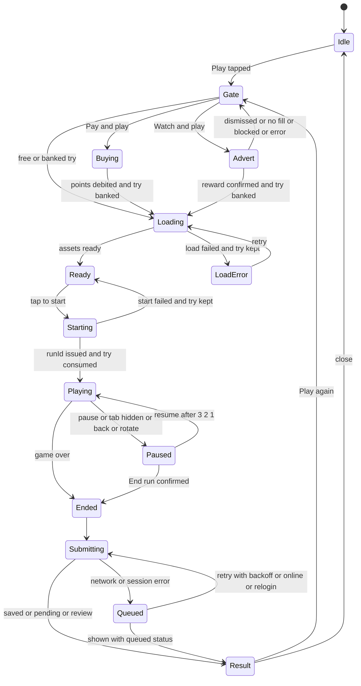

# 09 UX and product flows: PlayToEarn Playground

| Field | Value |
| --- | --- |
| Track | Player experience, UX flows and product surface |
| Date | 2026-09-24 |
| Status | Research and planning only (no project code) |
| Readers | Owner, builder agents (demo), PlayToEarn lead developer (port into playtoearn.com) |
| Evidence labels | **V** = verified today from a primary source or the live site. **D** = documented by a vendor or standards body. **UNVERIFIED** = inference or secondary source |
| ID scheme | J = journey, S = screen, E = edge case, C = component, AC = acceptance criterion, OQ = open question |

---

## TL;DR

1. **Fit the host, do not reinvent it.** Live playtoearn.com (fetched 2026-09-24) calls its currency "PlayToEarn Points" / "P2E Points" with a gold coin icon, sells "PlayToEarn Plus" ($9.99/month: double points, ad-free browsing), uses a Teddy bear mascot, and already runs a "Teddy Jump Challenge" and a "10K Daily Challenge" leaderboard with an "Ends in" countdown. The front end is jQuery + Bootstrap 4 + Inter (V), and the back end looks like Laravel (UNVERIFIED, strong cookie and CSRF evidence). Reuse this vocabulary and the Reward Center V2 look: pill CTAs in `#0012FF`, 16 px cards, Inter.
2. **One global tries pool** (3 per day, 9 for Plus), shown in a single TriesWidget with a reset countdown. **A try is consumed only when a run really starts** (server-confirmed). Paying 10 points or watching an ad is a one-step "Pay and play" / "Watch and play" action. A failed load, ad or network call never costs a try or points.
3. **The TryGate decision table (section 5.4) defines the single primary action for every state**: free, bonus, points, ad, none, offline, logged out, maintenance, run active elsewhere. Every Play button states its cost. Points and ad options get equal visual weight, neither pre-selected. The first paid try of the day asks for confirmation. After game over, input is ignored for 800 ms to stop accidental paid replays.
4. **The result sheet is the motivation engine.** It shows score, new best, rank change with arrow and number, "if the week ended now" reward, the exact score needed for the next reward tier or the top 100, the Overall trophies change, save status, and "Play again" with its cost.
5. **Overall ranking = "Trophies".** Each top-100 finish earns `101 - rank` trophies (#1 = 100, #100 = 1). This equals the owner's `N x 100 - sum(ranks)` score plus 1 per top-100 finish, so the order is almost identical. In the owner's version a #100 finish scores 0, the same as not playing; here it counts. The additive form is explainable in one sentence and stays stable when the pool grows from 10 to 50 games. Every row can expand into its per-game breakdown.
6. **Community Bonus**: show a rounded estimate updated hourly, plus how it splits by rank. Never show the 50% rule, paid-try counts, points spent or per-user contributions. The copy truthfully says it is "based on the weekly participation activity of the community". Legal review is flagged.
7. **Mobile first**: portrait 9:16 game frame. Game mode is **pseudo-fullscreen** because the Fullscreen API is not available for elements on iPhone (MDN BCD). The host must add `viewport-fit=cover` on Playground routes for safe areas. The primary CTA sits in a sticky bottom bar in the thumb zone, and the back button pauses the game.
8. **Accessibility gaps inherited from the host must be fixed in our scope.** The host has a global `button:focus{outline:0!important}`. Its muted text `#7A828F` measures 3.88:1 and its gold rank numerals `#F0C419` measure 1.66:1 on white. Section 16 gives replacement tokens with measured ratios. Also: reduced motion, colorblind-safe arrows and numerals, text-free and flash-safe games.
9. **Ethics as a feature**: no fake urgency, no auto-start into paid tries, ads always optional and clearly labeled as "1 try" (video icon, never green), notifications opt-in and rate-limited, a spending history and an optional daily points limit. This aligns with the AdMob rewarded policy, Poki and CrazyGames rules, DSA Art. 25, the FTC dark-patterns report and the CPC principles.
10. **The demo ships a dev panel** with personas, clock travel, an ad outcome simulator, network faults, "close week now", locale and theme switches, and an adapter call log. The lead developer can then see every state and every integration point without reading code (section 7.15).

How this report maps to the requested structure: findings are in section 1 plus the evidence notes in sections 5 and 9 to 14. Recommendations are in sections 2 to 18 and the acceptance criteria in 22. Risks are in 19, open questions in 20, cross-track notes in 21 and sources in 23.

## Recommendations at a glance (details in the numbered sections)

| Topic | Recommendation | Key numbers |
| --- | --- | --- |
| Tries | Global pool. A try is consumed at run start. "Pay and play" / "Watch and play" | 3 free (Plus 9), 10 points per try, ad cap is config (demo 5), reset 00:00 UTC |
| Week | ISO week with one global close | Monday 00:00 UTC. Closing banner at T-60 min. Grace 15 min (runtime to confirm). Results by T+12 h (economy to confirm) |
| Paid-try safety | Confirm the first paid try per day. Input guard at game over. No bundles | 800 ms guard. Optional daily points limit 50/100/200/custom |
| Ads | Opt-in per ad. Reward = 1 try. Equal choice pills, video icon, never green. 7 outcomes | 8 s ready timeout. 10 s confirm + 60 s polling. Hide after 2 blocked detections |
| Result sheet | Score, best, rank delta, if-now reward, next target, trophies delta, save state, cost-labeled Play again | Local score in 300 ms or less. Rank in 2 s or less (p75) |
| Leaderboards | Top 100 + around me + #100 cutoff + sticky "You" row | Around me = +-5 ranks. Poll 30 s (game page), 60 s (hub). Ties go to the earliest time |
| Overall | Trophies = 101 - rank per top-100 finish | #1 = 100, #100 = 1 |
| Community Bonus | Rounded estimate, hourly. Distribution shown. Formula hidden | Nearest 50 (under 10,000) or 100. Hidden below 1,000 |
| Notifications | In-app first. Email and push opt-in. Rate-limited | Drop-out: 1 per game per 24 h, 3 per day |
| Mobile | Pseudo-fullscreen game mode, 9:16, `viewport-fit=cover`, sticky CTA | Targets 44 px, CTA 56 px, pre-run frame max 62dvh |
| Desktop | 3 columns: info, frame, board | 280 / auto / 340 px. Frame height `clamp(560px, 100vh - 160px, 800px)` |
| Accessibility | WCAG 2.2 AA shell. Scoped focus ring. Measured tokens | Text 4.5:1, non-text 3:1, targets 24 px minimum (44 px standard) |
| i18n | ICU MessageFormat, Intl, text-free games, pseudo-locale | Design for +40% text |
| Performance | Lazy per-game chunks. Skeletons. No polling during runs | LCP 2.5 s, INP 200 ms, CLS 0.1, shell JS 60 KB gzip, time to playable 3 s |
| Brand | Reward Center V2 look, Inter, `#0012FF` pills, Teddy in empty states | Tokens in 16.2 |
| Demo | Dev panel + adapter log | All 46 edge cases reproducible |

---

## 1. Verified platform context (what the Playground must fit into)

All rows **V** unless marked. They come from a live fetch of public pages and assets on 2026-09-24, with no challenge page served.

| # | Fact | Evidence | UX implication |
| --- | --- | --- | --- |
| 1 | The header balance reads "PlayToEarn Points" (`.setPlayToEarnUserPoints`, "0 Points"). The Plus page says "P2E Points". The token icon is `assets.playtoearn.com/brand/p2e_token.png`, a gold coin embossed with the logo glyph | https://playtoearn.com/rewards , https://playtoearn.com/plus | Make the currency name a config string (`{currencyName}`, default "P2E Points", short form "points") and put the token icon next to every amount |
| 2 | Premium is "PlayToEarn Plus": $9.99/month or $99.90/year. Perks: "Boosted Rewards" (double P2E Point earnings), ad-free browsing, profile and Discord badges, early access to in-house games (Desktop, Android, iOS), member-only events, challenges and competitions. Crown icon `icon_plus_transparent.png` | https://playtoearn.com/plus | Plus = 9 free tries. Two conflicts need owner answers (OQ-3 double points, OQ-4 ads). Show the Plus crown on leaderboard rows. Early access fits as a practice-only preview |
| 3 | The payout threshold is "2,000 points to your first payout" (progress bar, "View rewards", Reward Center, USDT and tokens) | https://playtoearn.com/rewards | Weekly results show progress toward the next payout with the same meter pattern |
| 4 | A 7-day daily login streak pays +5, +5, +10, +10, +15, +15, +20 | https://playtoearn.com/earn | Do not add a second daily streak. Use weekly missions instead (phase 2) |
| 5 | The "Teddy Jump Challenge" task card reads "Points credited instantly" and "Earn points". The "10K Daily Challenge" shows top-3 chips (rank, avatar, name, points) with an "Ends in" countdown | Rewards HTML | The Playground should absorb or link these. Reuse the "Ends in" wording. Teddy is the brand's game hero |
| 6 | The mascot is a Teddy bear in a blue "PlayToEarn" hoodie with sunglasses. Default avatars are Teddy variants (`/user/beta/N.png`) | Public asset URLs | Use Teddy for onboarding and empty states. Avatars fall back to host defaults |
| 7 | Users appear as username + avatar with a profile link `/user/{name}/{id}`, or as a masked wallet ("0xGo....5363") on the P2E leaderboard | https://playtoearn.com/account/p2e-leaderboard | LeaderboardRow must handle masked wallets, any Unicode script (`dir="auto"`) and truncation |
| 8 | Login is a client-side modal, `playToEarnAuth.showLogin()`, with MetaMask, Phantom, WalletConnect and Google sign-in | `assets/js/auth.js`, HTML | "Log in to play" calls the host login through an adapter and returns to the same URL |
| 9 | Front end: jQuery, Bootstrap 4.3.1, Font Awesome 6.5.1, Line Awesome, GSAP 3.12.5, Lottie 5.12.2, Swiper, hot-toast. Tooltips use `data-balloon`, new components use inline Tabler SVG icons, and fonts are Inter and Instrument Sans (Google Fonts) | HTML `<head>` of /rewards and /plus | Namespace all CSS and avoid Bootstrap class names (`.btn`, `.card`, `.modal`, `.badge`). Lottie is already loaded, so it can drive celebrations |
| 10 | The back end is probably Laravel: `csrf-token` meta, `XSRF-TOKEN` cookie and an `<app>_session` cookie with `Max-Age=7200` (UNVERIFIED as a framework, strong evidence) | Response headers | Idle sessions expire after 2 h, and a stale CSRF token returns 419. A pending score must survive both (E-13) |
| 11 | Night mode is the `body.night-mode` class (333 CSS references) with neutral dark surfaces `#111`, `#212121`, `#2D2D2D` and text `#E8E8E8`. The Rewards page forces light mode | CSS, inline script | Theme tokens switch on `.night-mode`. Design light-first like Reward Center V2 |
| 12 | Reward Center V2 tokens: `--rc-ink #1f2430`, `--rc-muted #7a828f`, `--rc-line #e7e9ee`, `--rc-track #dfe7f5`, `--rc-inner 960px`. CTA pill `#0012ff`, radius 999 px. Cards: radius 16 px, white, soft shadow. Active tab underline `#2f6bff`. Rank chip numerals: gold `#f0c419`, silver `#aeb6c2`, bronze `#cd7f32`. Mobile breakpoint 720 px. Plus page hover/pressed blues: `#0010E0`, `#0010BF` | rewardcenter.css, plus.css | Build our tokens on these and fix the contrast failures (section 16.2) |
| 13 | Global CSS: `button:focus{outline:0!important}`, `input:focus{outline:none}`, `body{font-size:.9rem}` | header.css and others | Restore focus rings with a scoped box-shadow and set our own root font size (section 10.3) |
| 14 | The viewport meta is `width=device-width, initial-scale=1` without `viewport-fit=cover`. The manifest has `display: standalone` and theme `#000000` | HTML, /manifest.json | Add `viewport-fit=cover` on Playground routes. Offer an optional "Add to Home Screen" tip for true full screen on iOS |
| 15 | Display banner slots (728x90, 320x90) exist for non-Plus users | header.css | Keep banner ads away from Play buttons and game controls. Hide them in game mode |
| 16 | The header and Reward Center have a notification bell and a chat widget (`.PlayToEarnChatRequest`) | HTML | Send notifications to the host inbox through an adapter. Hide the chat bubble in game mode |
| 17 | The Android app is "PlayToEarn - Crypto Games List" on Google Play. `/.well-known/assetlinks.json` returns 404, so it is not a verified TWA. The wrapper type is UNVERIFIED | https://play.google.com/store/apps/details?id=com.playtoearn.playtoearn | Must work inside WebViews: back button, safe areas, no reliance on the Fullscreen API |
| 18 | The language selector shows English only | HTML footer | Launch in English, built i18n-ready (section 11) |

Note for other tracks: the assets track read a self-hosted "Futura" from archived CSS. Today's live /rewards and /plus pages load Inter and Instrument Sans from Google Fonts. The shell should take its font from `--pg-font-ui` and default to Inter.

---

## 2. UX principles (rules every builder follows)

| ID | Principle | Concrete rule |
| --- | --- | --- |
| P1 | Two taps to play | Lobby card, then Play. No menus in between. First-run tips are overlays, not gates |
| P2 | Cost before commitment | Every Play button shows its cost (free try, bonus try, 10 points, ad). No paid run starts without a tap on a button that names the cost |
| P3 | Never charge for our failures | A try is consumed when the server issues a `runId` at run start. Load, ad and network failures keep tries and points intact |
| P4 | One thumb, portrait first | The primary CTA sits in the bottom 1/3. Games are playable with one thumb, and desktop adds keyboard |
| P5 | Honest numbers | Only real deadlines (daily reset, weekly close). Provisional rewards use "if the week ended now". Estimates are rounded and say "about" |
| P6 | Text-free games, localized shell | Canvases draw only digits and icons. All words live in the DOM shell and come from locale files |
| P7 | Host-agnostic | Every host touchpoint goes through a named adapter, and the dev panel logs every adapter call |
| P8 | Accessible by default | WCAG 2.2 AA for all non-game UI. Games get fairness-neutral options (visual, audio, input remap) |
| P9 | Calm by default | No auto-play into paid tries, no nagging. Notifications are opt-in except results. No confirmshaming |
| P10 | Always show the path | Show "what it takes": score to the next tier, score to reach the top 100, trophies to the next Overall rank |

---

## 3. Vocabulary (use exactly these words in UI)

| Concept | UI term (EN) | Definition | Never use |
| --- | --- | --- | --- |
| Permission to start one ranked run | **try / tries** | Consumed when a run starts | life, credit, ticket, entry, chance, token |
| Daily allowance | **free try** | 3 per day (Plus 9). Resets at the daily reset | |
| Try gained by points or ad | **bonus try** | Normally used immediately. Banked only if a start fails | extra life |
| One play session | **run** | Start to game over or "End run" | round, match, bet, game (ambiguous) |
| Week | **Week 39** / "this week" | Monday 00:00 UTC to Monday 00:00 UTC | season (unless seasons are added) |
| Top 100 | **top 100**, "reward zone" | Ranks that earn weekly points | winners' circle |
| Host currency | **P2E Points** (long), **points** (short, next to coin icon) | From config | coins, cash, money, $, USDT, crypto |
| Overall unit | **trophies** | Sum over games of (101 - rank) for top-100 finishes | points (collides with the currency) |
| Cross-game board | **Overall ranking** / tab "Overall" | Ranked by trophies | league, championship |
| Dynamic pool | **Community Bonus** | Extra P2E Points for the Overall top N | jackpot, pot, prize pool, lottery |
| Premium | **Plus**, "PlayToEarn Plus" | Host membership | VIP, premium (in UI) |
| Unranked play (if enabled) | **Practice** | Free, never counts | free play |

**Banned in all copy** (legal and tone): bet, wager, stake, gamble, jackpot, lottery, raffle, draw, cash, free money, guaranteed, risk-free, buy-in, entry fee, prize money, "earn crypto by watching ads", "earn points by watching ads". The ad reward is always "1 try".

---

## 4. Information architecture and routes

```
/playground                         Lobby (public, SSR-friendly, SEO)
/playground/g/{slug}                Game page (public; ranked play needs login)
/playground/g/{slug}#play           Game mode state (history entry so Back = pause)
/playground/leaderboards            Hub, default tab: last played game, else Overall
/playground/leaderboards/overall    Overall ranking (?week=2026-W39)
/playground/leaderboards/{slug}     Per-game board (?week=2026-W39, ?view=around)
/playground/results/{weekId}        Weekly results reveal (auth, also opened as a sheet)
/playground/me                      My Playground: this week, rewards, runs, settings (auth)
/playground/rules                   Rules and FAQ (public, anchor per question)
/playground/admin/...               Back office (admin role only)
(demo only) DEV button / ?dev=1     Dev panel, excluded from production builds
```

| Entry point | Placement | Notes |
| --- | --- | --- |
| Top nav "Playground" | Between "Games" and "Rewards", "NEW" badge for 30 days | Needs a host header change (integration) |
| Rewards page task card | Replaces or sits next to "Teddy Jump Challenge": "Playground: quick games, weekly rewards" | Reuse the `__RcTaskCard` pattern |
| Homepage banner | Launch weeks only | |
| Notifications | Results ready, dropped out of top 100, week closing (opt-in) | Deep link to the right screen, never auto-start a run |
| Share links | `/playground/g/{slug}?s={opaqueShareId}` | No personal data in URLs |

---

## 5. Core models the UI depends on

### 5.1 Tries model (UX recommendation; economy track owns the numbers)

| Rule | Value / behavior |
| --- | --- |
| Scope | **Global pool across all games** (recommended, OQ-1). Config flag `triesScope: global or perGame` so the demo can show both |
| Free per day | 3, Plus 9 (config) |
| Daily reset | 00:00 UTC (config). Align with the host's daily-streak day boundary if it differs (OQ-7) |
| Consumption order | Free first, then banked bonus tries |
| When consumed | At run start, when the server issues a `runId`. Not at "Play" tap, not at ad completion |
| Paid try | 10 points, "Pay and play": debit and start in one flow. If the start fails after the debit, the try stays banked |
| Ad try | "Watch and play": reward confirmed, then start. If the start fails, the try stays banked |
| Banked tries | Never expire (recommended) or expire at weekly close (OQ-9). Shown as "+1 bonus try" |
| Plus bought mid-day | Free total becomes 9 immediately (+6 today). Toast "Welcome to Plus! 6 more free tries today" |
| Plus expires mid-day | Keep today's remaining tries. 3 from the next reset |
| One active run per user | A second tab or device sees "Run in progress elsewhere" (E-21) |

### 5.2 Week model

| Item | Recommendation |
| --- | --- |
| Boundaries | ISO week, Monday 00:00:00 UTC to next Monday 00:00:00 UTC (config). That is Sunday 17:00 in Los Angeles, Sunday 20:00 in New York, Monday 02:00 in Berlin, Monday 05:30 in Kolkata and Monday 08:00 in Manila (computed with Node Intl). Final-hour play falls on Sunday evening in the Americas |
| States | `open` then `closing` (last 60 min: banner) then `finalizing` (new week already open; old week under verification) then `final` (payouts credited, reveal available) then `archived` |
| Grace | Runs that start before the close and end within `graceMinutes` (runtime track, suggest 15) count for the week they started in |
| Countdown format | 24 h or more: "2d 14h". 1 to 24 h: "13h 05m". Under 1 h: "12:30" (mm:ss). Tooltip shows the absolute local time: "Sun 20:00 your time" |
| Clock | Every API response carries `serverNow`. Countdowns use the server offset, never the device clock (E-29) |
| Precedent | Weekly boards with a fixed global reset are the platform norm: Google Play Games resets weekly boards at midnight between Saturday and Sunday, UTC-7 (https://developer.android.com/games/pgs/leaderboards). Apple Game Center recurring leaderboards run from 5 minutes to 30 days per occurrence (App Store Connect help, via search summary). Duolingo resets weekly on Sunday in each user's time zone. We use one global instant because rewards are shared |

### 5.3 Run lifecycle (client state machine)



Notes: the game bundle preloads while the user is on the game page, so `Loading` is usually instant. `startMode` per game is `tap` (Flappy-like "tap to start") or `countdown` (3, 2, 1). The submit carries an idempotency key, so retries never create duplicate runs.

### 5.4 TryGate decision table (single source of truth for Start panel, Result "Play again" and Payment sheet)

The first matching row wins.

| # | Condition | Start panel shows | Primary action | Secondary |
| --- | --- | --- | --- | --- |
| 1 | Not logged in | "Log in to play" + "3 free tries every day" | `auth.requestLogin({returnTo})` | Practice (flag `guestPractice`) |
| 2 | Maintenance or game disabled | "Paused for updates" | none | Other games |
| 3 | User restricted | Restricted copy | none | Contact support |
| 4 | Offline | "You're offline. Connect to start a run." | disabled | none |
| 5 | Client version outdated | "Update available" | Reload (no try used) | none |
| 6 | Run active elsewhere | "You have a run going in another tab or device" | End that run | Wait |
| 7 | `freeLeft > 0` | "Play (free try)" + "2 free tries left today" | Start (free) | Practice (flag) |
| 8 | `bonusBanked > 0` | "Play (bonus try)" | Start (bonus) | none |
| 9 | `pointsOk or adOk` | Payment choice (section 7.4) | Pay and play / Watch and play, **equal size** | Plus hint (non-Plus), Earn points |
| 10 | none of the above | "Out of tries" panel | none | Reset countdown, Earn points, Plus hint, Practice, Leaderboard |

Definitions: `pointsOk = balance >= cost and (no limit or limitLeft >= cost)`. `adOk = adsEnabled and adTriesLeftToday > 0 and not adBlockedThisSession`. If fewer than 2 minutes remain before weekly close, add the note "The week ends in {mm:ss}. This run counts if you finish within {grace} minutes."

### 5.5 View models the UI needs (language-agnostic, TypeScript notation, UTC ISO 8601 times, integer amounts)

```ts
type NotificationType = 'results_ready' | 'dropped_top100' | 'week_closing' | 'tries_back'
  | 'new_game' | 'score_removed' | 'payout_delayed'
type Viewer = {
  status: 'guest' | 'user'; userId?: string
  displayName?: string              // username or masked wallet "0xGo...5363"
  avatarUrl?: string; isPlus: boolean; isAdmin: boolean
  restricted?: { reason: 'review' | 'banned'; until?: string }
  locale: string; theme: 'light' | 'dark'   // theme mirrors host body.night-mode
  prefs: { sound: boolean; music: boolean; haptics: boolean
           reducedMotion: 'system' | 'on' | 'off'
           confirmPaid: 'always' | 'firstPerDay'
           dailyPointsLimit?: number
           notify: Record<NotificationType, { inApp: boolean; email: boolean; push: boolean }> }
}
type Tries = {
  scope: 'global' | 'perGame'; freePerDay: number; freeUsedToday: number
  bonusBanked: number; resetAt: string; pointsPerTry: number; balance: number
  spendLimit?: { perDay: number; spentToday: number }
  ads: { enabled: boolean; perDayCap: number; usedToday: number }
  activeRun?: { runId: string; gameId: string; startedAt: string; where: 'this' | 'other' }
}
type Week = {
  id: string; number: number; startsAt: string; endsAt: string
  state: 'open' | 'closing' | 'finalizing' | 'final'; graceMinutes: number
  rewardsTotalEstimate: number; resultsEta?: string; unseenResultsWeekId?: string
}
type CommunityBonus = {
  display: 'hidden' | 'growing' | 'amount'; amountRounded?: number; updatedAt?: string
  eligibleTopN: number; distribution: { fromRank: number; toRank: number; percent: number }[]
  finalAmount?: number
}
type GameCard = {
  id: string; slug: string; title: string; coverUrl: string; coverAlt: string; category: string
  status: 'live' | 'new' | 'maintenance' | 'comingSoon' | 'plusPreview'
  playersThisWeek: number; lastWeekChampion?: { displayName: string; score: number }
  my?: { bestThisWeek?: number; rank?: number; rankDeltaSinceLastVisit?: number; inTop100: boolean }
}
type LeaderboardRow = {
  rank: number; userId: string; displayName: string; avatarUrl?: string; isPlus: boolean
  score: number; achievedAt: string; status?: 'verified' | 'pending'
  rewardIfEndedNow?: number; isMe?: boolean
  trophies?: number; gamesRanked?: number          // Overall only
  breakdown?: { gameId: string; rank: number; trophies: number }[]   // Overall, on expand
}
type Leaderboard = {
  boardId: string; weekId: string; live: boolean; totalPlayers: number
  rows: LeaderboardRow[]; around?: LeaderboardRow[]; me?: LeaderboardRow
  cutoffScoreAt100?: number; rewardTiers: { fromRank: number; toRank: number; points: number }[]
  updatedAt: string
}
type RunResult = {
  runId: string; gameId: string; score: number
  submit: 'saved' | 'pending' | 'review' | 'queued' | 'rejected'
  isBestThisWeek: boolean; previousBestThisWeek?: number; allTimeBest?: number
  rank?: { before?: number; after: number; totalPlayers: number }
  rewardIfEndedNow?: { points: number; tierFrom: number; tierTo: number }
  nextTarget?: { kind: 'tier' | 'top100' | 'first'; rank: number; scoreNeeded: number; pointsAtTarget?: number }
  overall?: { rankBefore?: number; rankAfter?: number; trophiesDelta: number }
  nextTry: { kind: 'free' | 'bonus' | 'points' | 'ad' | 'none'; freeLeft: number; cost: number }
}
type WeeklyResults = {
  weekId: string; totalPoints: number
  lines: { kind: 'game' | 'overall' | 'bonus'; gameId?: string; rank?: number; points: number }[]
  closest?: { gameId: string; rank: number; scoreGap: number }    // when nothing was won
  credited: boolean; creditedAt?: string; payoutProgress?: { current: number; threshold: number }
}
type AdOutcome = 'granted' | 'dismissed' | 'noFill' | 'blocked' | 'capped' | 'timeout' | 'error'
```

**Ad outcome mapping** (the rewarded-ads track owns providers; the UI only needs these seven outcomes):

| AdOutcome | Google Ad Placement API `breakStatus` (D) | GPT web rewarded (D) | Timeout rule |
| --- | --- | --- | --- |
| granted | `viewed` (adViewed) | `rewardedSlotGranted` | Reward confirmation waits up to 10 s, then background polling up to 60 s |
| dismissed | `dismissed` (adDismissed) | `rewardedSlotClosed` without granted | |
| noFill | `noAdPreloaded`, `notReady` | `defineOutOfPageSlot()` returns null, or no ready event | 8 s without ready |
| capped | `frequencyCapped`, or our daily cap | our daily cap | |
| timeout | `timeout` | our timer | 8 s |
| blocked | SDK script failed to load | same | Detected at load |
| error | `error`, `invalid`, `other` | JS error | |

Sources: https://developers.google.com/ad-placement/apis/adbreak , https://developers.google.com/publisher-tag/samples/display-rewarded-ad , https://support.google.com/admanager/answer/9116812

---

## 6. User journeys

### J1 Logged-out visitor

| Step | User sees / does | System | Copy key |
| --- | --- | --- | --- |
| 1 | Arrives at /playground from the nav, a banner or a share link | Public lobby: covers, top 3 per game, week countdown, total weekly rewards, Community Bonus estimate | `lobby.*` |
| 2 | TriesWidget slot shows "3 free tries every day. Log in to play." | No personal data | `tries.guest` |
| 3 | Taps a game | Game page: attract loop, leaderboard, rewards, how to play. Play button reads "Log in to play" | `start.login` |
| 4 | (flag) "Practice without saving" | Practice run, nothing submitted. Result: "Log in to save scores like this and win P2E Points" | `result.guestCta` |
| 5 | Taps "Log in to play" | `auth.requestLogin({ returnTo: currentUrl })`, which maps to `playToEarnAuth.showLogin()` | |
| 6 | Logs in | Returns to the same URL. J2 starts if this is the first visit | |

### J2 First-time onboarding (logged in, first Playground visit)

| Step | Presentation | Notes |
| --- | --- | --- |
| 1 | Onboarding sheet, 3 cards with a Teddy illustration: (1) quick games and daily free tries, (2) weekly top 100 wins P2E Points, (3) Overall ranking, trophies and the Community Bonus | Skippable, shown once, "Read the rules" link. Legal track decides whether explicit rules acceptance is needed |
| 2 | Coach mark on the TriesWidget: "Your free tries. They reset every day." | Shown once, dismiss on tap |
| 3 | First game page: how-to pictogram in the frame plus a localized one-line caption below | Pictogram animates, static under reduced motion |
| 4 | First result: "Your first score is on the board!" plus rank | Special copy once per game |
| 5 | After the first run: "Try another game to earn trophies in the Overall ranking" | Once. Links to the lobby |

### J3 Daily return

| Element | Behavior |
| --- | --- |
| Unseen weekly results | Reveal sheet opens first (J9), once per week |
| Tries refilled | The TriesWidget shows full pips. A toast "Your free tries are back" appears only if the user ended yesterday at 0 |
| Continue row | Last 2 to 4 played games first |
| Change markers | Cards show a down marker and number if the user lost rank since the last visit |
| "Where you can climb" row | Games where the user is ranked 101 to 200 or within 10% of the #100 score. Honest, data-based |
| Week card | Countdown, total rewards, Community Bonus estimate |

### J4 Free try run

Lobby card, then the game page ("Play (free try)"), then pseudo-fullscreen, then "tap to start" (server start, try consumed), then play, then game over, then the result sheet (J8).

### J5 Paying for a try (points vs ad)

| Step | Points path | Ad path |
| --- | --- | --- |
| 1 | Free tries are 0, so the Start panel and Result "Play again" show the Payment choice | same |
| 2 | Taps "Play for 10 points" (token icon) | Taps "Watch ad for 1 try" (video icon, neutral color) |
| 3 | First paid try today: confirm dialog "Use 10 points for 1 try? Balance 245 to 235" with a "Don't ask again today" checkbox | Disclosure shown on the button area: "Watch a short ad to get 1 try. {n} ad tries left today." |
| 4 | Debit (idempotency key), then balance animates down in our chip and the host header (`points.onBalanceChanged`) | "Loading ad..." (8 s timeout), then the provider's full-screen ad. Lobby music is muted only when the ad actually starts |
| 5 | Try banked, then Ready ("tap to start") | "Confirming your reward...", then "Nice! 1 try added.", then Ready |
| 6 | Debit fails: "Couldn't complete the payment. No points were used." Start fails after the debit: "Couldn't start the run. Your try is saved for later." | Failure copy per AdOutcome (section 7.5). The points option stays available |

### J6 Out of options

The trigger is no free, no bonus, points not OK and ad not OK. The panel never dead-ends:

```
+--------------------------------------+
| (Teddy resting)                      |
| You're out of tries for today        |
| Free tries reset in 5h 12m           |
|                                      |
| [ How to earn points ]  (host /earn) |
| Plus members get 9 free tries a day. |
| Learn about Plus >                   |
| [ Practice (not ranked) ]   (flag)   |
| See where you rank >                 |
+--------------------------------------+
```

### J7 Playing

| Moment | Behavior |
| --- | --- |
| Enter game mode | Pseudo-fullscreen overlay, host chrome hidden (header, banners, chat bubble), body scroll locked, focus moved into the frame |
| HUD | Pause button (DOM, 44x44, top-left inside the safe area). Score drawn by the game (digits only). Nothing else |
| Tab or app hidden | Auto-pause on `visibilitychange`. On return the pause menu shows and Resume runs a 3, 2, 1 countdown |
| Back button / Android back | The first back opens the pause menu (history entry `#play`). Back from the pause menu shows the leave confirm |
| Rotate to landscape on a phone | Auto-pause and a rotate prompt |
| Connection lost | Game continues and an offline dot appears in the pause menu. The submit is queued |
| Session expires | Does not interrupt play. Handled at submit (E-13) |
| End run | Pause menu, then "End run". Confirm "End this run? Your score so far (1,230) will be saved." |

### J8 Result

See S5 (section 7.7). Order: score, best badge, rank change, reward-if-now, next target, Overall change, save status, "Play again" with cost, secondary actions.

### J9 Weekly close, results reveal and payout notification

| Time | What the user sees |
| --- | --- |
| T-24 h (opt-in) | Notification only if the user is within reach (rank 90 to 150 in some game): "{game}: you're #{rank} and the week ends in {duration}." |
| T-60 min | Banner: "The week ends in 59:12. Runs started before the end still count." |
| T0 | Countdown reaches 0. The lobby switches to the new week, and the old week card reads "Week 39 is over. We're checking the final scores. Rewards arrive by {time}." |
| T+ up to 12 h (economy and runtime tracks set the SLA) | Results final and points credited (ledger). In-app notification "Week 39 results are in: you earned 1,240 points!" Email only if opted in |
| Next visit | The reveal sheet opens once if the user earned more than 0. If nothing was earned, a lobby card shows the closest miss, with no modal |
| Reveal CTA | "Play Week 40" and "See full results". Points are already credited, so there is no "claim" step and nothing expires |

### J10 Dropped out of top 100

| Rule | Value |
| --- | --- |
| Trigger | The user was in a game's top 100 for 60 minutes or more, then fell to rank 101 or lower |
| Rate limits | At most 1 per game per 24 h and 3 per day in total. More than that becomes a digest. None for users inactive for 14 days |
| Channels | In-app bell on by default. Email and push are opt-in |
| Copy | "You dropped to #104 in Sky Hop. The top 100 now needs 1,540." |
| Deep link | Game page with the "Around me" tab selected. Never auto-starts a run |

### J11 Upgrade to Plus from the out-of-tries state

"Learn about Plus" opens the host /plus page (same tab, `returnTo`). On return with Plus active, a toast says "Welcome to Plus! 6 more free tries today." and the Start panel re-evaluates.

### J12 Failure recovery

A submit fails, so the result sheet shows "Couldn't save yet. Retrying..." with backoff of 1, 2, 4, 8 and 16 s, and the pending submit is persisted in local storage. After 5 tries: "Saved on this device. We'll send it when you're back online." On 401 or 419: "Your session ended. Log in again to save your score.", then `auth.requestLogin`, then an automatic submit and the toast "Score saved".

---

## 7. Screen inventory and wireframes

Game names below (Sky Hop, Flap Dash, Stack Up) and all reward numbers are **placeholders**. The roster and economy tracks decide the real ones.

### 7.0 Screen index and state coverage

| ID | Screen | Loading | Empty | Error | Offline | Logged out | Notable edge states |
| --- | --- | --- | --- | --- | --- | --- | --- |
| S1 | Lobby | Skeletons | No games live | Retry card | Cached, read-only | Teaser | Results unseen, maintenance, first visit |
| S2 | Game page | Frame progress | No scores yet | Load failed | Play disabled | Log in CTA | Game disabled, week closing, active elsewhere, outdated |
| S3 | Payment sheet | Ad loading | n/a | Ad outcomes | Points and ad disabled | n/a | Insufficient, capped, blocked, limit reached |
| S4 | Game mode | 3, 2, 1 | n/a | Crash overlay | Offline dot | n/a | Rotate, hidden tab, back, leave |
| S5 | Result sheet | Rank pending | First run | Submit failed | Queued | Guest practice | Review, week closed during run |
| S6 | Leaderboards | Row skeletons | "Be the first" | Retry | Cached | Public | Fewer than 100 players, pending rows, banned rows hidden |
| S7 | Weekly reveal | Spinner | Nothing won (card) | Retry | Cached | n/a | Payout delayed |
| S8 | My Playground | Skeleton | "Your runs will show up here" | Retry | Cached | Redirect to login | Refunded try, removed score |
| S9 | Rules and FAQ | Static | n/a | n/a | Cached | Public | Locale fallback |
| S10 | Notifications | n/a | n/a | n/a | n/a | n/a | Rate limits |
| S11 | Admin | Table skeletons | Per table | Inline errors | Blocked | Hidden | Payout dry run, idempotency |
| S12 | Dev panel | n/a | n/a | n/a | Simulated | Persona | Everything in section 8 |

### 7.1 S1 Lobby

Mobile (under 720 px):

```
+--------------------------------------+
| HOST HEADER (logo, menu, coin 245)   |
+--------------------------------------+
| Playground                (i) Rules  |
| [Games]  Leaderboards  My Playground |  sticky subnav, 48 px
+--------------------------------------+
| +----------------------------------+ |
| | (o)(o)( )  2 free tries left     | |  C11 TriesWidget
| | Resets in 5h 12m    Plus: 9/day >| |
| +----------------------------------+ |
| +----------------------------------+ |
| | THIS WEEK          Ends in 2d 14h| |  C14 WeekCard
| | 24,500 P2E Points to win         | |
| | Community Bonus: about 8,200  (i)| |  C15
| +----------------------------------+ |
| Continue                             |
| +---------------+ +---------------+  |
| | [cover 1:1]   | | [cover 1:1]   |  |  C21 GameCard
| |  #23  up 4    | |  NEW          |  |  chips on calm lower quarter
| +---------------+ +---------------+  |
| | Sky Hop       | | Flap Dash     |  |  title in UI font
| | Best 2,310    | | Not played    |  |
| +---------------+ +---------------+  |
| Where you can climb                  |
| ...                                  |
| All games                    Sort v  |
| (2-column grid)                      |
| +----------------------------------+ |
| | OVERALL RANKING          See all>| |  C39 teaser
| | 1 [av] Lkings       912 trophies | |
| | 2 [av] M.           870          | |
| | 3 [av] Janet        845          | |
| | You #57             312          | |
| +----------------------------------+ |
| How it works (3 steps) >             |
+--------------------------------------+
```

Desktop (1024 px and up):

```
+-----------------------------------------------------------------------------------------------+
| HOST HEADER                                                                                   |
+-----------------------------------------------------------------------------------------------+
| Playground          [Games]  Leaderboards  My Playground  Rules                               |
+---------------------------------------------------------------------+-------------------------+
| THIS WEEK  Ends in 2d 14h   24,500 P2E Points to win                | YOUR TRIES              |
| Community Bonus: about 8,200 (i)                                    | (o)(o)( ) 2 of 3 left   |
+---------------------------------------------------------------------+ Resets in 5h 12m        |
| [All] [Jump] [Tap] [Dodge] [Stack]                    Sort: Popular | Plus: 9 a day >         |
| +-----------+ +-----------+ +-----------+ +-----------+             +-------------------------+
| | cover 1:1 | | cover 1:1 | | cover 1:1 | | cover 1:1 |             | BALANCE  (coin) 245     |
| +-----------+ +-----------+ +-----------+ +-----------+             +-------------------------+
| | Sky Hop   | | Flap Dash | | Stack Up  | | ...       |             | OVERALL RANKING  See all|
| | Best 2,310| | Not played| | Best 540  | |           |             | 1 Lkings        912     |
| | #23 up 4  | | NEW       | | #140      | |           |             | 2 M.            870     |
| +-----------+ +-----------+ +-----------+ +-----------+             | 3 Janet         845     |
| (4 columns, right rail 320 px)                                      | You #57         312     |
|                                                                     +-------------------------+
|                                                                     | HOW IT WORKS (3 steps)  |
+---------------------------------------------------------------------+-------------------------+
```

| Element | Spec |
| --- | --- |
| Grid | 2 columns under 720 px (1 column under 340 px), 3 columns at 720 to 1023 px, 4 columns at 1024 px and up with a 320 px right rail. Max content width 1200 px |
| GameCard states | default; not played; played (best + rank); top 100 (badge); #1 (gold medal); dropped since last visit (down marker + number); new (14 days); maintenance ("Paused for updates", disabled); coming soon (dimmed, date); Plus preview (crown chip, practice only) |
| Sorting and filtering | Up to 12 games: none. 13 to 29: category chips + sort (Popular, New, My best rank, A to Z). 30 and up: add search (input font 16 px so iOS does not zoom) |
| Week card | "Ends in" countdown, total weekly rewards (fixed tables plus bonus estimate), Community Bonus line with (i) |
| Overall teaser | Top 3 + "You" row. When unranked: "Get into any game's top 100 to join the Overall ranking." |

States: loading shows skeletons for TriesWidget, WeekCard and 6 cards with fixed aspect boxes (no CLS). Logged out replaces the TriesWidget with a login CTA. Error shows an inline card "Couldn't load the Playground. Try again." with cached data if any. Maintenance shows a full-page state with Teddy. Unseen results open the reveal sheet first.

### 7.2 S2 Game page (pre-run)

Mobile:

```
+--------------------------------------+
| < Games          Sky Hop        (i)  |
+--------------------------------------+
| +----------------------------------+ |
| |                                  | |
| |   [cover art or attract loop]    | |  C23 GameFrame, 9:16, max 62dvh
| |                                  | |
| |   [tap pictogram, no words]      | |
| |                                  | |
| +----------------------------------+ |
| Tap to jump. Avoid the gaps.         |  localized caption
| Best 2,310 . Rank #23 (up 4) of 1,284|
| Last week's champion: Lkings 4,120   |
| [Leaderboard]  Rewards  How to play  |  tabs
|  1 [av] Lkings              4,120    |
|  2 [av] M.                  3,980    |
|  ...                                 |
| 23 [av] You                 2,310  < |
+--------------------------------------+
| [    Play (free try)    ] 2 left     |  C4 StickyActionBar, thumb zone
+--------------------------------------+
```

Desktop:

```
+------------------------------------------------------------------------------------------------+
| Games / Sky Hop                                                         Rules (i)    Share     |
+---------------------------+----------------------------------+---------------------------------+
| HOW TO PLAY               |  +----------------------------+  | LEADERBOARD  Week 39  Live      |
| [pictograms]              |  |                            |  | [Top 100] [Around me]           |
| Tap / Space: jump         |  |       GAME FRAME 9:16      |  |  1 Lkings              4,120    |
| Arrows / A D: move        |  |  height clamp(560px,       |  |  2 M.                  3,980    |
|                           |  |    100vh - 160px, 800px)   |  |  3 Janet               3,870    |
| YOUR WEEK                 |  |                            |  |  ...                            |
| Best 2,310 (#23, up 4)    |  |  +----------------------+  |  | 23 You                 2,310    |
| Runs this week 5          |  |  | START PANEL (C24)    |  |  |  ...                            |
|                           |  |  | [ Play (free try) ]  |  |  | --- top 100 reward zone ---     |
| REWARDS THIS WEEK         |  |  | 2 free tries left    |  |  | Updated 1 min ago  [Refresh]    |
| #1          1,000         |  |  +----------------------+  |  +---------------------------------+
| #2            700         |  +----------------------------+  | YOUR TRIES 2 of 3 left          |
| ...                       |  [ Full screen ]   [ Sound on ]  | Resets in 5h 12m                |
| #51 to #100    20         |                                  | BALANCE (coin) 245              |
+---------------------------+----------------------------------+---------------------------------+
```

States: the frame shows a progress bar while the bundle preloads. On load failure: "The game didn't load. No try was used. [Try again]". Game disabled: overlay "Paused for updates". Week closing: banner above the frame. Active run elsewhere: TryGate row 6.

### 7.3 Start panel variants (rendered from the TryGate)

| Variant | Primary | Secondary | Helper line |
| --- | --- | --- | --- |
| free | Play (free try) | Practice (flag) | "2 free tries left today. A try is used when your run starts." |
| bonus | Play (bonus try) | | "You have 1 bonus try." |
| choice | Play for 10 points (coin), equal choice pill | Watch ad for 1 try (video icon), equal choice pill | "Balance 245. 3 ad tries left today." |
| points only | Play for 10 points | Ad option disabled with reason | "No ad available right now." or "Ad tries used up for today." |
| ad only | Watch ad for 1 try | Points option disabled with reason | "You need 10 points. You have 4." plus "How to earn points" |
| none | none (J6 panel) | Practice, Leaderboard | Reset countdown, Plus hint |
| logged out | Log in to play | Practice (flag) | "3 free tries every day" |
| offline, maintenance, restricted, outdated, active elsewhere | disabled or special | per TryGate | per TryGate |

### 7.4 S3 Payment choice sheet and spend confirm

```
+--------------------------------------+
|                 ___                  |  bottom sheet (mobile) / dialog (desktop)
| Out of free tries                (x) |
| Free tries reset in 5h 12m.          |
| +----------------------------------+ |
| | (coin) Play for 10 points        | |  56 px, choice pill (see below)
| +----------------------------------+ |
| Balance 245 -> 235                   |
| +----------------------------------+ |
| | (video) Watch ad for 1 try       | |  56 px, identical choice pill
| +----------------------------------+ |
| Short video ad. 3 ad tries left today|
|                                      |
| Plus members get 9 free tries a day. |
| Learn about Plus >                   |
| Not now                              |
+--------------------------------------+

+--------------------------------------+
| Use 10 points for 1 try?             |  C26 SpendConfirmDialog
| Balance 245 -> 235                   |  initial focus on the heading,
| [ ] Don't ask again today            |  so Enter spends nothing
| [ Use 10 points ]    [ Cancel ]      |
+--------------------------------------+
```

Rules:

- Both options use the same "choice pill" style: surface fill, 2 px brand border, ink text and their own icon. They have equal height and width, and neither is pre-selected or filled. This matches the assets track button spec.
- The ad button uses the video icon and is never green (Poki rule). No "recommended" labels.
- "Not now" is plain and neutral, with no confirmshaming.
- Balance is re-read before the sheet opens.
- The points option stays visible but disabled, with its reason, when unaffordable. Hiding it would make the ad look mandatory.

### 7.5 Rewarded ad states (inside S3 or as an overlay from S5)

| State | UI | Copy key | Next |
| --- | --- | --- | --- |
| requesting | Spinner overlay with Cancel link | `ad.loading` | ready: provider shows ad. 8 s: noFill |
| showing | Provider full screen. Our UI and audio muted when the ad starts | none | |
| confirming | Spinner | `ad.confirming` | 10 s, then "Still confirming. Your try will appear shortly." with polling up to 60 s |
| granted | Inline success, then the Ready state | `ad.granted` | Loading/Ready |
| dismissed | Notice | `ad.closedEarly` | Sheet stays open |
| noFill / timeout | Notice + "Try again" enabled after 60 s | `ad.noFill` | Points option stays available |
| blocked | Notice. After 2 detections, hide the ad option for the session | `ad.blocked` | Points option |
| capped | Disabled button with reason and reset countdown | `ad.capReached` | |
| error | Notice | `ad.error` | |

Policy constraints (D): the opt-in must be affirmative, and the action and reward must be disclosed before each ad. The user must be able to skip or dismiss. Monetary items (cash, crypto, gift cards) are never allowed as ad rewards, so the reward is "1 try", never points (https://support.google.com/admob/answer/7313578). GAM web rewarded requires a publisher-built opt-in screen. Google prompts to confirm forfeiting if the user closes early, and a display ad must be in view for 5 s (https://support.google.com/admanager/answer/9116812). Pause and mute during ads, but mute only when the ad actually starts (https://docs.crazygames.com/sdk/video-ads/).

### 7.6 S4 Game mode (pseudo-fullscreen)

```
+--------------------------------------+ <- env(safe-area-inset-top)
| (II)              2,310              |  pause (DOM, 44x44) + score (canvas digits)
|                                      |
|             GAME CANVAS              |
|       safe 9:16 play area centered,  |
|       background extends to edges    |
|                                      |
+--------------------------------------+ <- env(safe-area-inset-bottom)

Pause menu (DOM, dark glass panel)      Rotate prompt (phone landscape)
+------------------------------+        +------------------------------+
|           Paused             |        |  (phone rotate icon)         |
|        Score 1,230           |        |  Turn your phone upright     |
|   [       Resume       ]     |        |  to keep playing             |
|   Sound (on)   Music (on)    |        +------------------------------+
|   [       End run      ]     |
|  Ending the run saves your   |
|  score.                      |
+------------------------------+
```

| Rule | Spec |
| --- | --- |
| Overlay | `position: fixed; inset: 0; height: 100dvh`, above host header, banners and chat (host adapter `host.setChromeVisible(false)`) |
| Scroll and gestures | Lock body scroll. Canvas `touch-action: none`. Root `overscroll-behavior: none`. `user-select: none` and `-webkit-touch-callout: none` on the frame |
| Quit | Only via pause, then End run (no X in the HUD, to avoid accidental taps) |
| Leave guard | In-app links: dialog "Leave the game? Your run will end and your score so far will be saved." A `beforeunload` listener is added only while a run is active (MDN guidance) and removed after |
| Desktop | The frame stays in the page. An optional "Full screen" button uses the Fullscreen API (hidden where unsupported, e.g. iPhone). Space and arrow keys are captured only while the frame has focus |
| Audio | Starts on the first user gesture (Play tap), per the Chrome autoplay policy. The state is remembered |

### 7.7 S5 Result sheet

```
+--------------------------------------+
|              NEW BEST!               |  C32
|                2,310                 |  count-up 600 ms (instant if reduced motion)
|     Rank #23   up 34  (was #57)      |  C18 RankDelta (arrow + number + text)
|          of 1,284 players            |
| +----------------------------------+ |
| | If the week ended now            | |
| | (coin) 100 points  (#11 to #25)  | |
| | 180 more to reach #10: 200 points| |  C34 NextTargetHint
| +----------------------------------+ |
| Overall #41  up 16  (+34 trophies)   |
| (check) Score saved                  |  C33 SubmitStatusChip
| +----------------------------------+ |
| |   Play again (free try)  1 left  | |  cost always visible, 800 ms input guard
| +----------------------------------+ |
| [Leaderboard]  [Share]  [Other games]|
+--------------------------------------+
```

| Variant | Headline | Body changes |
| --- | --- | --- |
| New best | "New best!" | Rank change and reward block |
| Not a best | Score only | "Your best this week: 2,310 (#23). Only your best counts." "So close!" appears only if within 5% of the best |
| First run of a game | "Your first score is on the board!" | Rank shown |
| Entered top 100 | "You're in the top 100!" | Reward block highlighted, 1 s confetti (off under reduced motion) |
| New #1 | "You're #1!" | "Hold it until {weekEnd}." Lead over #2 |
| Outside top 100 | Score | "{diff} more to reach the top 100" |
| Under review | Score + "In review" chip | "Your score is being checked. This can take up to 24 hours." |
| Queued (offline or failed) | Score + "Not saved yet" chip | Auto-retry. "Saved on this device" after 5 attempts |
| Session expired | Score | "Log in again to save your score" button, then auto-submit |
| Week closed during run (beyond grace) | Score | Copy per the runtime or economy decision (E-15) |
| Guest practice | Score | "Log in to save scores like this and win P2E Points" |
| Practice (logged in) | "Practice" | "Not saved to leaderboards." Primary: "Play ranked (free try)" |

### 7.8 S6 Leaderboards hub

```
Mobile                                   Overall row expanded
+--------------------------------------+ +--------------------------------------+
| Leaderboards                         | | 12 [av] Janet (crown)  845 trophies  |
| [Overall] [Sky Hop v]   Week 39 v    | |    9 games ranked            [less]  |
| [Top 100] [Around me]   Live . 1m ago| |    Sky Hop    #4    97 trophies      |
| #   Player                    Score  | |    Flap Dash  #57   44 trophies      |
| 1  (1) [av] Lkings (crown)    4,120  | |    Stack Up   #12   89 trophies      |
| 2  (2) [av] M.                3,980  | |    ...                               |
| 3  (3) [av] Janet             3,870  | +--------------------------------------+
| 4      [av] 0xGo...5363       3,700  |
| ...                                  |
| 100    [av] Nani55            1,540  |
| ---- Top 100 reward zone ends ----   |
| 143    [av] You               1,210  |  sticky "You" row when off-screen
| 330 more to reach the top 100        |
+--------------------------------------+
```

| Spec | Detail |
| --- | --- |
| Markup | Real `<table>` with `<caption>` ("Sky Hop, Week 39, top 100") and headers Rank, Player, Score, Reward (reward column shown at 720 px and up) |
| Row | Rank badge (medal 1 to 3 with numeral), avatar 32 px, name (`dir="auto"`, ellipsis, full name in `title`), Plus crown, score (tabular numerals), optional reward pill |
| Me row | Brand tint background + "You" label. Sticky at the bottom when out of view |
| Around me | Ranks me - 5 to me + 5, plus the "#100 needs {score}" line |
| Live updates | Poll every 30 s on the game page and 60 s in the hub, paused when hidden. New data does not reorder under the user: a "New scores, tap to refresh" pill appears |
| Ties | Same score: earlier `achievedAt` ranks higher. No shared ranks displayed |
| Pending rows | Clock icon + "Pending" label (the anti-cheat track decides visibility) |
| Past weeks | Week selector (last 12 weeks), "Final" badge, reward column shows the points actually paid |
| Fewer than 100 players | Header "Top 100 (37 players so far)" |
| Empty | "No scores yet this week. Be the first!" with a Play CTA |

### 7.9 S7 Weekly results reveal

```
+--------------------------------------+
|           Week 39 results            |
|             You earned               |
|        (coin)  1,240 points          |  count-up, coin fly-in (Lottie), static if reduced motion
| ------------------------------------ |
| Sky Hop          #4     (coin) 300   |
| Flap Dash        #57    (coin)  20   |
| Stack Up         #140          -     |
| Overall          #12    (coin) 400   |
| Community Bonus         (coin) 520   |
| ------------------------------------ |
| (check) Added to your balance        |
| [=====-----] 760 points to your      |  host "first payout" meter pattern
|              first payout            |
| [          Play Week 40          ]   |
| See full results                     |
+--------------------------------------+
```

Rules:

- Opens once per week per user, after `credited = true`, and only if the total is above 0.
- If nothing was earned, show a lobby card instead: "No top 100 finishes in Week 39. Your closest: #143 in Sky Hop, 330 points away. New week, new chance!"
- No "claim" step and no expiry.
- If payouts run late: "Rewards for Week 39 are running late. They're safe and on the way."

### 7.10 S8 My Playground

| Tab | Content |
| --- | --- |
| This week | Tries used today (free, points, ad split), points spent this week, per-game best and rank, Overall rank and trophies |
| Rewards | List of weeks with the total earned. Each week expands to the reveal lines, with a ledger reference ID for support |
| Runs | Recent 50 runs: game, score, time, try type (free, bonus, points, ad), status (saved, review, removed, refunded) |
| Settings | Sound, music, haptics (Android only), reduced motion (system, on, off), paid-try confirmation (always, first per day), daily points limit (off, 50, 100, 200, custom), notifications per type and channel |

Daily points limit (optional, recommended): decreases apply immediately and increases apply after 24 h. At the limit: "You've reached your daily limit of 100 points. You can change it in Settings."

### 7.11 S9 Rules and FAQ

This is an accordion with one anchor per question. Every (i) in the UI deep-links to its anchor, and the page shows "Last updated {date}". Dynamic values come from config (section 15.3 has the outline).

### 7.12 S10 Notifications

| Type | Trigger | Default channels | Rate limit | Copy key | Deep link |
| --- | --- | --- | --- | --- | --- |
| results_ready | Week final and credited, total above 0 | In-app on, email opt-in | 1 per week | `notif.results` | Reveal |
| dropped_top100 | Section J10 | In-app on | 1 per game per 24 h, 3 per day, digest beyond | `notif.dropped` | Game, Around me |
| week_closing | T-24 h, rank 90 to 150 somewhere | Opt-in | 1 per week | `notif.closing` | Game |
| tries_back | Daily reset after the user ended at 0 | Opt-in, off by default | 1 per day | `notif.tries` | Lobby |
| new_game | Admin publishes a game | In-app on | 1 per game | `notif.newGame` | Game |
| score_removed | Anti-cheat removal | In-app on (transactional) | per event | `notif.scoreRemoved` | Rules, fair play |
| payout_delayed | SLA missed | In-app on | 1 per week | `notif.payoutDelayed` | Reveal |

Delivery goes through `notify.push({type, params, deepLink})` into the host bell. Toasts use `ui.toast()` mapped to the host's toaster. Web push only matters if the host becomes an installed PWA: on iOS, web push works only for Home Screen web apps from 16.4 and needs a user gesture (https://webkit.org/blog/13878/web-push-for-web-apps-on-ios-and-ipados/).

### 7.13 Global states

| State | Where | Copy key | Behavior |
| --- | --- | --- | --- |
| Offline | Banner on all screens | `state.offline` | Read-only. Runs in progress continue |
| Maintenance | Full page | `state.maintenance` | Runs in progress may finish and submit |
| Restricted | Start panel + My Playground | `state.restricted` | View only, support link |
| Session expired | Dialog | `state.sessionExpired` | Keeps the pending action, returns after login |
| Outdated client | Start panel | `state.outdated` | Reload button, no try used |
| Unsupported browser | Game page | `state.unsupported` | Lists supported browsers |

### 7.14 S11 Admin back office (desktop-first; the lead developer ports it into the host admin)

| Area | Functions | Safeguards |
| --- | --- | --- |
| Dashboard | KPIs: DAU, runs today, free, points and ad split, points spent, exact bonus pool, ad funnel (requested, filled, completed, granted, blocked), review backlog, error rate | Read-only |
| Games | Enable or disable, order, featured, category, cover, how-to caption per locale, practice flag, Plus-preview window, version | Disabling needs a reason. Running runs may finish. Audited |
| Weeks and payouts | Schedule, grace minutes, close preview, finalize, **dry-run payout**, execute (idempotent batch with ledger batch ID), export CSV | Type-to-confirm "PAY 2026-W39". Optional second approver. Re-running changes nothing |
| Rewards | Per-game tier table (default + override), Overall fixed table, bonus distribution %, minimum participants, weekly cost preview | Changes apply from next week only |
| Tries and pricing | Free per day (normal, Plus), points per try, ad cap per day, scope, reset time, paid confirmation default, spending limit defaults | Applies at the next daily reset. Audited |
| Community Bonus | Pool %, rounding step, update cadence, display threshold, exact current pool (admin only) | The formula is never exposed to users |
| Players | Search by name, ID or wallet. Detail: tries, banked tries, runs, bests, flags, payouts. Actions: refund a try, grant a bonus try, remove a score, restrict or unrestrict | Reason required, user notified with a template, audited |
| Review queue | Flagged runs: score percentile, flags, replay link, device. Actions: approve, remove, remove and restrict, bulk | Warn before a payout if flagged runs sit in any top 100 |
| Content | Rules and FAQ Markdown per locale (versioned), announcement banner, maintenance mode | Preview before publish |
| Notifications | Templates, per-type enable, rate limits | |
| Audit log | Who, what, when, before and after | Append-only |
| Flags | guestPractice, practice, sharing, missions, spendingLimit, notification channels | |

```
+----------------------------------------------------------------------------------------------+
| Playground Admin | Dashboard | Games | Weeks & payouts | Rewards | Tries & pricing | Players    |
|                  | Review queue (12) | Community Bonus | Content | Notifications | Audit | Flags|
+----------------------------------------------------------------------------------------------+
| Week 2026-W39 (open)  ends Mon 00:00 UTC (in 2d 14h)            Maintenance mode [off]       |
| +--------+ +--------+ +--------+ +--------+ +--------+ +--------+ +--------+                 |
| | DAU    | | Runs   | | Free   | | Points | | Ad     | | Pts    | | Bonus  |                 |
| | 5,120  | | 18,400 | | 71%    | | 18%    | | 11%    | | 33,100 | | 16,550 |                 |
| +--------+ +--------+ +--------+ +--------+ +--------+ +--------+ +--------+                 |
| Ad funnel: requested 4,210 . filled 71% . completed 88% . granted 3,180 . blocked 9%         |
| Week   | State      | Players | Fixed payout | Bonus  | Flagged in top 100 | Actions          |
| W39    | open       | 5,980   | est 61,500   | 16,550 | 3                  | Preview close    |
| W38    | finalizing | 6,210   | 61,500       | 15,980 | 0                  | Dry run > Pay    |
| W37    | paid       | 5,870   | 61,500       | 14,220 | 0                  | Export CSV       |
+----------------------------------------------------------------------------------------------+
```

### 7.15 S12 Demo dev panel (demo builds only)

```
+------------------------------------------------------------------+
| DEV PANEL (demo only)                                        (x) |
| Persona: logged-out | new user | regular | Plus | low balance |  |
|          restricted | admin                                      |
| Clock: Thu 24 Sep 14:10 UTC  [+1h] [+1d] [5 min before close]    |
|        [Close week now] [Finalize + pay] [Daily reset now]       |
| Wallet: balance [ 245 ] [Set]    Tries: [Refill] [Use all free]  |
| Next ad: (o) granted ( ) dismissed ( ) no fill ( ) blocked       |
|          ( ) capped ( ) timeout ( ) error ( ) slow confirm (15 s)|
| Network: [Online v]  Submit fails next [2]x  Latency [300 ms]    |
|          [Expire session (401)] [CSRF 419] [Start run elsewhere] |
| Boards: [Seed 500 bots] [Push me out of top 100] [Flag my run]   |
| Game: [Disable current game] [Bump version] [Crash game]         |
| Locale: [en] [de] [pseudo] [rtl-pseudo]   Theme: [light] [dark]  |
| A11y: [Reduced motion] [Text 200%]   Flags: [guestPractice] ...  |
| Adapter log (last 50, copy as JSON):                             |
|  14:10:02 points.debit  {amount:10, reason:"try", key:"k-91"}    |
|  14:10:03 ads.show      {placement:"try"} -> granted             |
|  14:10:04 runs.start    {gameId:"sky-hop"} -> runId r-18         |
| [Reset demo data]                                                |
+------------------------------------------------------------------+
```

Every edge case in section 8 must be reproducible from this panel (AC-27).

---

## 8. Edge case matrix

| ID | Case | Detection | Behavior | Copy key | Owner |
| --- | --- | --- | --- | --- | --- |
| E-1 | Ad no fill | Provider status or 8 s timeout | Notice, retry after 60 s, points option stays | `ad.noFill` | Ads |
| E-2 | Ad blocked by an extension | SDK load failure | Notice, hide ad option after 2 detections this session, never accuse | `ad.blocked` | Ads |
| E-3 | Ad closed early | dismissed | No try, sheet stays open | `ad.closedEarly` | Ads |
| E-4 | Reward confirmation slow | No server grant within 10 s | "Still confirming" + poll 60 s. Idempotent grant ID so a late grant never double-counts | `ad.confirmingSlow` | Ads, Integration |
| E-5 | Ad daily cap reached | Counter | Disabled with reason + reset countdown | `ad.capReached` | Economy |
| E-6 | Ad SDK error | error or invalid | Notice | `ad.error` | Ads |
| E-7 | Insufficient points | Balance lower than cost | Points option disabled with the numbers, "How to earn points" link | `pay.notEnough` | Economy |
| E-8 | Balance changed elsewhere | Server rejects debit | Refresh balance, re-render gate | `pay.balanceChanged` | Integration |
| E-9 | Daily limit reached | Limit check | Message + Settings link | `pay.limitReached` | Economy |
| E-10 | Double tap on Pay | UI | Button disabled after the first tap + idempotency key | none | Integration |
| E-11 | Session expired before start (401) | API | Login prompt. Restore the sheet or state after return | `state.sessionExpired` | Integration |
| E-12 | CSRF token stale (419, Laravel) | API | Silent token refresh + one retry, then login prompt | none | Integration |
| E-13 | Session expired during run | Submit returns 401 or 419 | Persist the pending submit, prompt login, auto-submit, toast | `result.loginToSave` | Integration |
| E-14 | Submit network failure | Fetch error | Backoff 1, 2, 4, 8, 16 s, persisted queue, chip state, retry on `online` event and next visit | `result.retrying`, `result.savedOffline` | Runtime |
| E-15 | Run ends after weekly close | Server | Counts for the start week within grace. Beyond grace, the copy follows the runtime or economy decision | `result.afterClose.*` | Runtime, Economy |
| E-16 | Tab or app hidden mid-run | `visibilitychange` | Auto-pause, pause menu on return | none | Runtime |
| E-17 | Tab closed mid-run | Next visit finds a local open run | Periodic local checkpoint. On return: "Your last run was interrupted. We saved your score of {score}." if the runtime accepts checkpoints, else "That try was used." No automatic refund. Admin can refund | `state.interrupted*` | Runtime, Anti-cheat |
| E-18 | Back button mid-run | `popstate` | Pause menu. A second back asks to leave | `game.leaveConfirm` | UX |
| E-19 | Host link clicked mid-run | Click intercept, `beforeunload` | Leave confirm | `game.leaveConfirm` | Integration |
| E-20 | Phone rotated to landscape | Orientation media query | Pause + rotate prompt | `game.rotate` | UX |
| E-21 | Second tab or device starts a run | Server `activeRun` | "Run in progress elsewhere" + "End that run" | `state.activeElsewhere` | Runtime |
| E-22 | Offline at start | `navigator.onLine` + failed ping | Play disabled with explanation | `state.offline` | UX |
| E-23 | Offline mid-run | Same | Play continues, submit queued | `result.savedOffline` | Runtime |
| E-24 | Daily reset during run | Clock | Run unaffected. Widget refreshes after the result | none | Economy |
| E-25 | Plus bought or expired mid-day | Viewer refresh | See 5.1 | `plus.welcome` | Integration |
| E-26 | Game disabled mid-run | Admin | Current run may finish and submit, then "Paused for updates" | `state.gamePaused` | Admin |
| E-27 | New game version mid-week | Version check at start | Reload prompt before start. No try used | `state.outdated` | Runtime |
| E-28 | Game crashes (JS error) | Error boundary | "The game stopped. Your score so far ({score}) was saved." if a checkpoint exists, else "No score recorded". Report link | `game.crashed` | Runtime |
| E-29 | Device clock wrong | `serverNow` offset | All countdowns use the server offset | none | Integration |
| E-30 | Low FPS device | Frame timing | Auto low-effects (particles, parallax). Never change game speed | none | Runtime |
| E-31 | Audio blocked by autoplay policy | AudioContext suspended | Resume on the Play tap. Remember sound prefs | none | Runtime |
| E-32 | Long, emoji or RTL names | Rendering | `dir="auto"`, ellipsis, `title` tooltip, system font fallback (Google Play Games warns that player names may contain non-English Unicode, so custom leaderboard fonts must render them) | none | UX |
| E-33 | Equal scores | Server | Earlier `achievedAt` ranks higher, explained in the rules | none | Economy |
| E-34 | Fewer than 100 players | Count | Header shows the count. Reward eligibility per the economy track | `lb.fewPlayers` | Economy |
| E-35 | Score under review | Status | "In review" chip on my row and result | `result.review` | Anti-cheat |
| E-36 | Score removed | Status | Notification with a rules link. No public shaming | `notif.scoreRemoved` | Anti-cheat |
| E-37 | Restricted account | Viewer | View only | `state.restricted` | Anti-cheat |
| E-38 | Payout late | SLA | Reveal and notification copy "on the way" | `notif.payoutDelayed` | Economy |
| E-39 | Host header balance stale | After debit or credit | `points.onBalanceChanged(newBalance)` updates `.setPlayToEarnUserPoints` | none | Integration |
| E-40 | Account switched in another tab | Viewer ID changes on focus | Reload the Playground state | none | Integration |
| E-41 | Rapid taps at game over | Result opened less than 800 ms ago | Ignore input on result buttons for 800 ms | none | UX |
| E-42 | Space or Enter held at game over | Key events | Keys never trigger a paid "Play again". Paid needs a click or the confirm | none | UX |
| E-43 | Guest practice, then login | Flag | Practice scores are not saved (said before and after) | `result.guestCta` | UX |
| E-44 | Hidden page polling | Visibility | Pause all polling and countdown ticks | none | Integration |
| E-45 | Screen reader user reaches the canvas | a11y | Frame label + live announcements for start, pause and game over with score. The FAQ is honest that real-time games are visual | `a11y.*` | UX |
| E-46 | Ad shown while lobby music plays | Ad start event | Mute when the ad starts, unmute after | none | Ads |

---

## 9. Layout system

### 9.1 Breakpoints and grid

| Range | Name | Layout |
| --- | --- | --- |
| under 340 px | xs | 1-column lobby. The game frame fills width. Sticky CTA |
| 340 to 719 px | sm (phones; the host breakpoint is 720) | 2-column lobby, stacked game page, sticky bottom CTA, sheets from the bottom |
| 720 to 1023 px | md (tablets, small laptops) | 3-column lobby. Game page: frame + leaderboard side by side, info below |
| 1024 px and up | lg | 4-column lobby + 320 px rail. Game page in 3 columns (info 280, frame auto, board 340). Max width 1200 px |

Spacing scale is 4, 8, 12, 16, 20, 24, 32, 40 px. The side gutter is 16 px on phones and 24 px from md.

### 9.2 Game frame sizing

| Context | Rule |
| --- | --- |
| Logical design size | 360x640 (9:16), roster and runtime tracks to confirm. Games render a centered 9:16 safe play area and extend the background to fill other ratios (no black bars on 19.5:9 phones) |
| Mobile game mode | 100vw x 100dvh (dynamic viewport units track the browser toolbars, https://web.dev/blog/viewport-units). HUD padded with `max(12px, env(safe-area-inset-*))` |
| Mobile pre-run page | Frame height `min(62dvh, 100vw x 16/9)` so the Play bar stays visible |
| Desktop | Height `clamp(560px, 100vh - 160px, 800px)`, width = height x 9/16. The stage backdrop is `--pg-stage` |

### 9.3 Safe areas and viewport (host change needed)

- Playground routes need `<meta name="viewport" content="width=device-width, initial-scale=1, viewport-fit=cover">`. Without `viewport-fit=cover`, iOS insets content automatically and `env(safe-area-inset-*)` stays 0 (https://webkit.org/blog/7929/designing-websites-for-iphone-x/).
- Always write `padding-top: max(12px, env(safe-area-inset-top))` (same source).
- Do not set `maximum-scale=1` or `user-scalable=no` on normal pages, because text zoom is an accessibility need. Only the game frame blocks gestures, via `touch-action`.

### 9.4 Full screen reality check (D, MDN browser-compat-data, main branch 2026-09-24)

| Platform | Element fullscreen | Consequence |
| --- | --- | --- |
| iPhone Safari | Not available ("Only available on iPad, not on iPhone"). Where available, "Swiping down exits fullscreen mode, making it unsuitable for some use cases like games" | Pseudo-fullscreen overlay is the default everywhere |
| iPad Safari | Partial since 16.4 with an overlay button | Pseudo-fullscreen. Optional real fullscreen button |
| Android Chrome and Samsung Internet | Supported, needs a user gesture | Optional "Full screen" button |
| Desktop browsers | Supported | Optional button in the frame toolbar |
| Screen Orientation `lock()` | Not in Safari. Chrome Android 38+ | Portrait design + rotate prompt instead of a lock |
| `navigator.vibrate` | Not in Safari | Haptics toggle is shown only where supported |
| Standalone PWA (host manifest `display: standalone`) | No browser UI | Optional tip after the 3rd session on iOS: "Add PlayToEarn to your Home Screen for full-screen play" |

### 9.5 Thumb zones and touch

- About 49% of observed users hold phones one-handed (Hoober 2013, https://www.uxmatters.com/mt/archives/2013/02/how-do-users-really-hold-mobile-devices.php).
- Primary actions go in the sticky bottom bar (72 px + safe area). Destructive actions (End run) sit only inside the pause menu, away from the primary.
- Targets are at least 44x44 CSS px (Apple 44 pt, Android 48 dp). WCAG 2.2 AA minimum is 24x24.
- The pause button sits top-left, a low-accident zone during gameplay taps.
- Game input uses `pointerdown` for latency. UI buttons activate on click (pointer up) per WCAG 2.5.2.

### 9.6 Keyboard map (desktop)

| Key | Action |
| --- | --- |
| Tab / Shift+Tab | Move through UI (frame is one stop) |
| Enter / Space on focused Play | Start a free or bonus run. Paid runs open the confirm |
| Space, Up, W | Game primary action (per game) |
| Left/Right, A/D | Move (per game). Remappable in Settings (fairness-neutral) |
| P or Esc | Pause and release focus to the pause menu |
| R | Not used (no accidental restarts) |

---

## 10. Accessibility spec

### 10.1 WCAG 2.2 mapping (W3C Recommendation, current version dated 12 Dec 2024, https://www.w3.org/TR/WCAG22/)

| SC | Requirement (short) | How the Playground meets it |
| --- | --- | --- |
| 1.1.1 | Text alternatives | Covers `alt="{game} cover art"`. Icons have `aria-label`. The frame has a label and instructions |
| 1.3.1 | Info and relationships | Leaderboards are tables with headers and a caption. Tabs and dialogs use native semantics |
| 1.4.1 | Use of color (A) | Rank change = arrow + sign + number + text. Medals carry numerals. Disabled options state their reason in text |
| 1.4.3 | Contrast 4.5:1 (AA) | Tokens in 16.2, all measured |
| 1.4.4 / 1.4.10 | Resize 200%, reflow at 320 px | rem units, 1-column fallback under 340 px, no fixed-height text boxes |
| 1.4.11 | Non-text contrast 3:1 | Focus ring, input borders (`#7D8799` 3.62:1 on white), try pips |
| 1.4.13 | Content on hover/focus | Tooltips dismissible with Esc, hoverable, persistent |
| 2.1.1 / 2.1.2 | Keyboard, no trap | All UI keyboard operable. Esc pauses and frees focus from the canvas |
| 2.2.1 | Timing adjustable | Countdowns are informational. Games fall under the real-time exception. No timed dialogs |
| 2.2.2 | Pause, stop, hide | Attract loops stop under reduced motion and on hover-pause. Leaderboards never auto-reorder (refresh pill) |
| 2.3.1 | Three flashes | UI and games: no more than 3 flashes per second. No large red flashes (game spec) |
| 2.3.3 (AAA, target) | Animation from interactions | Reduced-motion setting removes non-essential motion |
| 2.4.7 / 2.4.11 | Focus visible, not obscured | Scoped focus ring overrides host CSS. `scroll-padding-bottom: 96px` so the sticky bar never hides focus |
| 2.5.2 | Pointer cancellation | UI buttons act on up-event. Games use down-event (essential) |
| 2.5.7 | Dragging movements | No drag-only UI. Bottom sheets also close with X or Esc |
| 2.5.8 | Target size 24x24 minimum (AA) (https://www.w3.org/WAI/WCAG22/Understanding/target-size-minimum.html) | Standard 44x44 |
| 3.2.x | Predictable | Focus never starts runs. No auto-start into paid tries |
| 4.1.2 | Name, role, value | Native `<dialog>` (Chrome 37, Safari 15.4, Firefox 98 per MDN BCD), `inert` for background (Chrome 102, Safari 15.5, Firefox 112) |
| 4.1.3 | Status messages | Toasts use `role="status"`. Errors use `role="alert"`. Result score and rank are announced politely |

### 10.2 Screen reader announcements

| Event | Announcement (polite unless noted) |
| --- | --- |
| Run start | "Run started. Press Escape to pause." |
| Pause | "Paused. Score 1,230." |
| Game over | "Game over. Score 2,310. New best. Rank 23, up 34 places." |
| Try used or granted | "Free try used. 1 left today." / "1 try added." |
| Submit failed | "Score not saved yet. Retrying." (assertive only on final failure) |
| Countdowns | Not announced every second. `<time datetime>` + an `aria-label` with the full phrase |

### 10.3 Focus rings despite host CSS

The host ships `button:focus{outline:0!important}` and `input:focus{outline:none}` (V). The host's own newer components already draw focus with box-shadow (`.playtoearnCheckbox:focus-visible` uses a `0 0 0 3px rgba(0,18,...)` shadow). Recommended scoped rule, by intent:

- `.pg-root :focus-visible` gets `box-shadow: var(--pg-focus)` and `outline: 2px solid transparent`.
- The transparent outline becomes visible in Windows forced-colors mode.
- Box-shadow is not touched by the host's `outline:0!important`.
- Set `.pg-root { font-size: 16px; line-height: 1.5 }` because the host body is `.9rem`.

### 10.4 Reduced motion

| Element | Default | Reduced |
| --- | --- | --- |
| Score count-up | 600 ms | Instant |
| Confetti, coin fly-in | 1 to 1.5 s | Off. Static badge instead |
| Sheet transitions | Slide 200 ms | Fade 120 ms |
| Attract loops, parallax | On | Poster image |
| In-game screen shake, flashes | Per game | Off (game init flag `reducedMotion: true`) |

Sources: `prefers-reduced-motion` (https://developer.mozilla.org/en-US/docs/Web/CSS/@media/prefers-reduced-motion) plus an in-app override (system, on, off).

### 10.5 Colorblind-safe encoding

- Never rely on hue alone. Up is a triangle + "+12" in `--pg-success`. Down is an inverted triangle + "-3" in `--pg-danger`. Same is "=".
- Games follow the assets track grammar: hazards are spiky shapes, collectibles are round, power-ups are hexagons. Shape carries the meaning and color reinforces it.
- Data colors (admin charts only) use the Okabe-Ito set: `#E69F00 #56B4E9 #009E73 #F0E442 #0072B2 #D55E00 #CC79A7 #000000`.
- Test with Chrome DevTools vision-deficiency emulation.

### 10.6 Game-level accessibility (fairness-neutral subset of the Game Accessibility Guidelines "basic" list, https://gameaccessibilityguidelines.com/basic/)

| Guideline | Adopt in ranked play? | How |
| --- | --- | --- |
| Large, well-spaced controls | Yes | Whole-screen or half-screen tap zones |
| Simple controls | Yes | 1 to 2 inputs per game (roster track) |
| Same input method for UI and game | Yes | Touch, or keyboard end to end |
| Remappable controls | Yes (desktop keys) | Settings |
| Haptics toggle | Yes | Android only |
| Avoid flicker and repetitive patterns | Yes | Game spec + QA |
| Nothing essential by sound alone | Yes | Visual cue for every audio cue |
| Separate volume or mute for SFX and music | Yes | Settings |
| Settings remembered | Yes | Host preference store or localStorage |
| Accessibility info on the website | Yes | Rules and FAQ section |
| Adjust game speed, difficulty levels | **No in ranked** (unfair). Yes in Practice only if Practice exists | OQ-2 |

---

## 11. Internationalization spec

| Topic | Rule |
| --- | --- |
| Strings | All UI text is in locale JSON with `area.element.state` keys and translator notes (max length, context) |
| Message format | ICU MessageFormat for plurals and selects. Write full sentences inside plural branches and never concatenate fragments (https://unicode-org.github.io/icu/userguide/format_parse/messages/). Example: `{count, plural, =0 {No free tries left} one {# free try left} other {# free tries left}}` |
| Numbers | `Intl.NumberFormat` (grouping differs: en 24,500, de 24.500, en-IN 12,34,567, verified in Node). Compact "12K" only where space is tight |
| Dates and times | `Intl.DateTimeFormat` in the user's time zone. The rules page also shows UTC |
| Durations | `Intl.DurationFormat` (Chrome 129, Safari 16.4, Firefox 136 per MDN BCD) with an ICU fallback. Node 22 lacks it, so the demo needs the fallback |
| Expansion | Design for +40% text. Buttons may wrap to 2 lines. No fixed widths on text |
| Pseudo-locale | Accents + 40% padding + brackets, in the dev panel. It must render without clipping (AC-21) |
| RTL readiness | CSS logical properties (`margin-inline-start`), `dir` from locale. Mirror back chevrons, never mirror rank arrows. Canvases are unaffected |
| Games | Text-free: digits and icons only. "Tap to start", "Game over" and "New best" live in the DOM shell. Canvas digits use Latin numerals everywhere (documented limitation); the DOM uses locale digits |
| Covers | No text in images (owner rule for all generated images). Titles render in HTML from locale files |
| Game names | Treated as brand names (not translated) unless the owner decides otherwise |
| User names | Any script, `dir="auto"`, system font fallback for CJK, Arabic and Devanagari |
| Legal texts | Versioned per locale, with a statement of which language prevails (legal track) |

---

## 12. Performance spec and budgets

| Surface | Metric | Budget |
| --- | --- | --- |
| Lobby | LCP p75 (mobile) | 2.5 s or less (https://web.dev/articles/vitals) |
| All pages | INP p75 | 200 ms or less |
| All pages | CLS p75 | 0.1 or less. Fixed aspect boxes for covers, tabular numerals, skeletons matching final sizes |
| Shell JS (gzip, excluding host) | Initial | 60 KB or less. Admin and dev panel are separate chunks |
| Shell CSS (gzip) | Initial | 15 KB or less |
| Cover tile | Per image | 1:1, AVIF or WebP, `srcset` 256/512, about 35 KB at 512. `loading="lazy"` below the fold. `fetchpriority="high"` on the first row only |
| Game chunk | Before the first frame | 200 KB gzip code (runtime track to confirm). Assets stream progressively |
| Time to playable | Game page to "tap to start" ready | 3 s or less on a mid-range Android over 4G. Poki reports players leave after 10 s of loading (https://developers.poki.com/guide/requirements-quality) |
| Frame rate | During runs | 60 fps target. Auto low-effects under a 50 fps average |
| Polling | Leaderboards | 30 s on the game page, 60 s elsewhere. Paused while hidden and during runs |

Loading strategy:

- Each game is a dynamic import.
- Prefetch the game chunk on card hover or visibility and when the game page is idle. Skip prefetch when `navigator.connection.saveData` is set or the connection is 2G.
- Audio loads after the first gesture.
- Never fetch leaderboards during a run.
- `requestIdleCallback` for non-critical work.

---

## 13. Motivation and retention (without dark patterns)

### 13.1 Loops

| Loop | Cadence | Mechanic | Honest framing |
| --- | --- | --- | --- |
| Session | Minutes | Run, result (best, rank change, next target), play again (cost shown) | "Only your best counts." |
| Daily | 24 h | Free tries refill, visible reset countdown, optional "tries are back" notification (opt-in) | No streak loss mechanics |
| Weekly | 7 days | Climb, close (real deadline), reveal, payout, new week | "If the week ended now" wording |
| Breadth | Weekly | Overall trophies reward top-100 finishes in many games, so players explore | Formula shown openly |
| Social | Any | Share score cards, Plus crown, last week's champion on the game page | Share is optional, no forced invites |
| Progress | Long term | All-time bests, weeks in top 100, reward history | |

### 13.2 Rank-up moments

| Trigger | Presentation | Sound (assets track keys) | Reduced motion |
| --- | --- | --- | --- |
| New best | "New best!" badge, count-up, sparkle | `shared.sfx.score.newbest` | Static badge |
| Rank up | Arrow + delta, mini-board row slides | `shared.sfx.rank.up` | No slide |
| Entered top 100 | Banner + reward tier chip, 1 s confetti | `sting.rank-top100` | Banner only |
| Top 10 / #1 | Medal + Teddy celebration pose | `sting.rank-top10` / `sting.rank-first` | Static medal |
| Overall rank up | Trophies delta chip on the result | `sting.allgames-rankup` | Chip only |
| Weekly reveal | Coin fly-in to balance (Lottie is already on the host) | `sting.weekly-results` | Static total |
| Honest near miss | "So close!" only within 5% of best or within 100 points of the next tier | none | same |

### 13.3 Optional systems (phase 2, flag-controlled)

| System | Design | Why optional |
| --- | --- | --- |
| Weekly missions | For example "Play 3 different games this week" gives +1 bonus try. Rewards tries, not points (no inflation) | Economy impact |
| Plus preview | New games open to Plus 48 h early **in Practice only**. Ranked play opens for all at once | Uses the existing Plus perk (early access to in-house games) without an unfair advantage |
| Hall of fame | Past weekly #1 per game | Data retention |
| Profile badges | "Top 10, Week 39" on the host profile | Host profile change |
| Referral share links | Share links carry the user's affiliate code (host affiliate program exists) | OQ-17 |

Deliberately excluded: daily login streaks (the host already has one), loss-framed streaks, and timed "limited offers" on tries.

### 13.4 Sharing

- `navigator.share` exists on iOS/macOS Safari 12.1+, Chrome Android 61+ and Chrome desktop 128+ (MDN BCD). Firefox desktop has it behind a preference.
- The fallback is a menu: Copy link, X, Telegram.
- Share text: "I scored {score} in {game} on the PlayToEarn Playground. Can you beat it?"
- Links use an opaque share ID with no personal data.
- The link preview image is 1200x630, built from cover art + score composited by code (assets track og spec).

### 13.5 Guardrails (do and don't)

| Do | Don't | Basis |
| --- | --- | --- |
| Show cost on every Play button | Hide the cost until after the tap | FTC 2022 report (buried costs), https://www.ftc.gov/reports/bringing-dark-patterns-light ; Forbrukerradet "Insert Coin" 2022 (invented currencies obscure real costs), https://storage02.forbrukerradet.no/media/2022/05/2022-05-31-insert-coin-publish.pdf |
| Present points and ad options equally, neither pre-selected | Pre-select paid, or make "No" small or shaming | DSA Art. 25 (no interfaces that deceive or manipulate), https://www.eu-digital-services-act.com/Digital_Services_Act_Article_25.html |
| Use only real deadlines | Fake countdowns or fake scarcity | FTC report (countdown timers); CMA Online Choice Architecture paper, https://assets.publishing.service.gov.uk/media/624c27c68fa8f527710aaf58/Online_choice_architecture_discussion_paper.pdf |
| Ads opt-in per ad, reward disclosed, dismissible | Auto-play ads, disguise ads, require ads to continue | AdMob rewarded policy (https://support.google.com/admob/answer/7313578); Poki: "Rewarded videos are an optional extra, never a gate" |
| Ad button with a video icon, not green, not bigger than the alternative | Style the ad as the default "Continue" | Poki requirements |
| Opt-in notifications with rate limits | Nagging, loss-framed pushes | DFA scope (addictive design), Q4 2026 proposal, https://www.europarl.europa.eu/legislative-train/theme-protecting-our-democracy-upholding-our-values/file-digital-fairness-act |
| Spending history + optional daily limit | Bulk "5 tries for 50 points" bundles (sunk-cost pressure) | CPC principles spirit: transparency, no forced currency purchase (in-scope only for purchasable currencies), https://techinsights.linklaters.com/post/102k6t4/game-changer-eu-introduces-consumer-protection-guidance-for-in-game-virtual-curr |
| Say "only your best score counts" | Imply more paid tries mean more rewards | Skill framing (legal track to confirm) |
| Show relative position ("around me", distance to top 100) | Only an absolute top list for everyone | Leaderboard research: the peer group shown changes effort (Leung, CHI 2019, field experiment with more than 1,000 users, https://dl.acm.org/doi/10.1145/3290605.3300397); Duolingo's weekly boards match learners with people of similar study habits (https://blog.duolingo.com/duolingo-leagues-leaderboards/) |

---

## 14. Overall ranking and Community Bonus presentation

### 14.1 Trophies (recommended presentation of the owner's formula)

| Item | Detail |
| --- | --- |
| Owner formula | `S = 100 x N - sum over games of r_g`, with unranked = 100 |
| Equivalent form | `S = sum over games of (100 - r_g)`. Unranked and #100 both contribute 0. N cancels out |
| Recommended | `trophies_g = 101 - r_g` if `r_g <= 100`, else 0. `S = sum of trophies_g`. #1 = 100, #100 = 1. Relation: `S = S_owner + k`, where k = number of top-100 finishes. The order changes only when two players' owner scores differ by less than their difference in k (example: one #1 finish gives owner 99 vs two #51 finishes 98; recommended gives 100 vs 100, then the tie-breakers decide) |
| Why | One sentence to explain. A #100 finish counts. Independent of the number of games, so nothing re-bases at 10, 20 or 50 games. Per-game contributions can be shown ("Sky Hop #4: 97 trophies") |
| Behavior to accept | Breadth dominates: #30 in 3 games (213) beats #1 in one game plus #50 in another (151). The economy track may add weighting, but the UX needs a one-sentence rule |
| Tie-breakers (proposal) | 1) more #1 finishes, 2) more top-10 finishes, 3) best single rank, 4) earlier time the total was reached |
| Live vs final | During the week, trophies are live and can drop when others overtake you (label "Live"). Final at close |

User-facing copy: "Every top 100 finish earns trophies: #1 gets 100, #100 gets 1. Trophies from all games add up to your Overall score."

### 14.2 Community Bonus display rules

| Show | Never show |
| --- | --- |
| Name "Community Bonus" | The 50% rule or any ratio |
| Rounded estimate: nearest 50 below 10,000, nearest 100 above. Prefix "about". Refreshed hourly at :00 | The number of paid tries, points spent, or real-time increments after each play |
| How it splits across Overall ranks (percent + "about {points}") | Per-user contribution ("you added 5 to the bonus") |
| "Your share if the week ended now: about {points}" (Overall top N only) | Messages that tie paying to growing the bonus (a manipulative nudge) |
| Final amount at close + history of past weeks' final amounts | |
| Below an admin threshold (default 1,000): "Growing this week" without a number | |

Copy: "Extra P2E Points for the Overall top {n}. The bonus is based on the weekly participation activity of the community. The final amount is set when the week ends."

Risk flag for the legal track: prize amounts that depend on paid entries, combined with an undisclosed method, may meet transparency or prize-promotion rules in some jurisdictions (section 19, R-3).

---

## 15. Copy guidelines and launch copy

### 15.1 Voice and rules

| Rule | Detail |
| --- | --- |
| Tone | Friendly, short, confident. Like the host ("Earn points", "Only 2,000 more points to unlock rewards!") without hype |
| Person and case | Second person, sentence case, digits for numbers |
| Punctuation | **No em dashes** (lint rule in CI). Use periods, commas, colons or parentheses. At most one exclamation mark per message |
| Length (EN) | Buttons 24 characters or fewer, toasts 80 or fewer, notifications 110 or fewer, helper lines 70 or fewer |
| Cost statements | Always "{n} points" with the coin icon, or "free try" or "1 try" for ads |
| Uncertainty | "If the week ended now", "about", "usually". Never "guaranteed" |
| Errors | Say what happened, what it cost (usually "No try was used"), and what to do next |
| Idioms | Allowed in EN when translators are told they may adapt (for example "to win") |

### 15.2 Key UI copy (English source strings, ICU where needed)

| Key | English |
| --- | --- |
| `nav.playground` | Playground |
| `nav.games` / `nav.leaderboards` / `nav.me` / `nav.rules` | Games / Leaderboards / My Playground / Rules |
| `lobby.subtitle` | Play quick games. Climb the weekly leaderboards. Win P2E Points. |
| `lobby.week.title` | This week |
| `lobby.week.endsIn` | Ends in {duration} |
| `lobby.week.total` | {amount} P2E Points to win |
| `lobby.continue` / `lobby.climb` / `lobby.all` | Continue / Where you can climb / All games |
| `card.best` | Best {score} |
| `card.notPlayed` | Not played yet |
| `card.new` | New |
| `card.paused` | Paused for updates |
| `card.plusPreview` | Plus preview |
| `tries.freeLeft` | `{count, plural, =0 {No free tries left} one {# free try left} other {# free tries left}}` |
| `tries.resetsIn` | Resets in {duration} |
| `tries.plusHint` | Plus members get {count} free tries a day |
| `tries.bonus` | `{count, plural, one {+# bonus try} other {+# bonus tries}}` |
| `tries.guest` | {count} free tries every day. Log in to play. |
| `start.free` | Play (free try) |
| `start.freeHelper` | `{count, plural, one {# free try left today.} other {# free tries left today.}} A try is used when your run starts.` |
| `start.bonus` | Play (bonus try) |
| `start.points` | Play for {cost} points |
| `start.ad` | Watch ad for 1 try |
| `start.adHelper` | `Short video ad. {count, plural, one {# ad try left today.} other {# ad tries left today.}}` |
| `start.balance` | Balance {balance} |
| `start.login` | Log in to play |
| `start.practice` | Practice (not ranked) |
| `pay.title` | Out of free tries |
| `pay.body` | Free tries reset in {duration}. |
| `pay.balanceAfter` | Balance {from} to {to} |
| `pay.notEnough` | You need {cost} points. You have {balance}. |
| `pay.earn` | How to earn points |
| `pay.confirmTitle` | Use {cost} points for 1 try? |
| `pay.dontAskToday` | Don't ask again today |
| `pay.confirm` / `pay.cancel` / `pay.notNow` | Use {cost} points / Cancel / Not now |
| `pay.balanceChanged` | Your balance changed. You now have {balance} points. |
| `pay.limitReached` | You've reached your daily limit of {limit} points. You can change it in Settings. |
| `ad.loading` | Loading ad... |
| `ad.confirming` | Confirming your reward... |
| `ad.confirmingSlow` | Still confirming. Your try will appear shortly. |
| `ad.granted` | Nice! 1 try added. |
| `ad.closedEarly` | The ad was closed early, so no try was added. |
| `ad.noFill` | No ad available right now. Try again in a minute or use points. |
| `ad.blocked` | Ads can't load right now. If you use an ad blocker, you can allow ads on this site to use this option. |
| `ad.capReached` | You've used all ad tries for today. More after the reset. |
| `ad.error` | Something went wrong with the ad. No try was used. |
| `game.paused` / `game.resume` / `game.endRun` | Paused / Resume / End run |
| `game.endRunConfirm` | End this run? Your score so far ({score}) will be saved. |
| `game.endRunHint` | Ending the run saves your score. |
| `game.leaveConfirm` | Leave the game? Your run will end and your score so far will be saved. |
| `game.rotate` | Turn your phone upright to keep playing |
| `game.loadFailed` | The game didn't load. No try was used. |
| `game.crashed` | The game stopped. Your score so far ({score}) was saved. |
| `result.newBest` | New best! |
| `result.firstScore` | Your first score is on the board! |
| `result.top100` | You're in the top 100! |
| `result.first` | You're #1! |
| `result.rank` | Rank #{rank} |
| `result.rankOf` | of {total} players |
| `result.rankUp` / `result.rankDown` / `result.rankSame` | `{count, plural, one {Up # place} other {Up # places}}` / `{count, plural, one {Down # place} other {Down # places}}` / No change |
| `result.bestCounts` | Your best this week: {score} (#{rank}). Only your best counts. |
| `result.closeCall` | So close! Only {diff} from your best. |
| `result.ifNow` | If the week ended now: {points} points |
| `result.nextTier` | {diff} more to reach #{rank}: {points} points |
| `result.toTop100` | {diff} more to reach the top 100 |
| `result.holdFirst` | Hold it until {weekEnd}. |
| `result.overall` | Overall #{rank} ({trophies} trophies) |
| `result.saving` / `result.saved` | Saving score... / Score saved |
| `result.retrying` | Couldn't save yet. Retrying... |
| `result.savedOffline` | Saved on this device. We'll send it when you're back online. |
| `result.loginToSave` | Log in again to save your score |
| `result.review` | Your score is being checked. This can take up to 24 hours. |
| `result.playAgainFree` / `result.playAgainPoints` / `result.playAgainAd` | Play again (free try) / Play again for {cost} points / Watch ad to play again |
| `result.share` / `result.shareText` | Share / I scored {score} in {game} on the PlayToEarn Playground. Can you beat it? |
| `result.guestCta` | Log in to save scores like this and win P2E Points. |
| `result.practice` | Practice run. Not saved to leaderboards. |
| `week.closingSoon` | The week ends in {duration}. Runs started before the end still count. |
| `week.finalizing` | Week {week} is over. We're checking the final scores. Rewards arrive by {time}. |
| `week.resultsTitle` | Week {week} results |
| `week.youEarned` | You earned |
| `week.added` | Added to your balance |
| `week.toPayout` | {points} points to your first payout |
| `week.nothing` | No top 100 finishes in Week {week}. Your closest: #{rank} in {game}, {diff} points away. New week, new chance! |
| `week.playNext` | Play Week {week} |
| `overall.title` | Overall ranking |
| `overall.explainer` | Every top 100 finish earns trophies: #1 gets 100, #100 gets 1. Trophies from all games add up to your Overall score. |
| `overall.you` | You: #{rank} with {trophies} trophies |
| `overall.unranked` | Get into any game's top 100 to join the Overall ranking. |
| `overall.gamesRanked` | `{count, plural, one {# game ranked} other {# games ranked}}` |
| `bonus.title` | Community Bonus |
| `bonus.amount` | About {amount} P2E Points |
| `bonus.growing` | Growing this week |
| `bonus.explainer` | Extra P2E Points for the Overall top {count}. The bonus is based on the weekly participation activity of the community. The final amount is set when the week ends. |
| `bonus.yourShare` | Your share if the week ended now: about {amount} |
| `lb.live` / `lb.final` | Live / Final |
| `lb.updated` | Updated {time} |
| `lb.newScores` | New scores. Tap to refresh. |
| `lb.rewardZoneEnd` | Top 100 reward zone ends here |
| `lb.fewPlayers` | Top 100 ({count} players so far) |
| `lb.empty` | No scores yet this week. Be the first! |
| `lb.pending` | Pending |
| `notif.results` | Week {week} results are in: you earned {points} points! |
| `notif.dropped` | You dropped to #{rank} in {game}. The top 100 now needs {score}. |
| `notif.closing` | {game}: you're #{rank} and the week ends in {duration}. |
| `notif.tries` | Your free tries are back. |
| `notif.newGame` | New game: {game}. The leaderboard is wide open! |
| `notif.scoreRemoved` | A score in {game} was removed after review. Tap to see why. |
| `notif.payoutDelayed` | Week {week} rewards are running late. They're safe and on the way. |
| `state.offline` | You're offline. Connect to start a run. |
| `state.maintenance` | The Playground is taking a short break. Back soon! |
| `state.restricted` | Your account can't join leaderboards right now. Contact support if you think this is a mistake. |
| `state.sessionExpired` | Your session ended. Log in again to continue. |
| `state.outdated` | A new version is ready. Reload to play. No try was used. |
| `state.activeElsewhere` | You have a run going in another tab or device. |
| `state.interrupted` | Your last run was interrupted. We saved your score of {score}. |
| `state.interruptedLost` | Your last run ended when the page closed. That try was used. |
| `state.gamePaused` | This game is paused for updates. Your scores are safe. |
| `state.unsupported` | This browser can't run the game. Try the latest Chrome, Safari, Edge or Firefox. |
| `state.startFailed` | Couldn't start the run. Your try is saved for later. |
| `pay.failed` | Couldn't complete the payment. No points were used. |
| `lobby.error` | Couldn't load the Playground. Try again. |
| `result.afterClose.next` | This run ended after Week {week} closed, so it counts for Week {nextWeek}. |
| `result.afterClose.none` | This run ended after Week {week} closed, so it isn't on a leaderboard. It's saved in your history. |
| `a11y.frame` | {game} game. Press Space to start. Press Escape to pause. |
| `a11y.runStart` / `a11y.paused` | Run started. Press Escape to pause. / Paused. Score {score}. |
| `a11y.gameOver` | Game over. Score {score}. Rank {rank}. |
| `a11y.tryUsed` / `a11y.tryAdded` | `Free try used. {count, plural, one {# left today.} other {# left today.}}` / 1 try added. |
| `plus.welcome` | Welcome to Plus! {count} more free tries today. |
| `onb.1.title` / `onb.1.body` | Play quick games / You get {free} free tries every day. Plus members get {plusFree}. |
| `onb.2.title` / `onb.2.body` | Beat the weekly top 100 / Your best score of the week counts. The top 100 of every game win P2E Points. |
| `onb.3.title` / `onb.3.body` | Go for the Overall ranking / Top 100 finishes earn trophies across all games. The best all-rounders win extra rewards and the Community Bonus. |
| `onb.cta` / `onb.rules` | Let's play / Read the rules |
| `common.retry` / `common.close` / `common.learnMore` | Try again / Close / Learn more |
| `empty.runs` / `empty.rewards` | Your runs will show up here. / No rewards yet. Finish in any top 100 to earn P2E Points. |

### 15.3 Rules and FAQ outline (dynamic values in braces)

| Section | Questions |
| --- | --- |
| 1 What is the Playground | What is it? Who can play (account, age and regions per Terms: legal track)? Is it free? ("Yes. You get {free} free tries every day.") |
| 2 Tries | How many free tries do I get ({free}, Plus {plusFree})? When do they reset ({resetTimeUTC}, your time {resetLocal})? Are tries shared across games? What counts as a try (starting a run)? How do I get more ({pointsPerTry} points, or an ad, max {adCap} a day)? Do unused tries roll over (no)? What if the game fails to load or the ad fails (no try used)? What if I close the page mid-run? |
| 3 Scores and leaderboards | Which score counts (best of the week per game)? When does a week start and end ({weekStartUTC})? How are ties broken (earlier time wins)? Why is my score pending or in review? Why was my score removed? |
| 4 Weekly rewards | What can I win (tier tables per game)? When are rewards paid (by {resultsEta})? Where do I see them (My Playground, Rewards)? Do Plus members earn more (OQ-3)? Is there a minimum number of players? |
| 5 Overall ranking | How do trophies work? Tie-breakers? What does it pay? |
| 6 Community Bonus | What is it? ("An extra reward for the Overall top {n}, based on the weekly participation activity of the community. The final amount is set when the week ends.") Why does the amount change during the week? |
| 7 Ads | Do I have to watch ads (never)? What if no ad loads or I close it early? I use an ad blocker. Plus and ads (OQ-4) |
| 8 Points and spending | How do I earn points (host /earn)? Can I limit my spending (daily limit)? Where is my spending history? |
| 9 Fair play | Not allowed: bots, scripts, modified clients, multiple accounts, exploiting bugs. How scores are checked, penalties, how to appeal |
| 10 Accessibility and settings | Controls, sound, reduced motion, known limits of real-time games |
| 11 Help | Contact support with a run or ledger reference ID |

---

## 16. Brand fit and visual tokens

### 16.1 Brand assets observed

| Asset | Observation | Use in the Playground |
| --- | --- | --- |
| Logo mark (local files) | Measured `#0012FF` dominant (edge pixels to `#0416FF`), not `#0019FF`. White hexagon + d-pad glyph | Small mark in empty states. Hexagon motif for try pips and bonus burst |
| Wordmark (`black.png`) | Heavy grotesk, black `#000000`, double-story "a". Typeface UNVERIFIED | Never recreated. Use the host header |
| P2E token coin | Gold coin embossed with the glyph (`brand/p2e_token.png`) | Next to every amount (24 px UI, 16 px inline) |
| Plus crown | Cream-gold crown (`icon/icon_plus_transparent.png`) | Leaderboard Plus badge, Plus hints |
| Teddy mascot | Bear, blue "PlayToEarn" hoodie, sunglasses (reward and avatar art) | Onboarding, empty, out-of-tries, error and celebration poses (assets track). No text in images |
| Existing Teddy Jump cover | Glossy 3D cartoon with the title painted in the image | Our covers keep the title in HTML, not in the image (owner rule and i18n) |

### 16.2 Tokens (CSS custom properties on `.pg-root`, dark values under `.night-mode .pg-root`)

| Token | Light | Dark | Use | Measured contrast |
| --- | --- | --- | --- | --- |
| `--pg-bg` | `#F5F7F9` | `#111111` | Page background | |
| `--pg-surface` | `#FFFFFF` | `#212121` | Cards, sheets | |
| `--pg-surface-2` | `#F3F4F6` | `#2D2D2D` | Pills, secondary buttons, skeletons | |
| `--pg-line` | `#E7E9EE` | `#313131` | Decorative dividers | |
| `--pg-ink` | `#1F2430` | `#E8E8E8` | Primary text | 14.45 on bg, 15.52 on white; 13.14 on `#212121` |
| `--pg-muted` | `#5F6B7A` (host `#7A828F` fails at 3.88) | `#AFAFAF` | Secondary text | 5.05 on bg, 5.43 on white, 4.93 on surface-2; 7.34 on `#212121` |
| `--pg-brand` | `#0012FF`, hover `#0010E0`, pressed `#0010BF` | same | Primary fill with white text | White on brand 8.30 |
| `--pg-brand-ink` | `#0012FF` | `#8F99FF` | Links, active tab | 7.73 on bg; 6.26 on `#212121` (`#0012FF` on dark is only 2.28) |
| `--pg-brand-tint` | `#E6ECFF` | `rgba(0,18,255,.22)` | "You" row, selected chip | Ink on tint 13.16 |
| `--pg-success` | `#007A26` | `#22C55E` | Rank up, saved, positive button fill | 5.13 on bg, white on it 5.51; 7.07 on `#212121` |
| `--pg-danger` | `#C62828` | `#FF6B6B` | Rank down, errors | 5.24 on bg; 5.80 on `#212121` |
| `--pg-warning` | `#9A5B00` | `#FFB020` | Closing soon | 5.05 on bg; 8.80 on `#212121` |
| `--pg-gold` / `--pg-silver` / `--pg-bronze` | `#F0C419` / `#AEB6C2` / `#CD7F32` | same | Medal fills only, with an `--pg-ink` numeral | Ink on gold 9.32, silver 7.59, bronze 4.93 |
| `--pg-gold-ink` | `#7A5E00` (host `#F0C419` text fails at 1.66) | `#F0C419` | Gold text | 5.70 on bg; 11.34 on `#111` |
| `--pg-input-border` | `#7D8799` | `#8A8A8A` | Inputs, pip outlines | 3.37 on bg, 3.62 on white; 4.66 on `#212121` |
| `--pg-focus` | `0 0 0 2px #FFFFFF, 0 0 0 4px #0012FF` | `0 0 0 2px #111111, 0 0 0 4px #8F99FF` | Focus ring | |
| `--pg-stage` | `#0B0E1A` | `#0B0E1A` | Game frame backdrop | White on stage 19.23 |

Contrast values were computed with the WCAG relative-luminance formula in a scratch script on 2026-09-24. The reward CTA exception: the host's green gradient `#00C03E` to `#00A834` with white text measures 2.44 to 3.16. Use `--pg-success` for fills, or keep the host gradient only with labels of 18.66 px bold or larger (large text, 3:1).

### 16.3 Type, shape, motion, icons

| Item | Spec |
| --- | --- |
| UI font | `--pg-font-ui`, default Inter (live host), weights 500/600/700/800. Display: Instrument Sans 700 optional. The assets track proposes Jost for the HUD and numerals, which is compatible if the owner prefers the geometric look |
| Scale (px) | 12 caption, 14 small, 16 body, 18 lead, 20 H3, 24 H2, 32 H1, 56 result score. Scores, ranks and timers use `font-variant-numeric: tabular-nums` |
| Radii | Pills 999 px (buttons, chips), cards 16 px, tiles 20 px (assets track), sheets 20 px top corners, small 10 px |
| Shadows | Card: `0 1px 2px rgba(20,22,30,.05), 0 8px 24px rgba(20,22,30,.06)`. Brand CTA: `0 4px 10px rgba(0,18,255,.25)` (host pattern) |
| Motion | 120 to 250 ms ease-out UI. Celebrations 1 to 1.5 s maximum. All non-essential motion off under reduced motion |
| Buttons | Primary (free or bonus Play, confirms): brand fill, white 700, height 48 px (56 px in sheets and the sticky bar). Secondary: surface-2 fill, ink text. Choice pills (Pay and play, Watch and play): identical to each other, surface fill, 2 px brand border, ink text, coin or video icon, 56 px |
| Icons | Inline SVG, 24 px grid, 2 px stroke. Tabler is already used by the host; the assets track proposes Lucide. Either works: pick one set. The video icon for ads, coin for points, crown for Plus and trophy for Overall are fixed choices |

---

## 17. UI component list for the demo shell

| ID | Component | Key props | States | A11y notes |
| --- | --- | --- | --- | --- |
| C1 | PgRoot | theme, locale, reducedMotion, tokens | light, dark | Sets font size, scoped focus ring, `lang` |
| C2 | PgSubnav | active, items | sticky | `nav` + `aria-current` |
| C3 | PageHeader | title, back, infoAnchor | | h1 |
| C4 | StickyActionBar | primary, helper | enabled, disabled, loading | Keeps focus visible (scroll padding) |
| C5 | Sheet / Dialog | open, title, onClose | modal, non-modal | Native `<dialog>`, focus return, Esc |
| C6 | ToastRegion | adapter | info, success, error | `role="status"` / `alert` |
| C7 | Banner | kind, text, action | offline, closing, maintenance | |
| C8 | Skeleton | shape | | `aria-busy` on the container |
| C9 | EmptyState | art (Teddy slot), title, body, cta | | Decorative art `alt=""` |
| C10 | ErrorState | code, retry | | `role="alert"` |
| C11 | TriesWidget | tries, isPlus | guest, free, bonus, zero | Text equivalent of pips |
| C12 | PointsChip | balance, delta | idle, animating | Delta announced |
| C13 | Countdown | target, serverOffset, format | long, short, final hour | `<time>`, not live |
| C14 | WeekCard | week, total | open, closing, finalizing | |
| C15 | CommunityBonusCard | bonus | hidden, growing, amount, final | Info anchor |
| C16 | PlusBadge | size | | `aria-label="Plus member"` |
| C17 | RankBadge | rank | medal 1 to 3, number | Numeral text |
| C18 | RankDelta | before, after | up, down, same, new | Arrow + text |
| C19 | TrophyCount | value, delta | | |
| C20 | GameGrid | cards, columns | | List semantics |
| C21 | GameCard | card | 10 states (7.1) | Whole card is a link, chips have text |
| C22 | FilterChips / SortMenu / SearchField | options | | Input font 16 px |
| C23 | GameFrame | game, mode | preload, ready, playing, paused, error, pseudoFullscreen | Focusable, labeled, keyboard capture only when focused |
| C24 | StartPanel | gateResult | TryGate variants | Cost in the accessible name |
| C25 | PaymentChoiceSheet | tries, adState | choice, points only, ad only | Equal options, no default |
| C26 | SpendConfirmDialog | cost, balance | | Initial focus on the heading |
| C27 | AdFlowOverlay | outcome | 9 states (7.5) | Status messages |
| C28 | PauseButton / PauseMenu | score, prefs | | 44x44, Esc |
| C29 | RotatePrompt | | | |
| C30 | CountdownOverlay | from | 3, 2, 1 | Announced once |
| C31 | GameHudShell | pause, practice chip | | |
| C32 | ResultSheet | runResult | 12 variants (7.7) | Heading focus, 800 ms guard |
| C33 | SubmitStatusChip | status | saving, saved, retrying, queued, review | Live region |
| C34 | NextTargetHint | target | tier, top100, first | |
| C35 | LeaderboardTabs | active | top, around | Tabs pattern |
| C36 | LeaderboardTable | board | loading, empty, live, final, few players | Table + caption |
| C37 | LeaderboardRow | row | me, pending, medal | `dir="auto"` on name |
| C38 | WeekSelector | weeks | | Buttons, not drag |
| C39 | OverallRow | row | collapsed, expanded | `aria-expanded` |
| C40 | RewardTierTable | tiers, plusMultiplier | | Table |
| C41 | WeeklyResultsReveal | results | earned, credited, delayed | |
| C42 | PayoutProgress | current, threshold | | `progressbar` role (host pattern) |
| C43 | RunsList / RewardsList | items | empty | |
| C44 | SpendingSummary + LimitSetting | spend, limit | | |
| C45 | SettingsPanel | prefs | | Toggles with labels |
| C46 | RulesAccordion / FaqItem | sections | | Anchors, headings |
| C47 | InfoTip | anchor, text | | Dismissible, hoverable |
| C48 | OnboardingSheet | steps | | Skippable |
| C49 | CoachMark | target, text | | Dismiss on tap or Esc |
| C50 | ShareButton | payload | native, fallback menu | |
| C51 | NotificationItem | type, params | unread, read | |
| C52 | Admin kit | DataTable, KpiTile, TypeToConfirmDialog, RewardTableEditor, ReviewItem, AuditList | | Desktop-first |
| C53 | DevPanel kit | PersonaSwitcher, ClockControl, AdSimulator, NetworkSimulator, AdapterLog | | Demo only |

Implementation constraints for the host port:

- Prefix classes with `pg-` and never reuse Bootstrap 4 class names.
- Scope all tokens to `.pg-root`.
- Mount into a single `<div id="playground-root">` inside a Blade page.
- Keep host adapters thin (section 21).

---

## 18. UX analytics events (for the owner's funnel; the integration track maps them to the host GA4 gtag)

| Event | When | Key properties |
| --- | --- | --- |
| `pg_view_lobby` | Lobby shown | logged_in, is_plus, free_left |
| `pg_view_game` | Game page | game_id, source (lobby, share, notification, direct) |
| `pg_play_tap` | Play tapped | game_id, gate_row (TryGate #) |
| `pg_gate_choice` | Payment sheet choice | choice (points, ad, cancel, plus, earn) |
| `pg_spend_confirm` | Confirm dialog | confirmed, dont_ask_today |
| `pg_ad_outcome` | Ad flow end | outcome, ms_to_ready, ms_to_grant |
| `pg_run_start` | Server start OK | game_id, try_kind |
| `pg_run_end` | Game over or End run | game_id, score, duration_s, end_reason |
| `pg_submit` | Submit resolved | status, retries |
| `pg_result_action` | Result CTA | action (again_free, again_points, again_ad, board, share, games) |
| `pg_share` | Share done | channel |
| `pg_reveal_view` | Reveal opened | week_id, total_points |
| `pg_notif_open` | Notification opened | type |
| `pg_settings_change` | Setting changed | key, value |
| `pg_error` | Error state shown | code, screen |

---

## 19. Risks

| ID | Risk | Severity | Mitigation |
| --- | --- | --- | --- |
| R-1 | Three short runs a day (Flappy-like runs last seconds to minutes) feels thin, so users churn | High | Optional Practice. Runs designed for about 30 to 120 s (roster track). Weekly goals. Breadth via trophies. Missions (phase 2) |
| R-2 | Paid tries + prizes read as pay-to-win or gambling-like | High | "Only your best counts" copy. No bundles. Banned-words list. Spending limit. Legal review |
| R-3 | Undisclosed Community Bonus method erodes trust or conflicts with prize-transparency rules | High | Truthful statement, visible amounts and distribution, rounding, legal sign-off before launch |
| R-4 | Ad unavailability (ad blockers, no fill) makes the ad option look broken | Medium | Points option always visible. Specific copy per outcome. Hide after 2 blocked detections |
| R-5 | Plus perks conflict: "ad-free" vs rewarded ads, "double points" vs Playground rewards | Medium | OQ-3 and OQ-4 before build |
| R-6 | Host CSS collisions (Bootstrap 4, global `outline:0!important`, `.9rem` body) break layout or focus | Medium | Namespacing, scoped tokens, box-shadow focus, own root font size, visual regression in the host page |
| R-7 | Session expiry (2 h idle) and CSRF 419 lose scores | Medium | Persisted submit queue, silent token refresh, re-login flow (E-12, E-13) |
| R-8 | Leaderboards demotivate the long tail | Medium | Around-me view, distance to top 100, "Where you can climb", personal bests, trophies for breadth |
| R-9 | iPhone limits (no element fullscreen, no orientation lock) hurt immersion | Medium | Pseudo-fullscreen, `viewport-fit=cover`, rotate prompt, optional PWA tip |
| R-10 | Accidental paid tries from rapid tapping at game over | Medium | 800 ms guard, confirmation, keys never trigger paid plays |
| R-11 | Notification fatigue | Low | Opt-in, rate limits, digests, per-type settings |
| R-12 | Time-zone confusion around resets | Low | Server-offset countdowns, local plus UTC display in the rules |
| R-13 | Tab closed mid-run feels like a stolen try | Low | Pause on hide, checkpoint submission if the runtime allows, clear copy, admin refunds |
| R-14 | Casino-like reward-center language bleeding into the Playground | Low | Vocabulary rules, assets track guardrails (no jackpot visuals or audio) |
| R-15 | Masked-wallet names and public profiles raise privacy questions | Low | Display-name policy decision (OQ-15) |

---

## 20. Open questions for the owner

| ID | Question | Recommendation |
| --- | --- | --- |
| OQ-1 | Free tries shared across all games, or per game? | Shared (global): simpler, and it makes choosing a game meaningful. The demo supports both via a flag |
| OQ-2 | Allow an unranked, free Practice mode (and for logged-out guests)? | Yes for logged-in users, flag-controlled. Guest practice as a conversion teaser |
| OQ-3 | Does the Plus "double P2E Points" perk apply to Playground rewards? | Decide before launch. If yes, show the host "x2" Plus badge on reward tables |
| OQ-4 | Can Plus members (ad-free perk) use rewarded ads? | Yes, opt-in only, with a clear label. Otherwise hide the ad option for Plus |
| OQ-5 | Name of the Overall unit and board? | "Trophies" and "Overall ranking" |
| OQ-6 | Accept the 101-based trophy variant of your formula? | Yes (your score + 1 per top-100 finish: near-identical order, clearer, #100 counts) |
| OQ-7 | Daily reset and weekly close times? | 00:00 UTC daily. Monday 00:00 UTC weekly. Align with the host's streak day boundary if different |
| OQ-8 | Show the live Community Bonus estimate, or only the final amount? | Rounded estimate, hourly, hidden below a threshold |
| OQ-9 | Do banked bonus tries expire? | No expiry (they only exist after a failed start) |
| OQ-10 | Confirm each paid try, or only the first per day? | First per day by default. Users can pick "always" |
| OQ-11 | Top-level nav item, and replace or absorb the Teddy Jump Challenge? | Top-level "Playground". Teddy Jump becomes one of the 10 launch games (roster track) |
| OQ-12 | Use Teddy in Playground UI and as a game hero? | Yes for UI personality. Roster and assets decide game heroes |
| OQ-13 | Offer a daily points spending limit? | Yes (cheap, builds trust) |
| OQ-14 | Which channels exist for notifications (email, push)? | In-app bell first. Email for results only if the host supports it |
| OQ-15 | Public display names: username, masked wallet, or allow an alias? | Host username. Masked wallet fallback. No hiding for ranked play (fair-play visibility) |
| OQ-16 | Target languages after English? | Decide from traffic data (platform track) |
| OQ-17 | Should share links carry the user's affiliate code? | Yes if the affiliate program allows it |
| OQ-18 | Who approves payouts (single admin or two-person)? | Two-person for weeks above a points threshold |
| OQ-19 | Minimum players per game for rewards? | Needed (economy track). UX shows the player count |
| OQ-20 | Auto-credit rewards, or a "claim" step? | Auto-credit + reveal. No expiry |

---

## 21. Cross-track notes

| Track | Implication from UX |
| --- | --- |
| Platform and market | Verified today: "PlayToEarn Points / P2E Points", Plus ($9.99/$99.90, double points, ad-free, early access to in-house games), payout threshold 2,000 points, 7-day login streak, Teddy mascot, Teddy Jump Challenge and 10K Daily Challenge, English-only language selector, Android app listing. Font discrepancy: live Inter and Instrument Sans vs archived Futura (assets track) |
| Rewarded ads | UI needs only 7 outcomes (5.5). Opt-in per ad, reward "1 try" (never points, because of the AdMob monetary-reward rule and the P2E-to-USDT chain). 8 s ready timeout, confirmation polling, idempotent grants. Mute on ad start. Ad-blocker path. GAM web rewarded needs our opt-in screen and a mobile-optimized, zoom-neutral viewport. Keep display banners away from Play buttons (accidental clicks) |
| Game roster | Portrait 9:16. One-thumb controls, touch by default (no tilt-only: iOS needs `DeviceOrientationEvent.requestPermission()`, iOS 14.5+ per MDN BCD). Keyboard map. Text-free (digits only). Flash-safe. Shape-coded hazards. Runs of about 30 to 120 s. `startMode` tap or countdown. Teddy Jump as a launch title candidate |
| Runtime and anti-cheat | Consume the try at `runs.start` (server `runId`), after the game has loaded. Pause on `visibilitychange`. Checkpoints for interrupted runs. Idempotent submit with a persisted queue. One active run per user. Grace window at weekly close. Version check before start. `reducedMotion`, `sound` and `music` flags in `init`. Events: loadProgress, ready, started, score, gameOver, checkpoint, error. Review states: pending, review, rejected |
| Economy | Tries scope, ad cap (demo default 5, a CrazyGames example), Plus multiplier, trophy formula, bonus rounding and threshold, tier tables returned with every leaderboard, `nextTarget` data in the result, minimum players, spending limit enforcement server-side, payout SLA for the reveal copy |
| Integration architecture | Adapters the UI calls: `auth.getViewer`, `auth.requestLogin({returnTo})` (maps to `playToEarnAuth.showLogin()`), `points.getBalance`, `points.debit(idempotencyKey)`, `points.onBalanceChanged` (update `.setPlayToEarnUserPoints`), `ads.show(placement)`, `notify.push`, `ui.toast` (host hot-toast), `theme.get` (`body.night-mode`), `host.setChromeVisible`, `analytics.track` (host GA4), `i18n.t`. Needs: `viewport-fit=cover` on Playground routes, Laravel CSRF and 419 handling, `serverNow` on every response, SSR for public pages (SEO), route map (section 4), view models (5.5), a `pg-` prefix and no Bootstrap class reuse |
| Assets and audio | Square covers without text (title in the UI below the art), 1200x630 og composites, Teddy poses (onboarding, empty, out-of-tries, celebrate, confused), coin, crown and video icons. UI SFX and sting keys referenced in 13.2. Lobby silent by default. Separate SFX and music toggles |
| Legal and compliance | Banned-words list (section 3). Undisclosed bonus method (R-3). Paid tries + redeemable prizes (R-2). "No purchase necessary: {free} free tries every day" statement. Eligibility and age gating UI. DSA Art. 25 and CPC principles alignment. The DFA proposal is due Q4 2026 (addictive design, dark patterns). Rules acceptance at onboarding |

---

## 22. UX acceptance criteria for the build (testable)

| ID | Criterion |
| --- | --- |
| AC-01 | A new logged-in user starts a free run from the lobby with 2 taps plus "tap to start" |
| AC-02 | Every Play and Play-again button shows its cost (free try, bonus try, points, ad) in visible text and accessible name |
| AC-03 | No paid run starts without an explicit tap on a cost-labeled control. The first paid try per day shows the confirm dialog (default setting) |
| AC-04 | Load, start, ad and network failures never reduce free tries, bonus tries or points (verified with the dev panel) |
| AC-05 | The result sheet shows the local score within 300 ms of game over. Rank data fills in when the server responds |
| AC-06 | Result sheet buttons ignore input for 800 ms after opening |
| AC-07 | Hiding the tab pauses the run. Returning shows the pause menu |
| AC-08 | Back during a run opens the pause menu and never leaves without confirmation |
| AC-09 | A failed submit is retried and survives a reload. Its state is visible |
| AC-10 | 401 or 419 at submit leads to re-login and automatic submit without losing the score |
| AC-11 | Offline disables Play with an explanation. A run in progress continues and its submit is queued |
| AC-12 | Points and ad options have equal size, neither is pre-selected, and the ad button has a video icon and is not green |
| AC-13 | Each ad outcome (granted, dismissed, noFill, blocked, capped, timeout, error) shows its own copy and a working next step |
| AC-14 | Countdowns use the server time offset and are correct in any time zone. The rules page shows UTC |
| AC-15 | Keyboard-only users can operate all UI with a visible focus ring on every focusable element inside the host page |
| AC-16 | All text meets 4.5:1 (3:1 large) in light and dark themes. axe reports no contrast violations on any state |
| AC-17 | Reduced motion (system or app) removes confetti, count-ups, parallax and shake. Games receive the flag |
| AC-18 | No information is conveyed by color alone (arrows, numerals, labels present) |
| AC-19 | Layouts work from 320 px to 1440 px without horizontal scrolling. The game frame keeps its 9:16 safe area |
| AC-20 | On iPhone, game mode covers the viewport with the HUD inside safe areas. Landscape phones show the rotate prompt |
| AC-21 | All UI strings come from locale files. The pseudo-locale renders without clipping. Canvases contain no words |
| AC-22 | Lobby LCP p75 2.5 s or less on mobile 4G, CLS 0.1 or less, INP 200 ms or less. A game's code loads only on its page |
| AC-23 | Leaderboards show top 100, around-me, the #100 cutoff and a sticky "You" row. Ties resolve by earliest time |
| AC-24 | The weekly reveal opens once per week after crediting and matches ledger entries exactly |
| AC-25 | Drop-out notifications respect the rate limits and user settings |
| AC-26 | Community Bonus UI never shows the formula, paid-try counts or real-time increments. Values are rounded and refreshed hourly |
| AC-27 | The dev panel reproduces every edge case in section 8 without code changes |
| AC-28 | Every host touchpoint goes through a named adapter visible in the dev panel log |
| AC-29 | Admin payout needs a dry run and type-to-confirm. Re-running a payout changes nothing |
| AC-30 | A copy lint fails the build on em dash characters and banned words |

---

## 23. Sources

Live platform (fetched 2026-09-24, public pages and assets, no challenge served):

- https://playtoearn.com/plus (Plus perks, pricing) and https://playtoearn.com/plus.css (hover and pressed blues)
- https://playtoearn.com/rewards and https://playtoearn.com/earn (points name, payout threshold, streak, Teddy Jump Challenge, 10K Daily Challenge, Reward Center V2 markup)
- https://playtoearn.com/account/p2e-leaderboard (masked wallet names, pagination)
- https://playtoearn.com/rewardcenter.css , https://playtoearn.com/playtoearnrewards.css , https://playtoearn.com/css/includes/header.css , https://playtoearn.com/assets/js/auth.js , https://playtoearn.com/manifest.json (tokens, focus overrides, login modal, manifest)
- https://play.google.com/store/apps/details?id=com.playtoearn.playtoearn (Android app listing)
- Local brand files: `C:/Users/Robo1/Desktop/p2e logo/` (pixel-measured `#0012FF`)

Ads:

- AdMob, Policies for ad units that offer rewards: https://support.google.com/admob/answer/7313578
- Google Ad Manager, Rewarded ads for web: https://support.google.com/admanager/answer/9116812
- GPT sample, Display a rewarded ad: https://developers.google.com/publisher-tag/samples/display-rewarded-ad
- Ad Placement API `adBreak()`: https://developers.google.com/ad-placement/apis/adbreak
- Poki requirements: https://developers.poki.com/guide/requirements-quality
- CrazyGames video ads and rewarded deep dive: https://docs.crazygames.com/sdk/video-ads/ , https://docs.crazygames.com/resources/rewarded-ads-deep-dive/

Accessibility, platform APIs, performance:

- WCAG 2.2: https://www.w3.org/TR/WCAG22/ ; Understanding 2.5.8: https://www.w3.org/WAI/WCAG22/Understanding/target-size-minimum.html
- MDN browser-compat-data (Element.requestFullscreen, ScreenOrientation.lock, Navigator.share, vibrate, wakeLock, dialog, inert, popover, touch-action, overscroll-behavior, env(), dynamic viewport units, DeviceOrientationEvent.requestPermission, Intl.DurationFormat), main branch read 2026-09-24: https://github.com/mdn/browser-compat-data
- MDN requestFullscreen: https://developer.mozilla.org/en-US/docs/Web/API/Element/requestFullscreen
- WebKit, Designing websites for iPhone X (safe areas): https://webkit.org/blog/7929/designing-websites-for-iphone-x/
- web.dev viewport units: https://web.dev/blog/viewport-units ; Web Vitals: https://web.dev/articles/vitals
- Chrome autoplay policy: https://developer.chrome.com/blog/autoplay ; Web Audio autoplay: https://developer.chrome.com/blog/web-audio-autoplay
- MDN Page Visibility API: https://developer.mozilla.org/en-US/docs/Web/API/Page_Visibility_API ; Chrome Page Lifecycle: https://developer.chrome.com/docs/web-platform/page-lifecycle-api ; MDN beforeunload: https://developer.mozilla.org/en-US/docs/Web/API/Window/beforeunload_event
- MDN prefers-reduced-motion: https://developer.mozilla.org/en-US/docs/Web/CSS/@media/prefers-reduced-motion
- Game Accessibility Guidelines (basic): https://gameaccessibilityguidelines.com/basic/
- ICU MessageFormat: https://unicode-org.github.io/icu/userguide/format_parse/messages/
- WebKit, Web Push for web apps on iOS and iPadOS: https://webkit.org/blog/13878/web-push-for-web-apps-on-ios-and-ipados/
- Touch targets: Apple HIG accessibility https://developer.apple.com/design/human-interface-guidelines/accessibility (44 pt, via search summary) ; Android https://support.google.com/accessibility/android/answer/7101858 (48 dp, via search summary)
- Hoober, How Do Users Really Hold Mobile Devices? (2013): https://www.uxmatters.com/mt/archives/2013/02/how-do-users-really-hold-mobile-devices.php (via search summary)
- Okabe-Ito palette, Color Universal Design: https://jfly.uni-koeln.de/color/ (hex values via search summary, UNVERIFIED fetch)

Leaderboards and motivation:

- Duolingo blog, leagues and leaderboards (2023-05-03): https://blog.duolingo.com/duolingo-leagues-leaderboards/
- Google Play Games Services leaderboards: https://developer.android.com/games/pgs/leaderboards
- Apple recurring leaderboards: https://developer.apple.com/documentation/gamekit/creating-recurring-leaderboards and https://developer.apple.com/help/app-store-connect/configure-game-center/manage-leaderboards/ (5 minutes to 30 days recurrence, via search summary)
- Leung, How Do One's Peers on a Leaderboard Affect Oneself? CHI 2019: https://dl.acm.org/doi/10.1145/3290605.3300397 (abstract via search)

Consumer protection and dark patterns:

- FTC, Bringing Dark Patterns to Light (2022): https://www.ftc.gov/reports/bringing-dark-patterns-light ; press release: https://www.ftc.gov/news-events/news/press-releases/2022/09/ftc-report-shows-rise-sophisticated-dark-patterns-designed-trick-trap-consumers
- DSA Article 25 text: https://www.eu-digital-services-act.com/Digital_Services_Act_Article_25.html ; Regulation (EU) 2022/2065: https://eur-lex.europa.eu/legal-content/EN/TXT/?uri=CELEX:32022R2065
- CPC Network key principles on in-game virtual currencies (27 March 2025): https://commission.europa.eu/news-and-media/news/european-commission-hosts-stakeholders-talks-application-cpc-networks-key-principles-games-virtual-2025-06-03_en ; scope summary: https://techinsights.linklaters.com/post/102k6t4/game-changer-eu-introduces-consumer-protection-guidance-for-in-game-virtual-curr
- European Parliament Legislative Train, Digital Fairness Act (announced, expected Q4 2026): https://www.europarl.europa.eu/legislative-train/theme-protecting-our-democracy-upholding-our-values/file-digital-fairness-act
- CMA, Online Choice Architecture discussion paper (2022): https://assets.publishing.service.gov.uk/media/624c27c68fa8f527710aaf58/Online_choice_architecture_discussion_paper.pdf (via search summary)
- Forbrukerradet, Insert Coin (2022): https://storage02.forbrukerradet.no/media/2022/05/2022-05-31-insert-coin-publish.pdf (via search summary)

Sibling research used for alignment: `docs/research/07-assets-and-audio.md` (cover formats, art grammar, SFX keys).
