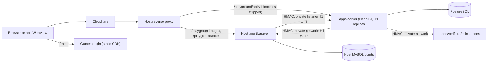

# 02 Architecture

| Field | Value |
|---|---|
| Scope | Repository, ports, HTTP API, data model, concurrency, settlement engine, deployment, native bridge, demo, security, observability, testing, porting kit |
| Date | 2026-09-24, revised after the cross-spec review |
| Binding inputs | `docs/OWNER-DECISIONS.md` (D1 to D26) > `docs/spec/00-design-rulings.md` (R1 to R12, Addenda A, B) > this spec > research |
| Implements | R9, D15 (Playground data in PostgreSQL, points in MySQL only through `PointsLedger`), D16 (AdMob in the app only), D26 (payout identity gate: storage, flow, host interface), the transport, storage and job side of D17 |
| Not owned here | Rules, numbers, config registry (spec 01); Arcade SDK, P2RP, verifier API, verdict policy (spec 03); games (spec 04); UI and view models (spec 06); legal policy, jurisdiction, retention periods (spec 07). Values owned elsewhere are marked "(spec 0X)". |

Rule IDs use the ruling prefixes with an `A` infix (`DB-A12`). Normative words: MUST, SHOULD, MAY. Glossary terms as in `00-design-rulings.md`. Items tagged (M2) are needed before public launch, not for the demo (14.3).

| ID | System invariant |
|---|---|
| SEC-A01 | The server is authoritative for tries, seeds, scores, ranks, rewards and time. Nothing a client sends (score, app mode, device data, ad outcome) grants value by itself. |
| DB-A01 | All Playground data lives in PostgreSQL (primary) or, only if the host insists, in MySQL 8.4 via the fallback DDL. Host points stay in the host MySQL, touched only through `PointsLedger` (D15). No query joins the two databases. |
| DB-A02 | No distributed transactions: every ledger call carries a deterministic idempotency key, is logged first in `playground_point_ops` and is completed or compensated by the reconciler (3.3). No ledger call runs inside a database transaction or a retried unit of work, except with a same-database ledger (`transactional = true`). |
| API-A01 | One Hono app serves the demo (in-process, memory adapters), the reference server (Node, SQL adapters) and the conformance target; only adapters and config differ. |
| BON-A01 | Community Bonus rate, inputs and formula never leave the server: not in `PublicConfig`, API responses, analytics, support-visible logs or production client bundles (R6.4, spec 01 BON-11). |

## 1. Repository and toolchain

The folder is not a git repository yet. The first build step MUST run `git init -b main` and commit `.gitignore`, `.gitattributes` (`* text=auto eol=lf`; `*.p2rp *.webp *.png *.opus *.mp3 binary`), `.editorconfig` and `.nvmrc` (`24`).

### 1.1 Layout (pnpm 11 workspace, one npm scope `@pg/`)

```text
AGENTS.md CLAUDE.md(@AGENTS.md) PORTING.md README.md LICENSE THIRD-PARTY-NOTICES  .claude/skills/port-playground/ (15)
spec/      generated and CI-diffed: openapi/{playground,host-internal}.v1.yaml (verifier.v1.yaml: spec 03), errors.json,
           config/registry.json, schemas/ (config, DTOs, bridge, analytics, identity-token, test/fixture), vectors/,
           sql/{postgres,mysql}/ (migrations), sql/queries/{postgres,mysql}/ + queries.manifest.json, fixtures/
porting/   RULEBOOK.md, DEPENDENCY-MAP.md, GAPS.md, host-mappings/{laravel,node}.md      deploy/ (9.7)   docs/runbooks/
packages/  core (pure rules; server-only subpaths core/bonus, core/settlement, core/config-defaults)
           contract (zod 4; contract/public: DTOs, PublicConfig, error codes; contract/server: config schema with
           defaults, verifier and host-internal types, game.config schema)   app (use cases, ports.ts, engine, workers)
           adapters-memory   adapters-sql (pg, PGlite, mysql2)   adapters-host (JWT, GeoAdapter, HMAC ledger, users)
           ledger-mysql (3.1 example)   ads-ssv (./mock signer)   http (Hono app, middleware)   test-routes (4.3)
           client (ApiClient, submit queue pg.v1.submits)   app-bridge (bridge v1, ./mock)   ui (spec 06)
           sdk-sim sdk-view arcade-shell arcade-host verifier testkit (published as @pg/<dir>, spec 03 SDK-PKG)
           conformance (player and host suites, concurrency, fault matrix)
games/<id>/  sim/ view/ assets/ bots/ test/ game.config.json (spec 04; the build writes game.json)
apps/      server (main.ts, main-test.ts, migrate)  verifier (@pg/verifier/node)  demo (SPA, dev panel, host-sim)
           embed (loader and versioned bundle: ui + client + app-bridge only)  arcade (games origin, spec 03)
tools/     export-spec check-purity check-bundles check-licenses check-config-keys check-error-codes size-budgets
           diff-settlement fake-host (9.3) vectors/ (Python reference, spec 01) load/
```

### 1.2 Dependency rules

| ID | Rule | Enforced by |
|---|---|---|
| DET-A01 | `core` has zero dependencies and no ambient effects (no `Date`, `Math.random`, `crypto`, `performance`, `fetch`, `process`, `console`, timers); time, randomness and ids are arguments. | `check-purity` (AST), dependency-cruiser |
| DET-A02 | `games/*/sim` imports only `@pg/sdk-sim`; `games/*` import only `@pg/sdk-sim` and `@pg/sdk-view`. | dependency-cruiser |
| API-A02 | DTO and config shapes are declared only in `contract`. | review, knip |
| API-A03 | `app` imports only `core` and `contract`; no drivers, Hono, DOM or `node:*`. | dependency-cruiser, Biome |
| API-A04 | `http` imports `app`, `contract`, `core`, `hono`, `zod`, never adapters; composition happens in `apps/*`. | dependency-cruiser |
| SEC-A02 | `ui`, `client`, `app-bridge`, `apps/embed` never import `app`, `adapters-*`, `http`, `ads-ssv`, `test-routes`, `ledger-mysql`, `core/bonus`, `core/settlement`, `core/config-defaults`, `contract/server`. | dependency-cruiser, SEC-A13 |
| SEC-A03 | `test-routes`, `*/mock` and `adapters-memory` are imported only by `apps/demo`, `main-test.ts`, `conformance` and tests. | dependency-cruiser, SEC-A13 |
| SEC-A04 | Nothing imports `apps/*`; apps never import each other; only `exports` entries are importable; packages export TypeScript source that apps bundle. | dependency-cruiser |
| CMP-A01 | Shipped dependencies are MIT, ISC, BSD-2-Clause, BSD-3-Clause, 0BSD or Apache-2.0 (one qualifying option suffices); build tools follow spec 07 CMP-305. `THIRD-PARTY-NOTICES` is generated from the lockfile; CI fails on diff (CMP-A02). | `check-licenses` |

### 1.3 Toolchain pins and scripts

Pins per R9.10 (Node engines `>=22.12`, API and verifier images on Node 24 LTS, CI on 22 and 24; `packageManager: pnpm@11.26.0` with explicit `allowBuilds` and default `minimumReleaseAge`; TypeScript `~6.0.3` with `strict`, `erasableSyntaxOnly`, `verbatimModuleSyntax`, `noUncheckedIndexedAccess`, `exactOptionalPropertyTypes`, no `baseUrl` or paths; Biome `2.5.14` exact), plus `@hono/node-server ^2.1.1`, `pg ^8.23.0` (MIT; `postgres` is Unlicense and fails CMP-A01), `mysql2 ^3.24.4`, `jose ^6.2.12`, `idb-keyval ^6.3.0`, `@asteasolutions/zod-to-openapi ^9.1.0`, `@redocly/cli ^2.54.2`, `@scalar/api-reference ^1.71.0`, `dependency-cruiser ^18.4.0`, `tsx ^4.23.15`, `fast-check`, `knip ^6.38.0`, optional `ioredis ^6.0.0`.

Root scripts: `dev` (demo, in-process API, arcade on port 5174), `dev:server`, `dev:verifier`, `build`, `build:demo -- --profile <p>`, `test`, `test:sql`, `conformance [--suite s] [--profile port]`, `conformance:host`, `spec:build`, `spec:check`, `lint` (Biome, dependency-cruiser, purity, knip, licenses, config keys, error codes, copy lint for em dashes and banned words), `typecheck`, `e2e`.

CI (GitHub Actions, PR and main): lint, typecheck, unit on Node 22 and 24; `spec:check` and Redocly; build with size budgets and bundle scans (SEC-A13); `test:sql` with concurrency on `postgres:16` (`postgres:14` weekly) and `mysql:8.4`, PHP PDO preparation (DB-A19) and drift (DB-A20); conformance of the `apps/server` test build against `tools/fake-host` over HTTP (player and host suites, then the fault matrix, where each fault MUST fail); Playwright on demo, host-sim (cookie and bearer) and app mode with axe; spec 03 golden and cross-browser jobs; (M2) nightly MariaDB 11.4, Schemathesis and monthly load.

## 2. Ports (`packages/app/src/ports.ts`, types only)

runId is the id issued at run start, when the try is consumed; it is the only run id used in ledger keys, bridge messages, replays, verifier calls, boards and UI. Row types mirror section 5 in camelCase.

### 2.1 Identity, region, Plus

```ts
export type UserId = string;  // host id, ASCII [A-Za-z0-9_-]{1,64}, bytewise order
export type EpochMs = number; export type Points = number;       // integers; 64-bit arithmetic (A4)
export type DayId = string;   // 'YYYY-MM-DD' UTC (SQL day_key)     export type WeekId = string;  // ISO 'YYYY-Www' (SQL week_key)
export type GameId = string;  export type AppMode = 'web' | 'android' | 'ios';
export type StaffRole = 'pg.support' | 'pg.moderator' | 'pg.finance' | 'pg.admin';
export interface IdentityFacts {                  // host-reported; core maps them to spec 01 EligibilityFacts.identity
  oauth: boolean;
  wallets: { idHash: string; fromMs: EpochMs; toMs: EpochMs | null; signedAtMs: EpochMs | null }[];  // login-wallet history, half-open;
                                                  //   signedAtMs = last host-verified SIWS or SIWE message (spec 01 ELG-12)
  email: { idHash: string; verified: boolean; attachedAtMs: EpochMs; via: 'signed' | 'email' | 'oauth' | 'unsigned' } | null;
  payoutFingerprints: string[];                   // host HMAC of redemption destinations, last 180 days (H6 only, ELG-4)
}
export interface UserContext {
  userId: UserId; displayName: string | null; avatarUrl: string | null; locale: string;
  plus: { active: boolean; intervals: [EpochMs, EpochMs | null][] };   // half-open, covering at least [weekStart - 7 d, now] (A5)
  accountCreatedAtMs: EpochMs; identity: IdentityFacts;
  flags: { staff: boolean; roles: StaffRole[]; hostBanned: boolean; rewardsBlocked: boolean };
  region: { country: string | null; subdivision: string | null; declaredCountry: string | null; vpnSuspected: boolean };
}
export type AuthResult = { kind: 'user'; user: UserContext; via: 'cookie' | 'bearer' | 'demo' }
  | { kind: 'admin'; user: UserContext; amr: string[] } | { kind: 'anonymous' }
  | { kind: 'rejected'; code: 'AUTH_REQUIRED' | 'CSRF_INVALID' };
export interface UserDirectory { authenticate(req: Request): Promise<AuthResult>;   // never throws on bad credentials
  getMany(ids: readonly UserId[]): Promise<Map<UserId, UserContext>> }            // absent id = deleted account
export interface GeoAdapter { locate(req: Request): { country: string | null; subdivision: string | null; vpnSuspected: boolean } }
export interface PremiumStatus { plusActiveDuring(userId: UserId, fromMs: EpochMs, toMs: EpochMs): Promise<boolean> }
```

`authenticate` fills `region` from `GeoAdapter` (trusted proxies, SEC-A27) and the host's declared residence (spec 07 CMP-114). `PremiumStatus` evaluates `plus.intervals`; `daily_user_usage.plus_seen` only caches `plusActiveDuring(dayStart, now)`. The HTTP layer adds principals `run` (`{userId, runId}`, RUN-A10), `service` (scheduler) and `host` (9.3).

### 2.2 PointsLedger

```ts
export type LedgerReason = 'PG_TRY_SPEND' | 'PG_TRY_REFUND' | 'PG_GAME_WEEKLY_REWARD' | 'PG_OVERALL_WEEKLY_REWARD'
  | 'PG_COMMUNITY_BONUS' | 'PG_ADJUSTMENT';
export interface LedgerRef { runId?: string; payoutId?: string; adjustmentId?: string; gameId?: GameId; weekId?: WeekId; scope?: string }
export interface LedgerTx { txId: string; idempotencyKey: string; userId: UserId; direction: 'debit' | 'credit';
  reason: LedgerReason; requestedAmount: Points; postedAmount: Points; createdAtMs: EpochMs }
export type LedgerFailure = { ok: false; retryable: boolean; detail?: string;     // retryable only UNAVAILABLE, TIMEOUT
  code: 'INSUFFICIENT_FUNDS' | 'ACCOUNT_LOCKED' | 'ACCOUNT_NOT_FOUND' | 'KEY_CONFLICT' | 'KEY_FORMAT' | 'NOT_ALLOWED'
      | 'AMOUNT_LIMIT' | 'EMISSION_LIMIT' | 'UNAVAILABLE' | 'TIMEOUT' };
export type LedgerResult = { ok: true; tx: LedgerTx; duplicate: boolean; balanceAfter: Points | null } | LedgerFailure;
export interface PointsLedger {
  readonly transactional: boolean;   // true only for a same-database ledger joining the UnitOfWork; reference: false
  getBalance(userId: UserId): Promise<{ ok: true; balance: Points } | LedgerFailure>;          // host decimals floored
  debit(i: { userId: UserId; amount: Points; idempotencyKey: string; reason: 'PG_TRY_SPEND' | 'PG_ADJUSTMENT'; ref: LedgerRef }): Promise<LedgerResult>;
  credit(i: { userId: UserId; amount: Points; idempotencyKey: string; reason: Exclude<LedgerReason, 'PG_TRY_SPEND'>;
    ref: LedgerRef; applyMembershipMultiplier: false }): Promise<LedgerResult>;
  findByKey(key: string): Promise<{ ok: true; tx: LedgerTx | null } | LedgerFailure>;
  listByKeyPrefix?(q: { prefix: string; fromMs: EpochMs; toMs: EpochMs; cursor: string | null; limit: number }):
    Promise<{ ok: true; items: LedgerTx[]; next: string | null } | LedgerFailure>;   // optional (3.3 R5)
}
```

| ID | Ledger key (spec 01 SET-6; ASCII, at most 160 chars, longest 134) | Reason |
|---|---|---|
| PAY-A01, PAY-A02 | `playground:v1:try:{runId}`, `playground:v1:refund:{runId}` | `PG_TRY_SPEND`, `PG_TRY_REFUND` |
| RWD-A01 to A03 | `playground:v1:payout:{weekId}:{scope}:{userId}`, scope `game.{gameId}`, `overall`, `bonus` | `PG_GAME_WEEKLY_REWARD`, `PG_OVERALL_WEEKLY_REWARD`, `PG_COMMUNITY_BONUS` |
| RWD-A04 | `playground:v1:clawback:{weekId}:{scope}:{userId}` (debit, one per line) | `PG_ADJUSTMENT` |
| RWD-A05 | `playground:v1:adjust:{adjustmentId}` (UUIDv7 minted when A14 is requested) | `PG_ADJUSTMENT` |

PAY-A15: a key is computed once, when its line, op or adjustment is planned, and stored in `payouts.idem_key` or `point_ops.idem_key` (spec 01 SET-15); every credit, retry, HOLD release, claim and clawback uses the stored key, never a rebuilt one; a topology switch copies `payouts` and `point_ops` verbatim. Scopes are `game.{gameId}`, `overall`, `bonus` everywhere (`payouts`, `weekly_results`, review items). PAY-A16: `spec/vectors/ledger-keys.json` (from spec 01 SET-6) holds one regex per reason and every RV-26 and RV-27 example; `core` key builders take the namespace (`playground`, or `playground-test` in test builds, SEC-A05). `applyMembershipMultiplier` is always `false`; a Plus multiplier, if ever enabled, is applied in `planSettlement` (spec 01 RWD-7).

### 2.3 Ads

```ts
export type BridgeErrorCode = 'UNSUPPORTED' | 'BUSY' | 'NO_FILL' | 'NETWORK' | 'CONSENT_REQUIRED' | 'NOT_LOADED'
  | 'INVALID_REQUEST' | 'TIMEOUT' | 'INTERNAL';
export type AdClientOutcome = { status: 'earned' | 'dismissed' | 'no_fill' | 'timeout' } | { status: 'failed'; code: BridgeErrorCode };
export interface AdTicketView { ticketId: string; gameId: GameId; expiresAt: string; placement: 'playground_try';
  ssv: { userId: string; customData: string } }                       // customData = ticketId (R9.8)
export interface AdsClientProvider {                                  // also spec 06 HostAdapters.ads
  readonly id: 'native-bridge' | 'mock';
  availability(): Promise<{ available: true } | { available: false; reason: 'not_app' | 'bridge_missing'
    | 'bridge_incompatible' | 'consent_required' | 'no_fill' | 'busy' | 'error' }>;
  preload(): Promise<void>; show(ticket: AdTicketView, signal?: AbortSignal): Promise<AdClientOutcome>;  // 'earned' = UI hint
}
```

Server side, `@pg/ads-ssv` exports `createAdmobVerifier(keys: SsvKeySource): { verify(rawQuery: string): Promise<SsvResult> }` (WebCrypto; failures `MALFORMED`, `MISSING_SIGNATURE`, `UNKNOWN_KEY`, `BAD_SIGNATURE`, `KEY_FETCH_FAILED`). `MockAdProvider` (`@pg/app-bridge/mock`) draws an "AD (simulated)" overlay and, in `ssv` mode, calls T6 so the real verifier checks a signed callback.

### 2.4 Other ports

```ts
export interface Clock { now(): EpochMs }           // SystemClock; OffsetClock (demo, test mode); ManualClock (tests)
export interface IdGenerator { uuidv7(): string }   // RFC 9562 v7, section 6.2 method 1 (12-bit counter): bytewise order = issue order
export interface RandomSource { bytes(n: number): Uint8Array; seedHex128(): string }       // CSPRNG in prod (R2.2)
export interface BotChallenge { verify(token: string, ip: string, action: 'run_start'): Promise<'pass' | 'fail' | 'unavailable'> }
export interface ReplayVerifier {                   // spec 03 10.2 over HTTP (9.3 signing), in-process in the demo
  verify(input: VerifyInput, o: { timeoutMs: number; signal?: AbortSignal }): Promise<VerifyOutcome>;
  seedsCheck(i: { gameId: GameId; simVersion: number; seedHex: string; botCheck: boolean }): Promise<SeedsCheckResult>;
  similarity(i: SimilarityRequest): Promise<SimilarityResult>;
  registry(): Promise<{ gameId: GameId; simVersion: number; simHash: string }[]> }   // types: spec 03
export type VerifyOutcome = { kind: 'result'; result: VerifyResult }
  | { kind: 'unavailable'; reason: 'timeout' | 'overloaded' | 'unreachable' | 'bad_response' };
export interface Notifications { send(n: { userId: UserId; type: NoticeType; params: Record<string, string | number>;
  route: string; dedupeKey: string }): Promise<void> }      // NoticeType: spec 06; stored in notices, host bell via H7
export interface ConfigProvider { active(now: EpochMs): Promise<ConfigSnapshot>; forWeek(w: WeekId): Promise<ConfigSnapshot>;
  byVersion(v: number): Promise<ConfigSnapshot> }             // ConfigSnapshot {version, effectiveFromMs, hash, doc}
export interface Lock { withLock<T>(name: string, ttlMs: number, fn: () => Promise<T>):
  Promise<{ acquired: true; value: T } | { acquired: false }> }   // non-blocking, lease renewed while fn runs
export interface Cache { get<T>(k: string): Promise<T | undefined>; set<T>(k: string, v: T, ttlMs: number): Promise<void>;
  del(k: string): Promise<void>; incr(k: string, ttlMs: number): Promise<number> }
export interface UnitOfWork { run<T>(label: string, fn: (r: Repos) => Promise<T>): Promise<T> }
  // one READ COMMITTED transaction, fn retried up to 3 times on 40001, 40P01, MySQL 1213, 1205: fn has no side effects outside Repos
export interface Analytics { track(e: AnalyticsEvent): void }   // non-blocking; server events via outbox
// PrivacyService { eraseUser, exportUser, runRetentionSweep }: spec 07 section 7, implemented here (DB-A18)
```

| ID | Rule |
|---|---|
| API-A20 | Verifier calls pass spec 03 `VerifyInput` unchanged, built by the pure, vector-tested `core.runFacts(run, result, course, commits, history, cfg)` and `core.antiCheatPolicy(cfg, gameId)` (`spec/vectors/run-facts.json`): `runId` = `runs.id`; `seedKind` 2 `weeklyCourse`, 3 `dailyCourse`, 1 `perRun`; `maxTicks` = `runs.maxRunTicks`; `issuedAtMs` = `runs.delivered_at_ms` (week and day attribution stay on `issued_at_ms`); `receivedAtMs` = `run_results.received_at_ms`; `submitDeadlineMs` = `runs.submit_by_ms`; `weekId` = `runs.week_key`; `courseId` = `course_seeds.period_key` (null for `perRun`); `commits` = `run_commits` rows in `seq` order; `frontier` = the highest `stimulusCount` feature of the user's earlier verified runs on that course (0 for `perRun`, null with `practice.weeklyCourseAfterRankedRun`); `course` = `course_seeds.course` or null (M2); `policy` = the week's pinned `runs.*`, `antiCheat.*`, `games.<id>.{sanityMaxScore, scoreEnvelope, calib}`. The verifier answers 400 without policy (spec 03). |
| API-A06 | Config activation: a key's class is its spec 01 section 11 Class: `immediate` (at once), `day` (`effectiveFromMs` a UTC day start), `week` (a week start, R3.4); violations answer `CONFIG_INVALID`. |
| API-A23 | The config schema is one TypeScript source in `contract/server` (key, type, default, validation, owner spec, role, class, public flag) whose normative table is spec 01 section 11. `spec:build` emits `spec/config/registry.json`, `spec/schemas/config.schema.json` and `spec/fixtures/config.default.json` (seeded as config version 1, DB-A20). `check-config-keys` fails CI on any backticked `namespace.key` in `docs/spec` or code that is not registered, and on two keys declaring one control. |

### 2.5 Repositories and guarantees

`Repos` (all methods inside `UnitOfWork.run`) has one repository per table group of 5.2. Every guard is a lock, a conditional write or a unique constraint; results are typed outcomes (`inserted`, `duplicate`, `conflict`, `ok`), never exceptions. Proven by the suites of 14:

| ID | Guarantee |
|---|---|
| PAY-A03 | `debit` is atomic, never makes a balance negative, is idempotent on its key forever (repeat = original tx, `duplicate: true`) and leaves no key when it fails. |
| PAY-A04, PAY-A05 | `credit` is idempotent on its key forever and posts exactly the requested amount; `findByKey` reflects every committed call. |
| TRY-A01 | Try, ad-ticket and status decisions run under the per-user-day lock with spec 01 pure functions (6.1). |
| RUN-A01, RUN-A02 | At most one run per (user, Idempotency-Key) and one `payment_pending` or `active` run per user (5.3; `runs.maxActiveRankedRunsPerUser` is exactly 1); one result per run, the first verdict wins. |
| RUN-A12 | A result is `accepted` only with a stored verified score (`CHECK (status <> 'accepted' OR verified_score IS NOT NULL)`). |
| LB-A01 | A board row is replaced only by a strictly better key (score desc, accepted_at asc, issued_at asc, run_id asc; spec 01 LB-3). |
| AD-A01 | At most one `issued` or `opened` ad ticket per user; `(provider, provider_tx_id)` unique. |
| DB-A03, SET-A01, API-A08 | Calls in one `UnitOfWork.run` share a READ COMMITTED transaction; `Lock` has one holder per name and a crashed holder loses the lease within `ttlMs`; `Clock` is the only source of "now" in `app`. |

Implementations: demo = memory adapters, mock ledger, persona directory, Web Worker verifier; Topology B = `adapters-sql`, `adapters-host`, `pg_try_advisory_lock`, memory LRU or Redis; Topology A = the host's services (session auth, points per 3.1, `DB::transaction`, `Cache::lock` or `playground_locks`, queued verifier job).

## 3. PointsLedger: host implementation and reconciliation

### 3.1 Host implementation over an existing schema

The host tables are unknown (D14). The host adds one side table and never alters existing tables:

```sql
-- MySQL 8.4 InnoDB, host database; connections READ-COMMITTED, time_zone '+00:00'
CREATE TABLE playground_ledger_entries (
  idempotency_key VARCHAR(191) CHARACTER SET ascii COLLATE ascii_bin NOT NULL PRIMARY KEY,   -- PAY-A06
  user_id VARCHAR(64) CHARACTER SET ascii COLLATE ascii_bin NOT NULL, direction VARCHAR(6) NOT NULL,  -- debit, credit
  reason VARCHAR(32) NOT NULL, requested_amount BIGINT NOT NULL, posted_amount DECIMAL(18,2) NOT NULL,
  host_tx_ref VARCHAR(64) NULL, ref JSON NULL, created_at DATETIME(3) NOT NULL DEFAULT CURRENT_TIMESTAMP(3),
  KEY pg_ledger_user_idx (user_id, created_at), KEY pg_ledger_created_idx (created_at)) ENGINE=InnoDB;
```

One MySQL transaction per call: (1) PAY-A13 checks; (2) `INSERT` the side row; duplicate key (1062): `ROLLBACK`, read the row: same user, direction and amount is `duplicate` (return the stored tx), else `KEY_CONFLICT`; (3) the host balance update: debit `UPDATE <balances> SET balance = balance - :a1 WHERE user_id = :u AND <not locked> AND balance >= :a2` (0 rows: `ROLLBACK`, classify `ACCOUNT_NOT_FOUND`, `ACCOUNT_LOCKED`, `INSUFFICIENT_FUNDS`), credit `balance = balance + :a` (0 rows: `ACCOUNT_NOT_FOUND`); (4) the host's own journal row, its id stored in `host_tx_ref`; (5) `COMMIT`. `findByKey` and `listByKeyPrefix` read the side table. `packages/ledger-mysql` implements this over stand-in tables `p2e_points_balances` and `p2e_points_journal` and is the target of the ledger contract and concurrency suites (C6 to C8); `porting/host-mappings/laravel.md` gives the PHP version with the error mapping.

| ID | Rule for any host ledger |
|---|---|
| PAY-A06 | The side table key (or an equivalent UNIQUE journal key) holds at least 160 ASCII characters (recommended `VARCHAR(191)` ascii_bin) and keeps keys forever. Launch blocker. |
| PAY-A07, PAY-A08 | Balances never go negative (conditional UPDATE, or `SELECT ... FOR UPDATE` and check, in the same transaction); Playground amounts are integers and `getBalance` floors decimal balances. |
| PAY-A09 | The host never multiplies `PG_*` credits; "points earned today", Plus doubling, challenges and leaderboards exclude `PG_*` reasons (join on the side table); cached balances are invalidated after each call. |
| PAY-A10 | Launch blocker (spec 07 CMP-505): the host blocks every redemption while I1 reports `blocked` (open review case, `held` or `awaiting_identity` line, open fraud flag, failed clawback); the Reward Center calls I1 before each redemption; caching hosts subscribe to outbox topic `redemption_hold`. Until this ships, production sets `settlement.autoPayMaxPerUserPerWeek` to 500 (spec 01 SET-17): a user's lines above it wait for a reviewer CLEAR. The porting guide recommends the D26 identity gate on every redemption (B5). |
| PAY-A13 | Launch blocker (spec 07 CMP-504), enforced by the host itself: (1) the key matches the `ledger-keys.json` grammar of its reason and its userId equals the request's; production rejects keys not starting with `playground:v1:` and `test` kids (`KEY_FORMAT`); (2) `PG_TRY_REFUND` only for `playground:v1:refund:{id}` whose `playground:v1:try:{id}` debit exists for the same user, at most that amount, once (`NOT_ALLOWED`); (3) reward credits only for ended weeks, each at most `PG_HOST_MAX_CREDIT[reason]` (owner-set: 13% of the largest per-game pool, of `overall.fixedPool`, of `bonus.cap + bonus.maxCarry`, x `rewards.plusMultiplier` if ever enabled) (`AMOUNT_LIMIT`); (4) per week the three reward reasons total at most `PG_HOST_MAX_WEEKLY_EMISSION`, the spec 01 SET-3 bound (409 `EMISSION_LIMIT`, page on-call); (5) `PG_ADJUSTMENT` at most `PG_HOST_MAX_ADJUSTMENT` (5000) per call and 20000 per day; (6) no credits to staff accounts (`NOT_ALLOWED`). Ledger routes use their own HMAC keys (kid scope `ledger`, rotated every 90 days, never in test images). Topology A runs the same checks in the host. |
| PAY-A14 | Maturity (spec 07 CMP-505): for accounts younger than 90 days or without a completed redemption, `PG_*` credits become redeemable `settlement.redemptionMaturityDays` (14) after crediting; I1 returns `maturingPoints` and the host redeems at most `balance - maturingPoints`. |

### 3.2 Saga log and paid-try start

Each ledger call is preceded by a `playground_point_ops` row with its stored key (PAY-A15), written in the transaction of its domain change: `pending` (outcome unknown), `applied` (tx id and posted amount), `rejected` (nothing booked), `voided` (debit concluded not applied; watched for a late apply). The row, not an HTTP response, is what the Playground believes.

Paid start with a remote ledger: (1) tx1 under the per-user-day lock (6.1): `core.decideStart`, guarded usage and spend writes, insert run `payment_pending` (runId minted once) and op `pending`; (2) `debit` outside any transaction; (3a) ok or duplicate: tx2 op `applied`, CAS run `payment_pending -> active` with `delivered_at_ms`, 201; (3b) `INSUFFICIENT_FUNDS`, `ACCOUNT_LOCKED`, `ACCOUNT_NOT_FOUND`: op `rejected`, run `payment_failed`, usage released, 402 `INSUFFICIENT_POINTS` or 403 `ACCOUNT_RESTRICTED`; key or PAY-A13 failures: same compensation, 500 `SERVER_ERROR`, critical alert; (3c) `UNAVAILABLE`, `TIMEOUT`: run stays `payment_pending`, 503 `LEDGER_UNAVAILABLE`. A retry with the same Idempotency-Key finds the run by `UNIQUE (user_id, idem_key)` and repeats the debit with the stored key while `payment_pending`; a late debit after the reconciler voided the op is refunded by R2. A same-database ledger debits inside tx1.

PAY-A11: a seed is delivered only by a run that reached `active` through a successful CAS; if the reconciler resolved it first, the API answers 409 `START_ABORTED` without the seed. Spend counters are released only by a failure before delivery.

### 3.3 Reconciler (tick job)

| Case | Condition | Action |
|---|---|---|
| R1 | try debit `pending`, run `payment_pending`, older than `settlement.ledgerReconcileAfterMs` (120000) | `findByKey`. Found: op `applied`, run `refunded` (`SERVER_FAILURE_BEFORE_DELIVERY`), usage released, refund op (PAY-A02). Not found: op `voided`, run `payment_failed`, usage released. Lookup failed: retry, alert after 15 min |
| R2 | debit `voided` within `settlement.lateApplyWatchMs` (86400000) | `findByKey`; found: op `applied`, `late`, refund op, alert |
| R3 | credit `pending` and due | re-call `credit` with the stored key; ok: `applied`, owner advanced; non-retryable: `rejected`, owner `failed`, alert; retryable: backoff `settlement.payoutBackoffMs`, owner `failed` at `settlement.payoutMaxAttempts` (6) |
| R4 | clawback debit `pending` and due | re-call `debit`; `INSUFFICIENT_FUNDS`: op `rejected`, `clawback_status = 'failed'` (spec 01 CLAWBACK_OUTSTANDING; I1 blocks redemption), alert finance |
| R5 | daily for day D, after D + 1 h | host tx with prefix `playground:v1:` in D (`listByKeyPrefix`) versus ops resolved in D +/- 1 day, else `findByKey` for every `voided` and `rejected` op of D and `settlement.reconcileSampleSize` (500) `applied` ones. `host_only`: debit refunded as R2, credit op `applied`; `op_only`, `amount_mismatch`: critical |

| ID | Rule |
|---|---|
| PAY-A12 | The reconciler never re-sends a try debit, only looks it up; credits are re-sent with the stored key; undelivered `payment_pending` runs are refunded, never activated. |
| SET-A02 | An unacknowledged `op_only` or `amount_mismatch` finding blocks `finalized -> paying` while `settlement.blockPayOnReconcileMismatch` (true); acknowledgement (A13) is two-person (SEC-A45). |
| BON-A02 | Net paid-try points of week S (spec 01 BON-4) come only from `point_ops`: `max(0, sum of PG_TRY_SPEND ops of runs of S applied at the pool fix - sum of applied PG_TRY_REFUND ops of runs of S with resolved_at_ms <= snapshot)`, snapshot = `weekEnd(S)` (`previousWeek`) or the finalization of S (`currentWeek`). The fix waits until no debit of S is `pending`, at most `bonus.announceMaxDelayMs` (900000), and excludes debits pending then. Refunds of S applied after the snapshot add `debt:{opId}` to `bonusDebt` (spec 01 BON-15). Never from the host ledger. |

## 4. HTTP API

`contract` declares zod schemas and a route table (`id, method, path, auth, idempotent, request, responses, errors`); `export-spec` emits `spec/openapi/playground.v1.yaml` (OpenAPI 3.1) and `spec/errors.json`; `http` binds the table to Hono.

### 4.1 Conventions

| ID | Rule |
|---|---|
| API-A10 | Base `/playground/api/v1`; additive changes only within v1; header `Playground-Contract: 1.<minor>.<patch>`. |
| API-A11 | JSON camelCase; instants ISO 8601 UTC with ms (`EpochMs` inside `core`); `dayId`, `weekId`; integer points; every body has `serverTime`. |
| API-A12 | Auth: `cookie` (host session, CSRF header on unsafe methods; Topology A), `bearer` (SEC-A22), `admin` (SEC-A49; the only auth for `/admin/*`), `run` (`Authorization: PG-Run <runToken>`), `demo` (`X-Demo-User`, memory adapters only), `service` (`PG-Service <token>`, A11 only), `host` (9.3, private listener), `opt` (anonymous allowed). |
| API-A13 | `Idempotency-Key` (`[A-Za-z0-9_-]{16,64}`) on every POST and PATCH except P20; P8 uses `submit-{runId}`, P28 `commit-{runId}-{seq}` (deduplicated by the `run_commits` key, not stored in the idempotency table). Scope = userId (user and run principals alike) + method + route template; fingerprint = SHA-256 of the raw body; lock 30000 ms; retention `PG_IDEMPOTENCY_TTL_MS` (86400000). Missing: 400; other body: 422; running: 409 retryable; done: stored status and body with `Idempotent-Replayed: true`. 2xx and 4xx are stored, 5xx releases the key. A stored P6 body omits `seedHex` and `runToken`; a replay re-reads the run and returns them only while it is `active`. |
| API-A14 | Errors: RFC 9457 `application/problem+json`: `type` = `{PG_PROBLEM_TYPE_BASE}/{kebab-code}`, `title`, `status`, `detail`, `code`, `retryable`, `requestId`, optional `retryAfterMs`, `fields`, `tries`, `activeRunId`, `reasons`. A rejected run is not an error (200, `notVerified`). |
| API-A15 | Caching: user data `private, no-store`; leaderboards `private, max-age=10` + weak ETag (anonymous `public`); `/config/public`, `/games`, `/rules` `public, max-age=60`. `X-Request-Id` accepted (ASCII <= 64) or generated, echoed and logged (API-A16). |
| API-A17 | JSON bodies <= 8192 bytes; P8 body raw P2RP <= `runs.maxReplayBytes` (262144); unknown fields rejected on mutations; depth <= 8; pagination by opaque `cursor`, `limit` 1 to 100 (50), `nextCursor`. |
| API-A21 | `spec/errors.json` is the single code registry: `code`, `http`, `retryable`, `denyOrder` (spec 01 TRY-16 position), `uiKey` (spec 06 12.5), `specRule`. Spec 01 deny codes are problem codes verbatim. `check-error-codes` fails CI on a code in any spec, vector or copy catalog that is not registered. |
| API-A22 | Wire DTOs are the spec 06 section 3 view models with identical field names (instants as ISO strings), except the DTOs of 4.2. The server applies display-name fallbacks (SEC-A47) and derives `capabilities` from roles (SEC-A44). |

### 4.2 Player endpoints

| Id | Method and path | Auth | 2xx response (request) |
|---|---|---|---|
| P1 | `GET /config/public` | none | `PublicConfig` (4.6) |
| P2 | `GET /me` | user | `ViewerView` + `identity {walletSigned, emailVerified, payoutVerified}`, `activeRun`, `spentToday`, `spentThisWeek` |
| P3 | `GET /games` | opt | `GameCardView[]` + `scoreUnit`, `heroSkin`, `gameVersion`, my tries and stats |
| P4 | `GET /games/{gameId}` | opt | card + week's `simVersion`, `simHash`, `gameVersion`, arcade URL, `courseCommit`, `previousCourse {courseId, seedHex}` once revealed (`leaderboard.courseCommit.publish`), `practiceSeedHex` (only with `practice.weeklyCourseAfterRankedRun` and a delivered ranked run of mine in the game this week) |
| P5 | `GET /me/tries?gameId=` | user | `TryStatus`, or `TryStatus[]` without `gameId` |
| P6 | `POST /runs` | user | 201 `StartRunResponse` (`StartRunRequest`) |
| P7 | `GET /runs/{runId}` | user, run | `RunView` (`seedHex` only for the owner while `active`); P10 is retired, merged here |
| P8 | `POST /runs/{runId}/submit` | user, run | `SubmitRunResponse` (raw P2RP, `application/vnd.p2e.p2rp`, optional `X-Replay-SHA256`) |
| P9 | `POST /runs/{runId}/abandon` | user | `RunView` (`{}`; the try stays consumed) |
| P11, P12 | `GET /leaderboards/games/{gameId}`, `/leaderboards/overall`, `?week=current,previous,YYYY-Www&around=me` | opt | `BoardView` (top 100, me, 5 above and below, total, qualifying score, tiers, `percentile` past place 100); P12 adds `bonus: CommunityBonusView` |
| P13 | `GET /weeks/current` | opt | `WeekView` |
| P14, P15 | `GET /me/results?week=previous`, `POST /me/results/{weekId}/seen` | user | `WeeklyResultsView` (line statuses incl. `verifyToClaim` with `claimBy`); 204 |
| P16 | `GET /me/history?cursor=` | user | runs with source and public status; spending per day |
| P17 | `POST /ads/tickets` | user | 201 `AdTicketView`, 200 for the same open ticket (`{gameId, appMode, attestation?}`) |
| P18, P19 | `GET /ads/tickets/{id}`, `POST /ads/tickets/{id}/client-events` | user | `AdTicketState` (`status`, `grantExpiresAt`) (`{event: opened, earned, dismissed, failed; code?}`, advisory) |
| P20 | `GET /ads/ssv/admob` | Google signature | text `OK` (10.3) |
| P21 | `GET /healthz`, `/readyz` | none | liveness; readiness (DB, ledger, verifier) with `environment` |
| P22, P23 | `GET /me/prefs`, `PATCH /me/prefs` | user | `Prefs` (`Partial<Prefs>`, TRY-A03) |
| P24, P25 | `GET /me/notices?cursor=`, `POST /me/notices/{id}/read` | user | `NoticeView` page; 204 |
| P26, P27 | `GET /rules?week=&locale=`, `POST /me/rules-acceptance` | none, user | spec 07 `RulesDocument` (variant for the viewer's region) + `effectiveWeekId`, `updatedAt`, `prevailingLocale`; 201 (`{rulesVersion, ageDeclared: true}`, spec 07 CMP-006) |
| P28 | `POST /runs/{runId}/commit` | run | 204 (`{seq, tick, kind: tick, pause, resume, digest}`, RUN-A13) |
| P29, P30 | `GET /me/claims`, `POST /me/claims/refresh` | user | `awaiting_identity` lines of all weeks with `claimBy` (the UI links to spec 06 `verify-url`); the same after re-reading identity (D26) |
| P31 | `GET /app/attest-nonce` | user | `{nonce, expiresAt}` (SEC-A31, M2) |
| P32 | `POST /analytics/events` | opt | 204 (`{events}`, at most 20; BON-A03 schema check) |

```ts
type Prefs = { confirmPaid: 'daily' | 'always'; dailyPointsLimit: number | null;
  pendingLimitIncrease?: { value: number | null; effectiveAt: string }; notify: Record<NoticeType, { inApp: boolean; email: boolean; push: boolean }> };
// TryStatus: exactly spec 01 12.1 TryStatus (confirm = confirmation required), instants as ISO 8601 strings
type StartRunRequest = { gameId: string; simVersion: number; simHash: string;
  payment: { method: 'free' } | { method: 'ad' }      // ad: the game's earliest-expiring grant (spec 01 AD-10)
    | { method: 'points'; expectedPrice: number; confirmed: boolean; dontAskAgainToday?: boolean };
  client: { appMode: AppMode; embed: 'iframe' | 'inline'; locale: string; build: string; gameVersion: string; attestation?: string };
  deviceId?: string; challengeToken?: string };
type StartRunResponse = { run: { runId: string; gameId: string; weekId: string; dayId: string; simVersion: number; simHash: string;
    gameVersion: string; seedHex: string; seedKind: 1 | 2 | 3; maxTicks: number; source: 'free' | 'points' | 'ad'; costPoints: number;
    countsForBoard: boolean; issuedAt: string; submitBy: string };
  runToken: string; tries: TryStatus; balance: number | null;
  target: { score: number; kind: 'best' | 'tier' | 'top100' } | null; serverTime: string };   // spec 04 ViewStartContext.target
type SubmitRunResponse = { run: { runId: string; status: 'pending' | 'accepted' | 'inReview' | 'notVerified';
    reason: 'LATE' | 'NOT_VERIFIED' | 'IN_REVIEW' | null; score: number | null; claimedScore: number };
  board: { weekId: string; place: number | null; previousPlace: number | null; total: number; percentile: number | null;
    personalBest: boolean; rewardRankIfFinal: number | null; rewardIfFinal: number | null }; tries: TryStatus; serverTime: string };
type RunView = { run: { runId: string; gameId: string; status: 'active' | 'submitted' | 'expired' | 'abandoned'; submitBy: string;
    seedHex?: string }; result: SubmitRunResponse['run'] | null; serverTime: string };
type AdTicketState = { ticketId: string; gameId: string; status: 'issued' | 'opened' | 'granted' | 'consumed' | 'not_rewarded'
    | 'cancelled' | 'expired'; grantExpiresAt: string | null; serverTime: string };
```

P6 consumes nothing before the writes: API preconditions first (authentication, CSRF, idempotency, rate limits, 428 `CHALLENGE_REQUIRED` when spec 03 SEC-AC-52 requires a token), then `core.decideStart` in spec 01 TRY-16 order, where `GAME_VERSION_OUTDATED` also covers a `simHash` that is not the week's and a `gameVersion` not registered for that sim in `catalog.json` (the run stores it for the replay viewer, spec 03 SEC-AC-75), then the writes. `target` is the nearest of my weekly best, the next reward tier and the top-100 cutoff above my best. P8 reads `claimedScore`, `ticks` and `endReason` (spec 03, six values) from the P2RP header; another content type gets 415; a submit for an already submitted run answers 200 with the stored `SubmitRunResponse` and `Idempotent-Replayed: true` whatever its key (spec 01 SET-11); a submission after `submit_by_ms` answers 200 `notVerified`, reason `LATE` (spec 01 RUN-6).

### 4.3 Admin and test endpoints

Admin routes accept only the admin token (SEC-A49). Mutations need `Idempotency-Key` and `reason` (5 to 500 chars), write the audit log and return the entity; two-person actions (SEC-A45) answer 202 with an approval id until approved.

| Id | Endpoints under `/admin` | Role |
|---|---|---|
| A1 | `GET dashboard?week=` (KPIs, backlog, settlement state; bonus fields for finance only) | support |
| A2 | `GET`, `POST config/versions`; `POST config/versions/{v}/activate` (API-A06) | admin |
| A3 | `GET games`; `PATCH games/{gameId}` (`games.<id>.status` `live`, `paused`, `hidden` via an immediate config version; order); `POST games/{gameId}/sim-versions` (register a version listed by the verifier registry, live from the next reset) | admin |
| A4 | `GET review-cases`, `GET review-cases/{id}`, `POST review-cases/{id}/resolve` (`clear`, `dq_run`, `dq_user`, `hold`, `escalate`; a DQ needs a spec 03 `VOID_*` code) | moderator |
| A5 | `GET runs/{id}`, `GET runs/{id}/replay`, `GET runs/{id}/verifier` (reasons, flags, features, first bad checkpoint) | moderator |
| A6 | `GET users/{id}`; `POST users/{id}/bans`, `POST bans/{id}/revoke` (scope `playground` or `rewards`); `POST users/{id}/erase`, `GET users/{id}/export` | support read, moderator bans, admin privacy |
| A7 | `POST runs/{id}/refund` (points runs, spec 01 RUN-8) | finance |
| A8 | `GET weeks/{w}`; `POST weeks/{w}/dry-run`, `/recompute`, `/approvals`, `/config-pin`, `/games/{gameId}/freeze`, `/games/{gameId}/void` (8.3) | finance; moderator recompute; admin freeze, void |
| A9 | `GET weeks/{w}/payouts?status=&format=csv`; `POST payouts/{id}/{hold,release,retry,skip,void,clawback}` | finance |
| A10, A11 | `GET weeks/{w}/bonus` (inputs, carry, debt, allocation); `POST tick` | finance; service, admin |
| A12 | `GET audit-log?entityType=&entityId=&cursor=`; `GET reports/staff?week=` (SEC-A32) | support (`visibility = 'support'`), finance |
| A13 | `GET reconciliation?day=`, `POST reconciliation/{day}/ack` | finance |
| A14 | `POST adjustments` `{userId, points, direction, reasonCode, caseId}`: points <= `settlement.maxAdjustmentPoints` (5000), key RWD-A05, always two-person, SEC-A32 | finance |

Test endpoints `/test` (test builds only): T1 `POST reset`; T2 `POST clock` (`{set}`, `{advanceMs}`, `{freeze}`, persisted in `playground_test_clock` and read by every process); T3 `POST users` (tier, account age, identity facts, roles, flags, region; returns `{userId, bearerToken}`, accepted as `Authorization: Bearer` with CSRF off); T4 `POST points`; T5 `POST bots` (game or all, count, seed, week share elapsed, points tries per bot); T6 `POST ads/mock-ssv/complete` (`{ticketId, variant: valid, tampered, wrong_user, wrong_ad_unit, duplicate, late, never; delayMs}`, signs with a local P-256 key and calls P20); T7 `GET ads/mock-ssv/keys.json`; T8 `POST faults` (`ledger_timeout_after_apply`, `ledger_unavailable`, `crash_after_debit_before_commit`, `verifier_down`, `verifier_slow`, `db_error_once`, `http_503_next`, `token_expired`, `csrf_419_next`); T9 `GET state/export`, `POST state/import`; T10 `POST fixtures` (`spec/schemas/test/fixture.json`: users, balances, config version, weeks, week games, runs with verified scores, eligibility inputs).

SEC-A05 (test code never ships): test routes, mocks and the mock signer live only in `@pg/test-routes` and `*/mock` (SEC-A03); registration needs the build constant `__PG_TEST_BUILD__ === true` (`false` and eliminated in production builds) and `PG_TEST_MODE=1`. `main.ts` refuses `PG_TEST_MODE=1`; `main-test.ts` refuses to start unless `PG_ENVIRONMENT` is `ci`, `staging` or `demo` and the ledger is the mock or `PG_HOST_INTERNAL_URL` is in `PG_TEST_ALLOWED_LEDGER_HOSTS`, requires `X-Test-Token` = `PG_TEST_TOKEN` and uses the key namespace `playground-test:`. Production HMAC kids are never issued to other environments.

### 4.4 Problem codes (`*` = retryable)

| HTTP | Codes |
|---|---|
| 400, 401, 402 | `IDEMPOTENCY_KEY_REQUIRED`, `BAD_REQUEST`; `AUTH_REQUIRED` (client refreshes identity once); `INSUFFICIENT_POINTS` |
| 403 | `CSRF_INVALID` (a Laravel 419 is handled the same), `FORBIDDEN`, `ACCOUNT_RESTRICTED`, `REGION_BLOCKED` (`reasons`, spec 07) |
| 404 | `NOT_FOUND`, `GAME_NOT_FOUND`, `RUN_NOT_FOUND`, `WEEK_NOT_FOUND`, `AD_TICKET_NOT_FOUND` (also for another user's resources) |
| 409 | Spec 01 deny codes: `GAME_NOT_AVAILABLE`, `GAME_VERSION_OUTDATED` (reload, no try used), `RULES_ACCEPTANCE_REQUIRED`, `RUN_ACTIVE` (`activeRunId`), `CEILING_REACHED`, `NO_FREE_TRY_LEFT`, `FREE_TRY_AVAILABLE`, `AD_GRANT_AVAILABLE`, `NO_AD_GRANT`, `POINT_TRIES_UNAVAILABLE`, `POINT_TRIES_DAILY_CAP`, `USER_DAILY_LIMIT`, `PRICE_CHANGED`, `CONFIRMATION_REQUIRED`, `ADS_DISABLED`, `APP_ONLY`, `ADS_REGION_UNAVAILABLE`, `PLUS_NO_ADS`, `AD_IN_PROGRESS`, `AD_DAILY_CAP`, `AD_TICKET_LIMIT`, `AD_COOLDOWN*` (`retryAfterMs`); others: `START_ABORTED` (new key), `RUN_NOT_ACTIVE`, `IDEMPOTENCY_IN_PROGRESS*`, `SETTLEMENT_STATE_INVALID`, `APPROVAL_REQUIRED` |
| 413, 415, 422 | `BODY_TOO_LARGE`, `REPLAY_TOO_LARGE`; `UNSUPPORTED_MEDIA_TYPE`; `VALIDATION_FAILED` (`fields`), `REPLAY_INVALID` (unparseable header), `IDEMPOTENCY_KEY_REUSED`, `CONFIG_INVALID` |
| 428, 429 | `CHALLENGE_REQUIRED*` (`challenge: {provider, siteKey}`); `RATE_LIMITED*` (`Retry-After`) |
| 500, 503 | `SERVER_ERROR*`; `MAINTENANCE*` (`runs.rankedEnabled = false`), `LEDGER_UNAVAILABLE*` |

### 4.5 Rate limits

Fixed windows via `Cache.incr`, per user or per client IP prefix (SEC-A27); 429 with `Retry-After`. Run starts follow spec 03 SEC-AC-50 (spec 02 adds no start limit). Owned here: `antiCheat.rateLimits.submitPerMinute` 20, `.adTicketPerMinute` 6, `.readPerMinute` 120, `.adminMutationsPerMinute` 60 (per user); `.ipPerMinute` 600 (per IPv4 /24 or IPv6 /48); `.ssvPerMinute` 60 (P20 requests with an invalid signature per IP prefix; valid callbacks are never limited). Commitments are capped per run by spec 03 `COMMIT_MAX` (then 429). Bot challenge: spec 03 `antiCheat.challenge.*` (production provider `turnstile`; `none` only in demo and CI).

### 4.6 Public config projection

`core.toPublicConfig(snapshot)` is the only path from config to clients (BON-A01). `PUBLIC_CONFIG_KEYS` (`contract/public`) derives from the registry's `public` flag (spec 01 section 11, column Pub) and MUST include every spec 07 Rules `{{cfg:<key>}}` key, among them `settlement.reviewTopNPerGame`, `.reviewTopNOverall` and `.redemptionMaturityDays`, the spec 06 keys `app.storeUrlAndroid`, `app.storeUrlIos`, `app.downloadUrl`, `app.handoffUrl`, and `leaderboard.courseCommit.publish`, plus day and week boundaries. Every other key stays out (all `antiCheat.*`, `jurisdiction.*` lists, non-public `bonus.*` and `settlement.*`); a Rules placeholder outside the list fails CI. Region gates are per user (`ViewerView.region`, `TryStatus`). The bonus appears only as `CommunityBonusView` (spec 06) on P12, rounded per spec 01 BON-10.

## 5. Data model

### 5.1 Rules and types

| ID | Rule |
|---|---|
| DB-A10 | Tables are prefixed `playground_`. PostgreSQL 14 is the tested minimum, 16+ recommended (PGlite 0.5 for dev and single-connection tests); `spec/sql/mysql` is the MySQL 8.4 fallback with identical semantics; MariaDB overrides are (M2). |
| DB-A11 | Instants are `BIGINT` epoch ms (`*_ms`) and connections run in UTC; `created_at` and `updated_at` columns exist for operators and no logic reads them. Points and scores are `BIGINT` with 64-bit intermediates; scores are 0 to 2^31 - 1 (DB-A12). |
| DB-A13 | Ids are app-generated monotonic UUIDv7 (2.4). Key-like text is bytewise (`COLLATE "C"` / `ascii_bin`), so ties order identically in PostgreSQL, MySQL, TypeScript `<` and PHP `strcmp`. Enumerations are `VARCHAR` + `CHECK`; JSON columns have no defaults (DB-A14). |
| DB-A16 | Guards are locks, conditional writes or unique constraints under READ COMMITTED. Lock order: `daily_user_usage` (the per-user-day lock), `daily_game_usage`, `ad_tickets`, `runs`, `point_ops`. |
| DB-A17 | SQL lives in `spec/sql/queries/{postgres,mysql}/<name>.sql` (same names) with `:name` parameters; `queries.manifest.json` gives per query the parameters in order with types, the result columns and whether affected-row counts matter. The reference runs exactly these files. |
| DB-A19 | A named parameter appears at most once per statement (`:s1`, `:s2`); list parameters are forbidden (PostgreSQL `= ANY(:ids)`, MySQL a generated placeholder list or a temporary-table join). CI prepares every query with PHP PDO (`php:8.3-cli`, emulation off) on both engines. |
| DB-A20 | One schema owner per deployment: Topology B runs `apps/server migrate`; Topology A wraps each `spec/sql/postgres/NNNN_*.sql` unchanged in a Laravel migration writing the same `playground_schema_migrations` row, so a topology switch keeps the history. A seed migration inserts `spec/fixtures/config.default.json` as config version 1 and the catalog from `catalog.json`. CI compares `information_schema` of both engines and fails on drift. |

Types: `K(n)` = `VARCHAR(n) COLLATE "C"` / MySQL ascii_bin (`user_id` K(64), `game_id` K(32), `week_key` K(8), `day_key` K(10), hashes K(64)); `UID` = `UUID` / `CHAR(36)`; `PTS` = `BIGINT`; `N` = `INTEGER NOT NULL DEFAULT 0 CHECK (>= 0)`; `B` boolean; `J` = `JSONB` / `JSON`; `BLOB` = `BYTEA` / `MEDIUMBLOB`; `ENC` = AES-GCM ciphertext (SEC-A28). Columns are `NOT NULL` unless marked `?`; `*_ms` are `BIGINT`.

### 5.2 Tables (prefix `playground_`)

| Table | Columns | Keys, constraints |
|---|---|---|
| `schema_migrations`, `config_versions` | version, checksum; version INT, status (draft, active, retired), effective_from_ms?, doc J, doc_hash, created_by, activated_by? | idx (status, effective_from_ms) |
| `games`, `sim_versions` | id, sort_order, manifest J (catalog only; status is config `games.<id>.status`); game_id, sim_version, sim_hash, game_version, sim_url, status (active, deprecated, blocked) | PK (game_id, sim_version), UNIQUE sim_hash |
| `weeks` | week_key, start_ms, end_ms, config_version, status (open, closed, provisional, review, finalized, paying, paid), one `*_at_ms?` per state, input_hash?, output_hash?, recompute_count N | idx (status, end_ms) |
| `week_games` | week_key, game_id, sim_version, sim_hash, game_version, seed_policy (weeklyCourse, perRun, dailyCourse), qualifying_score, pool_points, status (live, frozen, voided), frozen_at_ms?, void_reason? | PK (week_key, game_id) |
| `course_seeds` | game_id, period_key K(10) (spec 03 `courseId`: weekId, or dayId for `dailyCourse`), sim_version, seed ENC, course_commit, seed_check J (`/v1/seeds/check` result or `unscreened`), course J? (M2 envelope and oracle leads) | PK (game_id, period_key) |
| `daily_game_usage` | user_id, day_key, game_id, free_used N, points_used N, ad_used N | PK (user_id, day_key, game_id) |
| `daily_user_usage` | user_id, day_key, plus_seen B, point_tries N, points_spent PTS, dont_ask_paid B, tickets_issued N, late_grants N | PK (user_id, day_key) |
| `ad_tickets` | id UID, user_id, game_id, day_key, provider (admob, mock), status (issued, opened, granted, consumed, not_rewarded, cancelled, expired), app_mode_claimed, app_mode_attested B, expires_at_ms, hard_expires_at_ms, `opened, reported, granted, consumed` `_at_ms?`, grant_expires_at_ms?, late B, provider_tx_id K(128)?, run_id? | UNIQUE (provider, provider_tx_id); one issued or opened per user (5.3); idx (user_id, game_id, status, grant_expires_at_ms); idx (status, hard_expires_at_ms) |
| `ad_callbacks` | id SERIAL, provider, received_at_ms, ip_hash, raw_query (<= 4096), key_id?, signature_ok B, transaction_id?, ticket_id?, result (granted, duplicate, orphan, rejected, too_late, bad_signature) | idx (received_at_ms), (ticket_id); invalid signatures sampled (10.3) |
| `runs` | id UID (runId), user_id, game_id, week_key, day_key, sim_version, sim_hash, game_version, seed ENC, seed_kind, source (free, points, ad), cost_points, ad_ticket_id?, idem_key K(64), status (payment_pending, active, submitted, expired, abandoned, payment_failed, refunded), counts_for_board B, issued_at_ms, submit_by_ms, `delivered, submitted, closed` `_at_ms?`, refund_reason?, plus_at_start B, app_mode_claimed, app_mode_attested B, jurisdiction J (spec 07 context, decision, `policyVersion`), device_hash?, ip_hash?, client_meta J (build, engine and OS from UA Client Hints for spec 03 VER-60) | UNIQUE (user_id, idem_key); UNIQUE ad_ticket_id; one payment_pending or active per user (5.3); CHECK (source <> 'ad' OR ad_ticket_id IS NOT NULL); CHECK (source = 'points' OR cost_points = 0); idx (status, submit_by_ms); idx (week_key, game_id, source, status) |
| `run_commits` | run_id, seq INT, tick INT, kind (tick, pause, resume), digest K(64), received_at_ms | PK (run_id, seq) |
| `run_results` | run_id (FK runs), user_id, game_id, week_key, sim_version, claimed_score, verified_score?, ticks, end_reason (over, maxTicks, quit, timeout, error, snapshot), status (pending, accepted, flagged, rejected, voided), verdict?, status_reason?, reasons J, flags J, features J, input_digest?, edge_sketch TEXT?, risk NUMERIC(4,3)?, replay_sha256, replay_bytes, received_at_ms (spec 01 `acceptedAt`), verified_at_ms?, verify_attempts N, verify_priority INT, verify_lease_until_ms?, verifier_version? | PK run_id; RUN-A12 CHECK; idx (status, verify_priority DESC, received_at_ms); idx (week_key, game_id, input_digest) |
| `replays` | run_id (FK, cascade), format, data BLOB?, storage_ref?, retention_class (transient, best, rewarded, evidence), delete_after_ms?, purged_at_ms? | idx (delete_after_ms) |
| `weekly_best`, `overall_live` | week_key, game_id, user_id, score, accepted_at_ms, issued_at_ms, run_id; week_key, user_id, place, trophies, games_ranked, firsts, detail J | PK (week_key, game_id, user_id), idx (week_key, game_id, score DESC, accepted_at_ms, issued_at_ms, run_id); UNIQUE (week_key, place) |
| `review_cases` | id UID, case_key K(160), week_key, kind (top_rank, overall_top, user_review, flagged_run, input_duplicate, input_similar, risk, audit, verify_error, verify_exhaustion, reverify_mismatch, linked_accounts, board_cluster, appeal), game_id?, run_id?, user_id?, blocking B, priority, status (open, escalate, clear, dq_run, dq_user, hold), reason_code?, reasons J, assigned_to?, resolved_by?, resolved_at_ms? | UNIQUE case_key (`{week}:{kind}:{runId, userId or digest}`); idx (status, priority DESC); idx (week_key, status, blocking) |
| `account_flags`, `bans` | id, user_id, code, week_key?, game_id?, run_id?, value?, created_at_ms, cleared_at_ms?; id, user_id, scope (playground, rewards), reason, created_by, expires_at_ms?, revoked_at_ms? | idx (user_id, created_at_ms), (week_key, code); idx (user_id, scope) |
| `device_links` | week_key, kind (device, ip), hash, user_id, day_mask INT (bit d = weekday seen on a ranked run), first_seen_ms, last_seen_ms, runs N | PK (week_key, kind, hash, user_id) |
| `eligibility`, `weekly_results`, `results_seen` | week_key, user_id, status (eligible, hold, ineligible), reasons J, hold_until_ms?, identity_ok B, snapshot J; week_key, scope K(40) (`game.{gameId}`, `overall`), user_id, place, reward_rank?, score, detail J, is_final B; user_id, week_key, seen_at_ms | PKs; UNIQUE (week_key, scope, place) |
| `bonus_pools`, `bonus_ledger` | week_key, basis, base_week_key, net_paid_try_points, debt_take, raw_amount, carry_in, amount, status (estimate, announced, final), config_version; source_key K(64) (`leftover:{W}`, `take:{W}`, `forfeit:{payoutId}`, `debt:{opId}`, `debt-take:{W}`), kind (carry_in, carry_out, retained, debt_in, debt_out), week_key, amount > 0 | finance data; carry = sum(carry_in) - sum(carry_out), debt = sum(debt_in) - sum(debt_out) |
| `point_ops` | id, idem_key K(160), kind (debit, credit), reason, user_id, amount > 0, owner_type (run, payout, adjustment), owner_id, week_key, status (pending, applied, rejected, voided), attempts N, next_attempt_at_ms, ledger_tx_id?, posted_amount?, late B, last_error?, resolved_at_ms? | UNIQUE idem_key; idx (status, next_attempt_at_ms), (week_key, reason, status); finance data |
| `payouts` | id, week_key, scope, user_id, reward_rank, amount > 0, reason, idem_key K(160), status (planned, held, awaiting_identity, crediting, credited, failed, skipped, forfeited, unclaimed, voided), hold_reason?, hold_until_ms?, escalated_at_ms?, claim_by_ms?, attempts N, next_attempt_at_ms, lease_until_ms?, posted_amount?, ledger_tx_id?, credited_at_ms?, clawback_status (pending, applied, failed)? | UNIQUE idem_key; UNIQUE (week_key, scope, user_id); idx (status, next_attempt_at_ms), (user_id, status) |
| `adjustments`, `approvals` | id (adjustmentId), user_id, points, direction, reason_code, case_id?, idem_key, status (pending_approval, approved, applied, rejected), requested_by, approved_by?; id, action (SEC-A45), entity_key, payload_hash, requested_by, approved_by?, status (pending, approved, rejected, expired) | UNIQUE idem_key; CHECK (approved_by <> requested_by) |
| `settlement_runs`, `idempotency_keys` | id, period_key, phase (8.1 phases, reconcile, purge, report), status (running, succeeded, failed, skipped), actor, dry_run B, started_at_ms, finished_at_ms?, stats J; scope K(200), idem_key, request_hash, status (in_progress, completed), response_status?, response_body?, locked_until_ms, expires_at_ms | PK (scope, idem_key) |
| `user_prefs`, `user_profiles`, `notices` | user_id, confirm_paid (daily, always), daily_points_limit?, pending_limit?, pending_effective_at_ms?, notify J; user_id, display_name, avatar_url?, is_plus B (refreshed from each token and settlement lookup; boards read names here); id, user_id, type, params J, route, dedupe_key, read_at_ms? | notices UNIQUE dedupe_key |
| `rules_documents`, `rules_acceptances` | version, week_key, locale, variant (base, spendDisclosure), markdown, sha256, config_snapshot_hash; user_id, rules_version, rules_sha256, age_declared B, accepted_at_ms (spec 07 CMP-005, 006) | PK (version, week_key, locale, variant); PK (user_id, rules_version) |
| `deletion_requests`, `rate_buckets`, `locks`, `test_clock` | user_id, status (deferred, done), reasons J; bucket_key, window_start_ms, count; name, holder, expires_at_ms; offset_ms, frozen_at_ms? (test builds only) | PKs |
| `audit_log`, `outbox` | id, at_ms, actor_type (system, staff, user, provider, host), actor_id?, action, entity_type, entity_id, before J?, after J?, reason?, request_id?, visibility (support, finance); id, topic, dedupe_key, payload J, available_at_ms, published_at_ms?, attempts | audit: INSERT and SELECT grants only; outbox UNIQUE dedupe_key |

### 5.3 PostgreSQL partial uniques and MySQL 8.4

```sql
CREATE UNIQUE INDEX playground_runs_one_active_uq ON playground_runs (user_id) WHERE status IN ('payment_pending','active');
CREATE UNIQUE INDEX playground_ad_tickets_one_open_uq ON playground_ad_tickets (user_id) WHERE status IN ('issued','opened');
-- MySQL 8.4: stored generated column + UNIQUE (NULLs never collide); open_user_id on ad_tickets alike
active_user_id VARCHAR(64) CHARACTER SET ascii COLLATE ascii_bin
  GENERATED ALWAYS AS (CASE WHEN status IN ('payment_pending','active') THEN user_id END) STORED,
UNIQUE KEY playground_runs_one_active_uq (active_user_id)
```

MySQL: ensure-rows use `ON DUPLICATE KEY UPDATE user_id = user_id` (never `INSERT IGNORE`); guarded upserts are two statements (6.3); no `RETURNING` (re-read by key; never branch on upsert affected rows); pooled connections set `transaction_isolation = 'READ-COMMITTED'`, `time_zone = '+00:00'`, `sql_mode` with `STRICT_ALL_TABLES`, `NO_ZERO_DATE`, `ERROR_FOR_DIVISION_BY_ZERO`; advisory lock `GET_LOCK(name, 0)` (PostgreSQL `pg_try_advisory_lock(hashtextextended(name, 0))` on a dedicated connection); retryable 1213, 1205 (PostgreSQL 40001, 40P01), unique violation 1062 (23505).

### 5.4 Retention and deletion

The daily `purge` job applies spec 07 section 7, the only retention table (keys `antiCheat.retention.*`): `idempotency_keys` `PG_IDEMPOTENCY_TTL_MS`; usage rows `.usageDays`; `runs`, `run_results`, `run_commits` `.runWeeks`, or `.rewardedRunDays` with a reward rank, case, void or flag; `weekly_best` `.weeklyBestWeeks`; replays `transient` (deleted after verification unless weekly best or flagged), `best` `.bestReplayDays`, `rewarded` `.rewardedReplayDays`, `evidence` `.caseEvidenceDays` (never before the clawback window ends); `device_links` `.deviceDays`; IP hashes `.ipHashDays`; ad tickets and callbacks `.adDays`; published outbox `.outboxDays`; results, payouts, point ops, bonus, eligibility, approvals, adjustments, cases `.resultDays` (then user ids pseudonymized); audit `.auditDays`. Batches of 1000, idempotent, audited.

DB-A18 (spec 07 CMP-403, CMP-406): the host calls I2 when it deletes an account, and a daily job erases ids that H6 reports absent. `PrivacyService.eraseUser` defers (row in `deletion_requests`, audited) while the user has an open review case, a `held` or `awaiting_identity` payout, a payout inside `settlement.clawbackWindowDays`, a failed clawback or a pending appeal; meanwhile the account is restricted (no play, I1 blocks redemption), personal fields are pseudonymized and runs, replays and device links of reward-ranked or flagged runs move to class `evidence`. Otherwise, and when the deferral ends, user ids in kept tables become `deleted-{first 16 hex of SHA-256(userId)}` and the user's runs, results, commits, replays, device links, prefs, notices and usage rows are deleted, within 30 days.

## 6. Concurrency patterns and state machines

Under READ COMMITTED a blocked PostgreSQL UPDATE re-evaluates its WHERE clause on the new row version and InnoDB reads the latest committed version under a lock, so conditional UPDATEs are reliable guards.

### 6.1 Tries and points spending (R1.1 to R1.8)

| ID | Rule |
|---|---|
| TRY-A01 | Start, ad-ticket and status requests run in one transaction: ensure rows; lock the user's `daily_user_usage` row of dayId(now) (`SELECT ... FOR UPDATE`); load spec 01 `UserDayState` (today's and yesterday's usage, tickets and grants, `plus.intervals`, account age, prefs, the ledger balance read before the transaction, the jurisdiction decision, rules acceptance, the active run); call `core.decideStart`, `core.decideAdTicket` or `core.tryStatus`; write with the guards below. Decisions are spec 01's (12.1, TRY-17); transaction boundaries follow this spec. A 0-row guard aborts and retries the transaction, never producing a deny code. |
| TRY-A02 | The slot is consumed in the transaction that inserts the run, after load and the player's tap (R1.7); a failure before delivery releases it (free, ad: rollback; points: 3.2); a delivered run never played stays consumed (spec 01 RUN-8). |
| TRY-A03 | Spend guards (spec 01 PAY-3 to PAY-5): `point_tries`, `points_spent`, `dont_ask_paid` are written in the start transaction and released only by a failure before delivery. P23 lowers `dailyPointsLimit` at once and raises it or clears it after `pricing.userLimitIncreaseDelayMs`. The first time a day's spend exceeds `pricing.spendNoticeAbovePoints` (100) the user gets notice `unusualSpend`. |
| RUN-A03 | At issue a run copies `sim_version`, `sim_hash`, `game_version`, `seed_policy` from `week_games`; `seed` = the course seed of (gameId, period) for course policies, else `RandomSource.seedHex128()` (R2); `week_key`, `day_key` from `issued_at_ms`; `submit_by_ms = min(issued_at_ms + runs.maxWallTimeMs, weekEnd + settlement.graceMs)` (spec 01 RUN-6); `counts_for_board` from `core.decideStart` (spec 01 RUN-4, spec 07 CMP-112, never recomputed); `jurisdiction` = the context from `UserContext.region` and app mode, with the `decideJurisdiction` result and `policyVersion`. |

```sql
UPDATE playground_daily_game_usage SET free_used = free_used + 1   -- or points_used; ad_used on the ticket's day (6.2 C5)
 WHERE user_id = :u AND day_key = :d AND game_id = :g AND free_used + points_used + ad_used < :ceiling;
UPDATE playground_daily_user_usage
   SET point_tries = point_tries + 1, points_spent = points_spent + :price1, dont_ask_paid = (dont_ask_paid OR :dont_ask)
 WHERE user_id = :u AND day_key = :d AND point_tries < :max_point_tries AND (:limit_off OR points_spent + :price2 <= :limit);
```

### 6.2 Ad tickets and grants (R1.5, D16, A3)

C1 issue (P17, under the lock): `core.decideAdTicket` (spec 01 TRY-16 ad-ticket row; the spec 07 `ad.ticket` reason `REGION_NO_ADS` becomes `ADS_REGION_UNAVAILABLE`; counts, cooldown and late grants from ticket rows); ok: an `issued` ticket for another game becomes `cancelled`, a same-game open ticket is returned (200), else insert `issued` (`expires_at_ms = now + ads.ticketTtlMs`, `hard_expires_at_ms = expires_at_ms + ads.ssvGraceMs`), `tickets_issued + 1`. C2 `opened` (P19): `opened_at_ms` (starts the cooldown, spec 01 AD-6). C3 client `dismissed` or `failed` (sets `reported_at_ms`), or a free or points start of the same game (`decideStart.releaseTicketId`, spec 01 TRY-7): `not_rewarded`; the ticket still counts toward the daily cap until `hard_expires_at_ms` (spec 01 AD-5). C4 grant (verified SSV, 10.3): lock the ticket, then the user-day row of the ticket's day; from any status but `granted`, `consumed` while `now <= hard_expires_at_ms`: `granted`, `granted_at_ms`, `provider_tx_id`, `grant_expires_at_ms` (AD-A13); for a client-reported ticket also `late` and `late_grants + 1` (spec 01 AD-13 `AD_LATE_AFTER_DISMISS`; beyond `ads.maxLateGrantsPerDay` the day's next tickets get `AD_TICKET_LIMIT`). C5 consume (P6 source `ad`): the game's `granted` ticket with the earliest `grant_expires_at_ms > now` becomes `consumed` with `run_id`; `ad_used + 1` on the ticket's day under the 6.1 ceiling guard; a 0-row guard leaves the grant unused and answers `CEILING_REACHED` (spec 01 AD-14). C6 (tick): `issued`, `opened` past `expires_at_ms` and `granted` past `grant_expires_at_ms` become `expired`.

| ID | Rule |
|---|---|
| AD-A10 | Caps (`ads.maxAdTriesPerDay`, the new-account cap, `ads.maxTicketsPerDay`, `ads.cooldownMs` from the later of the last grant and the last `opened`, late grants), `ads.enabledRegions` and the per-game ceiling (runs plus unused grants, spec 01 AD-7) are checked by `core` at ticket issue, before any ad is shown (A3); a grant and its run are booked on the ticket's day (spec 01 AD-10). |
| AD-A11 | A signature-valid callback grants from any status but `granted`, `consumed` until `hard_expires_at_ms` (spec 01 AD-8, Google policy). |
| AD-A12 | Client events are advisory: `opened` starts the cooldown; `dismissed`, `failed` mark `not_rewarded` without ending the cap count; `earned` changes nothing; no client event grants. |
| AD-A13 | `grant_expires_at_ms = max(end of the ticket's UTC day, granted_at_ms + ads.creditMinLifetimeMs (900000))`: tickets redeem on their issue day (A3) and a grant landing after midnight keeps 15 minutes. |

### 6.3 Weekly best (R4.1, spec 01 LB-3)

Order key `score DESC, accepted_at_ms ASC, issued_at_ms ASC, run_id ASC` (spec 01 LB-3); `accepted_at_ms` = `run_results.received_at_ms` (spec 01 `acceptedAt`), so asynchronous verification never reorders players, and the issue-order tie-breaks satisfy spec 07 CMP-003. Only accepted results of runs with `counts_for_board` are offered (LB-A14).

```sql
-- PostgreSQL (a returned row = inserted or improved)
INSERT INTO playground_weekly_best AS wb (week_key, game_id, user_id, score, accepted_at_ms, issued_at_ms, run_id)
VALUES (:w, :g, :u, :s, :t, :i, :r)
ON CONFLICT (week_key, game_id, user_id) DO UPDATE
   SET score = EXCLUDED.score, accepted_at_ms = EXCLUDED.accepted_at_ms, issued_at_ms = EXCLUDED.issued_at_ms,
       run_id = EXCLUDED.run_id, updated_at = now()
 WHERE EXCLUDED.score > wb.score OR (EXCLUDED.score = wb.score AND (EXCLUDED.accepted_at_ms, EXCLUDED.issued_at_ms,
       EXCLUDED.run_id) < (wb.accepted_at_ms, wb.issued_at_ms, wb.run_id))
RETURNING wb.run_id;
-- MySQL: ensure-insert, then a guarded UPDATE with parameters only; improved := re-read run_id = :r
INSERT INTO playground_weekly_best (week_key, game_id, user_id, score, accepted_at_ms, issued_at_ms, run_id)
VALUES (:w, :g, :u, :s, :t, :i, :r) ON DUPLICATE KEY UPDATE user_id = user_id;
UPDATE playground_weekly_best SET score = :s1, accepted_at_ms = :t1, issued_at_ms = :i1, run_id = :r1
 WHERE week_key = :w AND game_id = :g AND user_id = :u
   AND (score < :s2 OR (score = :s3 AND (accepted_at_ms > :t2 OR (accepted_at_ms = :t3
   AND (issued_at_ms > :i2 OR (issued_at_ms = :i3 AND run_id > :r2))))));
```

After a void, `rebuildUser` deletes the row if it points to the voided run and re-offers the best remaining accepted result, in one transaction.

### 6.4 Submit, verification, commitments

P8: `UPDATE playground_runs SET status = 'submitted', submitted_at_ms = :now WHERE id = :r AND user_id = :u AND status IN ('active','expired')`; 0 rows: re-read (`submitted`: stored response, spec 01 SET-11; else `RUN_NOT_ACTIVE`); insert the result (`pending`, or `rejected` with `status_reason = LATE_SUBMISSION` when `now > submit_by_ms`) and the replay (`transient`); commit; verify synchronously up to `antiCheat.verify.syncTimeoutMs` (spec 03), else the worker verifies.

Verdict transaction (first verdict wins: `WHERE run_id = :r AND status = 'pending'`): store verdict, verified score, reasons, flags, features, `input_digest`, `edge_sketch`; `core.admitRun(result, ctx)` (spec 03 10.4) sets status and case kinds; exact duplicates (another user's result in the same week and game with the same digest, spec 03 SEC-AC-40) put `INPUT_DUPLICATE` (hold) on the later submission by `received_at_ms` then run id and `INPUT_DUPLICATE_SOURCE` (review) on the earliest, in one case `{week}:input_duplicate:{digest}`; account flags (SEC-AC-31) go to `account_flags` and risk (SEC-AC-62) to `run_results.risk`; an accepted result with `counts_for_board` is offered to `weekly_best`.

Worker (every `antiCheat.verifyWorkerIntervalMs` (1000) per instance; Laravel: a queued job): claim `pending` results by `verify_priority DESC, received_at_ms` with a null or past lease (`FOR UPDATE SKIP LOCKED`), at most `antiCheat.rateLimits.verifyConcurrencyPerUser` per user in flight; lease `antiCheat.verify.asyncTimeoutMs`; `unavailable` backs off per `antiCheat.verify.backoffMs`; after `antiCheat.verify.maxAttempts` the result becomes `flagged` (`VERIFY_UNAVAILABLE`, no verified score) with a `verify_error` case. Priority: established accounts (at least 7 days old, an identity fact, no open flag) first by claimed score descending, then all others.

| ID | Rule |
|---|---|
| RUN-A12 | `flagged` becomes `accepted` only with a stored `verified` verdict. A `verify_error` case resolves only by reverification (purpose `review`, CPU budget x 4, dedicated worker) or `dq_run`; spec 06 offers no Approve for it. Two timeouts at x 4 open a `verify_exhaustion` security case marked as a `VOID_EXPLOIT` candidate. |
| RUN-A13 | Commitments (spec 03 SEC-AC-15, 16): P28 accepts `{seq, tick, kind, digest}` for an `active` run with its run token; the first receipt of each `seq` is stored with `received_at_ms`, at most spec 03 `COMMIT_MAX` per run (then 429); rows reach the verifier as `RunFacts.commits`, which checks cadence against `delivered_at_ms` and each RPL-09 digest; commitments sent late after an offline period only lead to review. |

### 6.5 State machines and status map

| Entity | Transitions |
|---|---|
| Run | none -> `active` (free, ad; `delivered_at_ms`); none -> `payment_pending` -> `active` (CAS), `payment_failed`, `refunded` (R1); `active` -> `submitted`, `abandoned` (P9), `expired` (tick); `expired` -> `submitted` (late, result `rejected`); points runs -> `refunded` (staff refund, board void) |
| Result | `pending` -> `accepted`, `rejected`, `flagged`; `flagged` -> `accepted` (verified only), `voided`; `accepted` -> `voided` (then `rebuildUser`) |
| Ad ticket | `issued` -> `opened` -> `granted` -> `consumed`; `issued`, `opened` -> `not_rewarded`, `expired`; `issued` -> `cancelled`; `not_rewarded`, `cancelled`, `expired` -> `granted`; `granted` -> `expired`; a valid callback with a foreign `user_id` or `ad_unit` is stored `rejected` and alerts |
| Payout | written `planned`, `held` or `awaiting_identity` (spec 01 SET-2 step 8); `planned` -> `crediting` -> `credited`; `crediting` -> `failed` -> `crediting`; `planned`, `crediting` -> `awaiting_identity` (gate fails, 6.6) -> `crediting` (gate passes, stored key) or `unclaimed` (at `claim_by_ms`, never emitted or carried); `planned` -> `held` -> `planned` or `forfeited` (human INELIGIBLE decision only); `planned`, `held`, `failed`, `awaiting_identity` -> `skipped`, `voided` (staff); `credited` -> clawback via `clawback_status`; expired `crediting` leases are re-claimed with the stored key |

| Spec 01 | Spec 02 | Spec 06 view |
|---|---|---|
| ISSUED; SUBMITTED | run `active`; result `pending`, or `flagged` without a verified score | in progress; `verifying` |
| VERIFIED (`reviewHold` = flagged) | result `accepted`, or `flagged` with a verified score | `accepted`, `inReview` |
| REJECTED; ABANDONED; VOIDED | result `rejected` (incl. `LATE_SUBMISSION`); run `abandoned`, or `expired` without a result; result `voided` | `rejected`, `tooLate`; `left`; removed |
| no try consumed | run `payment_pending`, `payment_failed`, `refunded` before delivery | none |
| PAY; HOLD; CREDITED; FAILED | `planned`, `crediting`, `failed` below the cap; `held`; `credited`; `failed` at the cap | paying; `held`; `credited`; paying |
| AWAITING_IDENTITY; UNCLAIMED (D26) | `awaiting_identity` (`claim_by_ms`); `unclaimed` | `verifyToClaim` (`claimBy`); `claimLapsed` |
| FORFEITED; CLAWED_BACK; CLAWBACK_OUTSTANDING | `forfeited`; `credited` with `clawback_status` `applied`; `failed` | forfeited; `reversed` |

### 6.6 Payout claim, credit, idempotency middleware

```sql
SELECT p.id FROM playground_payouts p JOIN playground_weeks w ON w.week_key = p.week_key
 WHERE w.status IN ('paying','paid')
   AND ((p.status IN ('planned','failed') AND p.next_attempt_at_ms <= :now1 AND p.attempts < :max_attempts)
        OR (p.status = 'crediting' AND p.lease_until_ms <= :now2))
 ORDER BY p.next_attempt_at_ms LIMIT :batch FOR UPDATE OF p SKIP LOCKED;      -- MySQL: FOR UPDATE SKIP LOCKED
UPDATE playground_payouts SET status = 'crediting', attempts = attempts + 1, lease_until_ms = :lease_until
 WHERE id = ANY(:ids);                                                        -- MySQL: generated placeholder list
UPDATE playground_weeks SET status = :to WHERE week_key = :w AND status = :from;  -- every settlement transition
```

The pay worker re-reads the user (`UserDirectory.getMany`) right before each credit and applies the payout identity gate (`eligibility.payoutIdentityGate`, predicate `core.passesPayoutGate(facts, weekId, at, cfg)`, spec 01 ELG-12): a failing line becomes `awaiting_identity` with `claim_by_ms = dueAt + eligibility.claimWindowDays x 86400000` (`dueAt` = finalization for PAY lines, the release instant for HOLD lines); otherwise it inserts the credit op with the stored key (duplicate = reuse), commits and calls `credit` outside any transaction. Re-checks: P30, I3 and the daily `holds` phase.

Idempotency middleware: insert the key row `in_progress` with `locked_until_ms = now + 30000`; on a unique violation read it (other hash 422, locked 409, completed: replay); an expired lock with the same hash is taken over (`UPDATE ... WHERE status = 'in_progress' AND locked_until_ms <= :now AND request_hash = :hash`); completion stores status and body (P6 without seed and token); a 5xx deletes the row.

## 7. Leaderboard reads and caching

```sql
SELECT user_id, score, accepted_at_ms, issued_at_ms, run_id FROM playground_weekly_best    -- top page: index range scan
 WHERE week_key = :w AND game_id = :g ORDER BY score DESC, accepted_at_ms, issued_at_ms, run_id LIMIT :limit OFFSET :offset;
SELECT COUNT(*) + 1 AS place FROM playground_weekly_best                                    -- my place (my key s, t, i, r)
 WHERE week_key = :w AND game_id = :g AND (score > :s1 OR (score = :s2 AND (accepted_at_ms < :t1 OR (accepted_at_ms = :t2
   AND (issued_at_ms < :i1 OR (issued_at_ms = :i2 AND run_id < :r))))));
```

Neighbors use the same predicate ordered `score ASC, accepted_at_ms DESC, issued_at_ms DESC, run_id DESC LIMIT 5` (above, reversed for display) and the inverse predicate in top-page order `LIMIT 5` (below).

| ID | Rule |
|---|---|
| LB-A10 | Display place counts every entry (R4.2). Reward rank comes from `core.rankBoard` (spec 01): live boards use cached eligibility hints (bans, staff, rewards-blocked, region) and label rewards provisional; final boards read `weekly_results`. Names and avatars come from `user_profiles`; places past 100 carry `percentile = ceil(place x 100 / total)`. |
| LB-A11 | `week=current` reads live tables; `previous` and explicit keys read `weekly_results` from `provisional` on. Board state: `open` = `live`; `closed`, `provisional`, `review` = `provisional`; later `final`. |
| LB-A12 | The All-Games live view is recomputed every `overall.liveRefreshMs` (60000) with `core.rankOverall` and written to `overall_live` in one transaction. |
| LB-A13 | Try status and writes bypass caches. Caches: public config, catalog and card stats (players this week, cutoff at reward rank 100, last week's champion) 60000 ms; `pg:v1:lb:{week}:{game}:top` `leaderboard.cacheTopMs` (10000), invalidated by an offer landing at place <= 100; `pg:v1:lb:{week}:{game}:me:{user}` `leaderboard.cacheMeMs` (15000), invalidated by my improvement; `pg:v1:ov:{week}:top` per refresh; bonus view per `bonus.estimateRefreshMs` or until week end; final weeks 3600000 ms. |
| LB-A14 | Only accepted results of runs with `counts_for_board = true` reach `weekly_best`; others count for personal best only (spec 01 RUN-4, spec 07 CMP-112). The flag is fixed at issue, so a mid-week config change never alters earlier runs. |

Launch load is 300 to 3,000 weekly players (research 01), so SQL suffices. An optional Redis sorted set (`pgd:lb:{weekId}:{gameId}`, score `score * 2^20 + (2^20 - 1 - secondsIntoWeek)`, exact below 2^31) may accelerate live views; settlement always reads SQL.

## 8. Settlement engine

States (R3.2) with spec 01 SET-1 anchors, E = weekEnd(W): `open` -> `closed` at `now >= E` (new runs belong to W+1; submissions for W are accepted until their deadline) -> `provisional` after `E + settlement.graceMs` once drained -> `review` -> `finalized` at `now >= E + settlement.reviewWindowMs` (RV-26) -> `paying` -> `paid`, plus `review -> review` on recompute. Weeks advance strictly in order (A4).

### 8.1 Phases

| Phase | Guard | Work |
|---|---|---|
| `ensure` | from `leaderboard.seedCheck.leadMs` (spec 03, 21600000) before the next week or course period starts, retried each tick; lazily for the current week | insert the week with the config version active at its start, `week_games` pins and course seeds (SET-A16, spec 03 DET-17) |
| `bonus` | `previousWeek`: pool of W+1 not fixed, `now >= E`, and no try debit of W `pending` or `now >= E + bonus.announceMaxDelayMs` | `netTrySpend(W)` (BON-A02); `debt-take:{W+1}` = min(debt, net); `take:{W+1}` = the whole carry balance; `core.bonusBase` and pool per spec 01 BON-3 to BON-5; insert `announced` (immutable, R6.2). `currentWeek`: the same at finalization of W, hourly estimates meanwhile (spec 01 BON-10, `bonus.estimateRefreshMs`) |
| `close` | `open`, `now >= E` | CAS to `closed` |
| `drain`, `reverify` | `closed`, `now >= E + settlement.graceMs` | wait until no result of W is `pending`, ignoring those whose claimed score cannot reach reward rank 100; past `settlement.drainMaxMs` (7200000) keep draining with an alert while the queue progresses; results still failing afterwards become `flagged` with `verify_error` cases; re-verify the counted run of each entry in the top `antiCheat.reverify.topN` per board with the pinned sim; a mismatch raises `REVERIFY_MISMATCH` (hold) and a `reverify_mismatch` case |
| `similarity` (M2) | before `compute`; nightly 02:00 UTC for the open week | spec 03 SEC-AC-41, 42: each board's top `antiCheat.similarity.topN` best runs per `courseId` (`accountKey` = HMAC of the user id with the week key) to `/v1/similarity`; pairs open `input_similar` cases and account flags |
| `compute`, `recompute` | drained; `provisional` or `review` | (1) read boards in pages of `settlement.boardPageSize` (500) until the paid ranks are filled; (2) facts: `UserDirectory.getMany` (identity, payout fingerprints, Plus intervals), bans, account flags, device and IP day masks, the week's run jurisdiction contexts, rules acceptance, open blocking cases; `core.evaluateEligibility(facts, weekId, cfg)` into `eligibility`; (3) `core.planSettlement` (spec 01); (4) one transaction: replace `weekly_results` and `payouts` (`planned` or `held`, stored keys), store input and output hashes (SHA-256 of `core.canonicalJson`, RFC 8785), CAS to `provisional`. Same snapshot, identical rows |
| `review` | `provisional` | insert cases by `case_key`: mandatory (each game's top `settlement.reviewTopNPerGame`, overall top `settlement.reviewTopNOverall`), user reviews (spec 01 ELG-9), hold and review flags in reward windows, risk >= `antiCheat.risk.reviewThreshold`, similarity pairs, linked accounts, board clusters (spec 03 SEC-AC-44), the audit sample (spec 03 SEC-AC-70); items grouped into cases by digest, device and IP hash, at most `antiCheat.review.maxCasesPerBoard` (200) open per board-week, further items in one overflow case with an alert; notify moderators; CAS to `review`; each resolution triggers `recompute` |
| `finalize` | `review`, `now >= E + settlement.reviewWindowMs`, W-1 finalized or absent, SET-A15 and SET-A17 met | final plan (spec 01 SET-2): `is_final`; lines of users failing `core.passesPayoutGate` become `awaiting_identity` with `claim_by_ms`; bonus row `final`; `leftover:{W}` added to the carry, clamped at `bonus.maxCarry`, excess `retained` (BON-7); CAS to `finalized` |
| `pay` | `finalized`, `settlement.payoutsEnabled`, reconciliation clear (SET-A02) | CAS to `paying`; payout worker (6.6) |
| `notify` | no payout of W `planned`, `crediting` or `failed` | notices (dedupe `playground:v1:notify:{W}:{userId}`); CAS to `paid` |
| `holds` | daily 00:00 UTC; at once on review decisions and identity changes | per open line `core` (spec 01) decides: release (`held` -> `planned`); forfeit only after a human INELIGIBLE decision (a bonus line adds `forfeit:{payoutId}` to the carry); escalation of review, device and region holds at `E + eligibility.reviewHoldEscalateDays` (alert, top priority, never an automatic forfeit, spec 07 CMP-404); identity re-check (`awaiting_identity` -> `crediting`); lapse at `claim_by_ms` (`unclaimed`, never carried) |

| ID | Rule |
|---|---|
| SET-A10 | Every transition is a compare-and-set on `weeks.status` inside the transaction doing the phase's writes, with `settlement_runs` and audit rows; re-running a phase is a no-op or yields identical rows. |
| SET-A11 | Nothing is credited before `finalized`; results and payouts are replaced atomically only while W is `closed`, `provisional` or `review`; no regrading after `finalized` (spec 01): later voids lead to clawback and bans (SET-A12). |
| SET-A13 | W stays `paying` while a payout is `planned`, `crediting` or `failed` below the attempt cap; a payout at the cap alerts and needs staff `retry` or `skip`; `held` and `awaiting_identity` payouts do not block `paid`. |
| SET-A14 | Ranking, rewards, Trophies, bonus, eligibility and the identity gate are pure `core` functions owned by spec 01; the engine gathers inputs, calls them, stores outputs and moves points. |
| SET-A15 | Approval gate: with `settlement.approvalAbovePoints` set (default null = off) and the week's planned total above it, `finalized -> paying` waits for two distinct `pg.finance` approvals on the current `output_hash`; a recompute voids them. Single-finance teams keep it null. |
| SET-A16 | `ensure` pins (gameId, simVersion, simHash, gameVersion) only if `sim_versions.status = 'active'`, `ReplayVerifier.registry()` lists it and a HEAD on its arcade sim URL answers 200; else it keeps the previous version and alerts (spec 03 VER-35). Course seeds per spec 03 DET-17 (per week, or per day for `dailyCourse`): draw `RandomSource.seedHex128()` candidates and call `/v1/seeds/check` until one is `accepted`; after `leaderboard.seedCheck.maxCandidates` take the `ok` candidate with the smallest `distance` and alert; no `ok` candidate: no ranked runs of that game for the period (`GAME_NOT_AVAILABLE`) and on-call is paged; verifier unreachable at the period start: an unscreened CSPRNG seed with `seed_check = 'unscreened'` and an alert. Store the encrypted seed, `seed_check`, `course` (M2) and `course_commit` (spec 03 DET-15, published in P4); the seed is revealed after finalization. A future period's seed exists early, but the issue path refuses to decrypt it before the period starts. |
| SET-A17 | Blocking cases (spec 03 SEC-AC-70): mandatory, `reverify_mismatch`, and hold or `verify_error` cases on a run whose score would hold a reward rank if cleared. `settlement.openCaseAtDeadline = 'holdAndFinalize'` (default): at the finalize instant users with an open blocking case get HOLD REVIEW_PENDING (spec 01 SET-2 step 1), uncleared hold runs are excluded (spec 01 LB-8) and W finalizes; `'wait'`: W stays in review with hourly alerts. Non-blocking cases never delay finalization and their runs pay normally. |
| SET-A18 | Within a tick (spec 01 BON-8): HOLD releases, forfeits and claim expiries, then finalizations (carry additions), then pool fixes (carry takes). |

### 8.2 Job catalog

Node runs every job as an in-process timer on each instance (the lock elects one); `POST /admin/tick` lets an external cron drive the tick. Laravel ports schedule the tick with `Schedule::command('playground:tick')->everyMinute()->onOneServer()->withoutOverlapping()`, run sub-minute workers in a long-running `php artisan playground:work` under Supervisor (Laravel before 10 cannot schedule below a minute), dispatch a queued `VerifyRunJob` on submit, and use `playground_locks` without atomic cache locks.

| Job | Trigger (key) | Lock (TTL) |
|---|---|---|
| tick: 8.1 phases per unsettled week in `week_key` order (paying: at most `settlement.maxPayBatchesPerTick` (10) batches of `settlement.payoutBatchSize` (500)), run and ticket expiry, reconciler R1 to R4 | `settlement.tickIntervalMs` (60000) | `pg:tick` (`settlement.lockTtlMs`, 240000) |
| verification worker | `antiCheat.verifyWorkerIntervalMs` (1000) per instance, and on submit | row leases |
| payout worker; outbox | `settlement.payWorkerIntervalMs` (30000) while paying or releasing; 5000 ms | row leases |
| All-Games refresh | `overall.liveRefreshMs` (60000) | `pg:overall` |
| course selection (`ensure`) | each tick inside `leaderboard.seedCheck.leadMs` before a week or course day | `pg:tick` |
| similarity (M2) | 02:00 UTC daily, and before `compute` | `pg:similarity` (1 h) |
| holds; reconciler R5; purge and deletion reconciliation | 00:00, 01:00, 03:00 UTC daily | `pg:daily` (2 h) |
| desync monitor (spec 03 VER-60) | every 5 min | `pg:desync` |
| notices (resultsReady, droppedTop100, verifyToClaim at finalization, 7 days and 1 day before `claim_by_ms`) | outbox events | outbox lease |
| staff audit report (SEC-A32) | Mondays 06:00 UTC | `pg:report` |

### 8.3 Staff controls

| Control | Allowed | Effect |
|---|---|---|
| Dry run | any state (`open`: as if closed now) | compute steps 1 to 3 without writes; totals, counts, hashes, diff against the stored plan |
| Recompute; approve | `closed` (drained), `provisional`, `review`; `finalized` under SET-A15 | re-run compute (`recompute_count + 1`); approval on the current `output_hash` |
| Config pin | before `finalized`, two-person | re-pin `weeks.config_version`, then recompute |
| Resolve case | `review` or later | `clear`, `dq_run`, `dq_user`, `hold`, `escalate` (A4); before `finalized` it recomputes, after it leads to clawback |
| Freeze board | `open`, admin | `week_games.status = 'frozen'`, `frozen_at_ms`; no new runs of the game in W; earlier runs still submit and count; `liveMs = frozen_at_ms - weekStart` goes to `planSettlement` (spec 01 SET-12) |
| Void board | `open` to `review`, admin, two-person | `voided`; runs voided, rows deleted; points runs refunded (PAY-A02) except for users disqualified for W or voided with `VOID_EXPLOIT`, `VOID_BOT`, `VOID_TAS` (spec 01 RUN-8, SET-13) |
| Payout hold, release, skip, void, retry | hold, release before credit; skip, void for `planned`, `held`, `failed`, `awaiting_identity`; retry for `failed` | status change with reason; releasing a fraud or cluster hold is two-person |
| Clawback | `credited`, within `settlement.clawbackWindowDays` (90) of `credited_at_ms`, two-person | debit RWD-A04; `clawback_status` (failed = CLAWBACK_OUTSTANDING, I1 blocks redemption) |
| Refund run; adjustment | points run (A7); A14 | refund op and run `refunded` in one transaction; a refund before the run week's bonus snapshot lowers its net, a later one adds `debt:{opId}` (BON-A02); adjustment key RWD-A05, two-person |

Recovery follows from the rules above: a crashed `compute` rolls back and the next tick recomputes; a crash after a credit re-claims the expired `crediting` lease and the stored key returns `duplicate`; a crash after a try debit is resolved by R1 or the client retry (C15); ledger outages back off and alert; a stopped scheduler alerts at `pg_tick_last_success_age_ms` > 900000 and the next tick catches up phase by phase; two schedulers are harmless (Lock plus CAS).

## 9. Deployment topologies

### 9.1 Topology B (recommended first launch, R9.6): attached Node service



Host work (lead dev; checklist in `PORTING.md`): (1) proxy `location /playground/api/ { proxy_pass http://pg_api; proxy_set_header Cookie ""; proxy_set_header X-Forwarded-For $proxy_add_x_forwarded_for; client_max_body_size 512k; proxy_read_timeout 30s; }` passing `CF-Connecting-IP`, `CF-IPCountry`, `cf-region-code` (SEC-A20: the service never sees host cookies); (2) token endpoints (SEC-A21, SEC-A49); (3) H1 to H7 and calls to I1 to I3 on the private network only (`location /internal/ { allow <service CIDR>; deny all; }` on the public vhost); (4) the catch-all Blade view for `/playground/*` (spec 06 UX-HOST-11) with the embed loader served from the host origin under the nonce CSP, which injects the immutable versioned bundle with SRI `integrity` and `crossorigin="anonymous"`, and `<p2e-playground auth="bearer" token-endpoint="/playground/token" api-base="/playground/api/v1" games-base="https://arcade.playtoearn.com">`; (5) the ledger side table with PAY-A06, A09, A10, A13, A14; (6) Cloudflare: WAF skip for `/playground/api/v1/ads/ssv/*`, no bot challenges on `/playground/api/*`; if Bot Fight Mode cannot skip paths, P20 moves to a DNS-only hostname (for example `ssv.playtoearn.com`) proxied straight to the service and registered in AdMob ("Verify URL"); the host service worker treats `/playground/api/*` as network-only; (7) PostgreSQL 16+ (14 minimum), `apps/server migrate` at deploy; (8) session cookie `SameSite=Lax` (spec 07 CMP-503); (9) D26 identity facts: a SIWS or SIWE verification page (single-use 5-minute nonces bound to playtoearn.com and the chain, spec 07 CMP-501) and email attach, reported through the token and H6, with I3 on change; for app identity case B, `POST /api/app/playground-token` (10.4).

### 9.2 Topology A: API ported into the host

The host re-implements the API from `spec/openapi`, `spec/sql` (named queries unchanged), `spec/vectors` and `porting/*`; Playground tables stay in PostgreSQL through a second connection (D15), migrated per DB-A20; only if everything stays in MySQL may `transactional = true` debit inside the consumption transaction. The verifier stays Node (R9.4), called by a queued `VerifyRunJob` and the synchronous submit path. The SSV route skips CSRF middleware and MUST read `$_SERVER['QUERY_STRING']` (Symfony and Laravel `getQueryString()` re-sort and re-encode); `TrustProxies` uses the SEC-A27 list; jobs per 8.2. Parity: `pnpm conformance --profile port`, the vectors and `tools/diff-settlement` on staging.

### 9.3 Internal wire contracts

Every internal request carries `X-PG-Signature: kid=<kid>,t=<epochMs>,v1=<hex HMAC-SHA256(secret, t + "\n" + METHOD + "\n" + pathWithQuery + "\n" + hex(SHA-256(body)))>`, `pathWithQuery` being the request target exactly as sent (PHP `$_SERVER['REQUEST_URI']`, never a re-encoded path). Receivers reject `|now - t| > 300000`, compare in constant time and accept only kids of the route's scope: `ledger` (H1 to H5), `host` (H6, H7, I1 to I3), `verifier` (spec 03 VER-20 and VER-22: every `/v1/*` route), `test` (never in production). Keys rotate by `kid`. Vectors `spec/vectors/internal-hmac.json`; schemas, camelCase epoch-ms fields and the error body `{code, detail?}` in `spec/openapi/host-internal.v1.yaml`.

| Id | Endpoint | Request | Response |
|---|---|---|---|
| H1 | host `POST /internal/playground/ledger/debit` | `{userId, amount, idempotencyKey, reason, ref}` | 200 `{tx, duplicate, balanceAfter}`; 402 `INSUFFICIENT_FUNDS`; 404 `ACCOUNT_NOT_FOUND`; 409 `KEY_CONFLICT`; 422 `KEY_FORMAT`; 423 `ACCOUNT_LOCKED` |
| H2 | host `POST .../ledger/credit` | `{..., applyMembershipMultiplier: false}` | 200 as H1; 403 `NOT_ALLOWED`; 404; 409 `KEY_CONFLICT`, `EMISSION_LIMIT`; 422 `KEY_FORMAT`, `AMOUNT_LIMIT` |
| H3, H4, H5 | host `POST .../ledger/tx/lookup`, `.../tx/list`, `.../balance` | `{key}`; `{prefix, fromMs, toMs, cursor, limit}`; `{userId}` | `{tx}` (null if none); `{items, next}` (optional); `{balance}` (floored) |
| H6, H7 | host `POST /internal/playground/users`, `.../notifications` | `{ids}` (<= 500); `{userId, type, params, route, dedupeKey}` | `{users: UserContext[]}` (absent = deleted); 204 (host bell, optional) |
| I1 | Playground `GET /internal/playground/redemption-status/{userId}` | | `{blocked, reasons[], maturingPoints, maturesAt[]}` (PAY-A10, A14) |
| I2, I3 | Playground `POST /internal/playground/users/{userId}/erase`, `.../identity-changed` | `{}` | `{status: erased or deferred, reasons}` (DB-A18, spec 07 CMP-403); 204, re-checks `awaiting_identity` lines (D26) |

I1 to I3 are served only on the private listener `PG_INTERNAL_PORT`. Client timeout `PG_LEDGER_TIMEOUT_MS` (5000); network errors and 5xx map to `UNAVAILABLE`, timeouts to `TIMEOUT` (retryable), listed 4xx to their non-retryable failures. `pnpm conformance:host` checks a host: signature rejection (skew, bad MAC, unknown or wrong-scope kid), debit and credit idempotency, `KEY_CONFLICT`, PAY-A13 refusals, never-negative balances, C6 to C8 over HTTP, the users schema.

### 9.4 Identity, run token, CSRF, admin

| ID | Rule |
|---|---|
| SEC-A21 | The host serves `GET /playground/token` and `GET /playground/csrf-token` from its session. Both are excluded from every CORS middleware: no `Access-Control-Allow-*` header, `OPTIONS` answers 403, and before the session is read a request whose `Origin` differs from the host origin, or whose `Sec-Fetch-Site` is present and not `same-origin`, gets 403. `X-Playground-Token: 1` required; `Vary: Origin, Cookie`; `Cache-Control: no-store`; `PG_TOKEN_RATE_PER_MINUTE` (30) per session. Checklist test: a credentialed cross-origin fetch with the header fails and a preflight returns no CORS headers. |
| SEC-A22 | The token is a JWT with `kid`, `alg` `EdDSA` (Ed25519, default) or `HS256` (`PG_IDENTITY_ALG`, `PG_IDENTITY_HS256_KEYS`): `iss` `playtoearn.com`, `aud` `playground`, `sub`, `iat`, `exp` (lifetime <= `PG_IDENTITY_MAX_TTL_MS`, 600000), `name` (final display name) or `wal` (masked wallet, first and last 4 characters), `avt`, `plus` `{a, iv}` (A5 intervals), `acct` (creation, epoch s), `idv` (identity facts without fingerprints), `flg` `{st, rl, hb, rb}`, `cc`, `sd` (edge country and subdivision, fallback for SEC-A27), `rc` (declared residence), `loc`. Schema `spec/schemas/identity-token.json`; vectors `spec/vectors/identity-token.json` (keys, claims, compact JWT, expired and wrong-audience cases). `PG_IDENTITY_JWKS` is inline JWKS JSON; optional `PG_IDENTITY_JWKS_URL` cached 10 minutes; 60 s tolerance, exact `iss` and `aud`. |
| SEC-A49 | Admin routes accept only an admin token: an EdDSA JWT with `aud` `playground-admin`, lifetime <= 300000 ms and claim `amr`, issued by the host at `GET /playground/admin-token` (SEC-A21 protections) only when the staff session re-authenticated within `PG_ADMIN_REAUTH_MAX_AGE_MS` (900000), with MFA where supported. Admin routes reject `aud` `playground` and player routes reject `playground-admin`; optional `PG_ADMIN_ALLOWED_CIDRS`. The admin UI runs on a dedicated host origin (default `https://pg-admin.playtoearn.com`, own host-only session, proxying `/playground/api/v1/admin/*` as in 9.1) or, failing that, on a route with no third-party scripts and `Content-Security-Policy: script-src 'self' 'nonce-{n}'; object-src 'none'; base-uri 'none'; frame-ancestors 'none'; require-trusted-types-for 'script'`. |
| SEC-A23 | The client caches the token until 60 s before `exp`, one token per page for all widgets; on `AUTH_REQUIRED` it refreshes once and replays with the same Idempotency-Key and body; a 401 from the token endpoint dispatches `p2e-login-required` and the UI keeps its state. |
| RUN-A10 | Each started run returns `runToken = "pgrt1." + runId + "." + submitByMs + "." + kid + "." + base64url(HMAC-SHA256(key, "pgrt1\|" + runId + "\|" + userId + "\|" + submitByMs))` (`PG_RUN_TOKEN_KEYS`, vector `run-token.json`). It authorizes only P7, P8 and P28 for that run until `submitByMs`; the server recomputes the MAC with the stored `user_id`. |
| RUN-A11 | A finished run never depends on the host session or CSRF state. One submit queue, IndexedDB `pg.v1.submits` in `@pg/client`, keyed by runId, holds the latest snapshot or the final replay with its idempotency key and run token until a definitive answer; spec 06 `submitQueue` wraps it and spec 03 SDK-PRS writes snapshots through `ArcadeHost`. Retries follow `runs.submitRetryDelaysMs` (spec 06), then `online`, visibility and the next load; `pagehide` uses `fetch(..., {keepalive: true})` when the raw body is at most 60 KiB (spec 03 SDK-PRS-03). |
| SEC-A24 | Topology A cookie mode: unsafe methods send `X-CSRF-TOKEN` from `<meta name="csrf-token">`; on 419 or `CSRF_INVALID` the client fetches `/playground/csrf-token`, updates the meta tag and retries once with the same key and body. Bearer and run-token requests carry no ambient credentials. |
| SEC-A25 | `POST /admin/tick` also accepts `PG-Service` with `PG_TICK_SERVICE_TOKEN`. Roles come from `flg.rl` (host-assigned); `PG_BOOTSTRAP_ADMINS` grants `pg.admin` to listed ids only until a token carrying `pg.admin` is first seen. |

### 9.5 Origins, headers, CDN

| Item | Setting |
|---|---|
| Games origin | Default `https://arcade.playtoearn.com` (open decision 1): static, cookie-free, HTTPS + HSTS, never the PHP session of `games.playtoearn.com` (A8); the host MUST NOT add `Domain=playtoearn.com` cookies (else a separate registrable domain). Paths, file names, iframe attributes and headers per spec 03 SDK-BR and SEC-ARC: `/play/{gameId}/{gameVersion}/`, `/sdk/{sdkHash8}/`, `/sims/{gameId}/{simVersion}/sim.{simHash8}.mjs` (full SHA-256 in `sim_versions.sim_hash`); `sandbox="allow-scripts allow-same-origin"`, `allow="autoplay"`, `referrerpolicy="origin"`; game assets from the arcade origin; env `ARCADE_PARENT_ORIGINS` generates `/arcade-config.json` and `frame-ancestors` |
| Host Playground pages | `frame-src <games origin>; frame-ancestors 'self'`, `X-Frame-Options: SAMEORIGIN`, nonce-based `script-src` with no third-party scripts (spec 07 CMP-502), embed with SRI; viewport `width=device-width, initial-scale=1, viewport-fit=cover` |
| API responses | `nosniff`, `Content-Security-Policy: default-src 'none'; frame-ancestors 'none'`, no CORS headers |
| CDN | versioned embed bundles `assets.playtoearn.com/playground/embed/{version}/` and arcade paths `public, max-age=31536000, immutable`, never deleted; the host-served loader `max-age=300` (spec 06 UX-HOST-11); `catalog.json`, `arcade-config.json` `max-age=60`; the verifier image bundles every published sim (R9.4) |

### 9.6 Settings and secrets

| Environment variable | Default |
|---|---|
| `PG_ENVIRONMENT` | required: `production`, `staging`, `ci`, `demo` |
| `PG_DATABASE_URL`, `PG_DB_POOL_MAX` | required, 20 |
| `PG_IDENTITY_ALG`, `PG_IDENTITY_JWKS` or `_JWKS_URL`, `PG_IDENTITY_HS256_KEYS`, `PG_IDENTITY_ISSUER`, `PG_IDENTITY_AUDIENCE`, `PG_ADMIN_AUDIENCE`, `PG_IDENTITY_MAX_TTL_MS`, `PG_ADMIN_TOKEN_MAX_TTL_MS` | `EdDSA`, required (B), unset, `playtoearn.com`, `playground`, `playground-admin`, 600000, 300000 |
| `PG_HOST_INTERNAL_URL`, `PG_HOST_LEDGER_HMAC_KEYS`, `PG_HOST_HMAC_KEYS`, `PG_LEDGER_TIMEOUT_MS` | required (B), 5000 |
| `PG_INTERNAL_PORT`, `PG_METRICS_PORT` (private) | 8082, 9464 |
| `PG_VERIFIER_URL`, `PG_VERIFIER_HMAC_KEYS` | unset = in-process pool |
| `PG_RUN_TOKEN_KEYS`, `PG_HASH_KEYS` (master, SEC-A48), `PG_SEED_KEY` (SEC-A28) | required |
| `PG_TRUSTED_PROXY_CIDRS` | `127.0.0.1/32,::1/128` |
| `PG_ADMOB_KEYS_URL`, `PG_ADMOB_KEY_CACHE_MS`, `PG_ADMOB_AD_UNITS` | `https://www.gstatic.com/admob/reward/verifier-keys.json`, 43200000 (Google: <= 24 h), required with ads |
| `PG_GAMES_ORIGIN`, `PG_PROBLEM_TYPE_BASE`, `PG_IDEMPOTENCY_TTL_MS`, `PG_LOG_LEVEL` | `https://arcade.playtoearn.com`, `https://playtoearn.com/playground/problems`, 86400000, `info` |
| `PG_TICK_SERVICE_TOKEN`, `PG_TURNSTILE_SITE_KEY`, `PG_TURNSTILE_SECRET`, `PG_REDIS_URL`, `PG_ALERT_WEBHOOK_URL`, `PG_ADMIN_ALLOWED_CIDRS`, `PG_BOOTSTRAP_ADMINS` | optional |
| `PG_TEST_MODE`, `PG_TEST_TOKEN`, `PG_TEST_ALLOWED_LEDGER_HOSTS` | `main-test.ts` only (SEC-A05) |
| `VERIFIER_PORT`, `VERIFIER_METRICS_PORT`, `VERIFIER_WORKERS`, `VERIFIER_MAX_QUEUE`, `VERIFIER_HMAC_KEYS`, `VERIFIER_REGISTRY_DIR` | spec 03 VER-22, VER-32, VER-61 |
| Host side: `PG_HOST_MAX_CREDIT[reason]`, `PG_HOST_MAX_WEEKLY_EMISSION`, `PG_HOST_MAX_ADJUSTMENT`, `PG_TOKEN_RATE_PER_MINUTE`, `PG_ADMIN_REAUTH_MAX_AGE_MS` | owner and lead dev |

SEC-A26: secrets come from the host's secret manager as environment variables; never committed, logged or sent to clients; key lists are `kid:secret` with >= 32 random bytes; rotation prepends a new key and drops the old one after the longest token lifetime; ledger keys rotate every 90 days.

### 9.7 Deployment kit

`deploy/compose.yaml` runs `api`, `verifier` and, for staging, PostgreSQL; both Dockerfiles use one Node major. Deploy order, each step gated by `/readyz`: migrations (forward-only), verifier image with every new sim, API, arcade and embed on the CDN, config activation at the next boundary. Rollback: API, embed and arcade shell roll back; migrations and sims never do (they only add). PostgreSQL runs with point-in-time recovery; finance tables (`point_ops`, `payouts`, `bonus_*`, `adjustments`, `approvals`, `audit_log`) are in every backup. Alerts (13) go to `/metrics` where Prometheus exists and always to `PG_ALERT_WEBHOOK_URL` (Slack, Discord or Telegram compatible JSON `{alert, severity, summary, runbook}`, deduplicated per alert per hour).

## 10. Native app integration (D12, D16, R9.8)

The app loads the Playground pages (`https://playtoearn.com/playground/...`) in a WebView; the native layer shows AdMob rewarded ads, hands over identity (10.4) and forwards lifecycle and back events.

### 10.1 WebView requirements

| Platform | Requirement |
|---|---|
| Android | System WebView 103+; JavaScript and DOM storage on; no multiple windows, file or content access; `MIXED_CONTENT_NEVER_ALLOW`; Safe Browsing; first-party cookies only. Bridge via AndroidX `WebViewCompat.addWebMessageListener(webView, "P2ENative", setOf("https://playtoearn.com"), listener)`, which answers only that origin's frames; `addJavascriptInterface` MUST NOT be used (it reaches game iframes). Other hosts open in Custom Tabs. App Links for `/playground/*` (10.5). |
| iOS | WKWebView, iOS 16.4+; `allowsInlineMediaPlayback`; App-Bound Domains (`playtoearn.com`, games origin) with `limitsNavigationsToAppBoundDomains`; handler `p2eNative` accepts only `frameInfo.isMainFrame` messages from `https://playtoearn.com`. |
| Both | UA suffix ` P2EApp/{version} ({android or ios}; bridge/1)` (hint only); a rewarded unit with reward `try` x 1 and the P20 URL as SSV callback (AdMob "Verify URL"); UMP consent before any ad request; `viewport-fit=cover`. |

### 10.2 Bridge contract v1

Envelope `{"p2e": 1, "type", "id", "re"?, "payload"}`, at most 16 KiB, schemas in `spec/schemas/bridge-native/`; unknown types ignored. Web to native: Android `P2ENative.postMessage(JSON.stringify(env))`, iOS `webkit.messageHandlers.p2eNative.postMessage(env)`; native to web: Android `replyProxy.postMessage(...)`, iOS `evaluateJavaScript` dispatching `CustomEvent('p2e-native', {detail: env})`. `@pg/app-bridge` exposes `request(type, payload, timeoutMs)` and `on(type, handler)`.

| Type (direction) | Payload | Reply or events | Timeout (key) |
|---|---|---|---|
| `bridge.hello` (to native) | `{webBridge: 1, want}` | `bridge.hello.ack` `{bridge: 1, app: {platform, version, build}, capabilities, consent: {ads: granted, limited, required, unknown}, instanceId}` | `app.bridgeHelloTimeoutMs` (2000) |
| `auth.token` (to native) | `{}` | `auth.token.result` `{token, expiresAt}` or `{code: 'NOT_LOGGED_IN'}` | `app.authTimeoutMs` (5000) |
| `app.login` (to native) | `{returnTo}` | none; the native login opens | |
| `ads.rewarded.load` (to native) | `{placement: 'playground_try'}` | `ads.rewarded.load.result` `{ok, code?}` | `ads.bridgeLoadTimeoutMs` (10000) |
| `ads.rewarded.show` (to native) | `{ticketId, ssv: {userId, customData}}` | `ads.rewarded.event` `{ticketId, event: opened, earned, closed, failed; code?}`; `closed`, `failed` terminal | `ads.bridgeOpenTimeoutMs` (10000) to the first event, `ads.bridgeResultTimeoutMs` (180000) to terminal |
| `app.attest` (to native, M2) | `{nonce}` | `app.attest.result` `{token}` or `{code}` | 10000 |
| `app.lifecycle`, `app.back` (to web) | `{state: foreground, background}`; `{}` | none, the host pauses the game; `app.back.result` `{handled}` within 300 ms, else native back | |
| `app.openExternal` (to native) | `{url}` (https, allowlisted) | `app.openExternal.result` `{ok}` | 2000 |

Capabilities `ads.rewarded.v1`, `auth.token.v1`, `app.attest.v1`, `app.lifecycle.v1`, `app.back.v1`, `app.openExternal.v1`; errors are `BridgeErrorCode`; `p2e` is the major version; without `ads.rewarded.v1` the web shows no ad offer.

| ID | Rule |
|---|---|
| AD-A20 | Before `show()` the native layer sets `ServerSideVerificationOptions` with `userId = ssv.userId` (the token `sub`) and `customData = ssv.customData` (the ticket id), both URL-unreserved so raw-byte and decoded verifiers agree. |
| AD-A21 | The native layer never grants or reports a reward to the server (`earned` is a UI hint), shows one ad at a time (`BUSY`) and loads a fresh ad after each show. |
| AD-A22 | Opening the payment sheet only preloads; the "Watch ad" tap issues the ticket (P17) and then calls `ads.rewarded.show`, so viewing the sheet reserves nothing. |

Ad flow: sheet opens, `ads.rewarded.load`; tap: P17, then `ads.rewarded.show`, events mirrored to P19; Google calls P20 with `custom_data` = ticket id and `user_id`; the API grants (6.2 C4); the web polls P18 per spec 06 (`ads.confirmPollIntervalMs`, `ads.confirmWaitMs`, then `ads.pendingPoll*`) until granted or hard expiry; the player taps start and P6 carries `payment: {method: 'ad'}`.

SEC-A30 (a claimed app mode never grants value): `appMode` and the user agent choose UI and analytics only. A web client claiming `android` gets a ticket but no grant, which needs a Google-signed SSV callback for one of `PG_ADMOB_AD_UNITS` with `custom_data` = the ticket, `user_id` = its owner and a new `transaction_id`. `app.<platform>.pointTriesEnabled` and `app.<platform>.prizesEnabled` (spec 07 section 2) are honest-client switches binding the official app, which reports its mode truthfully; a modified client can claim `web` until `app.requireAttestation` (SEC-A31) is on. The porting guide states this.

### 10.3 SSV endpoint (P20)

(0) No `signature=` and `key_id=`, or a query above 4096 bytes: 400, no database write. (1) Take the bytes after the first `?` of the request target before any URL parsing (Node `IncomingMessage.url` via `rawQuery(req)`; PHP `$_SERVER['QUERY_STRING']`); never re-serialize. (2) Split at `&signature=`: the message is everything before; `signature` (base64url DER ECDSA) and `key_id` follow. (3) Key from the cache (<= `PG_ADMOB_KEY_CACHE_MS`); an unknown `key_id` refetches at most once per 60000 ms, then 403; key server down with an empty cache: 503. (4) Verify ECDSA P-256 SHA-256 over the UTF-8 message (DER to 64-byte r and s for WebCrypto); invalid: 403, `ssv_callbacks_total{result="bad_signature"}`, at most `ads.ssv.invalidSamplePerMinute` (10) sampled rows with the query cut to 512 bytes, and the limit `antiCheat.rateLimits.ssvPerMinute` per IP prefix; valid callbacks are never rate limited and are stored in full. (5) Require `ad_unit` in `PG_ADMOB_AD_UNITS`, `reward_item = 'try'`, `reward_amount = 1`, UUID `custom_data`, `user_id`, `transaction_id`, else 200 `rejected` and alert (a `timestamp` above 1e14 is microseconds, logged only). (6) Seen `(provider, transaction_id)`: 200 `duplicate`. (7) Unknown ticket: 200 `orphan`, alert; foreign `user_id`: 200 `rejected`, security alert; past hard expiry: 200 `too_late`; else grant (C4), 200 `granted`. (8) Transient failure: 503 (AdMob retries 5 times at 1 s).

### 10.4 Identity in the app

The porting questionnaire picks a case. Case A (full-site WebView, login inside it): nothing extra, first-party cookies. Case B (native login): with `auth.token.v1`, `@pg/app-bridge` sets `<p2e-playground>.tokenProvider` to a function sending `auth.token`; the native layer gets the SEC-A22 JWT from a host app-API endpoint (for example `POST /api/app/playground-token`, authenticated with the app credential); in app mode `p2e-login-required` is forwarded as `app.login`. The SSV `user_id` is the JWT `sub` in both cases.

### 10.5 Web to app handoff

`app.handoffUrl` (spec 06, default `https://playtoearn.com/playground/app?game={gameId}`) is a host route: Android user agents get a 302 to `intent://playtoearn.com/playground/g/{gameId}#Intent;scheme=https;package=com.playtoearn.playtoearn;S.browser_fallback_url={encoded app.storeUrlAndroid};end`; iOS gets `app.storeUrlIos`, or the web game page while it is null; desktop gets the web game page with the app promo (spec 06 S6). The app registers Android App Links for `/playground/*` (`assetlinks.json` on the host).

## 11. Demo architecture (R9.9)

`apps/demo` runs the real API in the page: `createPlaygroundApp(deps)` with `adapters-memory` (mock ledger, persona `UserDirectory` via `X-Demo-User`, OffsetClock, CSPRNG or seeded sfc32 with `?seed=`), an in-process `ReplayVerifier` in a Web Worker (`@pg/verifier` with the games' sims), the AdMob verifier with a mock P-256 key and `@pg/test-routes`. The ApiClient transport is `(req) => app.fetch(req)`, so validation, problem+json, idempotency, rate limits and run tokens behave as in production. State snapshots go to IndexedDB (`pg-demo-state-v{schemaVersion}`), debounced 500 ms; a schema mismatch resets with a notice. Remote mode uses `fetch` against a `main-test.ts` server; optional auto tick every 10 s.

Dev panel capabilities (UI: spec 06 S20), through test endpoints and mocks: personas new, regular (30 days), Plus, Plus lapsing today, low balance, unverified identity, unsigned wallet, staff, admin, Playground-banned, rewards-blocked, restricted region, each editable (T3); app mode web, android, ios with a simulated bridge (capabilities, consent, `BUSY`, identity case A or B); balance and ledger journal (T4); time travel incl. 23:59:50, Sunday 23:59:30, week end + grace, freeze (T2); counters, grants, tickets; next ad outcome (earned + SSV, slow SSV, no SSV, dismissed, dismissed then late SSV, no fill, failed, busy) and SSV variants (T6); 50, 500 or 5,000 simulated players per game from `scoreModel` (T5); settlement steps, approvals, dry run, "pay again", verify-to-claim and lapse, bonus inputs (admin-only), payout controls; review queue, replay viewer, resolutions; the E9 cheating submissions; T8 faults, run active elsewhere, game crash, sim bump; config editor with presets; logs; export, import, reset (T9, T1); locale, theme, reduced motion, 200% text; OpenAPI reference (Scalar).

`host-sim.html` imitates a legacy host page (vendored Bootstrap 4.3.1 and jQuery 3.7.1, `.setPlayToEarnUserPoints` counter, `<meta name="csrf-token">`, `playToEarnAuth.showLogin()` stub, `body.night-mode`, hostile global CSS) and proves Shadow DOM isolation, the balance and login events and dark mode, in cookie mode with a simulated CSRF check and 419 recovery (Topology A) and in bearer mode with a simulated `/playground/token` signing test JWTs (Topology B). Build profiles: `dev` (arcade iframe from `http://localhost:5174`); `static` (iframe when `PG_DEMO_GAMES_ORIGIN` is set, else inline; bare-token hash routes such as `#lobby`; private host, branding allowed); `host-sim`, `host-sim-bearer`; `artifact` (inline, relative paths, no service worker, no external requests, no `alert` or `confirm`, clipboard instead of downloads, files < 16 MB, unbranded "Playground demo"). Demo profiles define `__PG_TEST_BUILD__ = true` and `__PG_DEMO__ = true`; production builds define both `false`.

## 12. Security

| ID | Rule |
|---|---|
| SEC-A40 | Every user-scoped query filters by `user_id = principal.userId`; another user's resource answers 404. A `run` principal may call only P7, P8, P28 for its run; `service` only A11; `host` only I1 to I3. |
| SEC-A42 | Leaderboard rows expose only `userId`, sanitized name, avatar, Plus flag, score, time, places, percentile and provisional reward. |
| SEC-A43 | Mutating player routes check bans and host flags: scope `playground` blocks play (`ACCOUNT_RESTRICTED`); scope `rewards` allows play and makes the user INELIGIBLE at settlement. |
| SEC-A44 | Roles (host-assigned): `pg.support` reads dashboards without bonus data, users, runs, support audit rows; `pg.moderator` adds cases, replays, decisions, bans, recompute; `pg.finance` adds dry runs, approvals, payout controls, refunds, adjustments, bonus data, reconciliation, finance audit rows; `pg.admin` adds config, games, freezes, board voids, privacy actions, tick. Spec 06 capabilities: `admin` = `pg.admin`, `reviewer` = `pg.moderator`, `bonus.viewInputs` = `pg.finance`; spec 01 roles OWNER, OPS, COMPLIANCE act as `pg.admin` (COMPLIANCE changes tagged), ENG is release-only. Staff mutations need a reason and an append-only audit row in the same transaction (`visibility = 'finance'` for bonus data). |
| SEC-A45 | Two-person rule (`approvals`, approver differs from requester): `week.approve` (SET-A15), `week.config_pin`, `board.void`, `payout.clawback`, `payout.release_flagged` (fraud or cluster HOLD), `reconcile.ack`, `adjustment`, `case.approve_hold` (clearing a hold-mode flag, or any case for an entry at reward rank 10 or better or a user with at least 500 planned points in W), `run.void_top` (a run at reward rank 10 or better), and `config.activate` touching `rewards.*`, `overall.*`, `bonus.*`, `pricing.*`, `antiCheat.*`, `eligibility.*`, `jurisdiction.*`, `settlement.review*`, `settlement.approvalAbovePoints`, `ads.max*`, `ads.cooldownMs` or `games.<id>.{qualifyingScore, seedPolicy, simVersion, sanityMaxScore}`. Staff are never reward-eligible (R7.1) and never decide cases about their own runs. |
| SEC-A46 | Limits: API-A17 bodies; ids `^[A-Za-z0-9_-]{1,64}$` (user), `^[a-z0-9]+(-[a-z0-9]+)*$` <= 32 (game); scores 0 to 2^31 - 1; replays <= `runs.maxReplayBytes` with a matching `X-Replay-SHA256` when sent (the API parses only the P2RP header, never inflates; the verifier enforces the caps, spec 03); verifier bodies <= 400 KiB. |
| SEC-A47 | `core.displayName(raw, userId)`: NFC; removes Cc and Cf characters (bidi overrides U+202A to U+202E, U+2066 to U+2069, zero-width); collapses whitespace; 24 grapheme clusters; falls back to the masked wallet, then `Player {4 hash chars}`. The UI renders names and replay-derived values only as text with `dir="auto"` (`unsafeHTML`, `innerHTML` banned by lint). Avatars only from `https:` hosts in `app.avatarHosts`. CSV cells starting with `=`, `+`, `-`, `@`, tab or CR get a leading `'`. |
| SEC-A48 | Device and IP signals: the embed keeps a random UUID in `localStorage['pg.did']`; the app sends an app-instance id (never the advertising id) in `bridge.hello.ack`. The server stores only `HMAC-SHA256(k_W, deviceId)` and `HMAC-SHA256(k_W, IP prefix)` with `k_W = HMAC-SHA256(PG_HASH_KEYS master, weekId)` (no split inside a week, no link across weeks), in `device_links` with a weekday mask. No canvas, WebGL, audio or font fingerprinting (R7.1). Signals feed rate limits, linked-account facts and cases, never an automatic disqualification (A6). |
| SEC-A27 | Client IP = `CF-Connecting-IP` when the TCP peer is in `PG_TRUSTED_PROXY_CIDRS`, else the socket address; `X-Forwarded-For`, `CF-IPCountry` and `cf-region-code` (Cloudflare "Add visitor location headers") are read only from trusted peers, falling back to the token's `cc` and `sd`. Limits and hashes use the IPv4 /24 or IPv6 /48 prefix. |
| SEC-A28 | Course and run seeds are stored AES-256-GCM encrypted (`PG_SEED_KEY`) and decrypted only in the run-issue path and verifier calls; admin, export and dry-run outputs never contain seeds of unfinalized periods (only `course_commit`); idempotency records omit seeds and run tokens. |
| SEC-A29 | Public run outcomes are only `pending`, `accepted`, `inReview`, `notVerified` with reason `LATE`, `NOT_VERIFIED`, `IN_REVIEW` or null (P7, P8, P16); verifier reasons, flags, `firstBadCheckpoint` and features appear only in A5 and the security log. |
| SEC-A31 | (M2, default off) The app obtains a Play Integrity or App Attest token for a P31 nonce (single use, 5 min) through `app.attest` and sends it as `attestation` in P6 and P17; the server verifies it once and caches the verdict per user and app instance for 1 h. `app.requireAttestation`: RUN-4 app-mode switches use the attested mode (`runs.app_mode_attested`). `ads.requireAppIntegrity`: ticket issue without a passing verdict gets `APP_ONLY` (spec 01 AD-1). One verification adapter serves both. |
| SEC-A32 | A14 adjustments are refused for the requester's or approver's accounts and accounts sharing a device or IP-prefix hash with them in the last 30 days (spec 01 HOLD STAFF_LINKED covers winners linked to staff). A weekly report (A12) lists each staff member's approvals, decisions, voids, releases, refunds and adjustments. |
| SEC-A13 | `check-bundles` fails production builds containing test route paths, `MockSsv`, `X-Demo-User`, `PG_FAULT`, `__PG_TEST_BUILD__`, or, in client bundles, the canary `PG_SERVER_ONLY_CANARY = 'pg-srv-only-1f7c'` (exported and referenced by every server-only module), `bonusBase`, `planSettlement`, `netTrySpend`, `bonus.rate`, `bonus.cap`, `bonus.floor`, `bonus.maxCarry`. |
| SEC-A14, SEC-A15 | Demo builds contain the bonus formula: private hosting only, never linked from playtoearn.com. `pnpm install --frozen-lockfile`, `strictDepBuilds` with explicit `allowBuilds`, default `minimumReleaseAge`, license allowlist. |
| SEC-A16 | Logs never contain `Authorization`, cookies, tokens, keys, seeds, raw replays or raw SSV queries (those live only in `ad_callbacks`). User ids appear as `uh` (first 16 hex of `HMAC-SHA256(k_W, userId)`); bonus inputs and per-method try counts only on the `finance` channel. |

## 13. Observability and analytics

Logs are JSON lines (`ts`, `level`, `msg`, `channel` = `app`, `security` or `finance`, `requestId`, `route`, `status`, `durationMs`, `uh`, `runId`, `weekId`, `code`). Prometheus metrics on the private `PG_METRICS_PORT`, prefix `pg_`: HTTP requests and latency (route, status); `runs_started_total` (`source_class` `free` or `extra`, app mode); results (game, sim version, status); verification duration and oldest queue age; `desync_ratio` (game, sim version, engine, os); pending and oldest point ops, late applies, ledger latency and errors (op, code); `ssv_callbacks_total` (result); ad tickets (status); week status; payouts (status); reconcile findings; tick duration and `tick_last_success_age_ms`; rate limiting (key). No metric carries amounts, bonus inputs or per-method try counts.

Alerts (delivered per 9.7): verification queue oldest > 300000 ms for 5 min; `desync_ratio` > 0.001 with >= 200 runs, page above 0.01 (spec 03 VER-60); oldest pending point op > 900000 ms, any late apply, `op_only`, `amount_mismatch` or `EMISSION_LIMIT`; week `closed` > 3 h, `review` past deadline + 1 h, `paying` > 6 h, a payout at the cap, an escalated hold, a hold case older than `antiCheat.review.holdSlaMs`, an unscreened seed, tick older than 900000 ms; > 20 SSV `bad_signature` per 10 min, any `rejected` or `orphan`, tickets issued while granted callbacks stay 0 for 30 min; 5xx > 1% over 5 min; readiness failing.

Analytics envelope (`spec/schemas/analytics/`): `{eventId (UUIDv7), name, v: 1, ts, userId (internal sinks only), runId?, appMode, locale, isPlus, props}`; names `pg_*` <= 40 chars, <= 25 props, values <= 100 chars. With no third-party scripts on `/playground/*` (spec 07 CMP-502), the embed's `analytics` adapter posts client events to P32, which validates them and publishes them with server events via outbox topic `analytics` to the internal sink and (M2) GA4 Measurement Protocol. Client: `pg_lobby_view`, `pg_game_view`, `pg_play_tap` (gate `free`, `extra`, `get_app`, `login`, `none`), `pg_paywall_view`, `pg_ad_outcome`, `pg_game_loaded`, `pg_run_end`, `pg_submit_state`, `pg_leaderboard_view`, `pg_results_view`, `pg_get_app_click`, `pg_error`; finance sink only: `pg_paywall_choice`, `pg_spend_confirm`; server: `pg_try_start` (`source_class` `free` or `extra`; the exact source only on the finance sink), `pg_run_submit`, `pg_run_verdict`, `pg_ad_ticket`, `pg_ad_grant`, internal `pg_payout_credit`, `pg_week_phase`. Props per event are in the schema.

| ID | Rule |
|---|---|
| BON-A03 | No event sent to GA4 or any client-side sink carries a try's payment method, a count or share separating points tries from ad tries, a spend confirmation, a points amount, a bonus value, pool input, carry value or `bonus.*` value; `pg_paywall_choice` and `pg_spend_confirm` go only to the internal sink with `visibility = 'finance'`. A schema test rejects such props and P32 drops failing events. GA4 never receives raw user ids or display names. |
| API-A19 | Buckets are defined once in `contract`: place `1`, `2-3`, `4-10`, `11-50`, `51-100`, `101-1000`, `1000+`; ms `<250`, `<500`, `<1000`, `<2000`, `<5000`, `>=5000`; duration `<30s`, `30-60s`, `60-120s`, `120-300s`, `>300s`. Business numbers come only from the database. |

## 14. Testing strategy

### 14.1 Layers and concurrency

(1) `core` vectors: spec 01 RV-01 to RV-31 (runner mapping in `spec/vectors/README.md`, spec 01), spec 03 vectors, spec 07 JV-01 to JV-08, and this spec's `ledger-keys`, `run-token`, `run-facts`, `internal-hmac`, `identity-token`, `canonical-json` (RFC 8785), `ssv` (valid, tampered, percent-escaped `custom_data`, microsecond timestamp, unknown key), `public-config`, `board-order`, `display-name` (`spec/vectors/*.json`). (2) `app` use cases on memory adapters with ManualClock: every flow and error code, settlement end to end, reconciler R1 to R5. (3) In-process HTTP contract tests for every route against the generated OpenAPI. (4) SQL suites (`adapters-sql`, `ledger-mysql`) on PostgreSQL 16 (14 weekly) and MySQL 8.4, PDO preparation, drift. (5) Concurrency on real servers. (6) Player and host conformance, fault matrix. (7) Playwright. (8) (M2) Load: 200 run starts per second on one instance (p99 start < 300 ms, submit with sync verify < 1000 ms), verifier at planned peak x 3 (p99 < 2 s).

| Id | Concurrency scenario | Expected |
|---|---|---|
| C1, C2 | 20 parallel free starts with 3 left; 12 parallel points starts with 7 slots | exactly 3; exactly 7 runs |
| C3, C4, C5 | 20 parallel `POST /runs`, one user; 10 parallel submits of one run; 10 requests with one Idempotency-Key | 1 run, others `RUN_ACTIVE`; 10 responses with one result (SET-11); 1 execution |
| C6, C7, C8 | 5 parallel credits, one key; 2 parallel debits, balance for one; 2 with the same key | balance raised once; 1 ok + 1 `INSUFFICIENT_FUNDS`, never negative; 1 side row, both ok |
| C9, C10, C11 | 10 SSV callbacks, one `transaction_id`; 10 parallel ticket issues; parallel board offers of one user | 1 grant; 1 open ticket; the best key wins |
| C12, C13 | 3 payout workers over 1,000 payouts; 2 parallel ticks over a closing week | each credited once; each phase once |
| C14, C15 | reconciler racing a client retry on a `payment_pending` run; `crash_after_debit_before_commit`, then a retry with the same key | one debit, at most one refund; exactly one `PG_TRY_SPEND`, plus one `PG_TRY_REFUND` if never delivered (spec 01 RV-28) |

### 14.2 Conformance and fault matrix

`pnpm conformance -- --base-url <url> --test-token <t> [--suite <s>] [--profile port]`, suites: `time`; `config` (projection, secrecy); `tries` (RV-02 to RV-13 over HTTP via T2 and T3, each vector event mapped to a call and each expected field to a JSON pointer); `runs`; `payments` (RV-04, RV-11, spend guards); `ads` (every mock SSV variant, dismiss then late grant); `submit` (raw P2RP, late, snapshot, repeat); `leaderboard`; `overall`; `settlement` (RV-14 to RV-27 via T10, dry run, approvals, pay twice, reconcile); `identity` (D26 claim, refresh, lapse); `anticheat` (duplicate inputs of two users raise `INPUT_DUPLICATE`; the P2RP runId equals the run id; a verify call without policy fails; (M2) a run above the course envelope raises `ABOVE_COURSE_ORACLE`); `idempotency`; `ratelimit`; `authz` (foreign resources 404, roles, token audiences); `problem` (every registered code); `concurrency` (C3 to C5, C9, C10). Suites are tagged with the test endpoints they need. Fault matrix (`PG_FAULT`, test builds): `skip_idempotency`, `double_credit`, `wrong_tiebreak`, `no_ceiling`, `trust_client_score`, `release_slot_on_expire`, `bonus_in_public_config`, `no_ssv_signature_check`, `ssv_normalized_query`, `pay_before_finalize`, `rebuild_key_on_retry`, `accept_unverified`; CI requires a failing test per fault. `tools/diff-settlement` runs one T10 fixture to `paid` in the reference and a port and requires identical results, payouts and keys byte for byte.

Port test-mode profile: required T1, T2 (offset and freeze persisted in `playground_test_clock`, read by web requests, workers and the scheduler), T3 (`{userId, bearerToken}`), T4, T6, T7, T10; optional T8 `ledger_unavailable`, `verifier_down`, `http_503_next`; reference only T5, T9 and the fault matrix (skipped by `--profile port`). Laravel test routes live in a separate route file loaded only when `PG_TEST_MODE=1` and `APP_ENV` is not `production`, behind `X-Test-Token`; the runner refuses a server whose `/readyz` reports `production`.

### 14.3 End-to-end tests and milestones

| Id | E2E (Playwright) |
|---|---|
| E1 | Free run end to end with a pilot game (lobby, start, scripted input, submit, rank) |
| E2 | Web: after the free tries only "Play for 10 points" and "Get more tries in the app"; confirmation until "don't ask again today", kept across reloads; balance event |
| E3 | App: ad with mock SSV, grant, ad-try start; dismissed, no fill and slow SSV never charge; E3b: identity case B (`auth.token.v1`, no cookie) completes an ad try |
| E4, E5 | Week end, settlement, one-time reveal, "pay again" credits nothing; ledger timeout after apply yields one debit and one refund, and a 401 during a run still submits via run token |
| E6, E7, E8 | Host-sim in cookie and bearer mode (isolation snapshot, header update, 419 recovery, dark mode); axe at 375 x 812 and 1440 x 900, artifact makes no cross-origin request; staging smoke on the real host page (manual) |
| E9 | Anti-cheat from the dev panel: a tampered replay is rejected (`CHECKPOINT_MISMATCH` or `FINAL_HASH_MISMATCH`, "We could not verify this run"); a faster-than-real-time replay is rejected; a run above the score envelope is flagged, hidden, queued, disqualified (`dq_run`) and removed on rebuild; the same inputs from a second account raise `INPUT_DUPLICATE` |
| E10 | Reward math: RV-26 fixture (T10), clock past `weekEnd + reviewWindowMs`; every line, status, key and total asserted through the API and spec 06 S11 and S12, Trophies = 101 - reward rank |
| E11 | D26: a wallet-only winner sees "Verify to claim", verifies (I3 or P30) and is credited with the stored key; another lapses at `claim_by_ms`, nothing carried |

M1 (demo and port kit): PostgreSQL and PGlite adapters, MySQL DDL, `ledger-mysql`, OpenAPI, errors registry, vectors, conformance, fault matrix, SDK goldens on Node, Bun, Chromium, WebKit, random, casual and skilled bots, DET-G18 screening, exact duplicates, shadow plausibility features, review queue with one replay viewer, holds, D26 claims, dev panel, in-app notices (resultsReady, scoreRemoved, rewardReversed, payoutHeld, verifyToClaim, unusualSpend), locales `en` and `pseudo`, pilot games; accepted by E1 to E11, spec 06 UX-AC, spec 03 SDK-DOD. M2 (before public launch): MariaDB, Schemathesis, load, Redis, GA4 Measurement Protocol, attestation, oracle bots and calibration, bot seed check and course envelope, near-duplicate similarity, risk weights, audits, lockstep replay diff, Firefox goldens, memorization report, email and push, host widgets, admin config and audit editors. Every R7.3 layer exists before public launch; no M2 item blocks M1.

## 15. Porting kit (normative)

| File | Required content |
|---|---|
| `PORTING.md` | Questionnaire (Laravel, PHP, MySQL, PostgreSQL versions; queue, scheduler, Redis; points tables; app identity case A or B; Cloudflare plan and Bot Fight Mode; staging; who holds `pg.finance` and `pg.admin`); Topology B checklist with a verification command per step (token endpoints and SEC-A21 test, side table and PAY-A13 via `conformance:host`, I1 in the Reward Center, AdMob "Verify URL", `conformance` on staging, E8); Topology A checklist (DB-A20, named queries, jobs 8.2, `TrustProxies`, SSV raw query, `--profile port`, `diff-settlement`) |
| `porting/host-mappings/laravel.md` | port to Laravel construct; routes and middleware (`web` versus `api`, P20 CSRF exemption, admin origin); second `pgsql` connection; jobs and locks; JWT signing (sodium EdDSA or HS256); the 3.1 transaction in PHP; pitfalls: ISO week-year `'o-\WW'`, bytewise `strcmp`, 64-bit integers, repeated PDO parameters, `getQueryString()` |
| `porting/GAPS.md` | host capabilities, owner, blocking status: PAY-A06, A09, A10 (with the D26 redemption gate, B5), A13, A14, CMP-501, `SameSite=Lax`, admin origin and token, app token endpoint, App Links, the SEC-A30 limit |
| `RULEBOOK.md`, `DEPENDENCY-MAP.md`, `docs/runbooks/`, port skill | rule IDs of specs 01, 02, 03, 07 with their proving code, vector or test; package graph; one runbook per alert plus deploy, rollback, add a game, register a sim, rotate keys, freeze or void a board, payout retry, deferred deletion (trigger, impact, queries, commands, exit); `.claude/skills/port-playground/` walks a session through the checklists |

Acceptance: a fresh Claude session given only `PORTING.md` completes the Topology B checklist against `tools/fake-host`.


## Config keys owned by this spec

Spec 01 section 11 registers every key (API-A23); every other key cited here belongs to spec 01, spec 03 (`antiCheat.*`, `runs.*` SDK limits, `leaderboard.seedCheck.*`, `leaderboard.courseCommit.*`), spec 06 or spec 07 (`antiCheat.retention.*`).

```text
settlement.drainMaxMs 7200000 | .boardPageSize 500 | .lockTtlMs 240000 | .payWorkerIntervalMs 30000 | .maxPayBatchesPerTick 10
settlement.payoutBatchSize 500 | .payoutBackoffMs [60000,300000,1800000,7200000,21600000] | .payoutMaxAttempts 6
settlement.ledgerReconcileAfterMs 120000 | .lateApplyWatchMs 86400000 | .reconcileSampleSize 500 | .blockPayOnReconcileMismatch true
overall.liveRefreshMs 60000 | leaderboard.cacheTopMs 10000 | .cacheMeMs 15000
app.bridgeHelloTimeoutMs 2000 | app.authTimeoutMs 5000 | app.avatarHosts ["assets.playtoearn.com"]
ads.bridgeLoadTimeoutMs 10000 | .bridgeOpenTimeoutMs 10000 | .bridgeResultTimeoutMs 180000 | ads.ssv.invalidSamplePerMinute 10
antiCheat.rateLimits.submitPerMinute 20 | .adTicketPerMinute 6 | .readPerMinute 120 | .adminMutationsPerMinute 60
  .ipPerMinute 600 | .ssvPerMinute 60 | antiCheat.verifyWorkerIntervalMs 1000 | pricing.spendNoticeAbovePoints 100
```

## Open decisions for owner

| # | Question | Recommended default |
|---|---|---|
| 1 | Where are games served from? | `https://arcade.playtoearn.com` on the existing CDN if the host never sets `Domain=playtoearn.com` cookies, else a separate registrable domain |
| 2 | Launch topology and admin origin (with the lead dev) | Topology B (attached Node service and verifier), admin UI on `https://pg-admin.playtoearn.com`; a port into the host stack later if wanted |
| 3 | Who staffs the two-person actions (SEC-A45)? | The owner and the lead dev both hold `pg.finance` and `pg.admin`, so every approval has two people; the payout gate threshold itself is spec 01 open decision 6 (off at launch) |
| 4 | Redemption maturity for new accounts (PAY-A14) | On: 14 days for accounts younger than 90 days or without a completed redemption; established accounts are not delayed |
| 5 | Ranked course policy (finding PX-05; spec 01 open decision 5, spec 07 OD5) | Config keeps `weeklyCourse` until the owner answers spec 01 open decision 5; this spec supports `weeklyCourse`, `dailyCourse` and `perRun` with no code change, so the answer has no architecture cost |
| 6 | Can logged-out visitors see leaderboards with display names? | Yes, read-only, sanitized names |
| 7 | Which app ships bridge v1 first? | An Android update (with `auth.token` if it logs in natively), iOS later; until then no ad offer appears |
| 8 | Demo hosting | Branded demo on a private access-controlled host plus the unbranded `artifact` build, both confidential (SEC-A14) |

## Cross-spec interfaces

**Defined here.** The runId definition (2), tables `runs` and `run_results` (formerly sessions and runs), routes `/runs/...` and the status map to spec 01 RUN-5 and 12.2 (6.5); ports (2) incl. `ReplayVerifier` over spec 03 `VerifyInput` with `core.runFacts` (`courseId`, `frontier`, `commits`) and `core.antiCheatPolicy` (API-A20), `PremiumStatus`, `GeoAdapter` filling `UserContext.region`, `IdentityFacts`, the spec 07 `PrivacyService` implementation; ledger keys equal to spec 01 SET-6 with PAY-A15, PAY-A06 to PAY-A16, H1 to H7, I1 to I3 and their vectors and OpenAPI (spec 07 CMP-504, CMP-505); P1 to P32 (P22 to P27 as spec 06 assumes; P30 is the claim recheck), A1 to A14, T1 to T10, the 4.2 DTOs and spec 06 view models as wire DTOs with `serverTime` (API-A22); `spec/errors.json` with spec 01 deny codes verbatim (incl. `ADS_REGION_UNAVAILABLE`, `GAME_VERSION_OUTDATED`, `RULES_ACCEPTANCE_REQUIRED`) and 428 `CHALLENGE_REQUIRED`; payout statuses `awaiting_identity`, `unclaimed`; case decisions `clear`, `dq_run`, `dq_user`, `hold`, `escalate`; `PUBLIC_CONFIG_KEYS` and API-A23; bridge v1 (10.2), the handoff route, `pg.v1.submits`, `AdsClientProvider` as `HostAdapters.ads`; analytics, BON-A03, P32; DB-A18 and the retention mapping.

**Assumed.**

| From | Interface |
|---|---|
| 01 | Section 11 registry for every cited key (11.2 lists this spec's keys); 12.1 functions (`tryStatus`, `decideStart` with `countsForBoard` and `releaseTicketId`, `decideAdTicket`, `evaluateEligibility`, `passesPayoutGate`, `rankBoard`, `gameLines`, `rankOverall`, `bonusBase`, `planSettlement`, `ledgerKey`, `canonicalJson`), `TryStatus`, `UserDayState`, `EligibilityFacts`; TRY-16, TRY-17; AD-5 to AD-15; LB-3 with `issuedAt`; LB-8 and `antiCheat.review.holdSlaMs`; ELG-4, ELG-7, ELG-9, ELG-12, ELG-13; BON-4a, BON-7, BON-8, BON-15; SET-1 to SET-17; line statuses and the 12.2 map; RV-01 to RV-31 |
| 03 | `VerifyInput`, `RunFacts` (`courseId`, `frontier`, `commits`, `course`), `AntiCheatPolicy`, `VerifyResult`, `admitRun`; `/v1/verify`, `/v1/seeds/check`, `/v1/similarity` (M2), `/v1/registry`, all signed per 9.3 (VER-20); DET-15, DET-17 and `leaderboard.seedCheck.leadMs`, VER-33, VER-35, VER-52, VER-60; P2RP, `application/vnd.p2e.p2rp`, `EndReason`, `submit-{runId}`, `seedKind` 1 to 3; SEC-AC-15, 16 with `COMMIT_MAX`, SEC-AC-31, 40, 44, 50, 52, 62, 70, 72; arcade paths, iframe and headers (SDK-BR, SEC-ARC); `@pg/` package names; one Node major |
| 04 | `game.config.json` (`scoreUnit`, `heroSkin`, `sanityMaxScore`, `scoreModel`), scores below 2^31, `checkCourse` and `course-stats.json` behind DET-17, `ViewStartContext.target` |
| 06 | Section 3 view models; `NoticeType` with `verifyToClaim`, `unusualSpend`; line statuses `verifyToClaim`, `claimLapsed`; `verify-url`, `p2e-verify-required`; UX-HOST-11 routes and the host-served loader; `submitQueue` over `pg.v1.submits`; ad poll keys; `runs.submitRetryDelaysMs`; `app.handoffUrl`; S20 over the 11 capabilities; analytics adapter posting to P32 |
| 07 | Section 7 retention keys; `RulesDocument`, `RulesAcceptance`, CMP-005, CMP-006; `decideJurisdiction` incl. `ad.ticket`; CMP-403 and CMP-406 deletion; CMP-502, 503 header rules; CMP-504, 505; the Rules `{{cfg:}}` keys (all in 4.6) |

## Concerns for orchestrator

1. **Spec 07 leftovers (resolved in the final consistency check: spec 07 now matches AD-10, `REGION_BLOCKED` and I2).** CMP-201 still grants ad tries for `ads.grantValidityMs` (24 h), a key spec 01 removed; spec 01 AD-10 and this spec use the ticket day plus `ads.creditMinLifetimeMs` (A3). Its region message still names the problem `REGION_RESTRICTED`; the registry uses spec 01's `REGION_BLOCKED` (403, with `reasons`). CMP-403 calls the erase endpoint's auth `PG-Service`; I2 uses the 9.3 `host` HMAC.
2. **Registry additions for spec 01 section 11 (resolved in the final consistency check: spec 01 11.2 lists these keys and the Pub column marks the three Rules keys).** Keys this spec owns that 11.2 does not list yet: `app.authTimeoutMs`, `ads.ssv.invalidSamplePerMinute`, `antiCheat.verifyWorkerIntervalMs`, `pricing.spendNoticeAbovePoints` (AC-11's `unusualSpend` notice). The Pub column should mark `settlement.reviewTopNPerGame`, `.reviewTopNOverall` and `.redemptionMaturityDays`, which the spec 07 Rules template renders.
3. **Choices where findings disagreed.** Case kind `verify_error` (XS-10) rather than LD-08's `verify_unavailable`; Plus claim `plus {a, iv}` intervals (XS-17, A5) rather than LD-22's `{a, since, la}`; `AD_TICKET_LIMIT` stays 409 (a daily cap), not LD-11's 429; `holdAndFinalize` rather than AC-13's `wait` for mandatory cases (spec 01 SET-2); the embed uses spec 06's host-served loader with an SRI-pinned bundle instead of AC-07's SRI on a versioned tag (the loader is first-party under the nonce CSP); no spec 02 start limit (spec 03 owns them; AC-21's burst key was dropped by XS-19 and PX-12).
4. **Ranked course.** Spec 01 open decision 5 recommends `dailyCourse` and spec 07 OD5 recommends `weeklyCourse` with practice on the ranked course; the owner should get one question. Storage supports every answer.
5. **Namespaces.** Operational numbers without a namespace (idempotency retention, token lifetimes, ledger timeout, SSV key cache) are `PG_*` environment settings; an `ops.*` namespace would fit them. Rule IDs use the `A` infix.
6. **Size.** About 138 KB, above the 80 KB target and the previous 120 KB: about 90 findings added endpoints (P22 to P32, A14, H1 to H7, I1 to I3), 13 tables, host ledger rules, the D26 flow, a job catalog, a status map and the porting kit; the text was compressed to absorb most of it. Sections are self-contained; moving sections 6 to 15 (about 69 KB) into a companion file, as specs 01 and 06 did, would leave both files near 69 KB. This revision keeps one file because the assignment names one.
